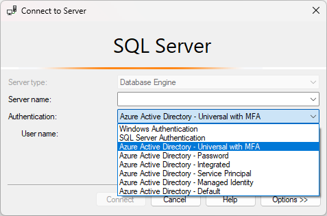
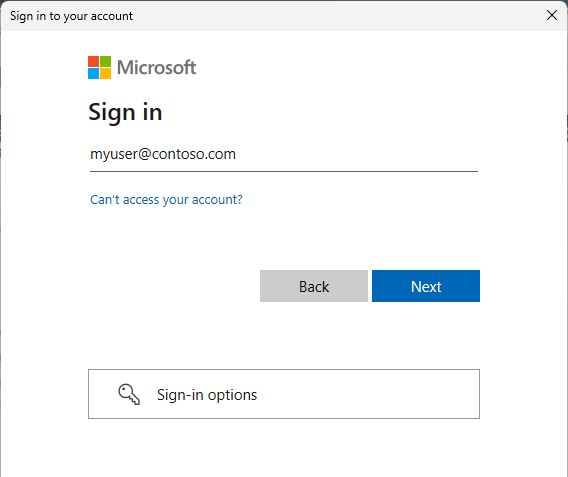

# Using Microsoft Entra multifactor authentication
[!INCLUDE[appliesto-sqldb-sqlmi-asa-sqlvm-arc](../includes/appliesto-sqldb-sqlmi-asa-sqlvm-arc.md)]

[Microsoft Entra multifactor authentication](/azure/active-directory/authentication/concept-mfa-howitworks) is a security feature provided by Microsoft's cloud-based identity and access management service. Multifactor authentication enhances the security of user sign-ins by requiring users to provide extra verification steps beyond a password. 

[!INCLUDE [entra-id](../includes/entra-id.md)]

Multifactor authentication is a supported authentication method for [Azure SQL Database](sql-database-paas-overview.md), [Azure SQL Managed Instance](../managed-instance/sql-managed-instance-paas-overview.md), [Azure Synapse Analytics](/azure/synapse-analytics/sql-data-warehouse/sql-data-warehouse-overview-what-is), and [SQL Server 2022 (16.x)](/sql/relational-databases/security/authentication-access/azure-ad-authentication-sql-server-overview) and later versions.

This article provides a brief overview of the benefits of multifactor authentication, explains how to configure it with Microsoft Entra ID, and shows how to use it to connect to a database with [SQL Server Management Studio (SSMS)](/sql/ssms/download-sql-server-management-studio-ssms).

> [!IMPORTANT]
> Databases in Azure SQL Database, Azure SQL Managed Instance, Azure Synapse, and SQL Server 2022 are referred to collectively in the remainder of this article as databases, and the server is referring to the [server](logical-servers.md) that hosts databases for Azure SQL Database and Azure Synapse.

## Benefits of MFA

Microsoft Entra multifactor authentication helps safeguard access to data and applications while meeting user demand for a simple sign-in process. MFA adds an extra layer of security to user sign-ins by requiring users to provide two or more authentication factors. These factors typically include something the user knows (password), something the user possesses (smartphone or hardware token), and/or something the user is (biometric data). By combining multiple factors, MFA significantly reduces the likelihood of unauthorized access.

Microsoft Entra multifactor authentication provides all the benefits of Microsoft Entra authentication described in the [Microsoft Entra authentication overview](./authentication-aad-overview.md#overview).

For the full list of authentication methods available, see [What authentication and verification methods are available in Microsoft Entra ID?](/azure/active-directory/authentication/concept-authentication-methods)

## Configuration steps

1. **Configure a Microsoft Entra tenant** - For more information, see [Administering your Microsoft Entra directory](/previous-versions/azure/azure-services/hh967611(v=azure.100)), [Integrating your on-premises identities with Microsoft Entra ID](/azure/active-directory/hybrid/whatis-hybrid-identity), [Add your own domain name to Microsoft Entra ID](/azure/active-directory/fundamentals/add-custom-domain), [Federation with Microsoft Entra ID](/azure/active-directory/hybrid/connect/whatis-fed), and [Manage Microsoft Entra ID using Windows PowerShell](/previous-versions/azure/jj151815(v=azure.100)).
2. **Configure MFA** - For step-by-step instructions, see [What is Microsoft Entra multifactor authentication?](/azure/active-directory/authentication/concept-mfa-howitworks), [Conditional Access (MFA) with Azure SQL Database and Data Warehouse](conditional-access-configure.md). (Full Conditional Access requires a Premium Microsoft Entra ID. Limited MFA is available with a standard Azure AD.)
3. **Configure Microsoft Entra authentication** - For step-by-step instructions, see [Connecting to SQL Database, SQL Managed Instance, or Azure Synapse using Microsoft Entra authentication](authentication-aad-overview.md).
4. **Download SSMS** - On the client computer, download the latest SSMS, from [Download SQL Server Management Studio (SSMS)](/sql/ssms/download-sql-server-management-studio-ssms).

[!INCLUDE[ssms-connect-azure-ad](../includes/ssms-connect-azure-ad.md)]

## Microsoft Entra B2B support

Microsoft Entra multifactor authentication also supports [Microsoft Entra B2B collaboration](/azure/active-directory/external-identities/what-is-b2b), which enables businesses to invite guest users to collaborate with their organization. Guest users can connect to databases either as individual users or members of a Microsoft Entra group. For more information, see [Create guest user in SQL Database, Azure Synapse, and SQL Managed Instance](/azure/azure-sql/database/authentication-aad-guest-users#create-guest-user-in-sql-database-and-azure-synapse).

## Connect using MFA in SSMS

The following steps show how to connect using multifactor authentication in the latest SSMS.

1. To connect using MFA, on the **Connect to Server** dialog box in SSMS select **Azure Active Directory - Universal with MFA**.

   

2. Fill the **Server name** box with your server's name. Fill the **User name** box with your Microsoft Entra credentials, in the format `user_name@domain.com`.
    
    

3. Click **Connect**.
4. When the **Sign in to your account** dialog box appears, it should be prepopulated with the **User name** you provided in step 2. No password is required if a user is part of a domain federated with Microsoft Entra ID.

    

5. You'll be prompted to authenticate using one of the methods configured based on the MFA administrator setting.
6. When verification is complete, SSMS connects normally, presuming valid credentials and firewall access.

Microsoft Entra multifactor authentication is a supported authentication method for all [SQL tools](/sql/tools/overview-sql-tools). For information on programmatically authenticating with Microsoft Entra ID, see the [Overview of the Microsoft Authentication Library (MSAL)](/azure/active-directory/develop/msal-overview).

## Next steps

- Grant others access to your database: [SQL Database Authentication and Authorization: Granting Access](logins-create-manage.md)
- Make sure others can connect through the firewall: [Configure a server-level firewall rule using the Azure portal](firewall-configure.md)
- [Configure and manage Microsoft Entra authentication with SQL Database or Azure Synapse](authentication-aad-configure.md)
- [Create Microsoft Entra guest users and set as a Microsoft Entra admin](authentication-aad-guest-users.md)
- C# interface [IUniversalAuthProvider Interface](/dotnet/api/microsoft.sqlserver.dac.iuniversalauthprovider)
- [Tutorial: Set up Microsoft Entra authentication for SQL Server](/sql/relational-databases/security/authentication-access/azure-ad-authentication-sql-server-setup-tutorial)
