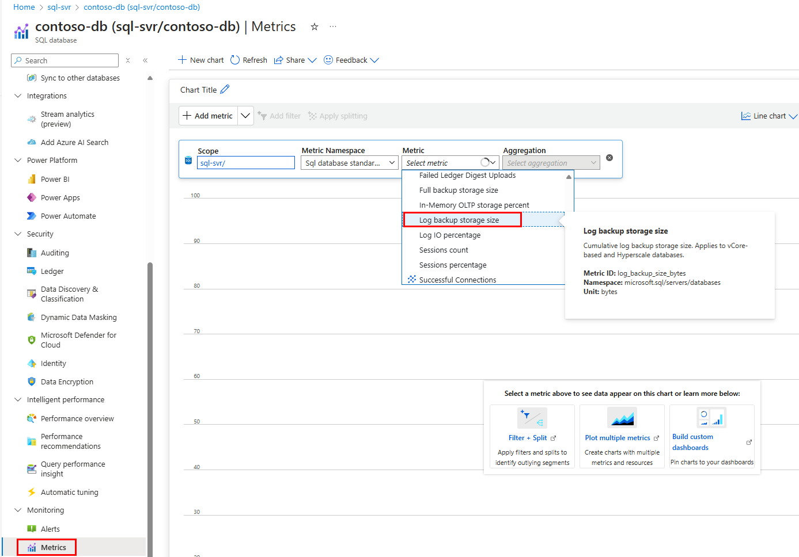
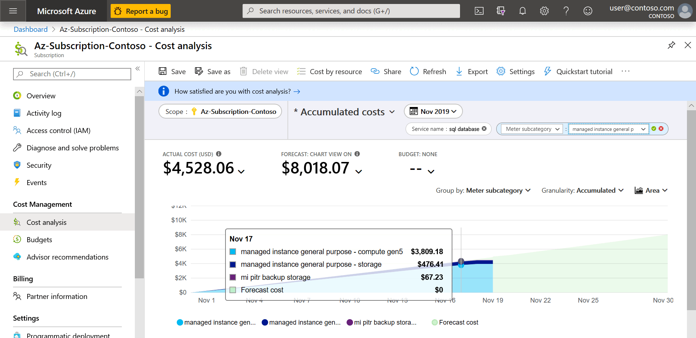

# Automated backups - Azure SQL Database

[!INCLUDE[appliesto-sqldb](../includes/appliesto-sqldb.md)]

> [!div class="op_single_selector"]
> * [Azure SQL Database](automated-backups-overview.md)
> * [Azure SQL Managed Instance](../managed-instance/automated-backups-overview.md)

<!---
Some of the content in this article is duplicated in /azure-sql/managed-instance/automated-backups-overview.md. Any relevant changes made to this article should be made in the other article as well. 
--->

This article describes the automated backup feature for Azure SQL Database. 

For Azure SQL Managed Instance, see [Automated backups for SQL Managed Instance](../managed-instance/automated-backups-overview.md).   
To change backup settings, see [Change settings](automated-backups-change-settings.md). To restore a backup, see [recover using backup](recovery-using-backups.md). 

[!INCLUDE [GDPR-related guidance](~/../azure/includes/gdpr-intro-sentence.md)]

## What is a database backup?

Database backups are an essential part of any business continuity and disaster recovery strategy, because they protect your data from corruption or deletion. These backups enable database restore to a point in time within the configured retention period. If your data protection rules require that your backups are available for an extended time (up to 10 years), you can configure [long-term retention](long-term-retention-overview.md) for both single and pooled databases.

Single and pooled databases in Azure SQL Database use SQL Server engine technology to back up and restore data. Hyperscale databases aim to address major painpoints with existing technology, and therefore have a unique architecture using [storage snapshots](hyperscale-architecture.md#azure-storage) for backup and restore. To learn more, see [Hyperscale backups](hyperscale-automated-backups-overview.md).

## Backup frequency

Azure SQL Database creates [full backups](/sql/relational-databases/backup-restore/full-database-backups-sql-server) every week, [differential backups](/sql/relational-databases/backup-restore/differential-backups-sql-server) every 12-24 hours, and [transaction log backups](/sql/relational-databases/backup-restore/transaction-log-backups-sql-server) every 5 to 10 minutes. The frequency of transaction log backups is based on the compute size and the amount of database activity.

When you restore a database, the service determines which full, differential, and transaction log backups need to be restored.

## Backup storage redundancy

By default, Azure SQL Database stores data in geo-redundant [storage blobs](/azure/storage/common/storage-redundancy) that are replicated to a [paired region](/azure/availability-zones/cross-region-replication-azure). Geo-redundancy helps protect against outages impacting backup storage in the primary region and allows you to restore your databases in a different region in the event of a regional outage. 

The storage redundancy mechanism stores multiple copies of your data so that it is protected from planned and unplanned events, including transient hardware failure, network or power outages, or massive natural disasters. To ensure your data stays within the same region where your database is deployed, you can change backup storage redundancy from the default geo-redundant storage to other types of storage that keep your data within the region. The configured backup storage redundancy is applied to both short-term backup retention settings that are used for point in time restore (PITR) and long-term retention used for long-term backups (LTR). To learn more about storage redundancy, see [Data redundancy](/azure/storage/common/storage-redundancy). 

Backup storage redundancy can be configured when you create your database, and can be updated at a later time; the changes made to an existing database apply to future backups only. After the backup storage redundancy of an existing database is updated, it may take up to 48 hours for the changes to be applied. 

The option to configure backup storage redundancy provides flexibility to choose one of the following storage redundancies for backups:

- **Locally-redundant (LRS)**:  Copies your backups synchronously three times within a single physical location in the primary region. LRS is the least expensive replication option, but isn't recommended for applications requiring high availability or durability.
- **Zone-redundant (ZRS)**: Copies your backups synchronously across three Azure availability zones in the primary region. Currently only available in [certain regions](/azure/storage/common/storage-redundancy#zone-redundant-storage). 
- **Geo-redundant (GRS)**: Copies your backups synchronously three times within a single physical location in the primary region using LRS, then copies your data asynchronously to a single physical location in the [paired](/azure/availability-zones/cross-region-replication-azure#azure-cross-region-replication-pairings-for-all-geographies) secondary region.

> [WARNING]
> - [Geo-restore](recovery-using-backups.md#geo-restore) is disabled as soon as a database is updated to use local or zone redundant storage. 
> - Backup storage redundancy for Hyperscale databases can only be set during creation. This setting cannot be modified once the resource is provisioned. Use [active geo-replication](active-geo-replication-overview.md) to update backup storage redundancy settings for an existing Hyperscale database with minimum downtime. Alternatively, you can use [Database copy](database-copy.md). Learn more in [Hyperscale backups and storage redundancy](hyperscale-automated-backups-overview.md#backup-storage-redundancy).

## Backup usage

You can use automatically created backups in the following scenarios:

- **Restore an existing database to a point in time** - [Restore an existing database to a point in time in the past](recovery-using-backups.md#point-in-time-restore) within the retention period by using the Azure portal, Azure PowerShell, Azure CLI, or REST API. This operation creates a new database on the same server as the original database, but uses a different name to avoid overwriting the original database. After restore completes, you can optionally delete the original database, and rename the restored database to the original database name. Alternatively, instead of deleting the original database, you can [rename](/sql/relational-databases/databases/rename-a-database) it, and then rename the restored database to the original database name. 
- **Restore a deleted database to a point in time** - [Restore a deleted database to the time of deletion](recovery-using-backups.md#deleted-database-restore) or to any point in time within the retention period. The deleted database can be restored only on the same server where the original database was created. When deleting a database, the service takes a final transaction log backup before deletion, to prevent any data loss.
- **Geo-restore a database** - [Restore a database to another geographic region](recovery-using-backups.md#geo-restore). Geo-restore allows you to recover from a regional outage when you cannot access your database or backups in the primary region. It creates a new database on any existing server in any Azure region.
   > [!IMPORTANT]
   > Geo-restore is available only for databases configured with geo-redundant backup storage. If you are not currently using geo-replicated backups for a database, you can change this by [configuring backup storage redundancy](automated-backups-change-settings.md#configure-backup-storage-redundancy).
- **Restore a database from long-term backup** - [Restore a database from a specific long-term backup](long-term-retention-overview.md) of a single or pooled database, if the database has been configured with a long-term retention (LTR) policy. LTR allows you to [restore an older version of the database](long-term-backup-retention-configure.md) by using the Azure portal, Azure CLI, or Azure PowerShell to satisfy a compliance request or to run an older version of the application. For more information, see [Long-term retention](long-term-retention-overview.md).

## Restore capabilities and features

This table summarizes the capabilities and features of [point in time restore (PITR)](recovery-using-backups.md#point-in-time-restore), [geo-restore](recovery-using-backups.md#geo-restore), and [long-term backup retention](long-term-retention-overview.md).

| **Backup Properties** | Point in time recovery (PITR) | Geo-restore | Long-term backup restore |
|---|---|---|---|
| **Types of SQL backup** | Full, Differential, Log | Replicated copies of PITR backups | Only the full backups |
| **Recovery Point Objective (RPO)** |  5-10 minutes, based on compute size and amount of database activity. | Up to 1 hour, based on geo-replication.\*  |  One week (or user's policy).|
| **Recovery Time Objective (RTO)** | Restore usually takes <12 hours, but could take longer dependent on size and activity. See [Recovery](recovery-using-backups.md#recovery-time). | Restore usually takes <12 hours, but could take longer dependent on size and activity. See [Recovery](recovery-using-backups.md#recovery-time). | Restore usually takes <12 hours, but could take longer dependent on size and activity. See [Recovery](recovery-using-backups.md#recovery-time). |
| **Retention** | 7 days by default, Up to 35 days |  Enabled by default, same as source.\*\* | Not enabled by default, Retention Up to 10 years. |
| **Azure storage**  | Geo-redundant by default. Can optionally configure zone or locally redundant storage. | Available when PITR backup storage redundancy is set to Geo-redundant. Not available when PITR backup store is zone or locally redundant storage. | Geo-redundant by default. Can configure zone or locally redundant storage. |
| **Use to create new database in same region** | Supported | Supported | Supported |
| **Use to create new database in another region** | Not Supported | Supported in any Azure region | Supported in any Azure region |
| **Use to create new database in another Subscription** |  Not Supported  |  Not Supported\*\*\* | Not Supported\*\*\*  |
| **Restore via Azure portal**|Yes|Yes|Yes|
| **Restore via PowerShell** |Yes|Yes|Yes|
| **Restore via Azure CLI** |Yes|Yes|Yes|

\* For business-critical applications that require large databases and must ensure business continuity, use [Auto-failover groups](auto-failover-group-sql-db.md). 

\*\* All PITR backups are stored on geo-redundant storage by default. Hence, geo-restore is enabled by default. 

\*\*\* Workaround is to restore to a new server and use Resource Move to move the server to another Subscription.

## Restore a database from backup

To perform a restore, see [Restore database from backups](recovery-using-backups.md). You can explore backup configuration and restore operations using the following examples:

| Operation | Azure portal | Azure CLI | Azure PowerShell |
|---|---|---|---|
| **Change backup retention** | [SQL Database](automated-backups-change-settings.md?tabs=azure-portal#change-short-term-retention-policy)   [SQL Managed Instance](../managed-instance/automated-backups-change-settings.md?tabs=azure-portal#change-short-term-retention-policy) | [SQL Database](automated-backups-change-settings.md?tabs=azure-cli#change-short-term-retention-policy)   [SQL Managed Instance](../managed-instance/automated-backups-change-settings.md?tabs=azure-cli#change-short-term-retention-policy) | [SQL Database](automated-backups-change-settings.md?tabs=powershell#change-short-term-retention-policy)  [SQL Managed Instance](../managed-instance/automated-backups-change-settings.md?tabs=powershell#change-short-term-retention-policy)|
| **Change long-term backup retention** | [SQL Database](long-term-backup-retention-configure.md#create-long-term-retention-policies)  [SQL Managed Instance](../managed-instance/long-term-backup-retention-configure.md) | [SQL Database](long-term-backup-retention-configure.md)   [SQL Managed Instance](../managed-instance/long-term-backup-retention-configure.md) | [SQL Database](long-term-backup-retention-configure.md) [SQL Managed Instance](../managed-instance/long-term-backup-retention-configure.md)  |
| **Restore a database from a point in time** | [SQL Database](recovery-using-backups.md#point-in-time-restore) [SQL Managed Instance](../managed-instance/point-in-time-restore.md) | [SQL Database](/cli/azure/sql/db#az-sql-db-restore)   [SQL Managed Instance](/cli/azure/sql/midb#az-sql-midb-restore) | [SQL Database](/powershell/module/az.sql/restore-azsqldatabase)   [SQL Managed Instance](/powershell/module/az.sql/restore-azsqlinstancedatabase) |
| **Restore a deleted database** | [SQL Database](recovery-using-backups.md) [SQL Managed Instance](../managed-instance/point-in-time-restore.md#restore-a-deleted-database) | [SQL Database](long-term-backup-retention-configure.md#restore-from-ltr-backups)   [SQL Managed Instance](../managed-instance/long-term-backup-retention-configure.md#restore-from-ltr-backups) | [SQL Database](/powershell/module/az.sql/get-azsqldeleteddatabasebackup)   [SQL Managed Instance](/powershell/module/az.sql/get-azsqldeletedinstancedatabasebackup)|

## Backup scheduling

The first full backup is scheduled immediately after a new database is created or restored. This backup usually completes within 30 minutes, but it can take longer when the database is large. For example, the initial backup can take longer on a restored database or a database copy, which would typically be larger than a new database. After the first full backup, all further backups are scheduled and managed  automatically. The exact timing of all database backups is determined by the SQL Database service as it balances the overall system workload. You cannot change the schedule of backup jobs or disable them. 

> [!IMPORTANT]
> - For a new, restored, or copied database, point-in-time restore capability becomes available from the time when the initial transaction log backup that follows the initial full backup is created.
> - Hyperscale databases are protected immediately after creation, unlike other databases where the initial backup takes time, even if the Hyperscale database was created with a large amount of data via copy or restore. To learn more, review [Hyperscale Automated backups](hyperscale-automated-backups-overview.md). 

## Backup storage consumption

With SQL Server backup and restore technology, restoring a database to a point in time requires an uninterrupted backup chain consisting of one full backup, optionally one differential backup, and one or more transaction log backups. Azure SQL Database schedules one full backup every week. Therefore, to provide PITR within the entire retention period, the system must store additional full, differential, and transaction log backups for up to a week longer than the configured retention period. 

In other words, for any point in time during the retention period, there must be a full backup that is older than the oldest time of the retention period, as well as an uninterrupted chain of differential and transaction log backups from that full backup until the next full backup. Hyperscale databases use a different backup scheduling mechanism, for more details see [Hyperscale backup scheduling](hyperscale-automated-backups-overview.md#backup-scheduling). 

Backups that are no longer needed to provide PITR functionality are automatically deleted. Because differential backups and log backups require an earlier full backup to be restorable, all three backup types are purged together in weekly sets.

For all databases, including [TDE-encrypted](transparent-data-encryption-tde-overview.md) databases, backups are compressed to reduce backup storage compression and costs. Average backup compression ratio is 3-4 times, however it can be significantly lower or higher depending on the nature of the data and whether data compression is used in the database.

Azure SQL Database computes your total used backup storage as a cumulative value. Every hour, this value is reported to the Azure billing pipeline, which is responsible for aggregating this hourly usage to calculate your consumption at the end of each month. After the database is deleted, consumption decreases as backups age out and are deleted. Once all backups are deleted and PITR is no longer possible, billing stops.
   
> [!IMPORTANT]
> Backups of a database are retained to provide PITR even if the database has been deleted. While deleting and re-creating a database may save storage and compute costs, it may increase backup storage costs, because the service retains backups for each deleted database, every time it is deleted. 

### Monitor consumption

For vCore databases in Azure SQL Database, the storage consumed by each type of backup (full, differential, and log) is reported on the database monitoring pane as a separate metric. The following diagram shows how to monitor the backup storage consumption for a single database. 

Instructions on how to monitor consumption in Hyperscale can be found in [monitor Hyperscale backup consumption](hyperscale-automated-backups-overview.md#monitor-backup-consumption).

### Fine-tune backup storage consumption

Backup storage consumption up to the maximum data size for a database is not charged. Excess backup storage consumption will depend on the workload and maximum size of the individual databases. Consider some of the following tuning techniques to reduce your backup storage consumption:

- Reduce the [backup retention period](automated-backups-change-settings.md#change-short-term-retention-policy) to the minimum possible for your needs.
- Avoid doing large write operations, like index rebuilds, more frequently than you need to.
- For large data load operations, consider using [clustered columnstore indexes](/sql/relational-databases/indexes/columnstore-indexes-overview) and following related [best practices](/sql/relational-databases/indexes/columnstore-indexes-data-loading-guidance), and/or reduce the number of non-clustered indexes.
- In the General Purpose service tier, the provisioned data storage is less expensive than the price of the backup storage. If you have continually high excess backup storage costs, you might consider increasing data storage to save on the backup storage.
- Use TempDB instead of permanent tables in your application logic for storing temporary results and/or transient data.
- Use locally redundant backup storage whenever possible (for example dev/test environments)

## Backup retention

Azure SQL Database provides both short-term and long-term retention of backups. Short-term retention backups allow Point-In-Time-Restore (PITR) within the retention period for the database, while long-term retention provides backups for various compliance requirements.  

### Short-term retention

For all new, restored, and copied databases, Azure SQL Database retains sufficient backups to allow PITR within the last seven days by default. Regular full, differential and log backups are taken to ensure databases are restorable to any point-in-time within the retention period defined for the database. Short-term back up retention of 1-35 days for Hyperscale databases is now in preview. To learn more, review [Managing backup retention in Hyperscale](hyperscale-automated-backups-overview.md#backup-retention). 

Differential backups can be configured to either a 12-hour or a 24-hour frequency. A 24-hour differential backup frequency may increase the time required to restore the database. 

You can specify your backup storage redundancy option for short-term retention (STR) when you create your database, and then change it at a later time. If you change your backup redundancy option after your database is created, new backups will use the new redundancy option while backup copies made with the previous STR redundancy option are not moved or copied, but are left in the original storage account until the retention period expires, which can be 1-35 days. 

Except for Basic tier databases, you can [change backup retention period](automated-backups-change-settings.md#change-short-term-retention-policy) per each active database in the 1-35 day range. As described in [Backup storage consumption](#backup-storage-consumption), backups stored to enable PITR may be older than the retention period. If you need to keep backups for longer than the maximum short-term retention period of 35 days, you can enable [Long-term retention](long-term-retention-overview.md).

If you delete a database, the system keeps backups in the same way it would for an online database with its specific retention period. You cannot change backup retention period for a deleted database.

> [!IMPORTANT]
> If you delete a server, all databases on that server are also deleted and cannot be recovered. You cannot restore a deleted server. But if you had configured long-term retention (LTR) for a database, long-term retention backups are not deleted, and can be used to restore databases on a different server in the same subscription, to a point in time when a long-term retention backup was taken. To learn more, review [restore long-term backup](long-term-backup-retention-configure.md#view-backups-and-restore-from-a-backup).

### Long-term retention

For SQL Database, you can configure full backup long-term retention (LTR) for up to 10 years in Azure Blob storage. After the LTR policy is configured, full backups are automatically copied to a different storage container weekly. To meet various compliance requirements, you can select different retention periods for weekly, monthly, and/or yearly full backups.  The frequency depends on the policy. For example, setting `W=0, M=1` would create an LTR copy monthly. For more information about LTR, see [Long-term backup retention](long-term-retention-overview.md). Databases in the Hyperscale service tier do not currently support long-term retention. 

Storage redundancy for long-term retention can be changed after the LTR policy is created for Azure SQL Database. Updating the backup storage redundancy for an existing Azure SQL Database only applies the change to subsequent backups taken in the future for the database. All existing LTR backups for the database will continue to reside in the existing storage blob and new backups will be stored on the newly requested storage blob type. 

Storage consumption depends on the selected frequency and retention periods of LTR backups. You can use the [LTR pricing calculator](https://azure.microsoft.com/pricing/calculator/?service=sql-database) to estimate the cost of LTR storage.

## Backup storage costs

The price for backup storage varies and depends on your [purchasing model (DTU or vCore)](purchasing-models.md), chosen backup storage redundancy option, and your region. Backup storage is charged per GB/month consumed, at the same rate for all backups. 

Backup storage redundancy impacts backup costs in the following way:
- locally redundant price = published price
- zone-redundant price = published price x 1.25
- geo-redundant price =  published price x 2

For pricing see the [Azure SQL Database pricing](https://azure.microsoft.com/pricing/details/sql-database/single/) page. 

> [!NOTE]
> Azure invoice will show only the excess backup storage consumed, not the entire backup storage consumption. For example, in a hypothetical scenario, if you have provisioned 4TB of data storage, you will get 4TB of free backup storage space. In case that you have used the total of 5.8TB of backup storage space, Azure invoice will show only 1.8TB, as only excess backup storage used is charged.

### DTU model

In the DTU model, there's no additional charge for backup storage for databases and elastic pools. The price of backup storage is a part of database or pool price.

### vCore model

Azure SQL Database computes your total billable backup storage as a cumulative value across all backup files. Every hour, this value is reported to the Azure billing pipeline, which aggregates this hourly usage to get your backup storage consumption at the end of each month. If a database is deleted, backup storage consumption will gradually decrease as older backups age out and are deleted. Because differential backups and log backups require an earlier full backup to be restorable, all three backup types are purged together in weekly sets. Once all backups are deleted, billing stops. 

Backup storage cost is calculated differently for Hyperscale databases, more information can be found in [Hyperscale backup storage costs](hyperscale-automated-backups-overview.md#backup-storage-costs). 

For single databases in SQL Database, a backup storage amount equal to 100 percent of the maximum data storage size for the database is provided at no extra charge.  The following equation is used to calculate the total billable backup storage usage:

`Total billable backup storage size = (size of full backups + size of differential backups + size of log backups) – maximum data storage`

For elastic pools, a backup storage amount equal to 100 percent of the maximum data storage for the pool storage size, respectively, is provided at no extra charge.  For pooled databases, the total billable backup storage size is aggregated at the pool level and is calculated as follows:

`Total billable backup storage size = (total size of all full backups + total size of all differential backups + total size of all log backups) - maximum pool data storage`

Total billable backup storage, if any, will be charged in GB/month as per the rate of the backup storage redundancy used. This backup storage consumption will depend on the workload and size of individual databases, elastic pools, and managed instances. Heavily modified databases have larger differential and log backups, because the size of these backups is proportional to the amount of changed data. Therefore, such databases will have higher backup charges.

As a simplified example, assume a database has accumulated 744 GB of backup storage and that this amount stays constant throughout an entire month because the database is completely idle. To convert this cumulative storage consumption to hourly usage, divide it by 744.0 (31 days per month * 24 hours per day). SQL Database will report to Azure billing pipeline that the database consumed 1 GB of PITR backup each hour, at a constant rate. Azure billing will aggregate this consumption and show a usage of 744 GB for the entire month. The cost will be based on the amount/GB/month rate in your region.

Now, a more complex example. Suppose the same idle database has its retention increased from seven days to 14 days in the middle of the month. This increase results in the total backup storage doubling to 1,488 GB. SQL Database would report 1 GB of usage for hours 1 through 372 (the first half of the month). It would report the usage as 2 GB for hours 373 through 744 (the second half of the month). This usage would be aggregated to a final bill of 1,116 GB/month.

Actual backup billing scenarios are more complex. Because the rate of changes in the database depends on the workload and is variable over time, the size of each differential and log backup will vary as well, causing the hourly backup storage consumption to fluctuate accordingly. Furthermore, each differential backup contains all changes made in the database since the last full backup, thus the total size of all differential backups gradually increases over the course of a week, and then drops sharply once an older set of full, differential, and log backups ages out. For example, if a heavy write activity such as index rebuild has been run just after a full backup completed, then the modifications made by the index rebuild will be included in the transaction log backups taken over the duration of rebuild, in the next differential backup, and in every differential backup taken until the next full backup occurs. For the latter scenario in larger databases, an optimization in the service creates a full backup instead of a differential backup if a differential backup would be excessively large otherwise. This reduces the size of all differential backups until the following full backup.

You can monitor total backup storage consumption for each backup type (full, differential, transaction log) over time as described in [Monitor consumption](#monitor-consumption).

### Monitor costs

To understand backup storage costs, go to **Cost Management + Billing** in the Azure portal, select **Cost Management**, and then select **Cost analysis**. Select the desired subscription as the **Scope**, and then filter for the time period and service that you're interested in as follows:

1. Add a filter for **Service name**.
2. In the drop-down list select **sql database** for a single database or an elastic database pool.
3. Add another filter for **Meter subcategory**.
4. To monitor PITR backup costs, in the drop-down list select **single/elastic pool pitr backup storage** for a single database or an elastic database pool. Meters will only show up if they've been consumed.
5. To monitor LTR backup costs, in the drop-down list select **ltr backup storage** for a single database or an elastic database pool. Meters will only show up if they've been consumed.

The **Storage** and **compute** subcategories might interest you as well, but they're not associated with backup storage costs.

> [!IMPORTANT]
> Meters are only visible for counters that are currently in use. If a counter is not available, it is likely that the category is not currently being used. For example, storage counters will not be visible for resources that are not consuming storage. As such, if there is no PITR or LTR backup storage consumption, these meters won't be visible.

For more information, see [Azure SQL Database cost management](cost-management.md).

## Encrypted backups

If your database is encrypted with TDE, backups are automatically encrypted at rest, including LTR backups. All new databases in Azure SQL are configured with TDE enabled by default. For more information on TDE, see  [Transparent Data Encryption with SQL Database](/sql/relational-databases/security/encryption/transparent-data-encryption-azure-sql).

## Backup integrity

On an ongoing basis, the Azure SQL engineering team automatically tests the restore of automated database backups.

Upon point-in-time restore, databases also receive DBCC CHECKDB integrity checks.

Any issues found during the integrity check will result in an alert to the engineering team. For more information, see [Data Integrity in SQL Database](https://azure.microsoft.com/blog/data-integrity-in-azure-sql-database/).

All database backups are taken with the CHECKSUM option to provide additional backup integrity.

## Compliance

When you migrate your database from a DTU-based service tier to a vCore-based service tier, the PITR retention is preserved to ensure that your application's data recovery policy isn't compromised. If the default retention doesn't meet your compliance requirements, you can change the PITR retention period. For more information, see [Change the PITR backup retention period](automated-backups-change-settings.md#change-short-term-retention-policy).

[!INCLUDE [GDPR-related guidance](~/../azure/includes/gdpr-intro-sentence.md)]

## Use Azure Policy to enforce backup storage redundancy

If you have data residency requirements that require you to keep all your data in a single Azure region, you may want to enforce zone-redundant or locally redundant backups for your SQL Database using Azure Policy. 
Azure Policy is a service that you can use to create, assign, and manage policies that apply rules to Azure resources. Azure Policy helps you to keep these resources compliant with your corporate standards and service level agreements. For more information, see [Overview of Azure Policy](/azure/governance/policy/overview). 

### Built-in backup storage redundancy policies 

The following built-in policies can be assigned at the subscription or resource group level to block creating new instances with geo-redundant backup storage: 

[SQL Database should avoid using GRS backup redundancy](https://portal.azure.com/#blade/Microsoft_Azure_Policy/PolicyDetailBlade/definitionId/%2Fproviders%2FMicrosoft.Authorization%2FpolicyDefinitions%2Fb219b9cf-f672-4f96-9ab0-f5a3ac5e1c13)

For a full list of built-in policy definitions for SQL Database, review the [policy reference](./policy-reference.md).

To enforce data residency requirements at an organizational level, these policies can be assigned to a subscription. After these policies are assigned at a subscription level, users in the given subscription will not be able to create a database or a managed instance with geo-redundant backup storage via Azure portal or Azure PowerShell. 

> [!IMPORTANT]
> Azure policies are not enforced when creating a database via T-SQL. To specify data residency when creating a database using T-SQL, [use 'LOCAL' or 'ZONE' as input to BACKUP_STORAGE_REDUNDANCY paramater in CREATE DATABASE statement](/sql/t-sql/statements/create-database-transact-sql#create-database-using-zone-redundancy-for-backups).

Learn how to assign policies using the [Azure portal](/azure/governance/policy/assign-policy-portal) or [Azure PowerShell](/azure/governance/policy/assign-policy-powershell). 

## Next steps

- Database backups are an essential part of any business continuity and disaster recovery strategy because they protect your data from accidental corruption or deletion. To learn about the other SQL Database business continuity solutions, see [Business continuity overview](business-continuity-high-availability-disaster-recover-hadr-overview.md).
- For information about how to configure, manage, and restore from long-term retention of automated backups in Azure Blob storage by using the Azure portal, see [Manage long-term backup retention by using the Azure portal](long-term-backup-retention-configure.md).
- For information about how to configure, manage, and restore from long-term retention of automated backups in Azure Blob storage by using PowerShell, see [Manage long-term backup retention by using PowerShell](long-term-backup-retention-configure.md). 
- Get more information about how to [restore a database to a point in time by using the Azure portal](recovery-using-backups.md).
- Get more information about how to [restore a database to a point in time by using PowerShell](scripts/restore-database-powershell.md).

