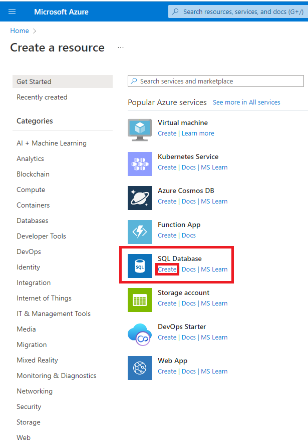
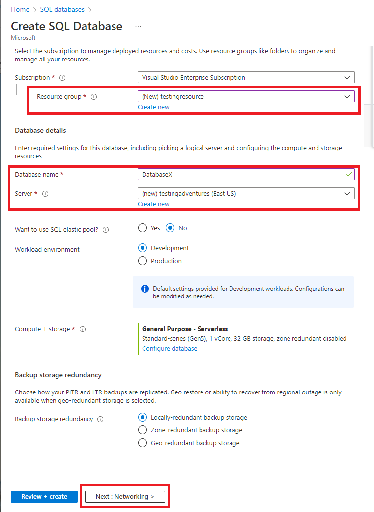
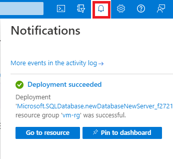
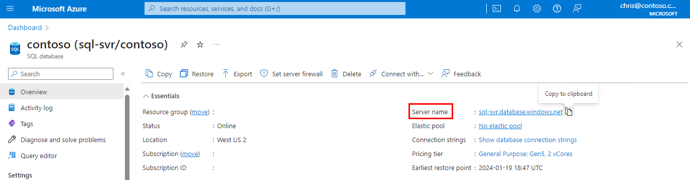
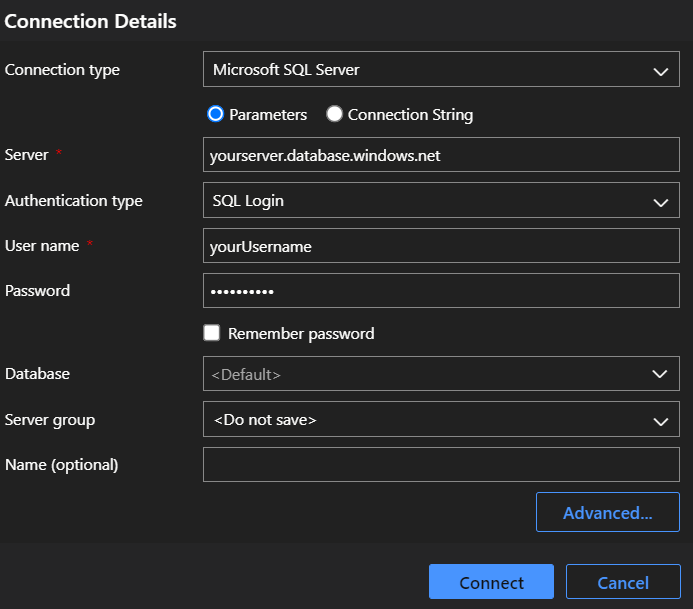
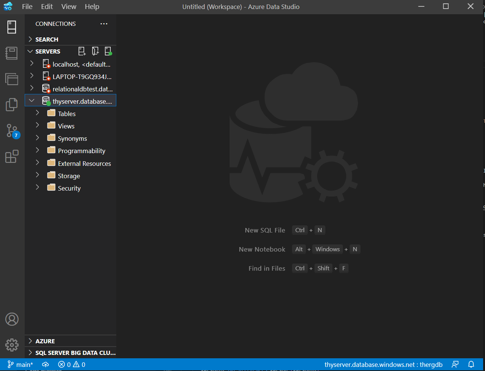
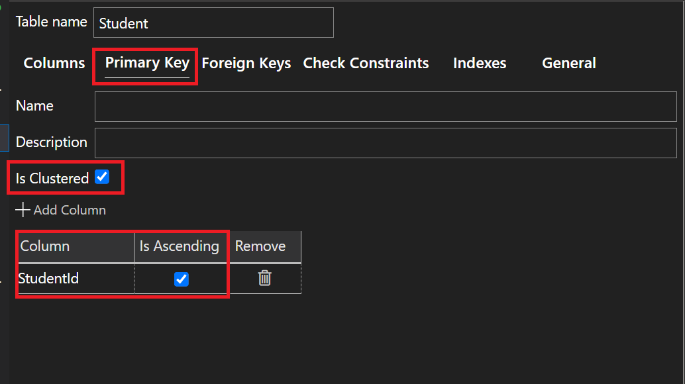
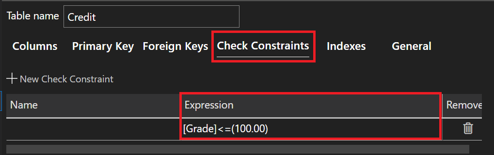

# Tutorial: Design a relational database in Azure SQL Database using Azure Data Studio (ADS)

[!INCLUDE[appliesto-sqldb](../includes/appliesto-sqldb.md)]

Azure SQL Database is a relational database-as-a-service (DBaaS) in the Microsoft Cloud (Azure). In this tutorial, you learn how to use the Azure portal and [Azure Data Studio](/sql/azure-data-studio/what-is-azure-data-studio.md) (ADS) to:

> [!div class="checklist"]
>
> - Create a database using the Azure portal*
> - Configure a server-level IP firewall rule using the Azure portal
> - Connect to the database with Azure Data Studio
> - Create tables with Azure Data Studio
> - Bulk load data with BCP
> - Query data with Azure Data Studio

*If you don't have an Azure subscription, [create a free account](https://azure.microsoft.com/free/) before you begin.

> [!TIP]
> This free Learn module shows you how to [Develop and configure an ASP.NET application that queries an Azure SQL Database](/learn/modules/develop-app-that-queries-azure-sql/), including the creation of a simple database.

> [!NOTE]
> For the purpose of this tutorial, we are using Azure SQL Database. You could also use a pooled database in an elastic pool or a SQL Managed Instance. For connectivity to a SQL Managed Instance, see these SQL Managed Instance quickstarts: [Quickstart: Configure Azure VM to connect to an Azure SQL Managed Instance](../managed-instance/connect-vm-instance-configure.md) and [Quickstart: Configure a point-to-site connection to an Azure SQL Managed Instance from on-premises](../managed-instance/point-to-site-p2s-configure.md).

## Prerequisites

To complete this tutorial, make sure you've installed:

- [Azure Data Studio](/sql/azure-data-studio/download-azure-data-studio.md) (latest version)
- [BCP and SQLCMD](https://www.microsoft.com/download/details.aspx?id=36433) (latest version)

## Sign in to the Azure portal

Sign in to the [Azure portal](https://portal.azure.com/).

## Create a blank database in Azure SQL Database

A database in Azure SQL Database is created with a defined set of compute and storage resources. The database is created within an [Azure resource group](/azure/active-directory-b2c/overview) and is managed using an [logical SQL server](logical-servers.md).

Follow these steps to create a blank database.

1. On the Azure portal menu or from the **Home** page, select **Create a resource**.
2. On the **Create a resource** page, select **SQL Database** or **Create** under **SQL Database**.
   

3. Fill out the **SQL Database** form with the following information, as shown on the preceding image:

    |Setting   |Suggested value | Description |
    |:-------- |:-------------: | :---------: |
    | **Subscription** | *yourSubscription* | For details about your subscriptions, see [Subscriptions](https://account.windowsazure.com/Subscriptions). |
    | **Resource group** | *yourResourceGroup* | For valid resource group names, see [Naming rules and restrictions](/azure/architecture/best-practices/resource-naming). |
    | **Database name** | *yourDatabase* | For valid database names, see [Database identifiers](/sql/relational-databases/databases/database-identifiers). |

4. Choose whether or not you want to use SQL elastic pool. For more details, visit [the SQL elastic pools documentation](\sql-docs-pr\azure-sql\database\elastic-pool-overview.md)

5. Choose the type of environment you would like your workload to be on. This will determine the compute + storage as well as backup redundancy recommendations for your workload.

6. Select the **Networking** tab to configure your Networking settings
    

7. In the **Networking** tab, select your connectivity method, connection policy, and encrypted connection settings. Then, hit the **Next** tab to configure your security and other additional settings.

8. In the **Additional settings** tab, you can choose where you want your data to be sourced from or start with a blank database. For the purposes of this demo, we will be starting with a blank database.

9. Enter a **Collation** for the blank database (for this tutorial, use the default value). For more information about collations, see [Collations](/sql/t-sql/statements/collations)

10. Select **Next** to assign Tags for categorizing and consolidating billing for your resource groups. This is optional but recommended if you are working with multiple resources and resource groups.

11. Now that you've completed the **SQL Database** form, Select **Next** to review and create the database. After review, Select **Create**. This step may take a few minutes.

12. On the toolbar, Select **Notifications** to monitor the deployment process.
   

## Create a server-level IP firewall rule

Azure SQL Database creates an IP firewall at the server-level. This firewall prevents external applications and tools from connecting to the server and any databases on the server unless a firewall rule allows their IP through the firewall. To enable external connectivity to your database, you must first add an IP firewall rule for your IP address (or IP address range). Follow these steps to create a [server-level IP firewall rule](firewall-configure.md).

> [!IMPORTANT]
> Azure SQL Database communicates over port 1433. If you are trying to connect to this service from within a corporate network, outbound traffic over port 1433 may not be allowed by your network's firewall. If so, you cannot connect to your database unless your administrator opens port 1433.

1. After the deployment completes, select **Go to resource** to configure IP firewall settings.

2. Select **Set server firewall** from the top menu. The overview page for your database opens, showing you the fully qualified **Server name** (such as `contosodatabaseserver01.database.windows.net`) and provides options for further configuration.

   

3. Copy this fully qualified server name for use to connect to your server and databases from SQL Server Management Studio.

   

4. Select **Add your current client IPv4 address** under **Firewall rules** to add your current IP address to a new IP firewall rule. An IP firewall rule can open port 1433 for a single IP address or a range of IP addresses. Then enable Azure services and resources to access this server by checking the checkbox.

5. Select **Save**. A server-level IP firewall rule is created for your current IP address opening port 1433 on the server.

6. You get a *success* message upon successful configuration of firewall rule. Once this occurs, close the **Firewall settings** page.

Your IP address can now pass through the IP firewall. You can now connect to your database using SQL Server Management Studio or another tool of your choice. Be sure to use the server admin account you created previously.

> [!IMPORTANT]
> By default, access through the SQL Database IP firewall is enabled for all Azure services. Select **OFF** on this page to disable for all Azure services.

## Connect to the database

Use [Azure Data Studio](/sql/azure-data-studio/what-is-azure-data-studio.md) to establish a connection to your database.

1. Open Azure Data Studio.
2. In the **New Connection** from the Object Explorer to create a new connection and enter the following information:

   | Setting       | Suggested value | Description |
   | --------------|-----------------|------------ |
   | **Connection type** | Microsoft SQL Server | This value is required. |
   | **Server name** | The fully qualified server name | For example, *yourserver.database.windows.net*. |
   | **Authentication type** | SQL Login | SQL Authentication is the only authentication type that we've configured in this tutorial. |
   | **Login** | The server admin account | The account that you specified when you created the server. |
   | **Password** | The password for your server admin account | The password that you specified when you created the server. |

   

3. Select **Connect**. The **Object Explorer** window opens in ADS.

4. In **Object Explorer**, expand **Databases** and then expand *yourDatabase* to view the objects in the sample database.  

     

## Create tables in your database

Create a database schema with four tables that model a student management system for universities using [the Table Designer](\sql-docs-pr\docs\azure-data-studio\table-designer-azure-data-studio.md):

- Person
- Course
- Student
- Credit

The following diagram shows how these tables are related to each other. Some of these tables reference columns in other tables. For example, the *Student* table references the *PersonId* column of the *Person* table. Study the diagram to understand how the tables in this tutorial are related to one another. For an in-depth look at how to create effective database tables, see [Create effective database tables](/previous-versions/tn-archive/cc505842(v=technet.10)). For information about choosing data types, see [Data types](/sql/t-sql/data-types/data-types-transact-sql).

  

1. In **Object Explorer**, Select *yourDatabase* which expands the dropdown menu of all processes stored in this database, right-Select the **Tables** folder, select **New Table**. A blank Table Designer opens that is connected to your database.

2. Use the Table Designer interface to create these four tables in your database. To learn more about creating tables using the Table Designer, refer to [the Table Designer documentation](\sql-docs-pr\docs\azure-data-studio\table-designer-azure-data-studio.md) :

    - Person Table

        

       Be sure to configure the Primary Key settings for the **Person** Table as shown below:

        

   - Student Table

        

       Be sure to configure the Primary Key settings for the **Student** Table as shown below:
           

       Be sure to configure the Foreign Key settings for the **Student** Table as shown below:
           

    - Course Table

        

       Be sure to configure the Primary Key settings for the **Course** Table as shown below:
          

    - Credit Table

        

       Be sure to configure the Foreign Key settings for the **Credit** Table as shown below:
        

       Be sure to configure the Check Constraint settings for the **Credit** Table as shown below:
        

3. Expand the **Tables** node under *yourDatabase* in the **Object Explorer** to see the tables you created.

   

## Load data into the tables

1. Create a folder called *sampleData* in your Downloads folder to store sample data for your database.

2. Right-Select the following links and save them into the *sampleData* folder.

   - [SampleCourseData](https://sqldbtutorial.blob.core.windows.net/tutorials/SampleCourseData)
   - [SamplePersonData](https://sqldbtutorial.blob.core.windows.net/tutorials/SamplePersonData)
   - [SampleStudentData](https://sqldbtutorial.blob.core.windows.net/tutorials/SampleStudentData)
   - [SampleCreditData](https://sqldbtutorial.blob.core.windows.net/tutorials/SampleCreditData)

3. Open a command prompt window and navigate to the *sampleData* folder.

4. Execute the following commands to insert sample data into the tables replacing the values for *server*, *database*, *user*, and *password* with the values for your environment.

   ```cmd
   bcp Course in SampleCourseData -S <server>.database.windows.net -d <database> -U <user> -P <password> -q -c -t ","
   bcp Person in SamplePersonData -S <server>.database.windows.net -d <database> -U <user> -P <password> -q -c -t ","
   bcp Student in SampleStudentData -S <server>.database.windows.net -d <database> -U <user> -P <password> -q -c -t ","
   bcp Credit in SampleCreditData -S <server>.database.windows.net -d <database> -U <user> -P <password> -q -c -t ","
   ```

You have now loaded sample data into the tables you created earlier.

## Query data

Execute the following queries to retrieve information from the database tables. See [Write SQL queries](/previous-versions/sql/sql-server-2005/express-administrator/bb264565(v=sql.90)) to learn more about writing SQL queries. The first query joins all four tables to find the students taught by 'Dominick Pope' who have a grade higher than 75%. The second query joins all four tables and finds the courses in which 'Noe Coleman' has ever enrolled.

1. In the Azure Data Studio Object Explorer, right-Select on your server connection, then select *New Query* to open up the Query Window. Then, execute the queries below:

   ```sql
   -- Find the students taught by Dominick Pope who have a grade higher than 75%
   SELECT  person.FirstName, person.LastName, course.Name, credit.Grade
   FROM  Person AS person
       INNER JOIN Student AS student ON person.PersonId = student.PersonId
       INNER JOIN Credit AS credit ON student.StudentId = credit.StudentId
       INNER JOIN Course AS course ON credit.CourseId = course.courseId
   WHERE course.Teacher = 'Dominick Pope'
       AND Grade > 75
   ```

2. In a query window, execute the following query:

   ```sql
   -- Find all the courses in which Noe Coleman has ever enrolled
   SELECT  course.Name, course.Teacher, credit.Grade
   FROM  Course AS course
       INNER JOIN Credit AS credit ON credit.CourseId = course.CourseId
       INNER JOIN Student AS student ON student.StudentId = credit.StudentId
       INNER JOIN Person AS person ON person.PersonId = student.PersonId
   WHERE person.FirstName = 'Noe'
       AND person.LastName = 'Coleman'
   ```

## Next steps

In this tutorial, you learned many basic database tasks. You learned how to:

> [!div class="checklist"]
>
> - Create a database using the Azure portal*
> - Set up a server-level IP firewall rule using the Azure portal
> - Connect to the database with Azure Data Studio
> - Create tables with Azure Data Studio
> - Bulk load data with BCP
> - Query data with Azure Data Studio

Advance to the next tutorial to learn about designing a database using Visual Studio and C#.

> [!div class="nextstepaction"]
> [Design a relational database within Azure SQL Database C# and ADO.NET.](design-first-database-csharp-tutorial.md)
