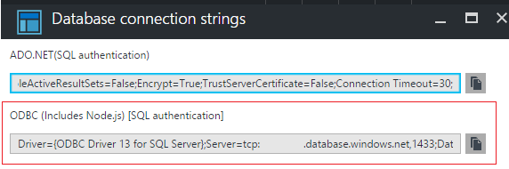
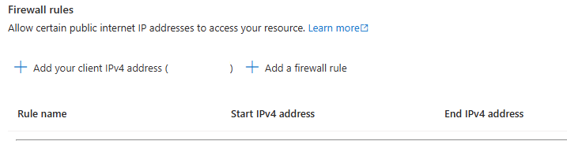
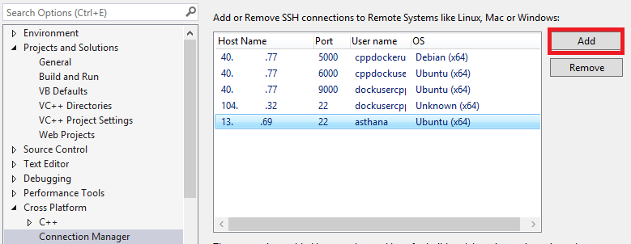

# Connect to SQL Database using C and C++
[!INCLUDE[appliesto-sqldb](../includes/appliesto-sqldb.md)]

This article helps C and C++ developers connect to [Azure SQL Database](sql-database-paas-overview.md). 

## Prerequisites

To complete the steps in this guide, you need the following: 

* An active Azure account. If you don't have one, you can sign up for a [Free Azure Trial](https://azure.microsoft.com/pricing/free-trial/).
* [Visual Studio](https://www.visualstudio.com/downloads/). You must install the C++ language components to build and run this sample.
* [Visual Studio Linux Development](/cpp/linux/). If you are developing on Linux, you must also install the Visual Studio Linux extension.

## Data access technologies: ODBC and OLE DB

There are currently two ways to connect to Azure SQL Database: ODBC (Open Database Connectivity) and OLE DB (Object Linking and Embedding database). In recent years, Microsoft has aligned with [ODBC for native relational data access](/archive/blogs/sqlnativeclient/microsoft-is-aligning-with-odbc-for-native-relational-data-access). ODBC is much faster than OLE DB. The only caveat here is that ODBC does use an old C-style API.

## Create your Azure SQL Database

See the [getting started page](single-database-create-quickstart.md) to learn how to create a sample database.  Alternatively, you can follow this [short two-minute video](https://azure.microsoft.com/documentation/videos/azure-sql-database-create-dbs-in-seconds/) to create an Azure SQL Database using the Azure portal.

## Get connection string

After your Azure SQL Database has been provisioned, you need to carry out the following steps to determine connection information and add your client IP for firewall access.

In the [Azure portal](https://portal.azure.com/), go to your Azure SQL Database ODBC connection string by using the **Show database connection strings** listed as a part of the **Overview** section for your database:




Copy the contents of the **ODBC (Includes Node.js) [SQL authentication]** string. We use this string later to connect from our C++ ODBC command-line interpreter. This string provides details such as the driver, server, and other database connection parameters.

## Add your IP to the firewall

Go to the firewall section for your server and add your [client IP to the firewall using these steps](firewall-configure.md) to make sure we can establish a successful connection:



At this point, you have configured your Azure SQL Database and are ready to connect from your C++ code.

## Connect from a Windows C/C++ application

You can easily connect to your [Azure SQL Database using ODBC on Windows using this sample](https://github.com/Microsoft/VCSamples/tree/master/VC2015Samples/ODBC%20database%20sample%20%28windows%29) that builds with Visual Studio. The sample implements an ODBC command-line interpreter that can be used to connect to our Azure SQL Database. This sample takes either a Database source name file (DSN) file as a command-line argument or the verbose connection string that we copied earlier from the Azure portal. Bring up the property page for this project and paste the connection string as a command argument as shown here:


Make sure you provide the right authentication details for your database as a part of that database connection string.

Launch the application to build it. You should see the following window validating a successful connection. You can even run some basic SQL commands like **create table** to validate your database connectivity:


Alternatively, you could create a DSN file using the wizard that is launched when no command arguments are provided. We recommend that you try this option as well. You can use this DSN file for automation and protecting your authentication settings:


Congratulations! You have now successfully connected to Azure SQL using C++ and ODBC on Windows. You can continue reading to do the same for Linux platform as well.

## Connect from a Linux C/C++ application

You can develop C++ Linux applications in Visual Studio. To learn more, review the following blog: [Visual C++ for Linux Development](https://blogs.msdn.microsoft.com/vcblog/20../../visual-c-for-linux-development/). 

To build for Linux, you need a remote machine where your Linux distro is running. If you don't have one available, you can set one up quickly using [Linux Azure Virtual machines](/azure/virtual-machines/linux/quick-create-cli?toc=/azure/virtual-machines/linux/toc.json).

This guide assumes you have an Ubuntu 16.04 Linux distribution set up. The steps also apply to Ubuntu 15.10, Red Hat 6, and Red Hat 7.

The following steps install the libraries needed for SQL and ODBC for your distro:

```console
    sudo su
    sh -c 'echo "deb [arch=amd64] https://apt-mo.trafficmanager.net/repos/mssql-ubuntu-test/ xenial main" > /etc/apt/sources.list.d/mssqlpreview.list'
    sudo apt-key adv --keyserver apt-mo.trafficmanager.net --recv-keys 417A0893
    apt-get update
    apt-get install msodbcsql
    apt-get install unixodbc-dev-utf16 #this step is optional but recommended*
```

Launch Visual Studio. Under Tools -> Options -> Cross Platform -> Connection Manager, add a connection to your Linux box:



After connection over SSH is established, create an Empty project (Linux) template:


You can then add a [new C source file and replace it with this content](https://github.com/Microsoft/VCSamples/blob/master/VC2015Samples/ODBC%20database%20sample%20%28linux%29/odbcconnector/odbcconnector.c). Using the ODBC APIs SQLAllocHandle, SQLSetConnectAttr, and SQLDriverConnect, you should be able to initialize and establish a connection to your database.
Like with the Windows ODBC sample, you need to replace the SQLDriverConnect call with the details from your database connection string parameters copied from the Azure portal previously.

```c
     retcode = SQLDriverConnect(
        hdbc, NULL, "Driver=ODBC Driver 13 for SQL"
                    "Server;Server=<yourserver>;Uid=<yourusername>;Pwd=<"
                    "yourpassword>;database=<yourdatabase>",
        SQL_NTS, outstr, sizeof(outstr), &outstrlen, SQL_DRIVER_NOPROMPT);
```

The last thing to do before compiling is to add **odbc** as a library dependency:


To launch your application, bring up the Linux Console from the **Debug** menu:


If your connection was successful, you should now see the current database name printed in the Linux Console:


Congratulations! You have successfully completed the guide and can now connect to your Azure SQL Database from C++ on Windows and Linux platforms.

## Get the complete C/C++ tutorial solution

You can find the GetStarted solution that contains all the samples in this article at GitHub:

* [ODBC C++ Windows sample](https://github.com/Microsoft/VCSamples/tree/master/VC2015Samples/ODBC%20database%20sample%20%28windows%29), Download the Windows C++ ODBC Sample to connect to Azure SQL
* [ODBC C++ Linux sample](https://github.com/Microsoft/VCSamples/tree/master/VC2015Samples/ODBC%20database%20sample%20%28linux%29), Download the Linux C++ ODBC Sample to connect to Azure SQL

## Related content

* Review the [SQL Database Development Overview](develop-overview.md)
* More information on the [ODBC API Reference](/sql/odbc/reference/syntax/odbc-api-reference/)
* [Design Patterns for multitenant SaaS Applications with Azure SQL Database](saas-tenancy-app-design-patterns.md)
* Explore all the [capabilities of SQL Database](https://azure.microsoft.com/services/sql-database/)
