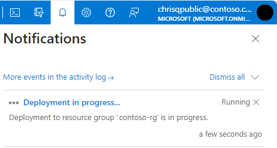

# Scale elastic pool resources in Azure SQL Database
[!INCLUDE [appliesto-sqldb](../includes/appliesto-sqldb.md)]

This article describes how to scale the compute and storage resources available for elastic pools and pooled databases in Azure SQL Database.

## Change compute resources (vCores or DTUs)

After initially picking the number of vCores or eDTUs, you can scale an elastic pool up or down dynamically based on actual experience using any of the below methods:

- [Azure portal](elastic-pool-manage.md#azure-portal)
- [PowerShell](/powershell/module/az.sql/Get-AzSqlElasticPool)
- [Azure CLI](/cli/azure/sql/elastic-pool#az-sql-elastic-pool-update)
- [REST API](/rest/api/sql/elastic-pools/update)


### Impact of changing service tier or rescaling compute size

Changing the service tier or compute size of an elastic pool follows a similar pattern as for single databases and mainly involves the service performing the following steps:

1. Create new compute instance for the elastic pool  

    A new compute instance for the elastic pool is created with the requested service tier and compute size. For some combinations of service tier and compute size changes, a replica of each database must be created in the new compute instance, which involves copying data and can strongly influence the overall latency. Regardless, the databases remain online during this step, and connections continue to be directed to the databases in the original compute instance.

1. Switch routing of connections to new compute instance

    Existing connections to the databases in the original compute instance are dropped. Any new connections are established to the databases in the new compute instance. For some combinations of service tier and compute size changes, database files are detached and reattached during the switch.  Regardless, the switch can result in a brief service interruption when databases are unavailable generally for less than 30 seconds and often for only a few seconds. If there are active long running transactions when connections are dropped, the duration of this step might take longer in order to recover aborted transactions. [Accelerated Database Recovery](../accelerated-database-recovery.md) can reduce the impact from aborting long running transactions.

> [!IMPORTANT]
> No data is lost during any step in the workflow.

### Latency of changing service tier or rescaling compute size

The estimated latency to change the service tier, scale the compute size of a single database or elastic pool, move a database in/out of an elastic pool, or move a database between elastic pools is parameterized as follows:

| Elastic pool scaling latency | To Basic, Standard, General Purpose elastic pool | To Premium, Business Critical elastic pool | To Hyperscale elastic pool |
|:-|:-|:-|:-|
| **From Basic, Standard, General Purpose elastic pool** | Proportional to the number of databases | &bull; &nbsp;Latency proportional to database space used due to data copying.</br>&bull; &nbsp;Typically, less than 1 minute per GB of space used. | N/A – databases need to be added individually to [Hyperscale elastic pools](hyperscale-elastic-pool-overview.md#limitations). Scaling latency per database documented in [Scale single database resources](single-database-scale.md). |
| **From Premium, Business Critical elastic pool** | &bull; &nbsp;Latency proportional to database space used due to data copying.</br>&bull; &nbsp;Typically, less than 1 minute per GB of space used. | &bull; &nbsp;Latency proportional to database space used due to data copying.</br>&bull; &nbsp;Typically, less than 1 minute per GB of space used. | N/A – databases need to be added individually to [Hyperscale elastic pools](hyperscale-elastic-pool-overview.md#limitations). Scaling latency per database documented in [Scale single database resources](single-database-scale.md). |
| **From Hyperscale elastic pool** | N/A | N/A | &bull; &nbsp;Constant time latency independent of space used.</br>&bull; &nbsp;Typically, less than 2 minutes. |

> [!NOTE]
>
> - When changing the service tier or scaling compute for any non-Hyperscale elastic pool, the summation of space used across all databases in the pool should be used to calculate the estimate. Scaling latency for Hyperscale elastic pools is independent of space used.
> - For Standard and General Purpose elastic pools, latency of moving a database in/out of an elastic pool or between elastic pools will be proportional to database size if the elastic pool is using Premium File Share ([PFS](/azure/storage/files/storage-files-introduction)) storage. To determine if a pool is using PFS storage, execute the following query in the context of any database in the pool. If the value in the AccountType column is `PremiumFileStorage` or `PremiumFileStorage-ZRS`, the pool is using PFS storage.

```sql
SELECT s.file_id,
       s.type_desc,
       s.name,
       FILEPROPERTYEX(s.name, 'AccountType') AS AccountType
FROM sys.database_files AS s
WHERE s.type_desc IN ('ROWS', 'LOG');
```

> [!NOTE]
> - The zone redundant property will remain the same by default when scaling an elastic pool from the Business Critical to the General Purpose tier. 
> - Latency for the scaling operation when zone redundancy is changed for a General Purpose elastic pool is proportional to database size.
> - Changing an existing non-Hyperscale elastic pool to the Hyperscale edition isn't supported. See [Hyperscale elastic pools](hyperscale-elastic-pool-overview.md#limitations) for more details. Instead, databases need to be added individually to Hyperscale elastic pools.
> - Changing the edition of a Hyperscale elastic pool to a non-Hyperscale edition isn't supported. See [Hyperscale elastic pools](hyperscale-elastic-pool-overview.md#limitations) for more details.

> [!TIP]
> To monitor in-progress operations, see: [Manage operations using the SQL REST API](/rest/api/sql/operations/list), [Manage operations using CLI](/cli/azure/sql/elastic-pool/op), [Monitor operations using T-SQL](/sql/relational-databases/system-dynamic-management-views/sys-dm-operation-status-azure-sql-database) and these two PowerShell commands: [Get-AzSqlElasticPoolActivity](/powershell/module/az.sql/get-azsqlelasticpoolactivity) and [Stop-AzSqlElasticPoolActivity](/powershell/module/az.sql/stop-azsqlelasticpoolactivity).

### Additional considerations when changing service tier or rescaling compute size

- When you reduce vCores or eDTUs for an elastic pool, the pool used space must be smaller than the max data size limit of the target service tier and pool compute.
- When you increase eDTUs for an elastic pool, an extra storage cost might apply if:
  - The max data size of the pool is supported by the target pool, and
  - The max data size of the pool exceeds the included storage amount of the target pool.
- For example, if a 100 eDTU Standard pool with a max data size of 100 GB is downsized to a 50 eDTU Standard pool, then an extra storage cost applies since target pool supports a max data size of 100 GB and its included storage amount is only 50 GB. So, the extra storage amount is 100 GB – 50 GB = 50 GB. For pricing of extra storage, see [SQL Database pricing](https://azure.microsoft.com/pricing/details/sql-database/). If the actual amount of space used is less than the included storage amount, then this extra cost can be avoided by reducing the max data size to the included amount.

### Billing during rescaling

You are billed for each hour a database exists using the highest service tier + compute size that applied during that hour, regardless of usage or whether the database was active for less than an hour. For example, if you create a single database and delete it five minutes later your bill reflects a charge for one database hour.

## Change elastic pool storage size

The storage size (max data size) for the elastic pool can be specified using the [Azure portal](elastic-pool-manage.md#azure-portal), [PowerShell](/powershell/module/az.sql/Get-AzSqlElasticPool), the [Azure CLI](/cli/azure/sql/elastic-pool#az-sql-elastic-pool-update), or the [REST API](/rest/api/sql/elastic-pools/update). When you increase the max data size of the elastic pool, the value specified cannot exceed the max data size limit of the pool's service objective. When decreasing the max data size, the new value specified has to be equal to or greater than the summation of space allocated across all databases in the pool.

> [!IMPORTANT]
> Under some circumstances, you might need to shrink a database to reclaim unused space. For more information, see [Manage file space in Azure SQL Database](file-space-manage.md).

### vCore-based purchasing model

- The storage size (max data size) for elastic pools in the General Purpose or Business Critical tiers can be specified up to the max data size limits specified in [Resource limits for elastic pools using the vCore purchasing model](resource-limits-vcore-elastic-pools.md). The max data size for the elastic pool can be increased or decreased in multiples of 1 GB.
- The price of storage for an elastic pool is the max data size specified, multiplied by the storage unit price of the service tier. For details on storage pricing, see [SQL Database pricing](https://azure.microsoft.com/pricing/details/sql-database/).

> [!IMPORTANT]
> Under some circumstances, you might need to shrink a database to reclaim unused space. For more information, see [Manage file space in Azure SQL Database](file-space-manage.md).

### DTU-based purchasing model

- The eDTU price for an elastic pool includes a certain amount of storage at no additional cost. Extra data storage beyond the included amount can be provisioned for an additional cost up to the max data size limit corresponding to the eDTUs provisioned. For included storage amounts and max data size limits, see [Resources limits for elastic pools using the DTU purchasing model](resource-limits-dtu-elastic-pools.md#elastic-pool-storage-sizes-and-compute-sizes).
- The price of extra storage for an elastic pool is the extra storage amount multiplied by the extra storage unit price of the service tier. For details on the price of extra storage, see [SQL Database pricing](https://azure.microsoft.com/pricing/details/sql-database/).
- Valid values for the max data size for a Standard or Premium tier elastic pool can be one of these values: 50 GB, 100 GB, 150 GB, 200 GB, 250 GB, 300 GB, 400 GB, 500 GB, 750 GB, 800 GB, 1024 GB, 1200 GB, 1280 GB, 1536 GB, 1600 GB, 1792 GB, 2000 GB, 2048 GB, 2304 GB, 2500 GB, 2560 GB, 2816 GB, 3000 GB, 3072 GB, 3328 GB, 3584 GB, 3840 GB, 4096 GB. The max data size specified cannot exceed the max data size limit specified for the eDTUs provisioned.

> [!IMPORTANT]
> Under some circumstances, you might need to shrink a database to reclaim unused space. For more information, see [Manage file space in Azure SQL Database](file-space-manage.md).

## Monitor or cancel scaling changes

A service tier change or compute rescaling operation can be monitored and canceled.

### [Azure portal](#tab/azure-portal)

In the SQL elastic pool Overview page, navigate to **Notifications** and select the tile indicating there's an ongoing operation:



On the resulting **Deployment is in progress** page, select **Cancel**.

### [PowerShell](#tab/azure-powershell)

In order to invoke the PowerShell commands on a computer, [Az package version 9.7.0](https://www.powershellgallery.com/packages/Az/9.7.0) or a newer version must be installed locally. Or, consider using the [Azure Cloud Shell](/azure/cloud-shell/overview) to run Azure PowerShell at [shell.azure.com](https://shell.azure.com/).

First, log in to Azure and set the proper context for your subscription:

```powershell
Login-AzAccount
$SubscriptionID = "<YourSubscriptionIdHere>"
Select-AzSubscription -SubscriptionName $SubscriptionID
```

To monitor operations on an elastic pool, including scaling operations, use [Get-AzSqlElasticPoolActivity](/powershell/module/az.sql/get-azsqlelasticpoolactivity). The following sample returns an `OperationId` for each operation currently executing.

```powershell
Get-AzSqlElasticPoolActivity -ResourceGroupName "ResourceGroup01" -ElasticPoolName "Pool01" ServerName "Server01" 
```

To cancel any asynchronous elastic pool management operation, like an elastic pool scale, identify the operation then use [Stop-AzSqlElasticPoolActivity](/powershell/module/az.sql/stop-azsqlelasticpoolactivity) with a specific `OperationId`, as in the following sample.

```powershell
Stop-AzSqlElasticPoolActivity -ResourceGroupName "ResourceGroup01" -ElasticPoolName "Pool01" -ServerName "Server01" -OperationId af97005d-9243-4f8a-844e-402d1cc855f5
```

### [Azure CLI](#tab/azure-cli)

From a Cloud shell terminal, use the following sample command to identify operations currently executing. From a Cloud shell terminal, set the `$resourceGroupName`, `$serverName`, and `$elasticPoolName` variables, and then run the following command:

```azurecli
$resourceGroupName = "<resource group name>"
$serverName = "<server name>"
$elasticPoolName = "<elastic pool name>"
az sql elastic-pool op list --resource-group $resourceGroupName --server $serverName --elastic-pool $elasticPoolName --query "[?state=='IN_PROGRESS'].name" --out tsv
```

To stop any asynchronous elastic pool management operation, like a scaling operation, from a Cloud shell terminal, set the `$resourceGroupName`, `$serverName`, and `$elasticPoolName` variables, and then run the following command:

```azurecli
$resourceGroupName = "<resource group name>"
$serverName = "<server name>"
$elasticPoolName = "<elastic pool name>"
$operationId = (az sql elastic-pool op list --resource-group $resourceGroupName --server $serverName --elastic-pool $elasticPoolName --query "[?state=='IN_PROGRESS'].name" --out tsv)
if (-not [string]::IsNullOrEmpty($operationName)) {
    (az sql elastic-pool op cancel --resource-group $resourceGroupName --server $serverName --elastic-pool $elasticPoolName --name $operationId)
        "Operation " + $operationName + " has been canceled"
}
else {
    "No management operation on the elastic pool found"
}
```

---

## Permissions

To scale an elastic pool via the Azure portal, PowerShell, Azure CLI, or REST API, Azure RBAC permissions are needed, specifically the Contributor, SQL DB Contributor role, or SQL Server Contributor Azure RBAC roles. For more information, see [Azure RBAC built-in roles](/azure/role-based-access-control/built-in-roles).

## Related content

For overall resource limits, see [SQL Database vCore-based resource limits - elastic pools](resource-limits-vcore-elastic-pools.md) and [SQL Database DTU-based resource limits - elastic pools](resource-limits-dtu-elastic-pools.md).
