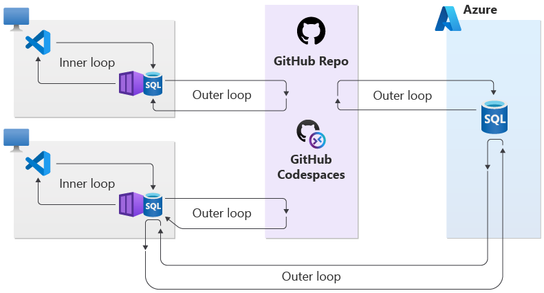

# What is the local development experience for Azure SQL Database?
[!INCLUDE[appliesto-sqldb](../includes/appliesto-sqldb.md)]

This article provides an overview of the local development experience for Azure SQL Database. 

To get started, see how to [set up a dev environment](local-dev-experience-set-up-dev-environment.md) and the [Quickstart](local-dev-experience-quickstart.md). 

## Overview

The Azure SQL Database local development experience is a combination of tools and procedures that empowers application developers and database professionals to design, edit, build/validate, publish, and run database schemas for databases while working offline.

The Azure SQL Database local development experience consists of extensions for Visual Studio Code and Azure Data Studio and an [Azure SQL Database emulator (preview)](local-dev-experience-sql-database-emulator.md). Extensions allow users to create, build and source control Database Projects while working offline with Azure SQL Database emulator, which is a containerized database with close fidelity to the Azure SQL Database public service.

The local development experience uses the emulator as a runtime host for Database Projects that can be published and tested locally as part of a developer's inner loop.

A common example would be to push a project to a GitHub repository that leverages GitHub Actions to automate database creation or apply schema changes to a database in Azure SQL Database. The Azure SQL Database emulator itself can also be used as part of Continuous Integration and Continuous Deployment (CI/CD) processes to automate database validation and testing.

> [!NOTE] 
> To learn more about upcoming use cases and support for new scenarios, review the [Devs's Corner](https://aka.ms/sql-db-local-dev-experience-plan) blog. 

## Visual Studio Code and Azure Data Studio extensions

To use the Azure SQL Database local development experience, install the appropriate extension depending on whether you are using [Visual Studio Code](https://code.visualstudio.com/Docs) or [Azure Data Studio](/sql/azure-data-studio/download-azure-data-studio).

| Extension | Description | Visual Studio Code | Azure Data Studio |
|--|--|--|--|
| The [mssql extension for Visual Studio Code](https://marketplace.visualstudio.com/items?itemName=ms-mssql.mssql) | Enables you to connect and run queries and test scripts against a database. The database may be running in the Azure SQL Database emulator locally, or it may be a database in the global Azure SQL Database service. | Install the mssql extension. | There is no need to install the mssql extension because this functionality is provided natively by Azure Data Studio. |
| [SQL Database Projects extension (Preview)](https://marketplace.visualstudio.com/items?itemName=ms-mssql.sql-database-projects-vscode) | Enables you to capture an existing database schema and/or design new database objects using a declarative database design model. You can commit a database schema to version control. You can also publish a database schema to a database running in the Azure SQL Database emulator, or to a database running in the global Azure SQL Database service. You may publish an entire database, or incremental changes to a database. | The SQL Database Projects extension is bundled into the mssql extension for Visual Studio Code and is installed or updated automatically when the mssql extension is updated or installed. | Install the SQL Database Projects extension. |

To learn how to install the extensions, review [Set up a local development environment](local-dev-experience-set-up-dev-environment.md). 

## Azure SQL Database emulator

The Azure SQL Database emulator (preview) is a containerized database with close fidelity to the Azure SQL Database public service. Application developers and database professionals can pull the Azure SQL Database emulator from an image in the Microsoft Container registry and run it on their own workstation. The Azure SQL Database emulator enables faster local and offline development workflows for Azure SQL Database.

You can also use the Azure SQL Database emulator as part of local or hosted CI/CD pipelines to support unit and integration testing, without the need to use the global Azure SQL Database cloud service.

Learn more in [Azure SQL Database emulator](local-dev-experience-sql-database-emulator.md).

## Next steps

Learn more about the local development experience for Azure SQL Database:

- [Set up a local development environment for Azure SQL Database](local-dev-experience-set-up-dev-environment.md)
- [Create a Database Project for a local Azure SQL Database development environment](local-dev-experience-create-database-project.md)
- [Publish a Database Project for Azure SQL Database to the local emulator](local-dev-experience-publish-emulator.md)
- [Quickstart: Create a local development environment for Azure SQL Database](local-dev-experience-quickstart.md)
- [Introducing the Azure SQL Database emulator (preview)](local-dev-experience-sql-database-emulator.md)
