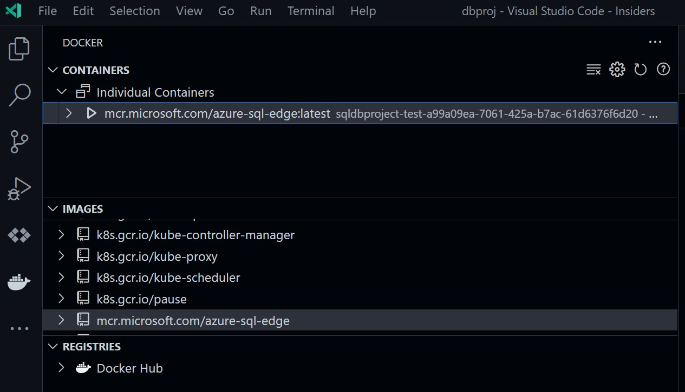

# Introducing the Azure SQL Database emulator (preview)
[!INCLUDE[appliesto-sqldb](../includes/appliesto-sqldb.md)]

This article introduces the Azure SQL Database emulator (preview), which provides the ability to locally validate database and query design together with client application code in a simple and frictionless model as part of the application development process. The Azure SQL Database emulator is a critical component that speeds up the overall workflow for application developers and database professionals. You can use the Azure SQL Database emulator as part of [the local development experience for Azure SQL Database](local-dev-experience-overview.md).

To get started, see how to [set up a dev environment](local-dev-experience-set-up-dev-environment.md) and the [Quickstart](local-dev-experience-quickstart.md). 

## What is the Azure SQL Database emulator?

The Azure SQL Database emulator is a local containerized database for development and testing. The emulator is a combination of a container image that provides a high-fidelity emulator for Azure SQL Database with a Visual Studio Code extension. This combination enables  developers to pull the Azure SQL Database emulator from the Microsoft Container Registry and run it on their own workstation to enable faster local and offline development workflows.

This Azure SQL Database emulator image can also be easily used as part of local or hosted CI/CD pipelines to provide support for unit and integration testing without the need for hitting public cloud service every time.

Within Visual Studio Code, developers can list, start, and stop existing instances of the Azure SQL Database emulator using the Docker extension, configure details like local ports or persistent volumes, and manage all other aspects of the emulator.

This local development experience is supported on Windows, macOS and Linux, and is available on x64 and ARM64-based hardware platforms.

Once validation and testing have succeeded, developers can directly deploy their SQL Database Projects from within Visual Studio Code to a database in Azure SQL Database and leverage additional capabilities like [Serverless](serverless-tier-overview.md).

## Limitations

The current implementation of the Azure SQL Database emulator is derived from an Azure SQL Edge base image, as it offers a cross-hardware platform compatibility and smaller image size. This means that compared to the Azure SQL Database public service, some specific features may not be available. For example, the Azure SQL Database emulator does not support all features that are supported across multiple Azure SQL Database service tiers. Limitations include:

* Spatial data types
* Memory-optimized tables in in-memory OLTP
* HierarchyID data type
* Full-text search
* Azure Active Directory Integration

While lack of compatibility with some of these features can be impactful, the emulator is still a great tool for local development and testing and supports most of the Azure SQL Database programmability surface.

In future releases, we plan to increase feature parity and provide higher-fidelity with Azure SQL Database public service.

Refer to the [Azure SQL Edge documentation](/azure/azure-sql-edge/features) for more specific details.

## Next steps

Learn more about the local development experience for Azure SQL Database:

- [What is the local development experience for Azure SQL Database?](local-dev-experience-overview.md)
- [Set up a local development environment for Azure SQL Database](local-dev-experience-set-up-dev-environment.md)
- [Quickstart: Create a local development environment for Azure SQL Database](local-dev-experience-quickstart.md)
- [Create a Database Project for a local Azure SQL Database development environment](local-dev-experience-create-database-project.md)
- [Publish a Database Project for Azure SQL Database to the local emulator](local-dev-experience-publish-emulator.md)
