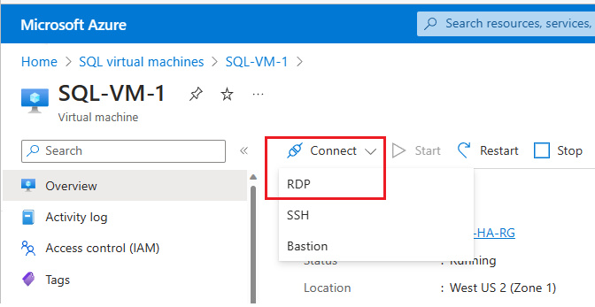

1. After the Azure virtual machine is created and running, select **Virtual machine**, and then choose your new VM. 

1. Select **Connect** and then choose **RDP** from the drop-down to download your RDP file. 

   

1. Open the **RDP** file that your browser downloads for the VM.

1. The Remote Desktop Connection notifies you that the publisher of this remote connection cannot be identified. Click **Connect** to continue.

1. In the **Windows Security** dialog, click **Use a different account**. You might have to click **More choices** to see this. Specify the user name and password that you configured when you created the VM. You must add a backslash before the user name.

   

1. Click **OK** to connect.
