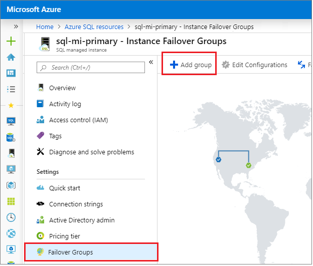
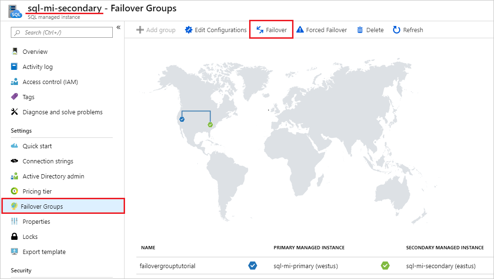

# Configure an auto-failover group for Azure SQL Managed Instance
[!INCLUDE[appliesto-sqlmi](../includes/appliesto-sqlmi.md)]

> [!div class="op_single_selector"]
> * [Azure SQL Database](../database/auto-failover-group-configure-sql-db.md)
> * [Azure SQL Managed Instance](auto-failover-group-configure-sql-mi.md)

This article teaches you how to configure an [auto-failover group](auto-failover-group-sql-mi.md) for Azure SQL Managed Instance using the Azure portal and Azure PowerShell. For an end-to-end experience, review the [Auto-failover group tutorial](failover-group-add-instance-tutorial.md). 

> [!NOTE]
> This article covers auto-failover groups for Azure SQL Managed Instance. For Azure SQL Database, see [Configure auto-failover groups in SQL Database](../database/auto-failover-group-configure-sql-db.md). 


## Prerequisites

Consider the following prerequisites:

- The secondary managed instance must be empty that is, contain no user databases.
- The two instances of SQL Managed Instance need to be the same service tier, and have the same storage size. While not required, it's strongly recommended that two instances have equal compute size, to make sure that secondary instance can sustainably process the changes being replicated from the primary instance, including the periods of peak activity.
- The IP address range(s) of the virtual network hosting the primary instance must not overlap with IP address range(s) of the virtual network hosting the secondary instance.
- Network Security Groups (NSG) rules on subnet hosting instance must have port 5022 (TCP) and the port range 11000-11999 (TCP) open inbound and outbound for connections from and to the subnet hosting the other managed instance. This applies to both subnets, hosting primary and secondary instance.
- The secondary SQL Managed Instance is configured during its creation with the correct DNS zone ID. It's accomplished by passing the primary instance's zone ID as the value of DnsZonePartner parameter when creating the secondary instance. If not passed as a parameter, the zone ID is generated as a random string when the first instance is created in each VNet and the same ID is assigned to all other instances in the same subnet. Once assigned, the DNS zone can't be modified. 
- The collation and time zone of the secondary managed instance must match that of the primary managed instance.
- Managed instances should be deployed in [paired regions](/azure/availability-zones/cross-region-replication-azure) for performance reasons. Managed instances residing in geo-paired regions benefit from significantly higher geo-replication speed compared to unpaired regions.

## Enabling connectivity between the instances

Connectivity between the virtual network subnets hosting primary and secondary instance must be established for uninterrupted geo-replication traffic flow. [Global virtual network peering](/azure/virtual-network/virtual-network-peering-overview) is **recommended** as the most performant and robust way for establishing the connectivity. It provides a low-latency, high-bandwidth private connection between the peered virtual networks using the Microsoft backbone infrastructure. No public Internet, gateways, or additional encryption is required in the communication between the peered virtual networks. To learn about alternative ways of establishing connectivity, see [enabling replication traffic between instances](auto-failover-group-sql-mi.md#enabling-replication-traffic-between-two-instances).

> [!IMPORTANT]
> Alternative ways of providing connectivity between the instances involving additional networking devices may make troubleshooting process in case of connectivity or replication speed issues very difficult and require active involvement of network administrators and significantly prolong the resolution time.

# [Portal](#tab/azure-portal)

1. In the [Azure portal](https://portal.azure.com), go to the **Virtual network** resource for your primary managed instance. 
1. Select **Peerings** under *Settings* and then select + Add.


1. Enter or select values for the following settings:

   | Settings | Description |
    | -------- | ----------- |
    | **This virtual network** |  |
    | Peering link name | The name for the peering must be unique within the virtual network. |
    | Traffic to remote virtual network | Select **Allow (default)** to enable communication between the two virtual networks through the default `VirtualNetwork` flow. Enabling communication between virtual networks allows resources that are connected to either virtual network to communicate with each other with the same bandwidth and latency as if they were connected to the same virtual network. All communication between resources in the two virtual networks is over the Azure private network. |
    | Traffic forwarded from remote virtual network | Both **Allowed (default)** and **Block** option will work for this tutorial. For more information, see [Create a peering](/azure/virtual-network/virtual-network-manage-peering#create-a-peering)|
    | Virtual network gateway or Route Server | Select **None**. For more information about the other options available, see [Create a peering](/azure/virtual-network/virtual-network-manage-peering#create-a-peering). |
    | **Remote virtual network** |  |
    | Peering link name | The name of the same peering to be used in the virtual network hosting secondary instance. |
    | Virtual network deployment model | Select **Resource manager**. |
    | I know my resource ID | Leave this checkbox unchecked. |
    | Subscription | Select the Azure subscription of the virtual network hosting the secondary instance that you want to peer with. |
    | Virtual network | Select the virtual network hosting the secondary instance that you want to peer with. If the virtual network is listed, but grayed out, it may be because the address space for the virtual network overlaps with the address space for this virtual network. If virtual network address spaces overlap, they cannot be peered.|
    | Traffic to remote virtual network | Select **Allow (default)** |
    | Traffic forwarded from remote virtual network | Both **Allowed (default)** and **Block** option will work for this tutorial. For more information, see [Create a peering](/azure/virtual-network/virtual-network-manage-peering#create-a-peering). |
    | Virtual network gateway or Route Server | Select **None**. For more information about the other options available, see [Create a peering](/azure/virtual-network/virtual-network-manage-peering#create-a-peering). |


1. Select **Add** to configure peering with the virtual network you selected. After a few seconds, select the **Refresh** button and the peering status will change from *Updating* to *Connected*.

   

# [PowerShell](#tab/azure-powershell)

Create global virtual network peering between virtual networks hosting primary and secondary instance. 

   ```powershell-interactive
   # Peer the virtual networks
   Write-host "Retreiving primary VNet and secondary VNet..."

   $primaryVirtualNetwork  = Get-AzVirtualNetwork `
                     -Name $primaryVNet `
                     -ResourceGroupName $primaryResourceGroupName
   
   $secondaryVirtualNetwork = Get-AzVirtualNetwork -Name $secondaryVNet `
                                   -ResourceGroupName $secondaryResourceGroupName

  Write-host "Peering primary VNet to secondary VNet..."
  
  Add-AzVirtualNetworkPeering `
    -Name $primaryVnetToSecondaryVNetPeeringName `
    -VirtualNetwork $primaryVirtualNetwork `
    -RemoteVirtualNetworkId $secondaryVirtualNetwork.Id
   
  Write-host "Peering secondary VNet to primary VNet..."
   
  Add-AzVirtualNetworkPeering `
    -Name $secondaryVNetToPrimaryVNetPeeringName`
    -VirtualNetwork $secondaryVirtualNetwork `
    -RemoteVirtualNetworkId $primaryVirtualNetwork.Id
  
  Write-host "Checking peering state on the primary virtual network, expecting state Connected..."

  Get-AzVirtualNetworkPeering `
  -ResourceGroupName $primaryResourceGroupName `
  -VirtualNetworkName $primaryVNet `
  | Select PeeringState

  Write-host "Checking peering state on the secondary virtual network, expecting state Connected..."

  Get-AzVirtualNetworkPeering `
  -ResourceGroupName $secondaryResourceGroupName `
  -VirtualNetworkName $secondaryVNet `
  | Select PeeringState
   ```


---

## Create the failover group

Create the failover group for your managed instances by using the Azure portal or PowerShell.

# [Portal](#tab/azure-portal)

Create the failover group for your SQL Managed Instances by using the Azure portal.

1. Select **Azure SQL** in the left-hand menu of the [Azure portal](https://portal.azure.com). If **Azure SQL** isn't in the list, select **All services**, then type Azure SQL in the search box. (Optional) Select the star next to **Azure SQL** to add it as a favorite item to the left-hand navigation.
1. Select the primary managed instance you want to add to the failover group.  
1. Under **Settings**, navigate to **Instance Failover Groups** and then choose to **Add group** to open the instance failover group creation page.

   

1. On the **Instance Failover Group** page, type the name of your failover group and then choose the secondary managed instance from the drop-down. Select **Create** to create your failover group.

   

1. Once failover group deployment is complete, you'll be taken back to the **Failover group** page.

# [PowerShell](#tab/azure-powershell)

Create the failover group for your managed instances using PowerShell.

   ```powershell-interactive
   $primaryResourceGroupName = "<Primary-Resource-Group>"
   $failoverGroupName = "<Failover-Group-Name>"
   $primaryLocation = "<Primary-Region>"
   $secondaryLocation = "<Secondary-Region>"
   $primaryManagedInstance = "<Primary-Managed-Instance-Name>"
   $secondaryManagedInstance = "<Secondary-Managed-Instance-Name>"

   # Create failover group
   Write-host "Creating the failover group..."
   $failoverGroup = New-AzSqlDatabaseInstanceFailoverGroup -Name $failoverGroupName `
        -Location $primaryLocation -ResourceGroupName $primaryResourceGroupName -PrimaryManagedInstanceName $primaryManagedInstance `
        -PartnerRegion $secondaryLocation -PartnerManagedInstanceName $secondaryManagedInstance `
        -FailoverPolicy Automatic -GracePeriodWithDataLossHours 1
   $failoverGroup
   ```

---


## Test failover

Test failover of your failover group using the Azure portal or PowerShell.

# [Portal](#tab/azure-portal)

Test failover of your failover group using the Azure portal.

1. Navigate to your _secondary_ managed instance within the [Azure portal](https://portal.azure.com) and select **Instance Failover Groups** under settings.
1. Note managed instances in the primary and in the secondary role. 
1. Select **Failover** and then select **Yes** on the warning about TDS sessions being disconnected.

   

1. Note managed instances in the primary and in the secondary role. If failover succeeded, the two instances should have switched roles.

   
   
> [!IMPORTANT]
> If roles didn't switch, check the connectivity between the instances and related NSG and firewall rules. Proceed with the next step only after roles switch.

1. Go to the new _secondary_ managed instance and select **Failover** once again to fail the primary instance back to the primary role.

# [PowerShell](#tab/azure-powershell)

Test failover of your failover group using PowerShell.

   ```powershell-interactive
   $primaryResourceGroupName = "<Primary-Resource-Group>"
   $secondaryResourceGroupName = "<Secondary-Resource-Group>"
   $failoverGroupName = "<Failover-Group-Name>"
   $primaryLocation = "<Primary-Region>"
   $secondaryLocation = "<Secondary-Region>"
   $primaryManagedInstance = "<Primary-Managed-Instance-Name>"
   $secondaryManagedInstance = "<Secondary-Managed-Instance-Name>"

   # Verify the current primary role
   Get-AzSqlDatabaseInstanceFailoverGroup -ResourceGroupName $primaryResourceGroupName `
       -Location $secondaryLocation -Name $failoverGroupName

   # Failover the primary managed instance to the secondary role
   Write-host "Failing primary over to the secondary location"
   Get-AzSqlDatabaseInstanceFailoverGroup -ResourceGroupName $secondaryResourceGroupName `
       -Location $secondaryLocation -Name $failoverGroupName | Switch-AzSqlDatabaseInstanceFailoverGroup
   Write-host "Successfully failed failover group to secondary location"

   # Verify the current primary role
   Get-AzSqlDatabaseInstanceFailoverGroup -ResourceGroupName $primaryResourceGroupName `
       -Location $secondaryLocation -Name $failoverGroupName

   # Fail primary managed instance back to primary role
   Write-host "Failing primary back to primary role"
   Get-AzSqlDatabaseInstanceFailoverGroup -ResourceGroupName $primaryResourceGroupName `
       -Location $primaryLocation -Name $failoverGroupName | Switch-AzSqlDatabaseInstanceFailoverGroup
   Write-host "Successfully failed failover group to primary location"

   # Verify the current primary role
   Get-AzSqlDatabaseInstanceFailoverGroup -ResourceGroupName $primaryResourceGroupName `
       -Location $secondaryLocation -Name $failoverGroupName
   ```

---

## Locate listener endpoint

Once your failover group is configured, update the connection string for your application to the listener endpoint. It will keep your application connected to the failover group listener, rather than the primary database, elastic pool, or instance database. That way, you don't have to manually update the connection string every time your database entity fails over, and traffic is routed to whichever entity is currently primary.

The listener endpoint is in the form of `fog-name.database.windows.net`, and is visible in the Azure portal, when viewing the failover group:


## <a name="creating-a-failover-group-between-managed-instances-in-different-subscriptions"></a> Create group between instances in different subscriptions

You can create a failover group between SQL Managed Instances in two different subscriptions, as long as subscriptions are associated to the same [Azure Active Directory Tenant](/azure/active-directory/fundamentals/active-directory-whatis#terminology). 

- When using PowerShell API, you can do it by specifying the `PartnerSubscriptionId` parameter for the secondary SQL Managed Instance. 
- When using REST API, each instance ID included in the `properties.managedInstancePairs` parameter can have its own Subscription ID.
- Azure portal does not support creation of failover groups across different subscriptions. 
  
> [!IMPORTANT]
> Azure portal does not support creation of failover groups across different subscriptions. For failover groups across different subscriptions and/or resource groups, failover can't be initiated manually via the Azure portal from the primary SQL managed instance. Initiate it from the geo-secondary instance instead.

## Change the secondary region

Let's assume that instance A is the primary instance, instance B is the existing secondary instance, and instance C is the new secondary instance in the third region. To make the transition, follow these steps:

1. Create instance C with same size as A and in the same DNS zone.
2. Delete the failover group between instances A and B. At this point, the logins will be failing because the SQL aliases for the failover group listeners have been deleted and the gateway won't recognize the failover group name. The secondary databases will be disconnected from the primaries and will become read-write databases.
3. Create a failover group with the same name between instance A and C. Follow the instructions in [failover group with SQL Managed Instance tutorial](failover-group-add-instance-tutorial.md). This is a size-of-data operation and will complete when all databases from instance A are seeded and synchronized.
4. Delete instance B if not needed to avoid unnecessary charges.

> [!NOTE]
> After step 2 and until step 3 is completed the databases in instance A will remain unprotected from a catastrophic failure of instance A.

## Change the primary region 

Let's assume instance A is the primary instance, instance B is the existing secondary instance, and instance C is the new primary instance in the third region. To make the transition, follow these steps:

1. Create instance C with same size as B and in the same DNS zone.
2. Connect to instance B and manually failover to switch the primary instance to B. Instance A will become the new secondary instance automatically.
3. Delete the failover group between instances A and B. At this point, log in attempts using failover group endpoints will be failing. The secondary databases on A will be disconnected from the primaries and will become read-write databases.
4. Create a failover group with the same name between instance B and C. Follow the instructions in the [failover group with managed instance tutorial](failover-group-add-instance-tutorial.md). This is a size-of-data operation and will complete when all databases from instance A are seeded and synchronized. At this point login attempts will stop failing.
5. Manually failover to switch the C instance to primary role. Instance B will become the new secondary instance automatically.
6. Delete instance A if not needed to avoid unnecessary charges.

> [!CAUTION]
> After step 3 and until step 4 is completed the databases in instance A will remain unprotected from a catastrophic failure of instance A.

> [!IMPORTANT]
> When the failover group is deleted, the DNS records for the listener endpoints are also deleted. At that point, there's a non-zero probability of somebody else creating a failover group with the same name. Because failover group names must be globally unique, this will prevent you from using the same name again. To minimize this risk, don't use generic failover group names.

## Enable scenarios dependent on objects from the system databases

<!--
This section is duplicated in /managed-instance/auto-failover-group-sql-mi.md. Please ensure changes are made to both documents. 
-->

System databases are **not** replicated to the secondary instance in a failover group. To enable scenarios that depend on objects from the system databases, make sure to create the same objects on the secondary instance and keep them synchronized with the primary instance. 

For example, if you plan to use the same logins on the secondary instance, make sure to create them with the identical SID. 

```SQL
-- Code to create login on the secondary instance
CREATE LOGIN foo WITH PASSWORD = '<enterStrongPasswordHere>', SID = <login_sid>;
``` 

To learn more, see [Replication of logins and agent jobs](https://techcommunity.microsoft.com/t5/modernization-best-practices-and/azure-sql-managed-instance-sync-agent-jobs-and-logins-in/ba-p/2860495). 

## Synchronize instance properties and retention policies instances

<!--
This section is duplicated in /managed-instance/auto-failover-group-sql-mi.md. Please ensure changes are made to both documents. 
-->

Instances in a failover group remain separate Azure resources, and no changes made to the configuration of the primary instance will be automatically replicated to the secondary instance. Make sure to perform all relevant changes both on primary _and_ secondary instance. For example, if you change backup storage redundancy or long-term backup retention policy on primary instance, make sure to change it on secondary instance as well.

## Scaling instances

<!--
This section is duplicated in /managed-instance/auto-failover-group-sql-mi.md.. Please ensure changes are made to both documents. 
-->

You can scale up or scale down the primary and secondary instance to a different compute size within the same service tier. When scaling up, we recommend that you scale up the geo-secondary first, and then scale up the primary. When scaling down, reverse the order: scale down the primary first, and then scale down the secondary. When you scale instance to a different service tier, this recommendation is enforced.

The sequence is recommended specifically to avoid the problem where the geo-secondary at a lower SKU gets overloaded and must be re-seeded during an upgrade or downgrade process.


## Permissions


<!--
There's some overlap of content in the following articles, be sure to make changes to all if necessary:
/azure-sql/auto-failover-group-overview.md
/azure-sql/database/auto-failover-group-sql-db.md
/azure-sql/database/auto-failover-group-configure-sql-db.md
/azure-sql/managed-instance/auto-failover-group-sql-mi.md
/azure-sql/managed-instance/auto-failover-group-configure-sql-mi.md
-->

Permissions for a failover group are managed via [Azure role-based access control (Azure RBAC)](/azure/role-based-access-control/overview). 

Azure RBAC write access is necessary to create and manage failover groups. The [SQL Managed Instance Contributor](/azure/role-based-access-control/built-in-roles#sql-managed-instance-contributor) role has all the necessary permissions to manage failover groups.

The following table lists specific permission scopes for Azure SQL Managed Instance: 

| **Action** | **Permission** | **Scope**|
| :---- | :---- | :---- | 
|**Create failover group**| Azure RBAC write access | Primary managed instance </br> Secondary managed instance|
| **Update failover group**| Azure RBAC write access | Failover group </br> All databases within the managed instance|
| **Fail over failover group** | Azure RBAC write access | Failover group on new primary managed instance |


## Next steps

For detailed steps configuring a failover group, see the [Add a managed instance to a failover group](failover-group-add-instance-tutorial.md) tutorial. 

For an overview of the feature, see [Auto-failover groups](auto-failover-group-sql-mi.md). To learn how to save on licensing costs, see [Configure standby replica](auto-failover-group-standby-replica-how-to-configure.md). 
