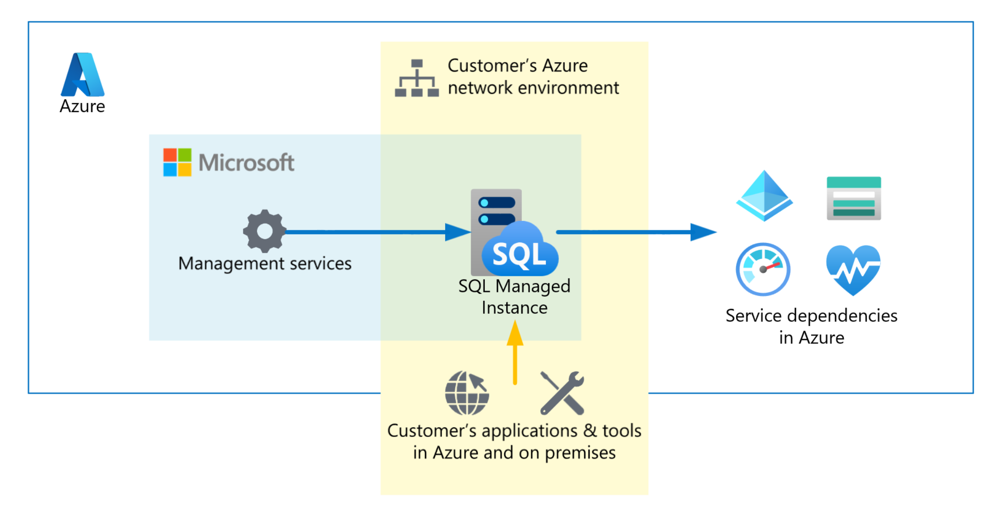
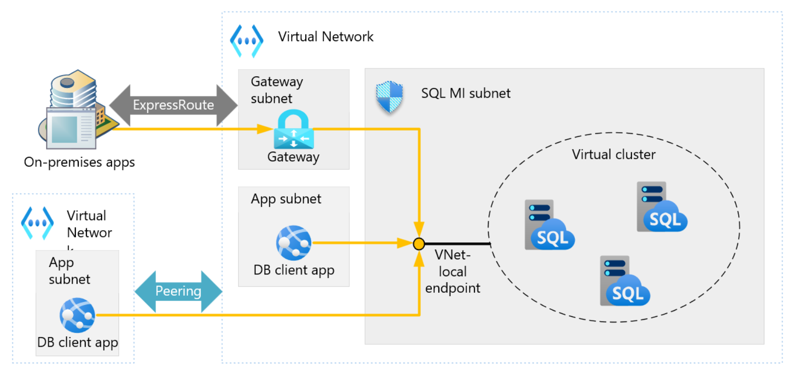
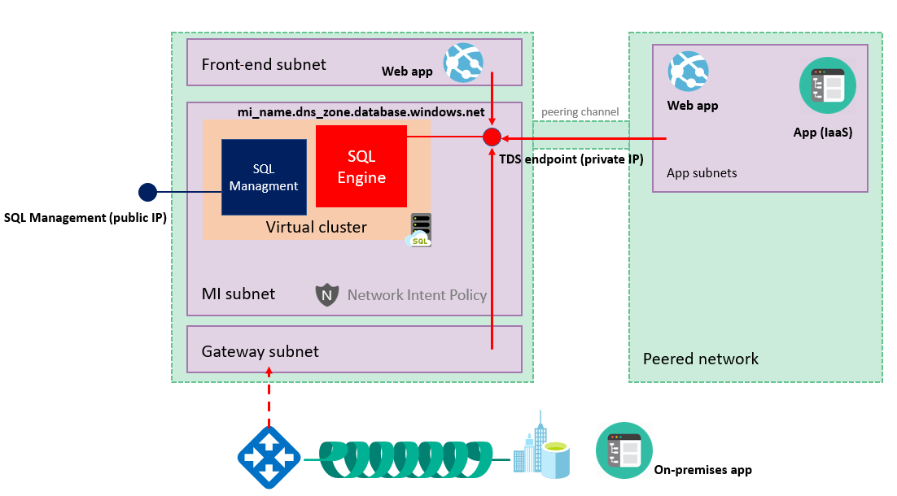
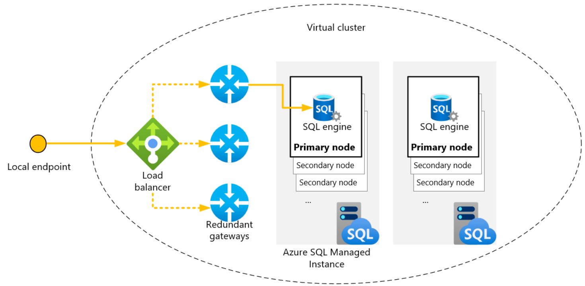
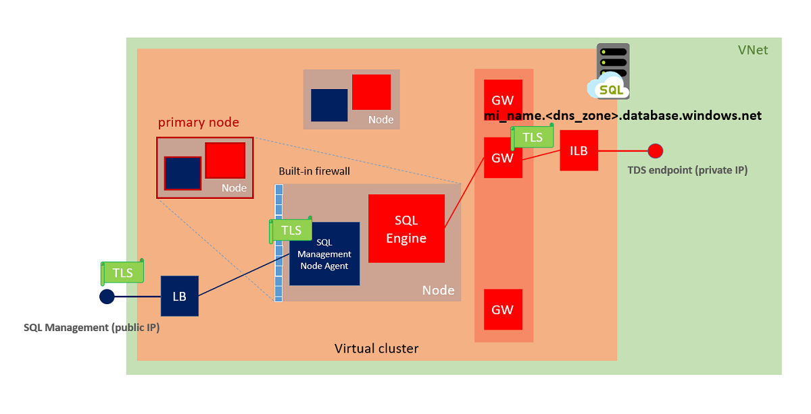

# Connectivity architecture for Azure SQL Managed Instance
[!INCLUDE[appliesto-sqlmi](../includes/appliesto-sqlmi.md)]

This article explains communication in Azure SQL Managed Instance, describing the connectivity architecture and how components direct traffic to a managed instance.  

SQL Managed Instance is placed inside the Azure virtual network and the subnet that's dedicated to managed instances. This deployment provides:

- A secure VNet-local IP address.
- The ability to connect an on-premises network to SQL Managed Instance.
- The ability to connect SQL Managed Instance to a linked server or another on-premises data store.
- The ability to connect SQL Managed Instance to Azure resources.

> [!NOTE]
> November 2022 introduced a number of changes to the default connectivity structure for SQL Managed Instance. This article provides information about the current architecture, as well as the architecture of instances that have not yet enrolled in the feature wave. For more information, review [November 2022 feature wave](doc-changes-updates-release-notes-whats-new.md#november-2022-feature-wave). 

## November 2022 feature wave 

The November 2022 feature wave introduced the following changes to the connectivity architecture for SQL Managed Instance: 

* Removed management endpoint
* Simplified mandatory Network Security Group (NSG) rules (removed one mandatory rule).
* Mandatory Network Security Group rules no longer include outbound to AzureCloud on port 443.
* Simplified Route table (reduced mandatory routes from 13 to 5).

## Communication overview

## [Current architecture](#tab/current)

The following diagram shows entities that connect to SQL Managed Instance. It also shows the resources that need to communicate with a managed instance. The communication process at the bottom of the diagram represents customer applications and tools that connect to SQL Managed Instance as data sources.  

SQL Managed Instance is a single-tenant Platform-as-a-Service (PaaS) offering that operates in two planes: _data plane_ and _control plane_.

The **data plane** is deployed inside the customer's subnet for compatibility, connectivity, and network isolation, and is typically accessed via its [VNet-local endpoint](#vnet-local-endpoint). Data plane depends on Azure services such as Azure Storage, Azure Active Directory (Azure AD) for authentication, and telemetry collection services. Customers will observe traffic to those services originating from subnets containing SQL Managed Instance.

The **control plane** carries the deployment, management and core service maintenance functions via automated agents. These agents have exclusive access to the compute resources operating the service: it is not possible to `ssh` or RDP to those hosts. All control plane communications are encrypted and signed using certificates. To check the trustworthiness of communicating parties, SQL Managed Instance constantly verifies these certificates through certificate revocation lists.

## [Architecture prior to November 2022](#tab/before-feature-wave)

The following diagram shows entities that connect to SQL Managed Instance. It also shows the resources that need to communicate with a managed instance. The communication process at the bottom of the diagram represents customer applications and tools that connect to SQL Managed Instance as data sources.  

SQL Managed Instance is a single-tenant Platform-as-a-Service (PaaS) offering. Its compute and networking elements are deployed inside the customer's subnet, and it is typically accessed via its VNet-local endpoint](connectivity-architecture-overview.md#vnet-local-endpoint). SQL Managed Instance depends on Azure services such as Azure Storage, Azure Active Directory (Azure AD), Azure Key Vault, Event Hubs, and telemetry collection services. Customers will observe traffic to those services originating from subnets containing SQL Managed Instance.

Deployment, management and core service maintenance operations are carried out via automated agents. These agents have exclusive access to the compute resources operating the service: it is not possible to `ssh` or RDP to those hosts. All internal communications are encrypted and signed using certificates. To check the trustworthiness of communicating parties, SQL Managed Instance constantly verifies these certificates through certificate revocation lists.

---

## High-level connectivity architecture

## [Current architecture](#tab/current)

At a high level, SQL Managed Instance is a set of service components hosted on a dedicated set of isolated virtual machines joined to a virtual cluster. Some service components are deployed inside the customer's virtual network subnet, while others operate in a secure network environment managed by Microsoft.

A virtual cluster can host multiple managed instances. The cluster automatically expands or contracts as needed to accommodate for new or removed instances.

Customer applications can connect to SQL Managed Instance and can query and update databases inside the virtual network, peered virtual network, or network connected by VPN or Azure ExpressRoute.

To facilitate connectivity with customer applications, SQL Managed Instance offers two types of endpoints: **VNet-local endpoint** and **public endpoint**.

### VNet-local endpoint

The VNet-local endpoint is the default means to connect to SQL Managed Instance. It is a domain name of the form `<mi_name>.<dns_zone>.database.windows.net` that resolves to an IP address from the subnet's address pool; hence "VNet-local", or an endpoint that is local to the virtual network. VNet-local endpoint can be used to connect a SQL Managed Instance in all standard connectivity scenarios.

### Public endpoint

The [public endpoint](public-endpoint-configure.md) is an optional domain name of the form `<mi_name>.public.<dns_zone>.database.windows.net` that resolves to a public IP address reachable from the Internet. This endpoint allows only TDS traffic to reach SQL Managed Instance and cannot be used for integration scenarios (such as failover groups, Managed Instance link, and other similar technologies).

## [Architecture prior to November 2022](#tab/before-feature-wave)

At a high level, SQL Managed Instance is a set of service components hosted on a dedicated set of isolated virtual machines joined to a virtual cluster. Service components are deployed inside the customer's virtual network subnet.

A virtual cluster can host multiple managed instances. The cluster automatically expands or contracts as needed to accommodate for new or removed instances.

Customer applications can connect to SQL Managed Instance and can query and update databases inside the virtual network, peered virtual network, or network connected by VPN or Azure ExpressRoute.

To facilitate connectivity with customer applications, SQL Managed Instance offers two types of endpoints: **VNet-local endpoint** and **public endpoint**.

### VNet-local endpoint

The VNet-local endpoint is the default means to connect to SQL Managed Instance. It is a domain name of the form `<mi_name>.<dns_zone>.database.windows.net` that resolves to an IP address from the subnet's address pool; hence "VNet-local", or an endpoint that is local to the virtual network. VNet-local endpoint can be used to connect a SQL Managed Instance in all standard connectivity scenarios.

### Public endpoint

The [public endpoint](public-endpoint-configure.md) is an optional domain name of the form `<mi_name>.public.<dns_zone>.database.windows.net` that resolves to a public IP address reachable from the Internet. This endpoint allows only TDS traffic to reach SQL Managed Instance and cannot be used for integration scenarios (such as failover groups, Managed Instance link, and other similar technologies).

### Management endpoint

To facilitate the communication between the control plane and components deployed inside the customer's subnet, Azure SQL Managed Instances not participating in the November 2022 Feature Wave employ a management endpoint. This means that elements of the virtual network's infrastructure can harm management traffic by making the instance fail and become unavailable.  Management and deployment services connect to SQL Managed Instance's management endpoint that maps to an external load balancer. Traffic is routed to the nodes only if it's received on a predefined set of ports that only the management components of SQL Managed Instance use. A built-in firewall on the nodes is set up to allow traffic only from Microsoft IP ranges. Certificates mutually authenticate all communication between management components and the management plane.

> [!NOTE]
> Traffic that goes to Azure services that are inside the SQL Managed Instance region is optimized and for that reason not NATed to the public IP address for the management endpoint. For that reason if you need to use IP-based firewall rules, most commonly for storage, the service needs to be in a different region from SQL Managed Instance.

The Azure SQL Managed Instance [mandatory inbound security rules](connectivity-architecture-overview.md#mandatory-security-rules-with-service-aided-subnet-configuration) require management ports 9000, 9003, 1438, 1440, and 1452 to be open from **Any source** on the Network Security Group (NSG) that protects SQL Managed Instance. Although these ports are open at the NSG level, they are protected at the network level by the built-in firewall.

The management endpoint is protected by a built-in firewall on the network level. On the application level, it is protected by mutual certificate verification. When connections start inside SQL Managed Instance (as with backups and audit logs), traffic appears to start from the management endpoint's public IP address. 

---

## Virtual cluster connectivity architecture

## [Current architecture](#tab/current)

Let's take a deeper dive into connectivity architecture for SQL Managed Instance. The following diagram shows the conceptual layout of the virtual cluster.

Clients connect to SQL Managed Instance by using a host name that has the form `<mi_name>.<dns_zone>.database.windows.net`. This host name resolves to a private IP address, although it's registered in a public Domain Name System (DNS) zone and is publicly resolvable. The `zone-id` is automatically generated when you create the cluster. If a newly created cluster hosts a secondary managed instance, it shares its zone ID with the primary cluster. For more information, see [Use auto failover groups to enable transparent and coordinated failover of multiple databases](auto-failover-group-sql-mi.md#terminology-and-capabilities).

This private IP address belongs to the internal load balancer for SQL Managed Instance. The load balancer directs traffic to the SQL Managed Instance gateway. Because multiple managed instances can run inside the same cluster, the gateway uses the SQL Managed Instance host name to redirect traffic to the correct SQL engine service.

## [Architecture prior to November 2022](#tab/before-feature-wave)

Let's take a deeper dive into connectivity architecture for SQL Managed Instance. The following diagram shows the conceptual layout of the virtual cluster.

Clients connect to SQL Managed Instance by using a host name that has the form `<mi_name>.<dns_zone>.database.windows.net`. This host name resolves to a private IP address, although it's registered in a public Domain Name System (DNS) zone and is publicly resolvable. The `zone-id` is automatically generated when you create the cluster. If a newly created cluster hosts a secondary managed instance, it shares its zone ID with the primary cluster. For more information, see [Use auto failover groups to enable transparent and coordinated failover of multiple databases](auto-failover-group-sql-mi.md#terminology-and-capabilities).

This private IP address belongs to the internal load balancer for SQL Managed Instance. The load balancer directs traffic to the SQL Managed Instance gateway. Because multiple managed instances can run inside the same cluster, the gateway uses the SQL Managed Instance host name to redirect traffic to the correct SQL engine service.

---

## Service-aided subnet configuration

To improve service security, manageability and availability, SQL Managed Instance applies a network intent policy on some elements of Azure virtual network infrastructure. This policy configures the subnet, the associated Network Security Group (NSG) and route table, ensuring that minimal requirements for SQL Managed Instance are met. This platform mechanism transparently communicates networking requirements to users. The policy's main goal is to prevent network misconfiguration and to ensure normal SQL Managed Instance operations and SLA commitment. When you delete a managed instance, the network intent policy is also removed.

Service-aided subnet configuration builds on top of the virtual network [subnet delegation](/azure/virtual-network/subnet-delegation-overview) feature to provide automatic network configuration management and enable service endpoints.

Service endpoints can be used to configure virtual network firewall rules on storage accounts that keep backups and audit logs. Even with service endpoints enabled, customers are encouraged to use [Private Link](/azure/private-link/private-link-overview) in order to access their storage accounts. Private Link provides additional isolation over service endpoints.

> [!IMPORTANT]
> Due to control plane configuration specificities, service-aided subnet configuration does not enable service endpoints in national clouds.

### Network requirements

The subnet in which SQL Managed Instance is deployed must meet the following characteristics:

- **Dedicated subnet:** The subnet used by SQL Managed Instance can only be delegated to the SQL Managed Instance service. This can't be a gateway subnet and you can only deploy SQL Managed Instance resources in it.
- **Subnet delegation:** The SQL Managed Instance subnet needs to be delegated to the `Microsoft.Sql/managedInstances` resource provider.
- **Network security group (NSG):** An NSG needs to be associated with the SQL Managed Instance subnet. You can use an NSG to control access to the SQL Managed Instance data endpoint by filtering traffic on port 1433 and ports 11000-11999 when SQL Managed Instance is configured for redirect connections. The service will automatically provision and keep current [rules](#mandatory-security-rules-with-service-aided-subnet-configuration) required to allow uninterrupted flow of management traffic.
- **Route table:** A route table needs to be associated with the SQL Managed Instance subnet. You can add entries to the route table to route traffic that has on-premises private IP ranges as a destination through the virtual network gateway or virtual network appliance (NVA). Service will automatically provision and keep current [entries](#mandatory-routes-with-service-aided-subnet-configuration) required to allow uninterrupted flow of management traffic.
- **Sufficient IP addresses:** The SQL Managed Instance subnet must have at least 32 IP addresses. For more information, see [Determine the size of the subnet for SQL Managed Instance](vnet-subnet-determine-size.md). You can deploy managed instances in [the existing network](vnet-existing-add-subnet.md) after you configure it to satisfy [the networking requirements for SQL Managed Instance](#network-requirements). Otherwise, create a [new network and subnet](virtual-network-subnet-create-arm-template.md).
- **Allowed by Azure policies:** If you use [Azure Policy](/azure/governance/policy/overview) to deny the creation or modification of resources in the scope that includes  SQL Managed Instance subnet/virtual network, such policies should not prevent SQL Managed Instance from managing its internal resources. The following resources need to be excluded from deny effects to enable normal operation:
  - Resources of type Microsoft.Network/serviceEndpointPolicies, when resource name begins with \_e41f87a2\_
  - All resources of type Microsoft.Network/networkIntentPolicies
  - All resources of type Microsoft.Network/virtualNetworks/subnets/contextualServiceEndpointPolicies
- **Locks on virtual network:** [Locks](/azure/azure-resource-manager/management/lock-resources) on the dedicated subnet's virtual network, its parent resource group, or subscription, may occasionally interfere with SQL Managed Instance's management and maintenance operations. Take special care when you use such locks.
- **Replication traffic:** Replication traffic for auto-failover groups between two SQL Managed Instances should be direct, and not through a hub network.
- **Custom DNS server:** If the virtual network is configured to use a custom DNS server, that server must be able to resolve public DNS records. Using additional features like Azure AD Authentication might require resolving additional fully qualified domain names (FQDNs). For more information, see [Resolving private DNS names in Azure SQL Managed Instance](resolve-private-domain-names.md).

### Mandatory security rules with service-aided subnet configuration

## [Current architecture](#tab/current)

These rules are necessary to ensure inbound management traffic flow. They are enforced by the network intent policy and don't need to be deployed by the customer. See the previous [high level connectivity architecture](#high-level-connectivity-architecture) section for more information on connectivity architecture and management traffic.

|Name        |Port                        |Protocol|Source           |Destination|Action|
|------------|----------------------------|--------|-----------------|-----------|------|
|internal-in |Any                         |Any     |_subnet_         |_subnet_   |Allow |

These rules are necessary to ensure outbound management traffic flow. See the [paragraph above](#high-level-connectivity-architecture) for more information on connectivity architecture and management traffic.

|Name               |Port          |Protocol|Source           |Destination               |Action|
|-------------------|--------------|--------|-----------------|--------------------------|------|
|AAD-out            |443           |TCP     |_subnet_         |AzureActiveDirectory      |Allow |
|OneDsCollector-out |443           |TCP     |_subnet_         |OneDsCollector            |Allow |
|internal-out       |Any           |Any     |_subnet_         |_subnet_                  |Allow |
|StorageP-out       |443           |Any     |_subnet_         |Storage._primaryRegion_   |Allow |
|StorageS-out       |443           |Any     |_subnet_         |Storage._secondaryRegion_ |Allow |

## [Architecture prior to November 2022](#tab/before-feature-wave)

These rules are necessary to ensure inbound management traffic flow. 

| Name       |Port                        |Protocol|Source           |Destination|Action|
|------------|----------------------------|--------|-----------------|-----------|------|
|management  |9000, 9003, 1438, 1440, 1452|TCP     |SqlManagement    |MI SUBNET  |Allow |
|            |9000, 9003                  |TCP     |CorpnetSaw       |MI SUBNET  |Allow |
|            |9000, 9003                  |TCP     |CorpnetPublic    |MI SUBNET  |Allow |
|mi_subnet   |Any                         |Any     |MI SUBNET        |MI SUBNET  |Allow |
|health_probe|Any                         |Any     |AzureLoadBalancer|MI SUBNET  |Allow |

These rules are necessary to ensure outbound management traffic flow. 

| Name       |Port          |Protocol|Source           |Destination|Action|
|------------|--------------|--------|-----------------|-----------|------|
|management  |443, 12000    |TCP     |MI SUBNET        |AzureCloud |Allow |
|mi_subnet   |Any           |Any     |MI SUBNET        |MI SUBNET  |Allow |

---

### Mandatory routes with service-aided subnet configuration

## [Current architecture](#tab/current)

These routes are necessary to ensure that management traffic is routed directly to a destination. They are enforced by the network intent policy and don't need to be deployed by the customer. See the previous [high level connectivity architecture](#high-level-connectivity-architecture) section  for more information on connectivity architecture and management traffic.

|Name                     |Address prefix           |Next hop            |
|-------------------------|-------------------------|--------------------|
|AzureActiveDirectory     |AzureActiveDirectory     |Internet*|
|OneDsCollector           |OneDsCollector           |Internet*|
|Storage._primaryRegion_  |Storage._primaryRegion_  |Internet*|
|Storage._secondaryRegion_|Storage._secondaryRegion_|Internet*|
|subnet-to-vnetlocal      |_subnet_                 |Virtual network     |

> [!NOTE]
> * **Internet** - this value in the "next hop" field instructs the gateway to route the traffic outside of the virtual network. However, if the destination address is for one of Azure's services, Azure routes the traffic directly to the service over Azure's backbone network, rather than outside of Azure cloud. Traffic between Azure services does not traverse the Internet, regardless of which Azure region the virtual network exists in, or which Azure region an instance of the Azure service is deployed to. For more details, visit the page on [Azure's virtual network traffic routing](/azure/virtual-network/virtual-networks-udr-overview).

In addition, you can add entries to the route table to route traffic that has on-premises private IP ranges as a destination through the virtual network gateway or virtual network appliance (NVA).

## [Architecture prior to November 2022](#tab/before-feature-wave)

These routes are necessary to ensure that management traffic is routed directly to a destination. 

|Name|Address prefix|Next hop 2|
|----|--------------|-------|
|subnet-to-vnetlocal|MI SUBNET 1|Virtual network|
|mi-azurecloud-REGION-internet|AzureCloud.REGION|Internet|
|mi-azurecloud-REGION_PAIR-internet|AzureCloud.REGION_PAIR|Internet|
|mi-azuremonitor-internet|AzureMonitor|Internet|
|mi-corpnetpublic-internet|CorpNetPublic|Internet|
|mi-corpnetsaw-internet|CorpNetSaw|Internet|
|mi-eventhub-REGION-internet|EventHub.REGION|Internet|
|mi-eventhub-REGION_PAIR-internet|EventHub.REGION_PAIR|Internet|
|mi-sqlmanagement-internet|SqlManagement|Internet|
|mi-storage-internet|Storage|Internet|
|mi-storage-REGION-internet|Storage.REGION|Internet|
|mi-storage-REGION_PAIR-internet|Storage.REGION_PAIR|Internet|
|mi-azureactivedirectory-internet|AzureActiveDirectory|Internet|

---

### Networking constraints

**TLS 1.2 is enforced on outbound connections**: In January 2020 Microsoft enforced TLS 1.2 for intra-service traffic in all Azure services. For SQL Managed Instance, this resulted in TLS 1.2 being enforced on outbound connections used for replication and linked server connections to SQL Server. If you are using versions of SQL Server older than 2016 with SQL Managed Instance, please ensure that [TLS 1.2 specific updates](https://support.microsoft.com/help/3135244/tls-1-2-support-for-microsoft-sql-server) have been applied.

The following virtual network features are currently *not supported* with SQL Managed Instance:

- **Microsoft peering**: Enabling [Microsoft peering](/azure/expressroute/expressroute-faqs#microsoft-peering) on ExpressRoute circuits peered directly or transitively with a virtual network where SQL Managed Instance resides effects traffic flow between SQL Managed Instance components inside the virtual network and services it depends on, causing availability issues. SQL Managed Instance deployments to virtual network with Microsoft peering already enabled are expected to fail.
- **Global virtual network peering**: [Virtual network peering](/azure/virtual-network/virtual-network-peering-overview) connectivity across Azure regions doesn't work for SQL Managed Instances placed in subnets created before 9/22/2020.
- **AzurePlatformDNS**: Using the AzurePlatformDNS [service tag](/azure/virtual-network/service-tags-overview) to block platform DNS resolution would render SQL Managed Instance unavailable. Although SQL Managed Instance supports customer-defined DNS for DNS resolution inside the engine, there is a dependency on platform DNS for platform operations.
- **NAT gateway**: Using [Azure Virtual Network NAT](/azure/virtual-network/nat-gateway/nat-overview) to control outbound connectivity with a specific public IP address would render SQL Managed Instance unavailable. The SQL Managed Instance service is currently limited to use of basic load balancer that doesn't provide coexistence of inbound and outbound flows with Virtual Network NAT.
- **IPv6 for Azure Virtual Network**: Deploying SQL Managed Instance to [dual stack IPv4/IPv6 virtual networks](/azure/virtual-network/ip-services/ipv6-overview) is expected to fail. Associating network security group (NSG) or route table (UDR) containing IPv6 address prefixes to SQL Managed Instance subnet, or adding IPv6 address prefixes to NSG or UDR that is already associated with Managed instance subnet, would render SQL Managed Instance unavailable. SQL Managed Instance deployments to a subnet with NSG and UDR that already have IPv6 prefixes are expected to fail.
- **Azure DNS private zones with a name reserved for Microsoft services**: Following is the list of reserved names: windows.net, database.windows.net, core.windows.net, blob.core.windows.net, table.core.windows.net, management.core.windows.net, monitoring.core.windows.net, queue.core.windows.net, graph.windows.net, login.microsoftonline.com, login.windows.net, servicebus.windows.net, vault.azure.net. Deploying SQL Managed Instance to a virtual network with associated [Azure DNS private zone](/azure/dns/private-dns-privatednszone) with a name reserved for Microsoft services would fail. Associating Azure DNS private zone with a reserved name to a virtual network containing an instance would render SQL Managed Instance unavailable. Please follow [Azure Private Endpoint DNS configuration](/azure/private-link/private-endpoint-dns) for the proper Private Link configuration.

## Next steps

- For an overview, see [What is Azure SQL Managed Instance?](sql-managed-instance-paas-overview.md).
- Learn how to [set up a new Azure virtual network](virtual-network-subnet-create-arm-template.md) or an [existing Azure virtual network](vnet-existing-add-subnet.md) where you can deploy SQL Managed Instance.
- [Calculate the size of the subnet](vnet-subnet-determine-size.md) where you want to deploy SQL Managed Instance.
- Learn how to create a managed instance:
  - From the [Azure portal](instance-create-quickstart.md).
  - By using [PowerShell](scripts/create-configure-managed-instance-powershell.md).
  - By using [an Azure Resource Manager template](https://azure.microsoft.com/resources/templates/sqlmi-new-vnet/).
  - By using [an Azure Resource Manager template (using JumpBox, with SSMS included)](https://azure.microsoft.com/resources/templates/sqlmi-new-vnet-w-jumpbox/).
