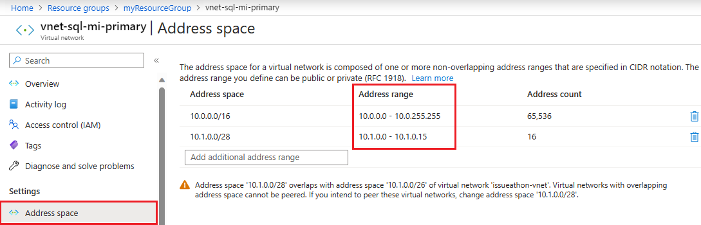
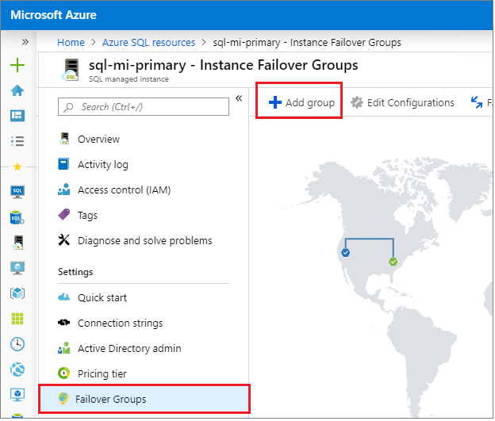
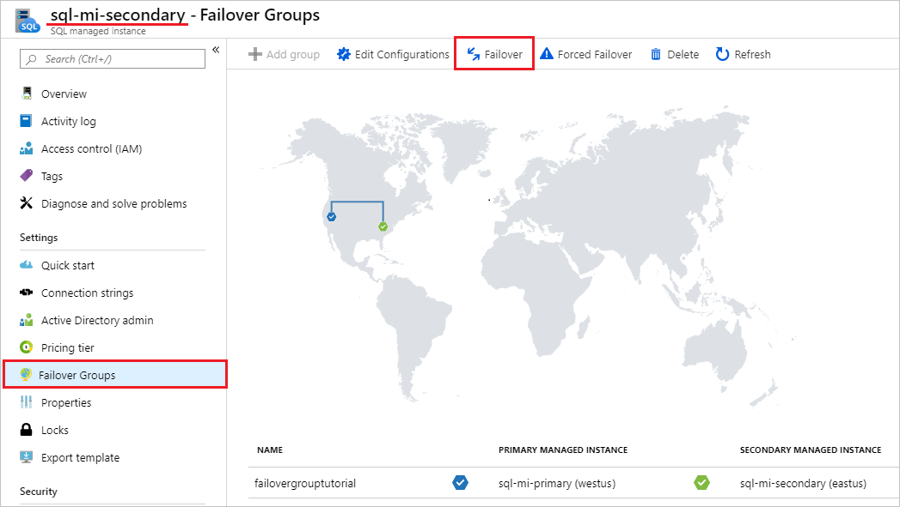

# Tutorial: Add SQL Managed Instance to a failover group
[!INCLUDE[appliesto-sqlmi](../includes/appliesto-sqlmi.md)]

> [!div class="op_single_selector"]
> * [Azure SQL Database (single database)](../database/failover-group-add-single-database-tutorial.md?view=azuresql-db&preserve-view=true)
> * [Azure SQL Database (elastic pool)](../database/failover-group-add-elastic-pool-tutorial.md?view=azuresql-db&preserve-view=true)
> * [Azure SQL Managed Instance](failover-group-add-instance-tutorial.md?view=azuresql-mi&preserve-view=true)

Add managed instances of Azure SQL Managed Instance to an [auto-failover group](auto-failover-group-sql-mi.md). 

In this tutorial, you will learn how to:

> [!div class="checklist"]
> - Create a primary managed instance.
> - Create a secondary managed instance as part of a failover group. 
> - Test failover.

 There are multiple ways to establish connectivity between managed instances in different Azure regions, including:
 * [Global virtual network peering](/azure/virtual-network/virtual-network-peering-overview) - the most performant and recommended way
 * [Azure ExpressRoute](/azure/expressroute/expressroute-howto-circuit-portal-resource-manager)
 * VPN gateways

This tutorial provides steps for global virtual network peering. If you prefer to use ExpressRoute or VPN gateways, replace the peering steps accordingly, or 
skip ahead to [Step 7](#create-a-failover-group) if you already have ExpressRoute or VPN gateways configured. 

  > [!IMPORTANT]
  > - When going through this tutorial, ensure you are configuring your resources with the [prerequisites for setting up failover groups for SQL Managed Instance](auto-failover-group-sql-mi.md#enabling-replication-traffic-between-two-instances). 
  > - Creating a managed instance can take a significant amount of time. As a result, this tutorial may take several hours to complete. For more information on provisioning times, see [SQL Managed Instance management operations](sql-managed-instance-paas-overview.md#management-operations). 

## Prerequisites

### [Portal](#tab/azure-portal)
To complete this tutorial, make sure you have: 

- An Azure subscription. [Create a free account](https://azure.microsoft.com/free/) if you don't already have one.

### [Azure PowerShell](#tab/azure-powershell)
To complete the tutorial, make sure you have the following items:

- An Azure subscription. [Create a free account](https://azure.microsoft.com/free/) if you don't already have one.
- [Azure PowerShell](/powershell/azure/)

---

## Create a resource group and primary managed instance

In this step, you will create the resource group and the primary managed instance for your failover group using the Azure portal or PowerShell. 

Deploy both managed instances to [paired regions](/azure/availability-zones/cross-region-replication-azure) for data replication performance reasons. Managed instances residing in geo-paired regions have much better data replication performance compared to instances residing in unpaired regions. 

### [Portal](#tab/azure-portal) 

Create the resource group and your primary managed instance using the Azure portal. 

1. Select **Azure SQL** in the left-hand menu of the Azure portal. If **Azure SQL** is not in the list, select **All services**, and then type `Azure SQL` in the search box. (Optional) Select the star next to **Azure SQL** to favorite it and add it as an item in the left-hand navigation. 
1. Select **+ Add** to open the **Select SQL deployment option** page. You can view additional information about the different databases by selecting **Show details** on the **Databases** tile.
1. Select **Create** on the **SQL Managed Instances** tile. 

    

1. On the **Create Azure SQL Managed Instance** page, on the **Basics** tab:
    1. Under **Project Details**, select your **Subscription** from the drop-down and then choose to **Create New** resource group. Type in a name for your resource group, such as `myResourceGroup`. 
    1. Under **SQL Managed Instance Details**, provide the name of your managed instance, and the region where you would like to deploy your managed instance. Leave **Compute + storage** at default values. 
    1. Under **Administrator Account**, provide an admin login, such as `azureuser`, and a complex admin password. 

    

1. Leave the rest of the settings at default values, and select **Review + create** to review your SQL Managed Instance settings. 
1. Select **Create** to create your primary managed instance. 

### [Azure PowerShell](#tab/azure-powershell)

Create your resource group and the primary managed instance with Azure PowerShell by using the commands in this section, or check the [Full script](#full-script) for an example. 

Run these commands in the following order to create your resource group, and primary SQL Managed Instance by using Azure PowerShell. 

| Command | Notes |
|---|---|
| 1. [Connect-AzAccount](/powershell/module/az.accounts/connect-azaccount) | Connect to Azure. |
| 2. [Set-AzContext](/powershell/module/az.accounts/set-azcontext) | Set the subscription context. 
| 3. [New-AzResourceGroup](/powershell/module/az.resources/new-azresourcegroup) | Create an Azure resource group.  |
| 4. [New-AzVirtualNetwork](/powershell/module/az.network/new-azvirtualnetwork) | Create a virtual network.  |
| 5. [Add-AzVirtualNetworkSubnetConfig](/powershell/module/az.network/add-azvirtualnetworksubnetconfig) | Add a subnet configuration to a virtual network. | 
| 6. [Set-AzVirtualNetwork](/powershell/module/az.network/set-azvirtualnetwork) | Updates a virtual network. | 
| 7. [Get-AzVirtualNetwork](/powershell/module/az.network/get-azvirtualnetwork) | Get a virtual network in a resource group. | 
| 8. [Get-AzVirtualNetworkSubnetConfig](/powershell/module/az.network/get-azvirtualnetworksubnetconfig) | Get a subnet in a virtual network. | 
| 9. [New-AzNetworkSecurityGroup](/powershell/module/az.network/new-aznetworksecuritygroup) | Create a network security group. | 
| 10. [New-AzRouteTable](/powershell/module/az.network/new-azroutetable) | Create a route table. |
| 11. [Set-AzVirtualNetworkSubnetConfig](/powershell/module/az.network/set-azvirtualnetworksubnetconfig) | Update a subnet configuration for a virtual network.  |
| 12. [Set-AzVirtualNetwork](/powershell/module/az.network/set-azvirtualnetwork) | Update a virtual network.  |
| 13. [Get-AzNetworkSecurityGroup](/powershell/module/az.network/get-aznetworksecuritygroup) | Get a network security group. |
| 14. [Add-AzNetworkSecurityRuleConfig](/powershell/module/az.network/add-aznetworksecurityruleconfig)| Add a network security rule configuration to a network security group. |
| 15. [Set-AzNetworkSecurityGroup](/powershell/module/az.network/set-aznetworksecuritygroup) | Update a network security group.  | 
| 16. [Get-AzRouteTable](/powershell/module/az.network/get-azroutetable) | Gets route tables. | 
| 17. [Add-AzRouteConfig](/powershell/module/az.network/add-azrouteconfig) | Add a route to a route table. |
| 18. [Set-AzRouteTable](/powershell/module/az.network/set-azroutetable) | Update a route table.  |
| 19. [New-AzSqlInstance](/powershell/module/az.sql/new-azsqlinstance) | Create a managed instance.  |

---

## Create secondary virtual network

If you're using the Azure portal to create your secondary managed instance, you will need to create the virtual network before creating the instance to make sure there's no indirect overlap of the IP address ranges between the VNets hosting the primary and secondary instance, or any other VNets they are peered with via local virtual network peering or other means. If you're using Azure PowerShell to configure your managed instance, skip ahead to [Create a secondary managed instance](#create-a-secondary-managed-instance). 

### [Portal](#tab/azure-portal) 

To verify the address range of your primary virtual network, follow these steps:

1. In the [Azure portal](https://portal.azure.com), navigate to your resource group and select the virtual network for your primary instance.  
2. Select **Address space** under **Settings** and note the **Address range** of the subnet created automatically during creation of your primary instance. The **Address range** for the virtual network of the primary instance must not overlap with the address range of the virtual network for the secondary managed instance you plan to create, and any other virtual network peered with either the primary or secondary virtual network. 

   

To create a virtual network, follow these steps:

1. In the [Azure portal](https://portal.azure.com), select **Create a resource** and search for *virtual network*. 
2. Select the **Virtual Network** option and then select **Create** on the next page. 
3. Fill out the required fields to configure the virtual network for your secondary managed instance, and then select **Create**. 

   The following table shows the required fields and corresponding values for the secondary virtual network:

    | **Field** | Value |
    | --- | --- |
    | **Name** |  The name for the virtual network to be used by the secondary managed instance, such as `vnet-sql-mi-secondary`. |
    | **Address space** | The address space for your virtual network, such as `10.128.0.0/16`. | 
    | **Subscription** | The subscription where your primary managed instance and resource group reside. |
    | **Region** | The location where you will deploy your secondary managed instance. |
    | **Subnet** | The name for your subnet. `default` is offered as a default name. |
    | **Address range**| The IP address range for your virtual network, such as `10.128.0.0/24`. This must not overlap with the IP address range used by any other virtual networks they are peered with. |

    

### [Azure PowerShell](#tab/azure-powershell)

This step is only necessary if you're using the Azure portal to deploy SQL Managed Instance. Skip ahead to [Create a secondary managed instance](#create-a-secondary-managed-instance) if you're using Azure PowerShell. 

---

## Create a secondary managed instance

In this step you will create a secondary managed instance, which will also configure the networking between the two managed instances. 

Your second managed instance must be:
- Empty, i.e. with no user databases on it. 
- Hosted in a virtual network that has no IP address range overlap with the virtual network address range hosting the primary managed instance, or any other virtual network peered with it. 

### [Portal](#tab/azure-portal)  

1. Select **Azure SQL** in the left-hand menu of the Azure portal. If **Azure SQL** is not in the list, select **All services**, and then type `Azure SQL` in the search box. (Optional) Select the star next to **Azure SQL** to add it as a favorite item in the left-hand navigation. 
1. Select **+ Add** to open the **Select SQL deployment option** page. You can view additional information about the different databases by selecting **Show details** on the **Databases** tile.
1. Select **Create** on the **SQL managed instances** tile. 

    

1. On the **Basics** tab of the **Create Azure SQL Managed Instance** page, fill out the required fields to configure your secondary managed instance. 

   The following table shows the values necessary for the secondary managed instance:
 
    | **Field** | Value |
    | --- | --- |
    | **Subscription** |  The Azure subscription to create the instance in. When using Azure portal, it must be the same subscription as for primary instance.|
    | **Resource group**| The resource group to create secondary managed instance in. |
    | **SQL Managed Instance name** | The name of your new secondary managed instance, such as `sql-mi-secondary`.  | 
    | **Region**| The Azure region for your secondary managed instance.  |
    | **SQL Managed Instance admin login** | The login you want to use for your new secondary managed instance, such as `azureuser`. |
    | **Password** | A complex password that will be used by the admin login for the new secondary managed instance.  |

1. Under the **Networking** tab, for the **Virtual Network**, select from the drop-down list the virtual network you previously created for the secondary managed instance.

   

1. Under the **Additional settings** tab, for **Geo-Replication**, choose **Yes** to _Use as failover secondary_. Select the primary managed instance from the drop-down. 
    
   Be sure that the collation and time zone match that of the primary managed instance. The primary managed instance created in this tutorial used the default of `SQL_Latin1_General_CP1_CI_AS` collation and the `(UTC) Coordinated Universal Time` time zone. 

   

1. Select **Review + create** to review the settings for your secondary managed instance. 
1. Select **Create** to create your secondary managed instance. 

### [Azure PowerShell](#tab/azure-powershell)

Create the secondary managed instance with Azure PowerShell by using the commands in this section, or check the [Full script](#full-script) for an example. 

Run these commands in the following order to create your secondary SQL Managed Instance by using Azure PowerShell. 

| Command | Notes |
|---|---|
| 1. [New-AzVirtualNetwork](/powershell/module/az.network/new-azvirtualnetwork) | Creates a virtual network.  |
| 2. [Add-AzVirtualNetworkSubnetConfig](/powershell/module/az.network/add-azvirtualnetworksubnetconfig) | Adds a subnet configuration to a virtual network. | 
| 3. [Set-AzVirtualNetwork](/powershell/module/az.network/set-azvirtualnetwork) | Updates a virtual network.  |
| 4. [Get-AzVirtualNetwork](/powershell/module/az.network/get-azvirtualnetwork) | Gets a virtual network in a resource group. | 
| 5. [Get-AzVirtualNetworkSubnetConfig](/powershell/module/az.network/get-azvirtualnetworksubnetconfig) | Gets a subnet in a virtual network. | 
| 6. [New-AzNetworkSecurityGroup](/powershell/module/az.network/new-aznetworksecuritygroup) | Creates a network security group. | 
| 7. [New-AzRouteTable](/powershell/module/az.network/new-azroutetable) | Creates a route table. |
| 8. [Set-AzVirtualNetworkSubnetConfig](/powershell/module/az.network/set-azvirtualnetworksubnetconfig) | Updates a subnet configuration for a virtual network.  |
| 9. [Set-AzVirtualNetwork](/powershell/module/az.network/set-azvirtualnetwork) | Updates a virtual network.  |
| 10. [Get-AzNetworkSecurityGroup](/powershell/module/az.network/get-aznetworksecuritygroup) | Gets a network security group. |
| 11. [Add-AzNetworkSecurityRuleConfig](/powershell/module/az.network/add-aznetworksecurityruleconfig)| Adds a network security rule configuration to a network security group. |
| 12. [Set-AzNetworkSecurityGroup](/powershell/module/az.network/set-aznetworksecuritygroup) | Updates a network security group.  | 
| 13. [Get-AzRouteTable](/powershell/module/az.network/get-azroutetable) | Gets route tables. | 
| 14. [Add-AzRouteConfig](/powershell/module/az.network/add-azrouteconfig) | Adds a route to a route table. |
| 15. [Set-AzRouteTable](/powershell/module/az.network/set-azroutetable) | Updates a route table.  |
| 16. [New-AzSqlInstance](/powershell/module/az.sql/new-azsqlinstance) | Creates a managed instance. Be sure to provide the `-DnsZonePartner` to link the secondary instance to your primary instance.  |

---

## Create a global virtual network peering 

> [!NOTE]
> The steps listed below will create peering links between the virtual networks in both directions.

### [Portal](#tab/azure-portal)

1. In the [Azure portal](https://portal.azure.com), go to the **Virtual network** resource for your primary managed instance. 
1. Select **Peerings** under *Settings* and then select + Add.

   

1. Enter or select values for the following settings:

   | Settings | Description |
    | -------- | ----------- |
    | **This virtual network** |  |
    | Peering link name | The name for the peering must be unique within the virtual network. |
    | Traffic to remote virtual network | Select **Allow (default)** to enable communication between the two virtual networks through the default `VirtualNetwork` flow. Enabling communication between virtual networks allows resources that are connected to either virtual network to communicate with each other with the same bandwidth and latency as if they were connected to the same virtual network. All communication between resources in the two virtual networks is over the Azure private network. |
    | Traffic forwarded from remote virtual network | Both **Allowed (default)** and **Block** option will work for this tutorial. For more information, see [Create a peering](/azure/virtual-network/virtual-network-manage-peering#create-a-peering)|
    | Virtual network gateway or Route Server | Select **None**. For more information about the other options available, see [Create a peering](/azure/virtual-network/virtual-network-manage-peering#create-a-peering). |
    | **Remote virtual network** |  |
    | Peering link name | The name of the same peering to be used in the virtual network hosting secondary instance. |
    | Virtual network deployment model | Select **Resource manager**. |
    | I know my resource ID | Leave this checkbox unchecked. |
    | Subscription | Select the Azure subscription of the virtual network hosting the secondary instance that you want to peer with. |
    | Virtual network | Select the virtual network hosting the secondary instance that you want to peer with. If the virtual network is listed, but grayed out, it may be because the address space for the virtual network overlaps with the address space for this virtual network. If virtual network address spaces overlap, they cannot be peered.|
    | Traffic to remote virtual network | Select **Allow (default)** |
    | Traffic forwarded from remote virtual network | Both **Allowed (default)** and **Block** option will work for this tutorial. For more information, see [Create a peering](/azure/virtual-network/virtual-network-manage-peering#create-a-peering). |
    | Virtual network gateway or Route Server | Select **None**. For more information about the other options available, see [Create a peering](/azure/virtual-network/virtual-network-manage-peering#create-a-peering). |

1. Click **Add** to configure the peering with the virtual network you selected. After a few seconds, select the **Refresh** button and the peering status will change from *Updating* to *Connected*.

   

### [Azure PowerShell](#tab/azure-powershell)

Create a global virtual network peering with Azure PowerShell by using the commands in this section, or check the [full script](#full-script) for an example. 

Run these commands in the following order to peer the virtual networks for your two instances: 

| Command | Notes |
|---|---|
| 1. [Get-AzVirtualNetwork](/powershell/module/az.network/get-azvirtualnetwork) | Gets a virtual network in a resource group. |
| 2. [Add-AzVirtualNetworkPeering](/powershell/module/az.network/add-azvirtualnetworkpeering) | Adds a peering to a virtual network. | 
| 3. [Get-AzVirtualNetworkPeering](/powershell/module/az.network/get-azvirtualnetworkpeering) | Gets a peering for a virtual network. |

---

## Create a failover group

In this step, you will create the failover group and add both managed instances to it. 

### [Portal](#tab/azure-portal)

Create the failover group using the Azure portal. 

1. Select **Azure SQL** in the left-hand menu of the [Azure portal](https://portal.azure.com). If **Azure SQL** is not in the list, select **All services**, and then type `Azure SQL` in the search box. (Optional) Select the star next to **Azure SQL** to add it as a favorite item in the left-hand navigation. 
1. Select the primary managed instance you created in the first section, such as `sql-mi-primary`. 
1. Under **Data management**, navigate to **Failover groups** and then choose **Add group** to open the **Instance Failover Group** page. 

   

1. On the **Instance Failover Group** page, type the name of  your failover group, such as `failovergrouptutorial`. Then choose the secondary managed instance, such as `sql-mi-secondary`, from the drop-down. Select **Create** to create your failover group. 

   

1. Once failover group deployment is complete, you will be taken back to the **Failover group** page. 

### [Azure PowerShell](#tab/azure-powershell)

Create the failover group using the following Azure PowerShell command, or check the [Full script](#full-script) for an example. 

| Command | Notes |
|---|---|
| [New-AzSqlDatabaseInstanceFailoverGroup](/powershell/module/az.sql/new-azsqldatabaseinstancefailovergroup)| Creates a new Azure SQL Managed Instance failover group.  |

---

## Test failover

In this step, you will fail your failover group over to the secondary server, and then fail back using the Azure portal. 

### [Portal](#tab/azure-portal)

Test failover using the Azure portal. 

1. Navigate to your _secondary_ managed instance within the [Azure portal](https://portal.azure.com) and select **Instance Failover Groups** under settings. 
1. Note managed instances in the primary and in the secondary role. 
1. Select **Failover** and then select **Yes** on the warning about TDS sessions being disconnected. 

   

1. Review that managed instance is the primary and which managed instance is the secondary. If failover succeeded, the two instances should have switched roles. 

   

1. Go to the new _secondary_ managed instance and select **Failover** once again to fail the primary instance back to the primary role. 

### [Azure PowerShell](#tab/azure-powershell)

Test failover by using the following Azure PowerShell commands, or check the [full script](#full-script) for an example. 

| Command | Notes |
|---|---|
| [Get-AzSqlDatabaseInstanceFailoverGroup](/powershell/module/az.sql/get-azsqldatabaseinstancefailovergroup) | Gets or lists SQL Managed Instance failover groups.| 
| [Switch-AzSqlDatabaseInstanceFailoverGroup](/powershell/module/az.sql/switch-azsqldatabaseinstancefailovergroup) | Executes a failover of a SQL Managed Instance failover group. | 

---

## Clean up resources
Clean up resources by first deleting the managed instances, then the virtual cluster, then any remaining resources, and finally the resource group. Failover group will be automatically deleted when you delete any of the two instances.

### [Portal](#tab/azure-portal)
1. Navigate to your resource group in the [Azure portal](https://portal.azure.com). 
1. Select the managed instance(s) and then select **Delete**. Type `yes` in the text box to confirm you want to delete the resource and then select **Delete**. This process may take some time to complete in the background, and until it's done, you will not be able to delete the *virtual cluster* or any other dependent resources. Monitor the deletion in the **Activity** tab to confirm your managed instance has been deleted. 
1. Once the managed instance is deleted, delete the *virtual cluster* by selecting it in your resource group, and then choosing **Delete**. Type `yes` in the text box to confirm you want to delete the resource and then select **Delete**. 
1. Delete any remaining resources. Type `yes` in the text box to confirm you want to delete the resource and then select **Delete**. 
1. Delete the resource group by selecting **Delete resource group**, typing in the name of the resource group, `myResourceGroup`, and then selecting **Delete**. 

### [Azure PowerShell](#tab/azure-powershell)

You will need to remove the resource group twice. Removing the resource group the first time will remove the managed instances and virtual clusters but will then fail with the error message `Remove-AzResourceGroup : Long running operation failed with status 'Conflict'`. Run the Remove-AzResourceGroup command a second time to remove any residual resources and the resource group.

Use the following Azure PowerShell command to remove the resource group:

| Command | Notes |
|---|---|
| [Remove-AzResourceGroup](/powershell/module/az.resources/remove-azresourcegroup) | Removes a resource group. |

---

## Full script

### [Azure PowerShell](#tab/azure-powershell)
[!code-powershell-interactive[main](~/../powershell_scripts/sql-database/failover-groups/add-managed-instance-to-failover-group-az-ps.ps1 "Add SQL Managed Instance to a failover group")]

This script uses the following commands. Each command in the table links to command-specific documentation.

| Command | Notes |
|---|---|
| [Connect-AzAccount](/powershell/module/az.accounts/connect-azaccount) | Connect to Azure. |
| [Set-AzContext](/powershell/module/az.accounts/set-azcontext) | Set the subscription context. 
| [New-AzResourceGroup](/powershell/module/az.resources/new-azresourcegroup) | Creates an Azure resource group.  |
| [New-AzVirtualNetwork](/powershell/module/az.network/new-azvirtualnetwork) | Creates a virtual network.  |
| [Add-AzVirtualNetworkSubnetConfig](/powershell/module/az.network/add-azvirtualnetworksubnetconfig) | Adds a subnet configuration to a virtual network. | 
| [Get-AzVirtualNetwork](/powershell/module/az.network/get-azvirtualnetwork) | Gets a virtual network in a resource group. | 
| [Get-AzVirtualNetworkSubnetConfig](/powershell/module/az.network/get-azvirtualnetworksubnetconfig) | Gets a subnet in a virtual network. | 
| [New-AzNetworkSecurityGroup](/powershell/module/az.network/new-aznetworksecuritygroup) | Creates a network security group. | 
| [New-AzRouteTable](/powershell/module/az.network/new-azroutetable) | Creates a route table. |
| [Set-AzVirtualNetworkSubnetConfig](/powershell/module/az.network/set-azvirtualnetworksubnetconfig) | Updates a subnet configuration for a virtual network.  |
| [Set-AzVirtualNetwork](/powershell/module/az.network/set-azvirtualnetwork) | Updates a virtual network.  |
| [Get-AzNetworkSecurityGroup](/powershell/module/az.network/get-aznetworksecuritygroup) | Gets a network security group. |
| [Add-AzNetworkSecurityRuleConfig](/powershell/module/az.network/add-aznetworksecurityruleconfig)| Adds a network security rule configuration to a network security group. |
| [Set-AzNetworkSecurityGroup](/powershell/module/az.network/set-aznetworksecuritygroup) | Updates a network security group.  | 
| [Get-AzRouteTable](/powershell/module/az.network/get-azroutetable) | Gets route tables. | 
| [Add-AzRouteConfig](/powershell/module/az.network/add-azrouteconfig) | Adds a route to a route table. |
| [Set-AzRouteTable](/powershell/module/az.network/set-azroutetable) | Updates a route table.  |
| [New-AzSqlInstance](/powershell/module/az.sql/new-azsqlinstance) | Creates a managed instance.  |
| [Get-AzSqlInstance](/powershell/module/az.sql/get-azsqlinstance)| Returns information about Azure SQL Managed Instance. |
| [New-AzPublicIpAddress](/powershell/module/az.network/new-azpublicipaddress) | Creates a public IP address.  | 
| [Add-AzVirtualNetworkPeering](/powershell/module/az.network/add-azvirtualnetworkpeering) | Adds a peering to a virtual network. | 
| [Get-AzVirtualNetworkPeering](/powershell/module/az.network/get-azvirtualnetworkpeering) | Gets a peering for a virtual network. |
| [New-AzSqlDatabaseInstanceFailoverGroup](/powershell/module/az.sql/new-azsqldatabaseinstancefailovergroup)| Creates a new SQL Managed Instance failover group.  |
| [Get-AzSqlDatabaseInstanceFailoverGroup](/powershell/module/az.sql/get-azsqldatabaseinstancefailovergroup) | Gets or lists SQL Managed Instance failover groups.| 
| [Switch-AzSqlDatabaseInstanceFailoverGroup](/powershell/module/az.sql/switch-azsqldatabaseinstancefailovergroup) | Executes a failover of a SQL Managed Instance failover group. | 
| [Remove-AzResourceGroup](/powershell/module/az.resources/remove-azresourcegroup) | Removes a resource group. | 

### [Portal](#tab/azure-portal) 

There are no scripts available for the Azure portal.

---

## Next steps

In this tutorial, you configured a failover group between two managed instances. You learned how to:

> [!div class="checklist"]
> - Create a primary managed instance.
> - Create a secondary managed instance as part of a [failover group](auto-failover-group-sql-mi.md). 
> - Test failover.

Advance to the next quickstart on how to connect to SQL Managed Instance, and how to restore a database to SQL Managed Instance: 

> [!div class="nextstepaction"]
> [Connect to SQL Managed Instance](connect-vm-instance-configure.md)
> [Restore a database to SQL Managed Instance](restore-sample-database-quickstart.md)
