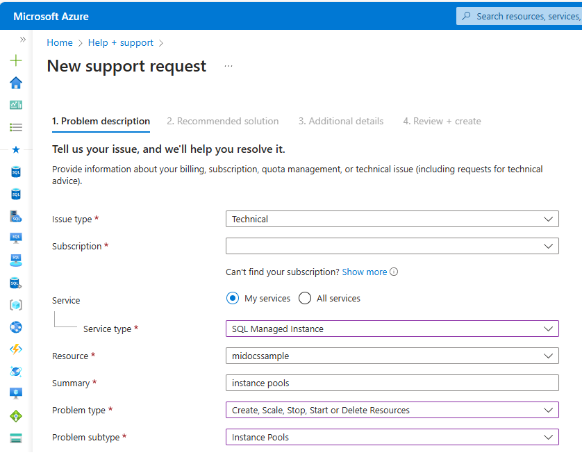

# Create an instance pool (preview) - Azure SQL Managed Instance
[!INCLUDE[appliesto-sqlmi](../includes/appliesto-sqlmi.md)]

This article teaches how to create an [instance pool](instance-pools-overview.md) for [Azure SQL Managed Instance](sql-managed-instance-paas-overview.md), as well as how to move instances in and out of the pool.  

Instance pools make it possible to deploy multiple instances with shared resources to a single virtual machine, which provides a convenient and cost-effective infrastructure to migrate multiple SQL Server instances without having to consolidate smaller and less compute-intensive workloads onto a larger SQL Managed Instance.

> [!NOTE]
> Instance pools for Azure SQL Managed Instance are currently in preview. 


## Prerequisites

To create an instance pool, you should have:

- An existing [virtual network](vnet-existing-add-subnet.md) with an [appropriately sized](vnet-subnet-determine-size.md) subnet range. 
- The latest [Az.SQL](/powershell/module/az.sql/) module for the current version of PowerShell or the latest version of the [Azure CLI](/cli/azure/install-azure-cli-windows). 
- Reviewed [Instance and pool properties](instance-pools-overview.md#instance-and-pool-properties). 

### Subnet size considerations

Carefully plan the size of your subnet if you plan to use an instance pool. Refer to [Determine required subnet size & range](vnet-subnet-determine-size.md) for subnet sizing guidelines.

Use the following formula when calculating the number of IP addresses required by one instance pool containing multiple General Purpose instances:

`2 * (5 + (3 * # of MIs)) + 5`

The `# of MIs` refers to the maximum potential number of instances you plan to provision. The maximum possible number of instances in the pool is 40. 

## Create instance pool 

You can create an instance pool using PowerShell or the Azure CLI. Consider the following: 

- Only the General Purpose service tier on either standard-series (Gen5) or premium-series hardware is currently available.
- The pool name can contain only lowercase letters, numbers and hyphens, and can't start with a hyphen.
- The [Azure Hybrid Benefit](../azure-hybrid-benefit.md) is applied at the instance pool level. You can set the license type when you create the pool, and update the license type after the pool is created. 

> [!IMPORTANT]
> Deploying an instance pool is a long running operation that can take up to 4.5 hours.


### [PowerShell](#tab/powershell)

To create your instance pool, use [New-AzSqlInstancePool](/powershell/module/az.sql/new-azsqlinstancepool). 

Consider the following: 

- For `LicenseType`, use *BasePrice* for the Azure Hybrid Benefit or *LicenseIncluded* if you have don't have a SQL Server license that can be used for the Azure Hybrid Benefit discount.
- Use `Get-AzLocation | select displayname, location` to obtain a list of regions where instance pools are available. 

Create a new instance pool with 8 vCores on standard-series (Gen5) hardware by running the following sample script: 

```powershell
# Identify the SubnetId
$virtualNetwork = Get-AzVirtualNetwork -Name <vnet name> -ResourceGroupName <resource group name>
$miSubnet = Get-AzVirtualNetworkSubnetConfig -Name <subnet name> -VirtualNetwork $virtualNetwork
$miSubnetConfigId = $miSubnet.Id

# Create the instance
$instancePool = New-AzSqlInstancePool `
    -ResourceGroupName  <resource group name> `
    -Name <instance pool name> `
    -SubnetId $miSubnetConfigId `
    -LicenseType LicenseIncluded `
    -VCore 8 `
    -Edition GeneralPurpose `
    -ComputeGeneration Gen5 `
    -Location <region>
```

### [Azure CLI](#tab/azure-cli)

To create your instance pool, use [az sql instance-pool create](/cli/azure/sql/instance-pool#az-sql-instance-pool-create). 

Consider the Following: 
- For `--license-type`, use *BasePrice* for the Azure Hybrid Benefit or *LicenseIncluded* if you have don't have a SQL Server license that can be used for the Azure Hybrid Benefit discount.


Create a new instance pool with 8 vCores on standard-series (Gen5) hardware by running the following sample script: 

```azurecli
# Get virtual network parameters
az network vnet show --resource-group <resource group name> --name <vnet name>

# Get subnet parameters
az network vnet subnet show --resource group <resource group name>  --name <subnet name> --vnet-name <vnet name>

# Create the instance pool 
az sql instance-pool create
    --license-type LicenseIncluded 
    --location <region>
    --name <pool name> 
    --capacity 8
    --tier GeneralPurpose
    --family Gen5 
    --resource-group <resource group name> 
    --subnet <subnet name>
    --vnet-name <vnet name>
```

---

## Create new instance inside pool

After your pool is created, you can create a new instance within the pool by using PowerShell, or the Azure CLI. 

### [PowerShell](#tab/powershell)

To identify pool parameters, use [Get-AzSqlInstancePool](/powershell/module/az.sql/get-azsqlinstancepool) then create your instance inside the specific pool with [New-AzSqlInstance](/powershell/module/az.sql/new-azsqlinstance). 

Create a new instance in your pool by running the following sample script: 

```powershell
$adminCredential = Get-Credential
$instancePool = Get-AzSqlInstancePool -ResourceGroupName <resource group name> -Name <instance pool name>

$instance01 = $instancePool | New-AzSqlInstance `
    -Name $instance01`
    -VCore 2 `
    -StorageSizeInGB 32 `
    -AdministratorCredential $adminCredential `
```

### [Azure CLI](#tab/azure-cli)

To create a new instance in your pool, provide the pool name in the `--instance-pool-name` parameter when you use [az sql mi create](/cli/azure/sql/mi#az-sql-mi-create) to create your instance. 

---

## Move existing instance 

You can move an existing instance into and out of a pool by using PowerShell or the Azure CLI if: 

- It's in the same resource group as the pool.
- It's on the same virtual network and subnet as the pool.
- It fits the instance pool resource limits.

When an existing instance is moved into a pool, settings at the pool level take precedence over instance-level settings. For example, the instance inherits the license type and maintenance window set at the pool level. When an instance is moved out of the pool, it retains the settings it inherited from the pool. The only exception is with the license type, which defaults back to 'LicenseIncluded' when an instance is removed from the instance pool - the [Azure Hybrid Benefit](../azure-hybrid-benefit.md) and [hybrid failover rights benefit](managed-instance-link-feature-overview.md#license-free-passive-dr-replica) must be configured manually after an instance is moved out of a pool. 


### [PowerShell](#tab/powershell)

To move an instance into a pool, provide the pool name when you use [Set-AzSqlInstance](/powershell/module/az.sql/set-azsqlinstance): 

```powershell
$instance01 | Set-AzSqlInstance -InstancePoolName $instancePoolName
```

To move an instance out of a pool, provide a _blank_ pool name: 

```powershell
$instance01 | Set-AzSqlInstance -InstancePoolName ''
```

### [Azure CLI](#tab/azure-cli)

To move an instance into a pool, provide the pool name in the `--instance-pool-name` parameter when you use [az sql mi update](/cli/azure/sql/mi#az-sql-mi-update) to update your instance. 

To move an instance out of a pool, provide a _blank_ name in the `--instance-pool-name` parameter when you use [az sql mi update](/cli/azure/sql/mi#az-sql-mi-update) to update your instance. 

---

## Connect to instance in a pool 

To connect to an instance in a pool, first enable the public endpoint for the instance, and then [allow public endpoint traffic on the network security group](public-endpoint-configure.md#allow-public-endpoint-traffic-in-the-network-security-group).


### [PowerShell](#tab/powershell)

To enable the public endpoint for an instance, set `-PublicDataEndpointEnabled` to _true_ when you update instance properties with [Set-AzSqlInstance](/powershell/module/az.sql/set-azsqlinstance): 

```powershell
$instance01 | Set-AzSqlInstance -InstancePoolName $instancePoolName -PublicDataEndpointEnabled $true
```

### [Azure CLI](#tab/azure-cli)

To enable the public endpoint for an instance, set `--public-data-endpoint-enabled` to _true_ when you update instance properties with [az sql mi update](/cli/azure/sql/mi#az-sql-mi-update). 

---

## Create a database

Creating a database for an instance inside a pool is the same as creating a database for a single instance. You can create a new database by using PowerShell or the Azure CLI. 

### [PowerShell](#tab/powershell)

To create a new database for your instance, use [New-AzSqlInstanceDatabase](/powershell/module/az.sql/new-azsqlinstancedatabase): 

```powershell
New-AzSqlInstanceDatabase -Name <database name> -InstanceName <instance name> -ResourceGroupName <resource group> 
```

### [Azure CLI](#tab/azure-cli)

To create a new database for your instance, use [az sql midb create](/cli/azure/sql/midb#az-sql-midb-create). 

---

## Get pool usage

### [PowerShell](#tab/powershell)

You can use PowerShell to determine how resources are being used inside a pool. 

To get a list of instances inside a pool, use [Get-AzSqlInstance](/powershell/module/az.sql/get-azsqlinstance):

```powershell
$instancePool | Get-AzSqlInstance
```

To get pool resource usage, use [Get-AzSqlInstancePoolUsage](/powershell/module/az.sql/get-azsqlinstancepoolusage):

```powershell
$instancePool| Get-AzSqlInstancePoolUsage
```

You can add the -ExpandChildren parameter to get a detailed overview of the pool and instances inside it: 

```powershell
$instancePool | Get-AzSqlInstancePoolUsage –ExpandChildren
```

To list the databases in an instance, use [Get-AzSqlInstanceDatabase](/powershell/module/az.sql/get-azsqlinstancedatabase):

```powershell
$databases = Get-AzSqlInstanceDatabase -InstanceName $instance01Name  -ResourceGroupName $resourceGroupName
```

> [!NOTE]
> To check limits on the instances deployed to a pool, and databases per instance pool, review [resource limits](instance-pools-overview.md#resource-limits).

### [Azure CLI](#tab/azure-cli)

To get information about the instances and resource usage in the pool, use [az sql instance-pool show](/cli/azure/sql/instance-pool#az-sql-instance-pool-show). 

---


## Update an instance pool

### [PowerShell](#tab/powershell)

You can use PowerShell to make changes to the instance pool limits. 

The following sample script changes the license type, vCore size, and hardware type: 


Change license type:

```powershell
$instancePool | Set-AzSqlInstancePool -LicenseType BasePrice -VCores 16 -ComputeGeneration Gen8
```

You can also determine the available maintenance window schedules: 

```powershell
# 'Available maintenance schedules in $location'
$configurations = Get-AzMaintenancePublicConfiguration
$configurations | ?{ $_.Location -eq $location -and $_.MaintenanceScope -eq "SQLManagedInstance"} 
$maintenanceWindowOptions = $configurations | ?{ $_.Location -eq $location -and $_.MaintenanceScope -eq "SQLManagedInstance"}
```

You can then change the maintenance window by specifying a window option, such as: 


```powershell
$instancePool | Set-AzSqlInstancePool -MaintenanceConfigurationId $maintenanceWindowOptions[1].Id
```

### [Azure CLI](#tab/azure-cli)

To update configuration settings for your pool, use [az sql instance-pool update](/cli/azure/sql/instance-pool#az-sql-instance-pool-update). 

---

## Update a pooled instance

If pool resource limits haven't been exceeded, you can modify resource configurations for an instance inside a pool using PowerShell or the Azure CLI, 

### [PowerShell](#tab/powershell)

To modify resource parameters for an instance inside a pool, use [Set-AzSqlInstance](/powershell/module/az.sql/set-azsqlinstance). 

For example, the following script updates the vCores to 8 and changes the storage size to 512 GB for Instance1: 

```powershell
$instance1name | Set-AzSqlInstance -VCore 8 -StorageSizeInGB 512 -InstancePoolName $instancePoolName
```


### [Azure CLI](#tab/azure-cli)

To modify resource parameters for an instance inside a pool, use [az sql mi update](/cli/azure/sql/mi#az-sql-mi-update). 

---

## Delete an instance pool 

You can delete an instance pool by using PowerShell or the Azure CLI, once all instances in the pool have either been deleted, or moved out of the pool. 


### [PowerShell](#tab/powershell)

To delete an instance pool, use [Remove-AzSqlInstancePool](/powershell/module/az.sql/remove-azsqlinstancepool/). 

The following sample script deletes an empty instance pool: 

```powershell
Remove-AzSqlInstancePool -ResourceGroupName <resource group name -Name <instance pool name>
```


### [Azure CLI](#tab/azure-cli)

To delete an instance pool, use [az sql instance-pool delete](/cli/azure/sql/instance-pool#az-sql-instance-pool-delete). 

---


## Instance pool operations

The following table shows available instance pool operations: 

|Command|Azure portal|PowerShell|Azure CLI|
|:---|:---|:---|:---|
|Create an instance pool|No|Yes|Yes|
|Update pool properties |No|Yes|Yes|
|Check a pool use and properties|Yes|Yes|Yes|
|Delete an instance pool|Yes|Yes|Yes|
|Create a managed instance inside a pool|No|Yes|Yes|
|Move a managed instance into a pool|No|Yes|Yes|
|Delete a managed instance from a pool|Yes|Yes|Yes|
|Move a managed instance out of a pool|No|Yes|Yes|
|Create a database in instance within a pool|Yes|Yes|Yes|
|Delete a database from SQL Managed Instance|Yes|Yes|Yes|

# [PowerShell](#tab/powershell)

To use PowerShell, [install the latest version of PowerShell Core](/powershell/scripting/install/installing-powershell#powershell), and follow instructions to [Install the Azure PowerShell module](/powershell/azure/install-az-ps).

Available [PowerShell commands](/powershell/module/az.sql/):

|Cmdlet |Description |
|:---|:---|
|[New-AzSqlInstancePool](/powershell/module/az.sql/new-azsqlinstancepool/) | Creates an instance pool. |
|[Get-AzSqlInstancePool](/powershell/module/az.sql/get-azsqlinstancepool/) | Returns information about an instance pool. |
|[Set-AzSqlInstancePool](/powershell/module/az.sql/set-azsqlinstancepool/) | Sets properties for an instance pool. |
|[Remove-AzSqlInstancePool](/powershell/module/az.sql/remove-azsqlinstancepool/) | Removes an instance pool. |
|[Get-AzSqlInstancePoolUsage](/powershell/module/az.sql/get-azsqlinstancepoolusage/) | Returns information about instance pool usage. |

For operations related to instances both inside pools and single instances, use the standard [managed instance commands](api-references-create-manage-instance.md#powershell-create-and-configure-managed-instances), but the *instance pool name* property must be populated when using these commands for an instance in a pool.

# [Azure CLI](#tab/azure-cli)

Prepare your environment for the Azure CLI.

[!INCLUDE [azure-cli-prepare-your-environment-no-header](~/../azure-sql/reusable-content/azure-cli/azure-cli-prepare-your-environment-no-header.md)]

Available [Azure CLI](/cli/azure/sql) commands:

|Cmdlet |Description |
|:---|:---|
|[az sql instance-pool create](/cli/azure/sql/instance-pool#az-sql-instance-pool-create) | Creates an instance pool. |
|[az sql instance-pool show](/cli/azure/sql/instance-pool#az-sql-instance-pool-show) | Returns information about an instance pool. |
|[az sql instance-pool update](/cli/azure/sql/instance-pool#az-sql-instance-pool-update) | Sets or updates properties for an instance pool. |
|[az sql instance-pool delete](/cli/azure/sql/instance-pool#az-sql-instance-pool-delete) | Removes an instance pool. |

---

## Limitations


During public preview, instances in a pool have the following limitations:

- The pool name can contain only lowercase letters, numbers and hyphens, and can't start with a hyphen.
- All instances in the pool use the same licensing model. When you specify a license model for an instance that is different than the license model for the pool, the pool license model is used. When the instance is moved out of the pool, it automatically switches to a full paid license (`LicenseType` = 'LicenseIncluded'). Manually activate the [Azure Hybrid Benefit](../azure-hybrid-benefit.md) or the [hybrid failover rights benefit](managed-instance-link-feature-overview.md#license-free-passive-dr-replica) to change the licensing model. 
- Pooled instances must belong to the same subnet and resource group. Moving an instance in and out of the pool is only possible within the subnet of the pool and same resource group. 
- Only the General Purpose service tier is available on standard-series (Gen5) or premium-series hardware. The Next-gen General Purpose, Business Critical service tier, and premium-series memory optimized hardware isn't available. 
- The maximum possible number of instances in the pool is 40. 
- An instance pool can only be deleted after all instances in the pool are either deleted or moved out of the pool. 
- You can't use the Azure portal to: 
    - Configure the instance pool. Use PowerShell or the Azure CLI instead. 
    - Move instances in and out of the pool. Use PowerShell or the Azure CLI instead.
- The following SQL Managed Instance features aren't supported when instances are in a pool: 
    - [Failover groups](failover-group-sql-mi.md). [Failover rights](failover-group-standby-replica-how-to-configure.md) aren't available to instances in a pool. 
    - [Start/Stop](instance-stop-start-how-to.md).
    - [Zone Redundancy](high-availability-sla.md#zone-redundant-availability). 
    - [Reserved capacity](../database/reserved-capacity-overview.md) instance pricing isn't available.


## Support requests

Create and manage support requests for instance pools in the [Azure portal](https://portal.azure.com).

If you're experiencing issues when creating or deleting an instance, be sure to specify **Instance Pools** in the **Problem subtype** field.



If you're experiencing issues related to a single managed instance or database within a pool, you should create a regular support ticket for Azure SQL Managed Instance.

To create larger SQL Managed Instance deployments (with or without instance pools), you might need to obtain a larger regional quota. For more information, see [Request quota increases for Azure SQL Database](../database/quota-increase-request.md). The deployment logic for instance pools compares total vCore consumption *at the pool level* against your quota to determine whether you're allowed to create new resources without further increasing your quota.


## Related content

- [SQL common features](../database/features-comparison.md).
- [SQL Managed Instance virtual network configuration](connectivity-architecture-overview.md).
- [Create a managed instance quickstart](instance-create-quickstart.md).
- [SQL Managed Instance migration using Database Migration Service](/azure/dms/tutorial-sql-server-to-managed-instance).
- [Monitor Azure SQL Managed Instance using Azure SQL Analytics](/azure/azure-monitor/insights/azure-sql).
- [SQL Managed Instance pricing](https://azure.microsoft.com/pricing/details/sql-database/managed/).
