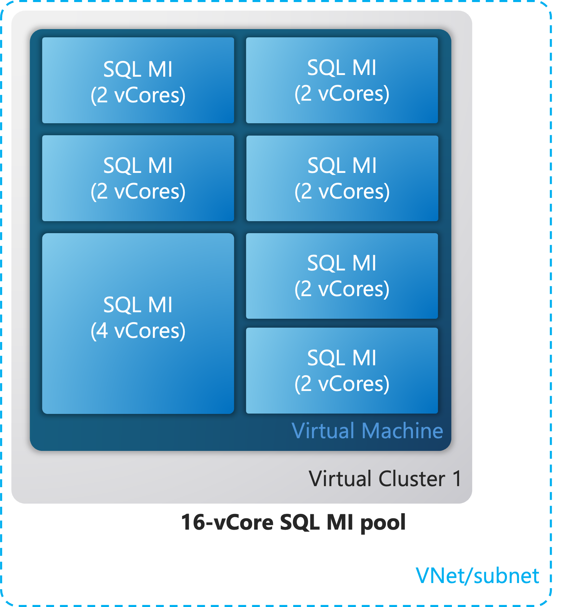
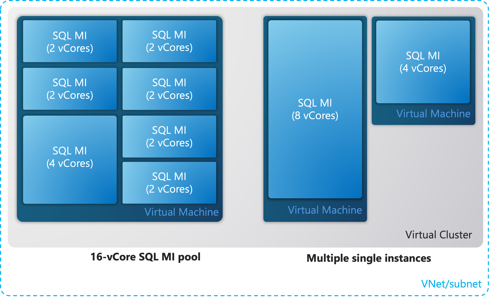

# What is an Azure SQL Managed Instance pool (preview)?
[!INCLUDE[appliesto-sqlmi](../includes/appliesto-sqlmi.md)]

Azure SQL Managed Instance pool is a deployment type for SQL Managed Instance that provides a convenient and cost-efficient way to migrate smaller SQL Server instances to the cloud at scale.

Instance pools allow you to pre-provision compute resources according to your total migration requirements. Once an instance pool has been provisioned, you can then deploy one or more individual managed instances in that that instance pool (up to the pre-provisioned compute level). For example, when you deploy an  8-vCore instance pool you can deploy two 2-vCore and one 4-vCore instance in it and then migrate databases into these instances.

The following diagram illustrates an instance pool with multiple managed instances deployed within a virtual network subnet.

Prior to instance pools being available, smaller and less compute-intensive workloads often had to be consolidated into a larger managed instance when migrating to the cloud. The need to migrate groups of databases to a large instance typically required careful capacity planning and resource governance, additional security considerations, and some extra data consolidation work at the instance level.

Additionally, instance pools support native VNet integration so you can deploy multiple instance pools and multiple single instances in the same subnet.

## Key capabilities

Instance pools provide the following core benefits:

1. Ability to host 2-vCore instances*. 
2. Predictable and fast instance deployment time (up to 5 minutes).

**2-vCore instanceas are available only within instance pools*

Instance pools enable deployment of multiple instances on the same virtual machine, where the virtual machine's compute size is based on the total number of vCores allocated for the pool. This architecture allows *partitioning* of the virtual machine into multiple instances which can be any supported size, including 2 vCores (2-vCore instances are an exclusive capability of instance pools).

After the initial deployment, management operations on instances in a pool are much faster. This is made possible as the deployment or extension of a [virtual cluster](connectivity-architecture-overview.md#high-level-connectivity-architecture) (dedicated set of virtual machines) is part of instance pool provisioning and not tied to single managed instance provisioning.

## Application scenarios

The following list provides the main use cases where instance pools should be considered:

- Migration of *a group of SQL Server instances* at the same time, where most of the instances are of a small size (e.g. 2- or 4-vCores).
- Scenarios where *quick and predictable instance creation or scaling* is important. For example, deployment of a new tenant in a multi-tenant SaaS application environment that requires instance-level capabilities.
- Scenarios where having a *fixed cost* or *spending limit* is important. For example, running shared dev-test or demo environments of a fixed (or infrequently changing) size, where you periodically deploy managed instances when needed.

## Architecture

Instance pools have a similar architecture to regular (*single*) managed instances. To support [deployments within Azure virtual networks](/azure/virtual-network/virtual-network-for-azure-services) and to provide isolation and security for customers, instance pools also rely on [virtual clusters](connectivity-architecture-overview.md#high-level-connectivity-architecture). Virtual clusters represent a dedicated set of isolated virtual machines deployed inside the customer's virtual network subnet.

The main difference between the two deployment models is that instance pools allow multiple SQL Server process deployments on the same virtual machine node, which are resource governed using [Windows job objects](/windows/desktop/ProcThread/job-objects), while single instances are always alone on a virtual machine node.

The following diagram shows an instance pool and two individual instances deployed in the same subnet and illustrates the main architectural details for both deployment models:

All instance pools as well single instances within a subnet belong to the same virtual cluster. Instances within a pool and single instances deployed in the same subnet do not share compute resources allocated to SQL Server processes and gateway components, which ensures performance predictability.

## Networking

### Subnet size configuration

Subnet size containing SQL MI pools should be carefully planned. Please refer to [Determine required subnet size & range - Azure SQL Managed Instance](vnet-subnet-determine-size) for subnet sizing guidelines. Use the following formula when calculating the number of IP addresses required by one instance pool containing General Purpose instances:

2 * (5 + 3 * # of MIs) + 5

The envisaged number of instances in the pool (# of MIs) refers to the potential maximum number of instances you are planning to eventually provision, e.g. in case the instance pool is scaled at some point in the future (the maximum possible number of instances in the pool is 40).

## Resource limits

Both SQL MI pool limits and SQL MI single instance limits apply (whichever is smaller). 

||SQL MI pool (pool level limits)|Pooled SQL MI (single instance limits)|
|:---|:---|:---|
|Service tier|General Purpose|General Purpose|
|Hardware tier|Standard (Gen5) Premium (Gen8)|Standard (Gen5) Premium (Gen8)|
|Number of vCores(1)|8-16-24-32-40-64-80|2-4-8-16-24-32-40-64-80|
|Max Storage| 32 TB(2)|640 GB for 2 vCores 2 TB for 4 vCores 8 TB for 8 vCores 16 TB for 16+ vCores|
|Max # of databases|500|50 for 2 vCores 100 for 4+ vCores|

(1) *vCore options for pooled SQL MIs also depend on the number of available vCores in the SQL MI pool.*

(2) *Pool storage limit refers to the sum of instance storages. The pool doesn't have storage on its own*

All other resource limits at instance level apply and can be found at [Resource limits - Azure SQL Managed Instance | Microsoft Learn](resource-limits).

## Public preview limitations

The public preview has the following limitations:

- Only the General Purpose service tier is available.
- Failover groups are not supported for instances in the pool.
- Start/Stop is not supported (neither for the pool nor for the pooled instances).
- Zone Redundancy is not supported.
- [Reserved capacity](../database/reserved-capacity-overview.md) instance pricing is not available.
- Azure portal support is not available for:
    - Instance pool configuration (supported via PowerShell and Azure CLI)
    - Instance move into and out of an instance pool (supported via PowerShell and Azure CLI)

## Unsupported and restricted features

A limited number of features is not supported for instances in instance pools, while some features can only be set at the pool level (applying to all pooled instances).

### Unsupported features

The following table lists unsupported features in pooled instances and/or instance pools.

|Feature|Pooled instance|Instance pool|
|:---|:---|:---|
|SQL License: AHB|NO*|YES|
|SQL License: Hybrid Failover Rights|NO*|YES**| 
|SQL License: Failover Rights|NO|NO|
|FMW|NO*|YES|
|Start/Stop|NO|NO|
|Start/Stop Schedule|NO|NO|
|Failover groups|NO|NO|
|Zone Redundancy (GP)|NO|NO|

**Can be set only at the pool level (for all pooled instances)*

***Can be set via PowerShell or Az CLI by setting LicenseType parameter to ‘BasePrice’*

### Instance properties set at the pool level

The following properties can only be set at the instance pool level (applying the setting to all pooled instances at once):

- Service tier
- Hardware tier
- SQL license
- Fixed Maintenance Window (FMW)

### Other restrictions

- Subnet: pooled instances belong to the same subnet. Instance moves in and out of instance pools are also possible only within the pool’s subnet.
- Resource Groups: pooled instances must belong to the same resource group as instance pool.

## Moving instances in and out of instance pool

An existing SQL MI (“instance”) can be moved into an instance pool provided the following conditions are met:

- Resource limits: instance must fit within both instance pool and pooled instance resource limits
- See other restrictions

When an instance **moves into an instance pool**, for all features that are set at instance pool level their settings will take precedence over per-instance settings. For example, the instance will automatically inherit pool's Fixed Maintenance Window (FMW) which might be potentially different from FMW while the instance out of the pool. 

Similarly, when an instance **moves out of an instance pool** it will retain all its attributes unless explicitly specified otherwise. The only exception is when SQL AHB or Hybrid Failover Rights are applied to the pool, in which case the instance leaving the pool automatically switches to a fully paid license (LicenseType property is set to ‘FullLicense’). This instance can then still be set to SQL AHB or Hybrid Failover Rights manually (provided the license term requirements are met).

## SQL features

Managed instances created in pools support the same [compatibility levels and features supported in single managed instances](sql-managed-instance-paas-overview.md#supported-sql-features).

Every managed instance deployed in a pool has a separate instance of SQL Agent.

Optional features or features that require you to choose specific values (such as instance-level collation, time zone, public endpoint for data traffic, failover groups) are configured at the instance level and can be different for each instance in a pool.

## Performance considerations

Although managed instances within pools do have dedicated vCore and RAM, they share local disk (for `tempdb` usage) and network resources. It's not likely, but it is possible to experience the *noisy neighbor* effect if multiple instances in the pool have high resource consumption at the same time. If you observe this behavior, consider deploying these instances to a bigger pool or as single instances.

## Security

### Authentication with Microsoft Entra ID

Authentication with Microsoft Entra ID ((formerly Azure Active Directory)[https://learn.microsoft.com/en-us/entra/fundamentals/new-name]) can be used after creating or setting a managed instance with the -AssignIdentity flag. For more information, see [New-AzSqlInstance](https://learn.microsoft.com/en-us/powershell/module/az.sql/new-azsqlinstance) and [Set-AzSqlInstance](https://learn.microsoft.com/en-us/powershell/module/az.sql/set-azsqlinstance). Users can then set a Microsoft Entra admin for the instance by following [Provision Microsoft Entra admin (SQL Managed Instance)](https://learn.microsoft.com/en-us/azure/azure-sql/database/authentication-aad-configure?view=azuresql#provision-azure-ad-admin-sql-managed-instance).

### Security considerations

Because instances deployed in a pool share the same virtual machine, you may want to consider disabling features that introduce higher security risks, or to firmly control access permissions to these features. For example, CLR integration, native backup and restore, database email, etc.

## Instance pool billing

Instance pools allow scaling compute and storage independently. Customers pay for compute associated with the pool resource measured in vCores, and storage associated with every instance measured in gigabytes (the first 32 GB are free of charge for every instance).

vCore price for a pool is charged regardless of how many instances are deployed in that pool.

For the compute price (measured in vCores), two pricing options are available, depending if you are using some of the benefits allowing you to bring your own SQL License or if you are paying full SQL License price:

  1. *License included*: Price of SQL Server licenses is included. This is for the customers who choose not to apply existing SQL Server licenses with Software Assurance.
  2. *Azure Hybrid Benefit*: A reduced price that includes Azure Hybrid Benefit for SQL Server. Customers can opt into this price by using their existing SQL Server licenses with Software Assurance. For eligibility and other details, see [Azure Hybrid Benefit](https://azure.microsoft.com/pricing/hybrid-benefit/).
  3. Hybrid Failover Rights Benefit: allows you to run a license-free SQL MI when used as a passive Disaster Recovery (DR) replica for your SQL Server licensed under [Software Assurance](https://www.microsoft.com/en-gb/licensing/licensing-programs/software-assurance-default) (SA). You can consult [License-free DR on Azure SQL Managed Instance for SQL Server to learn more about how this benefit works](https://techcommunity.microsoft.com/t5/azure-sql-blog/license-free-dr-on-azure-sql-managed-instance-for-sql-server/ba-p/3950559#:~:text=Hybrid%20failover%20rights%20is%20a%20new%20benefit%20that,Software%20Assurance%20%28SA%29%2C%20or%20using%20Pay-as-you-go%20billing%20option.). For precise terms and conditions of the Hybrid failover rights benefit, see the SQL Server licensing terms online in the section [“SQL Server – Fail-over Rights”](https://www.microsoft.com/licensing/terms/productoffering/SQLServer/EAEAS).

> [!NOTE]
> If you create instance pools on [subscriptions eligible for dev-test benefit](https://azure.microsoft.com/pricing/dev-test/), you automatically receive discounted rates of up to 55 percent on Azure SQL Managed Instance.

Setting different pricing options is not possible for individual instances in a pool. All instances in the parent pool must be either at License Included price or Azure Hybrid Benefit price. The license model for the pool can be altered after the pool is created.

> [!IMPORTANT]
> If you specify a license model for the instance that is different than the license model chosen for the pool, the pool price is used, and the instance level value is ignored. Also, when an instance is moved out of the pool it automatically switches to a fully paid license (LicenseType property is set to ‘FullLicense’). This instance can then still be set to SQL AHB or Hybrid Failover Rights manually (provided the license term requirements are met).

For full details on instance pool pricing, refer to the *instance pools* section on the [SQL Managed Instance pricing page](https://azure.microsoft.com/pricing/details/sql-database/managed/).

## Instance pool support requests

Create and manage support requests for instance pools in the [Azure portal](https://portal.azure.com).

If you are experiencing issues related to instance pool deployment (creation or deletion), make sure that you specify **Instance Pools** in the **Problem subtype** field.

If you are experiencing issues related to a single managed instance or database within a pool, you should create a regular support ticket for Azure SQL Managed Instance.

To create larger SQL Managed Instance deployments (with or without instance pools), you may need to obtain a larger regional quota. For more information, see [Request quota increases for Azure SQL Database](../database/quota-increase-request.md). The deployment logic for instance pools compares total vCore consumption *at the pool level* against your quota to determine whether you are allowed to create new resources without further increasing your quota.

## Next steps

- To get started with instance pools, see [SQL Managed Instance pools how-to guide](instance-pools-configure.md).
- To learn how to create your first managed instance, see [Quickstart guide](instance-create-quickstart.md).
- For a features and comparison list, see [Azure SQL common features](../database/features-comparison.md).
- For more information about VNet configuration, see [SQL Managed Instance VNet configuration](connectivity-architecture-overview.md).
- For a quickstart that creates a managed instance and restores a database from a backup file, see [Create a managed instance](instance-create-quickstart.md).
- For a tutorial about using Azure Database Migration Service for migration, see [SQL Managed Instance migration using Database Migration Service](/azure/dms/tutorial-sql-server-to-managed-instance).
- For advanced monitoring of SQL Managed Instance database performance with built-in troubleshooting intelligence, see [Monitor Azure SQL Managed Instance using Azure SQL Analytics](/azure/azure-monitor/insights/azure-sql).
- For pricing information, see [SQL Managed Instance pricing](https://azure.microsoft.com/pricing/details/sql-database/managed/).
