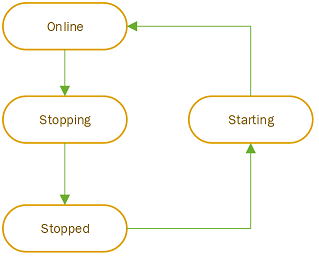

# Instance stop and start (preview) overview - Azure SQL Managed Instance 
[!INCLUDE[appliesto-sqlmi](../includes/appliesto-sqlmi.md)]

This article teaches you to stop and start your instance to save on billing costs when using Azure SQL Managed Instance. Start and stop your instance by using the Azure portal, or Azure PowerShell. 

The ability to stop and start your instance is currently in preview and only available for instances in the General Purpose service tier. 

## Overview

Save on billing costs by stopping your General Purpose managed instance when you're not using it. Stopping an instance is similar to deallocating a virtual machine. When an instance is in a stopped state, you're no longer billed for compute and licensing costs while still billed for storage and backup storage. 

Stopping an instance clears all cached data. 

This features introduces three new managed instance states, as the following diagram indicates:

:::row:::
    :::column:::
        <br />
        <br />
        <br />- Stopping
        <br />- Stopped
        <br />- Starting
    :::column-end:::
    :::column:::
        
    :::column-end:::
:::row-end:::


Once the stop operation is initiated, it typically takes about 5 minutes to stop the instance. However, conversely, starting an instance takes about 20 minutes from the moment the start operation is initiated. 

Only instances in a ready state can be stopped. Once the instance is stopped, it stays in a stopped state until the start operation is initiated, either manually, or triggered with a defined schedule. Only instances that are in the stopped state can be started.


> [!IMPORTANT]
> As a PaaS service, SQL Managed Instance is responsible for compliance for every part of the system components. In the event there is an urgent need for system maintenance that requires the instance to be online, Azure can initiate the start operation and keep the instance online until the maintenance operation completes, at which Azure stops the instance. Compute and license charges are applied for the entire time the instance is in an online state. 


## Action types 

There are two ways to stop and start an instance - either manually on demand, or with a schedule. 

### Manual commands 

Manual commands immediately trigger the stop or start action. Manual commands are good for instances that have larger periods of inactivity without regular patterns, or for testing purposes. In addition, [Azure Automation Schedules](/azure/automation/shared-resources/schedules) or any custom solution that creates customized and more flexible schedules that cannot be achieved by using the built-in stop/start scheduler in SQL Managed Instance. 

### Scheduled commands 

You can also create a schedule with one or more multiple points of time when a start or stop action is triggered. Scheduling commands are a good fit for instances that have regular patterns, such as starting an instance every working day at 8am, and then stopping it at 5pm, and then starting at 7am and stopping at 11am on a weekend. Scheduling your commands eliminates the need for custom solutions or Azure Automation Schedules to create stop/start schedules.

Scheduled items represent points in time when start or stop events are initiated, not when the instance  is up and running. So when creating a schedule, take the operation duration into account. For example, if you want to have your instance up and running at 08:00 AM, define a schedule item that initiates the start operation at 07:40 AM.

Consider the following rules for a stop-start schedule: 

- Scheduled items are defined as a stop-and-start pair, and must have both start and stop values populated. It's not possible to have a populated start value with a missing stop value, and vice versa.
- There can't be an overlap of scheduled pairs. If there is an overlap of scheduled times, the API returns an error. 
- The time span between the two successive actions (start after stop or stop after start) must be at least 1 hour. For example, if a start is scheduled for 10:00 AM, the stop action can't be scheduled before 11:00 AM. 
- If there are conflicting operations when a stop is triggered (such as scaling vCore in progress), the mechanism retries after 10 minutes. If after 10 minutes the conflicting operation is still active, the stop operation gets skipped.  

## Billing

Stopped instances don't get billed for vCores and the SQL license, they are only charged for storage and backup storage. However, vCores and license billing is charged for every **started** hour, meaning that at 12:01, you will be charged for the entire hour, even if the instance is stopped within the hour. 

### Azure Hybrid Benefit

The [Azure Hybrid Benefit (AHB)](../azure-hybrid-benefit.md) is applied per resource. If your SQL Managed Instance is using the Azure Hybrid Benefit to save on licensing costs, to apply that benefit to another resource when the instance is in a stopped state, you must first disable AHB on the instance, and then stop the instance. Similarly, once you start the instance again, you have to enable AHB on it once more to apply the licensing benefit. 

### Reserved instance pricing 

[Reserved instance pricing (reserved capacity)](../database/reserved-capacity-overview.md) is applied for the vCores and hours emitted. When an instance eligible for reserved pricing is stopped, reserved pricing is automatically redirected to another instance, if one exists. As such, the start and stop feature can be used to _overprovision_ reserved instance pricing. For example, assume you purchase a SQL Managed Instance with a reserved capacity of 16 vCores. This means that you can run two managed instances with 8 vCores each from 1pm to 2pm, stop  both instances, and then run two different managed instances with 8 vCores each from 2pm to 3pm, consuming your 16 vCore limit for each hour, spread amongst four instances in total. 

Reservation discounts are [use it or lose it](/azure/cost-management-billing/reservations/understand-reservation-charges), so if you don't have matching resources for any hour, then you lose the reservation quantity for that hour. You cannot carry forward unused reserved hours.

## Limitations

Consider the following limitations: 

- You cannot stop instances that: 
    - have ongoing [management operation](management-operations-overview.md) (such as an ongoing restore, vCores scaling, etc.)
    - are part of a [failover group](auto-failover-group-sql-mi.md) 
    - use the [Managed Instance link](managed-instance-link-feature-overview.md) 
- While instance is in a stopped state, it is not possible to change any configuration parameters, and the instance has to be started to change any instance properties. 
- While the instance is in stopped state it is not possible to take backups. Therefore, if you have [long-term backups](long-term-backup-retention-configure.md) configured and you have yearly backups in place, if the instance is stopped during the defined yearly backup period, the backup will be skipped. It is advised to keep the instance up and running during the yearly backup period. 
- It is not possible to cancel the start or stop operation once it is initiated. 


## Define PowerShell parameters

If you're using PowerShell to execute a manual stop and start commands, or you're creating a schedule, you first must define your parameters.

Skip this step if you're not using PowerShell. 

To define the parameters, first update the relevant values in the **USER CONFIGURABLE VALUES** section, and then run the following script:

```powershell
# ===============================================================
# SQL Managed Instance - Start/Stop feature examples
#
# Execute in Azure Cloud Shell PowerShell
# (C) 2021 Managed Instance product group
# ===============================================================
# ===============================================================
# USER CONFIGURABLE VALUES
# ===============================================================
$SubscriptionId = "<SubscriptionID>"
$SqlMIName = "<Sql-MI-name>"
$RgName = "<ResourceGroup>"
# ===============================================================
# DO NOT MODIFY THE SCRIPT BELOW - NOT USER CONFIGURABLE
# ===============================================================
# Constants
$UriPrefix = "https://management.azure.com/subscriptions/" + $SubscriptionId + "/resourceGroups/" + $RgName + 
"/providers/Microsoft.Sql/managedInstances/"
$UriSuffix = "?api-version=2021-08-01-preview"
# Main
Write-Host "Login to Azure subscription $SubscriptionID ..."
echo "Logging to Azure subscription"
# Login-AzAccount
Select-AzSubscription -SubscriptionName $SubscriptionID
Write-Host "Getting the profile information ..."
$azContext = Get-AzContext
$azProfile = [Microsoft.Azure.Commands.Common.Authentication.Abstractions.AzureRmProfileProvider]::Instance.Profile
$profileClient = New-Object -TypeName Microsoft.Azure.Commands.ResourceManager.Common.RMProfileClient -
ArgumentList ($azProfile)
# Get authentication token
Write-Host "Getting authentication token for REST API call ..."
$token = $profileClient.AcquireAccessToken($azContext.Subscription.TenantId)
$authHeader = @{'Content-Type'='application/json';'Authorization'='Bearer ' + $token.AccessToken}
# Define Instance GET uri
$instanceGetUri = $UriPrefix + $SqlMIName + $UriSuffix
```

----

## Stop the instance 

You can stop the instance by using the Azure portal, and Azure PowerShell. 


### [Portal](#tab/azure-portal)

To stop your instance by using the [Azure portal](https://portal.azure.com), go to the **Overview** page of your managed instance and select **Stop** on the top navigation bar: 

:::image type="content" source="media/instance-stop-start-how-to/manual-instance-stop.png" alt-text="Screenshot of the managed instance Overview page of the Azure portal, with the Stop highlighted. ":::

If your instance is already stopped, then the **Stop** is grayed out. 

### [PowerShell](#tab/azure-powershell)

To stop your instance by using PowerShell, run the following script: 

```powershell
######## STOP SECTION ########
# Define Stop SQL Managed Instance URI
Write-Host "Generating URI for stopping SQL Managed instance $SqlMIName in resource group $RgName"
$instanceStopUri = $UriPrefix + $SqlMIName + "/stop " + $UriSuffix
# Invoke API call to start the operation
$stopInstanceResp = Invoke-WebRequest -Method Post -Headers $authHeader -Uri $instanceStopUri
Write-Host "Instance Stop operation triggered:`n" $stopInstanceResp
#Get the operation ID
$stopInstanceOperationId = ($stopInstanceResp.Headers | ConvertTo-Json | ConvertFrom-Json)."x-ms-request-id"
Write-Host "Stop operation ID:`n" $stopInstanceOperationId
# Get the header from the API response, if status returned is Accepted, all is good
$stopInstanceStatusUri = ($stopInstanceResp.Headers | ConvertTo-Json | ConvertFrom-Json)."Azure-AsyncOperation"
Write-Host "Instance stop operation unique Get-status URI:`n" $stopInstanceStatusUri
# Poll the status of the operation (statuses: InProgress, Succeeded, Failed), continue when Succeeded
$stopInstanceStatusResp = Invoke-WebRequest -Method Get -Headers $authHeader -Uri (out-string -inputobject 
$stopInstanceStatusUri)
Write-Host "Status of the instance stop operation:`n" $stopInstanceStatusResp
# Get the operation result URI
$stopInstanceOperationStatusUri = ($stopInstanceResp.Headers | ConvertTo-Json | ConvertFrom-Json)."Location"
Write-Host "Instance stop operation result unique URI:`n" $stopInstanceOperationStatus
# Check the stop operation result
$stopInstanceOperationStatusResp = Invoke-WebRequest -Method Get -Headers $authHeader -Uri (out-string -inputobject 
$stopInstanceOperationStatusUri)
Write-Host "Status of the instance stop operation:`n" $stopInstanceOperationStatusResp
# Get the SQL Managed Instance and check properties
$getInstanceResp = Invoke-WebRequest -Method Get -Headers $authHeader -Uri $instanceGetUri
Write-Host "Instance Get API Response:`n" $getInstanceResp | ConvertFrom-Json
```

Stopping the instance uses the following API call:

`POST
https://management.azure.com/subscriptions/{subscriptionId}/resourceGroups/{resourceGroupName}/
providers/Microsoft.Sql/managedInstances/{managedInstanceName}/stop?api-version=2021-08-01-preview`


---

## Start the instance

You can start your instance by using the Azure portal and Azure PowerShell. 

### [Portal](#tab/azure-portal)

Once your instance is stopped, to start your instance by using the [Azure portal](https://portal.azure.com), go to the **Overview** page of your managed instance and select **Start** on the top navigation bar: 

:::image type="content" source="media/instance-stop-start-how-to/manual-instance-start.png" alt-text="Screenshot of the managed instance Overview page of the Azure portal, with the Start highlighted. ":::

If your instance is already started, then the **Start** is grayed out. 

### [PowerShell](#tab/azure-powershell)


To start your instance by using PowerShell, run the following script: 

```powershell
######## START SECTION ########
SQL Managed Instance URI
Write-Host "Generating URI for starting SQL Managed instance $SqlMIName in resource group $RgName"
$instanceStartUri = $UriPrefix + $SqlMIName + "/start " + $UriSuffix
# Invoke API call to start the operation
$startInstanceResp = Invoke-WebRequest -Method Post -Headers $authHeader -Uri $instanceStartUri
Write-Host "Instance Start API Response:`n" $startInstanceResp
#Get the operation ID
$startInstanceOperationId = ($startInstanceResp.Headers | ConvertTo-Json | ConvertFrom-Json)."x-ms-request-id"
Write-Host "Stop operation ID:`n" $startInstanceOperationId
# Get the header from the API response, if status returned is Accepted, all is good
$startInstanceStatusUri = ($startInstanceResp.Headers | ConvertTo-Json | ConvertFrom-Json)."Azure-AsyncOperation"
Write-Host "Instance start operation unique Get-status URI:`n" $startInstanceStatusUri
# Poll the status of the operation (statuses: InProgress, Succeeded, Failed), continue when Succeeded
$startInstanceStatusResp = Invoke-WebRequest -Method Get -Headers $authHeader -Uri (out-string -inputobject 
$startInstanceStatusUri)
Write-Host "Status of the instance start operation:`n" $startInstanceStatusResp
# Get the operation result URI
$startInstanceOperationStatusUri = ($startInstanceResp.Headers | ConvertTo-Json | ConvertFrom-Json)."Location"
Write-Host "Instance start operation result unique URI:`n" $startInstanceOperationStatusUri
# Check the start operation result
$startInstanceOperationStatusResp = Invoke-WebRequest -Method Get -Headers $authHeader -Uri (out-string -inputobject 
$startInstanceOperationStatusUri)
Write-Host "Status of the instance start operation:`n" $startInstanceOperationStatusResp
# Get the SQL Managed Instance and check properties
$getInstanceResp = Invoke-WebRequest -Method Get -Headers $authHeader -Uri $instanceGetUri
Write-Host "Instance Get API Response:`n" $getInstanceResp | ConvertFrom-Json
```


Starting the instance uses the following API call: 

`https://management.azure.com/subscriptions/{subscriptionId}/resourceGroups/{resourceGroupName}/
providers/Microsoft.Sql/managedInstances/{managedInstanceName}/start?api-version=2021-08-01-preview`

---


## Manage a stop and start schedule

You can manage start and stop schedules by using the Azure portal, and Azure PowerShell. 

### [Portal](#tab/azure-portal)

To manage start and stop schedules by using the [Azure portal](https://portal.azure.com), go to your managed instance and then select **Start/Stop Schedule** under **Settings**. 

:::image type="content" source="media/instance-stop-start-how-to/start-stop-schedule.png" alt-text="Screenshot of Start/stop schedule page of the managed instance in the Azure portal, with Start/stop schedule highlighted under settings." lightbox="media/instance-stop-start-how-to/start-stop-schedule.png":::

From the **Start/Stop Schedule** page you can:

- View existing schedules
- Specify the time zone you want your scheduled events to trigger by using the **Time zone** drop-down. 
- Create a new schedule by choosing **+Create a schedule item**. 
- Modify an existing schedule by selecting the pencil. 
- Delete an existing schedule by selecting the trash can. 

### [PowerShell](#tab/azure-powershell)


### Create or update schedule

To create or update a schedule to stop or start an instance by using PowerShell, run the following script: 

```powershell
######## CREATE OR UPDATE SCHEDULE ########
# Define URI for creating or updating start/stop schedule
Write-Host "Creating start/stop schedule for SQL Managed instance $SqlMIName in resource group $RgName"
$instanceCreateScheduleUri = $UriPrefix + $SqlMIName + "/startStopSchedules/default " + $UriSuffix
# Define schedule to be applied
$requestBody = [pscustomobject]@{
 properties = [pscustomobject]@{
 timeZoneId = "Central European Standard Time"
 description = "This is a schedule for our Dev/Test environment."
 scheduleList = @(
 @{startDay='Monday';startTime='06:00 AM';stopDay='Monday';stopTime='01:00 PM'}
 @{startDay='Wednesday';startTime='08:00 AM';stopDay='Wednesday';stopTime='05:00 PM'}
 @{startDay='Friday';startTime='03:00 PM';stopDay='Friday';stopTime='05:00 PM'}
 ) 
 } 
}
$instanceScheduleBody = ConvertTo-Json -InputObject $requestBody -Depth 3
# Invoke API call to start the operation
Invoke-WebRequest -Method Put -Headers $authHeader -Uri $instanceCreateScheduleUri -Body $instanceScheduleBody
```

Creating a schedule relies on the start StopSchedules API call: 

`PUT
https://management.azure.com/subscriptions/{subscriptionId}/resourceGroups/{resourceGroupName}/
providers/Microsoft.Sql/managedInstances/{managedInstanceName}/startStopSchedules/default?api-version=2021-08-01-preview`

#### Check schedule

To check an existing schedule, use the following sample script: 

```powershell
######## GET SCHEDULE ########
# Define URI for getting start/stop schedule
Write-Host "Getting start/stop schedule for SQL Managed instance $SqlMIName in resource group $RgName"
$instanceScheduleGetUri = $UriPrefix + $SqlMIName + "/startStopSchedules/default " + $UriSuffix
# Invoke API call to start the operation
Invoke-WebRequest -Method Get -Headers $authHeader -Uri $instanceScheduleGetUri
```

Checking the schedule uses the following API call: 

`GET
https://management.azure.com/subscriptions/{subscriptionId}/resourceGroups/{resourceGroupName}/
providers/Microsoft.Sql/managedInstances/{managedInstanceName}/startStopSchedules/default?api-version=2021-08-01-preview`


### Delete schedule

To delete an existing schedule, use the following sample script: 

```powershell
######## DELETE SCHEDULE ########
# Define URI for deleting start/stop schedule
Write-Host "Deleting start/stop schedule for SQL Managed instance $SqlMIName in resource group $RgName"
$instanceScheduleDeleteUri = $UriPrefix + $SqlMIName + "/startStopSchedules/default " + $UriSuffix
# Invoke API call to start the operation
Invoke-WebRequest -Method Delete -Headers $authHeader -Uri $instanceScheduleDeleteUri
```

Deleting a schedule uses the following API call: 

`DELETE
https://management.azure.com/subscriptions/{subscriptionId}/resourceGroups/{resourceGroupName}/
providers/Microsoft.Sql/managedInstances/{managedInstanceName}/startStopSchedules/default?api-version=2021-08-01-preview`

---


## Next steps

- For an overview, see [What is Azure SQL Managed Instance?](sql-managed-instance-paas-overview.md).
- Learn about [connectivity architecture in SQL Managed Instance](connectivity-architecture-overview.md).
- Learn how to [modify an existing virtual network for SQL Managed Instance](vnet-existing-add-subnet.md).
- For a tutorial that shows how to create a virtual network, create an Azure SQL Managed Instance, and restore a database from a database backup, see [Create an Azure SQL Managed Instance (portal)](instance-create-quickstart.md).
- For DNS issues, see [Resolving private DNS names in Azure SQL Managed Instance](resolve-private-domain-names.md).
