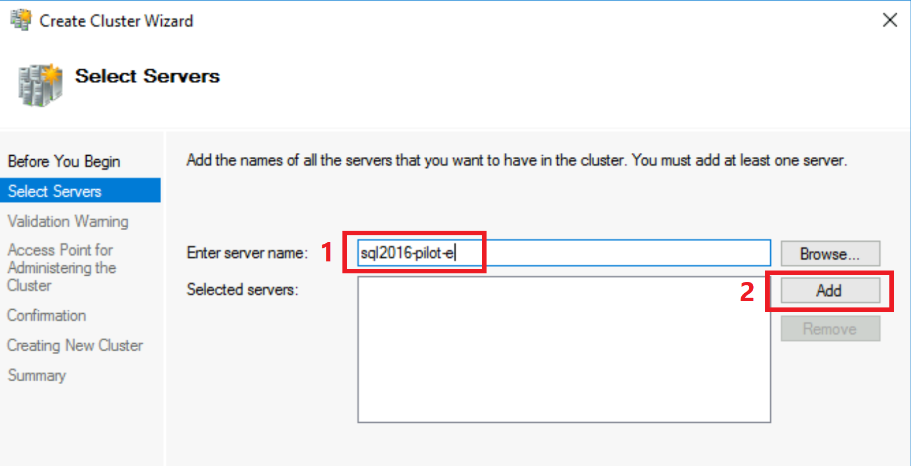
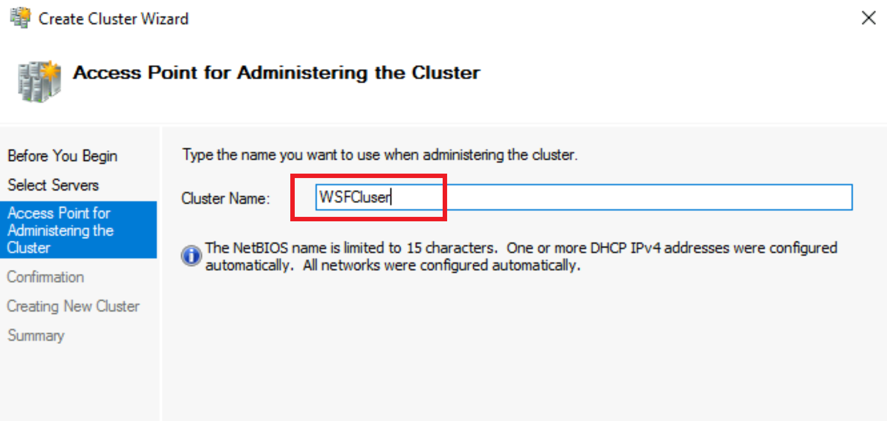
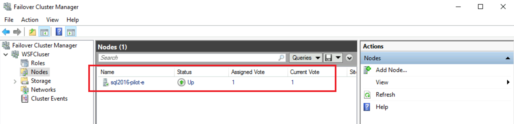
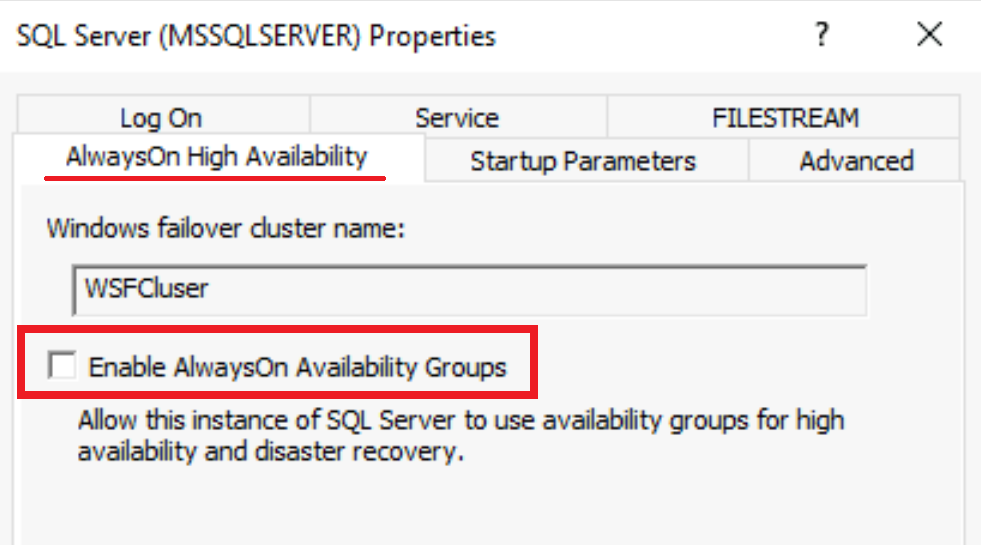

# Prepare your environment for a link with WSFC - Azure SQL Managed Instance
[!INCLUDE[appliesto-sqlmi](../includes/appliesto-sqlmi.md)]

This article teaches you how to enable Always On with Windows Server Failover Cluster (WSFC) on your SQL Server as an additional step to [prepare your environment](managed-instance-link-preparation.md) for Managed Instance link.

Configuration of a single-node Windows Server Failover Cluster (WSFC) is mandatory for SQL Server 2016 only. No multiple node WSFC configuration is required for the link, and it is optional. This step is not required for SQL Servers 2019-2022, and is optional.

## Install WSFC module on Windows Server

- Run the following PowerShell command as Administrator on Windows Server hosting the SQL Server to install Windows Server Failover Cluster module.

```powershell
-- Run as Administrator in PowerShell on Windows Server OS hosting the SQL Server
Install-WindowsFeature -Name Failover-Clustering –IncludeManagementTools
```

Alternatively, you can also use Server Manager to install WSFC module using the graphical interface.

## Configure single-node cluster using Failover Cluster Manager

On the Windows Server hosting the SQL Server, configure a single node cluster using graphical user interface following these steps:

1. Open Failover Cluster Manager by pressing Windows key + R on and typing '%windir%\system32\Cluadmin.msc' 
- Alternatively, Failover Cluster Manager can be accessed by opening Server Manager, selecting Tools in the upper right corner, and then selecting Failover Cluster Manager. 

1. In Windows Cluster manager, click on "Create Cluster"


1. Click Next
1. Enter the current server name (find out by clicking on right button, then properties of This PC, or by typing `hostname` from the command prompt)
1. Click on Add



1. Enter the cluster name, for example `WSFCluser`

1. Open Server Manager
1. Open Tools in the upper right corner of the Server Manager
1. Select Failover Cluster Manager from the menu.



1. Click Next, all the way through until the cluster creation has been started
1. Conclude by clicking on Finish

## Verification

To verify that single-node WSFC cluster has been created, follow these steps:

1. Click on the cluster name on the left hand side
1. Click on Nodes



You should be able to see single node added to this cluster which confirms the configuration has been completed.

Next, verify that Always On option can be enabled on SQL Server by following these steps:

1. Open SQL Server Configuration Manager
1. Double-click on SQL Server
1. Click on AlwaysOn High Availability tab



You should be able to check on the option to Enable AlwaysOn Availability Groups which confirms the configuration has been completed.

## Grant Permissions in SQL Server to work with WSFC

Next, grant permission in SQL Server to `NT Authority \ System` system account to create Availability Groups using WSFC. Execute the following T-SQL script on your SQL Server:

1. Login to your SQL Server, using a client such is SSMS
2. Execute the following T-SQL script

```sql
-- Run on SQL Server
-- Grant permissions to NT Authority \ System to create AG on this SQL Server
GRANT ALTER ANY AVAILABILITY GROUP TO [NT AUTHORITY\SYSTEM]
GO
GRANT CONNECT SQL TO [NT AUTHORITY\SYSTEM]
GO
GRANT VIEW SERVER STATE TO [NT AUTHORITY\SYSTEM]
GO
```

## Next steps

Continue preparing the environment for the link by [enablling Always ON](managed-instance-link-preparation.md#enable-availability-groups) on your SQL Server.
