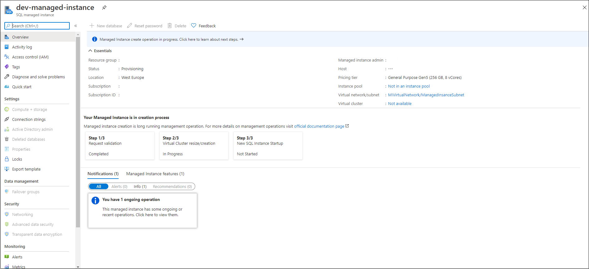
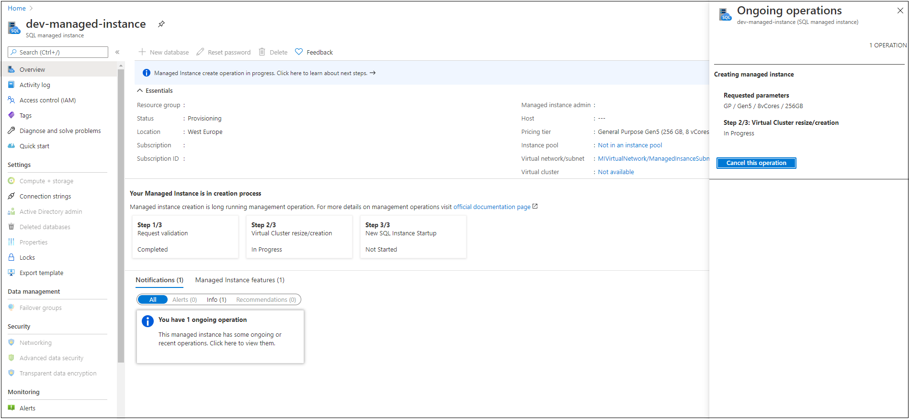

# Monitoring Azure SQL Managed Instance management operations
[!INCLUDE[appliesto-sqlmi](../includes/appliesto-sqlmi.md)]

Azure SQL Managed Instance provides monitoring of [management operations](management-operations-overview.md) that you use to deploy new managed instances, update instance properties, or delete instances when no longer needed. 

## Overview

All instance management operations can be categorized as follows:

- Create
- Update (changing instance properties, such as vCores or reserved storage).
- Delete

For a detailed description of the steps and estimated duration of each management operation, review [Management operations duration](management-operations-duration.md). Operations that require [seeding](management-operations-overview.md#seeding) data can extend the duration of an operation. 

There are several ways to monitor managed instance management operations:

- [Resource group deployments](/azure/azure-resource-manager/templates/deployment-history)
- [Activity log](/azure/azure-monitor/essentials/activity-log)
- [Managed instance operations API](#sql-managed-instance-operations-api)


The following table compares management operation monitoring options: 

| Option | Retention | Supports cancel | Create | Update | Delete | Cancel | Steps |
| --- | --- | --- | --- | --- | --- | --- | --- |
| Resource group deployments | Infinite<sup>1</sup> | No<sup>2</sup> | Visible | Visible | Not visible | Visible | Not visible |
| Activity log | 90 days | No | Visible | Visible | Visible | Visible |  Not visible |
| Managed instance operations API | 24 hours | [Yes](management-operations-cancel.md) | Visible | Visible | Visible | Visible | Visible |


<sup>1</sup> The deployment history for a resource group is limited to 800 deployments.

<sup>2</sup> Resource group deployments support cancel operations. However, due to cancel logic, only an operation scheduled for deployment after the initiated cancel action is canceled. Ongoing deployment isn't canceled when the resource group deployment is canceled. Since SQL managed instance deployment consists of one long running step (from the perspective  of Azure Resource Manager), canceling resource group deployment doesn't cancel SQL managed instance deployment and the operation still completes. 

## SQL Managed Instance operations API

Management operations APIs are specially designed to monitor operations. Monitoring SQL managed instance operations can provide insights on operation parameters and operation steps, and [cancel specific operations](management-operations-cancel.md). Besides operation details and cancel command, this API can be used in automation scripts with multi-resource deployments - based on the progress step, you can kick off some dependent resource deployment.

These are the APIs: 

| Command | Description |
| --- | --- |
|[Managed Instance Operations - Get](/rest/api/sql/managed-instance-operations/get)|Gets a management operation on a SQL managed instance.|
|[Managed Instance Operations - Cancel](/rest/api/sql/managed-instance-operations/cancel)|Cancels the asynchronous operation on the SQL managed instance.|
|[Managed Instance Operations - List By Managed Instance](/rest/api/sql/managed-instance-operations/list-by-managed-instance)|Gets a list of operations performed on the SQL managed instance.|

## Monitor operations

# [Portal](#tab/azure-portal)

In the Azure portal, use the SQL managed instance **Overview** page to monitor SQL managed instance operations. 

For example, the **Create operation** is visible at the start of the creation process on the **Overview** page: 



Select **Ongoing operation** to open the **Ongoing operation** page and view **Create** or **Update** operations. You can also [Cancel](management-operations-cancel.md) operations from this page as well.  



> [!NOTE]
> Create operations submitted through Azure portal, PowerShell, Azure CLI, or other tooling using REST API version 2020-02-02 [can be canceled](management-operations-cancel.md). REST API versions older than 2020-02-02 used to submit a create operation will start the instance deployment, but the deployment won't be listed in the Operations API and can't be canceled.

# [PowerShell](#tab/azure-powershell)

The Get-AzSqlInstanceOperation cmdlet gets information about the operations on a SQL managed instance. You can view all operations on a SQL managed instance or view a specific operation by providing the operation name.

```powershell-interactive
$managedInstance = "yourInstanceName"
$resourceGroup = "yourResourceGroupName"

$managementOperations = Get-AzSqlInstanceOperation `
    -ManagedInstanceName $managedInstance  -ResourceGroupName $resourceGroup
```

For detailed commands explanation, see [Get-AzSqlInstanceOperation](/powershell/module/az.sql/get-azsqlinstanceoperation).

# [Azure CLI](#tab/azure-cli)

The az sql mi op list gets a list of operations performed on the SQL managed instance. If you don't already have the Azure CLI installed, see [Install the Azure CLI](/cli/azure/install-azure-cli).

```azurecli-interactive
az sql mi op list -g yourResourceGroupName --mi yourInstanceName 
```

For detailed commands explanation, see [az sql mi op](/cli/azure/sql/mi/op).

---

## Related content

- [Quickstart guide](instance-create-quickstart.md)
- [Common SQL features](../database/features-comparison.md).
- [SQL Managed Instance virtual network configuration](connectivity-architecture-overview.md).
- [Create a managed instance](instance-create-quickstart.md).
- [SQL Managed Instance migration using Database Migration Service](/azure/dms/tutorial-sql-server-to-managed-instance).
