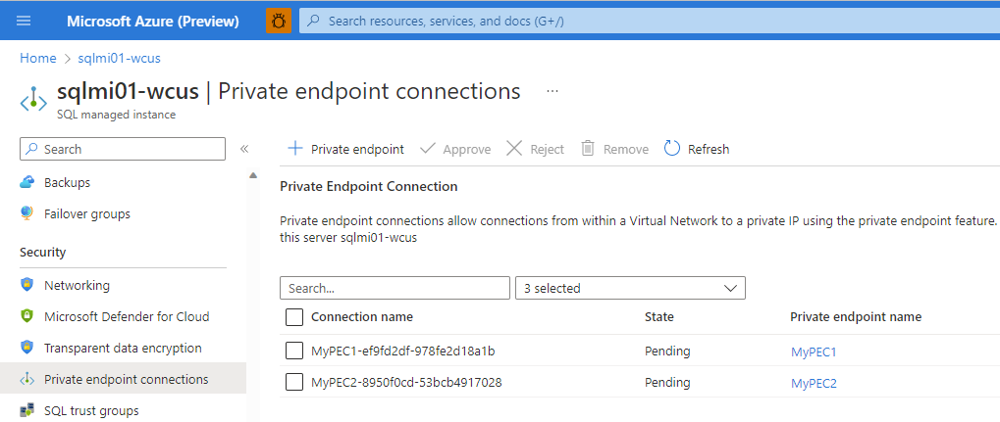
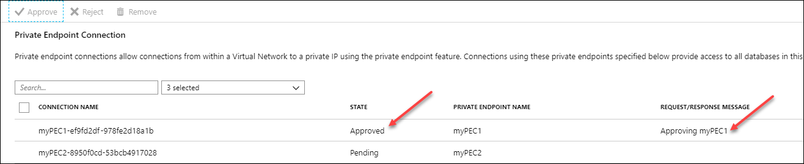
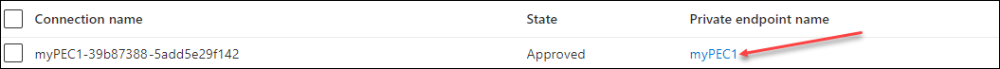
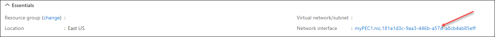
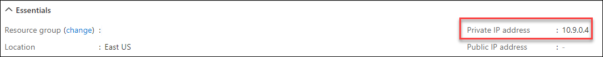

# Azure Private Link for Azure SQL Managed Instance
[!INCLUDE[appliesto-sqlmi](../includes/appliesto-sqlmi.md)]

This article provides an overview of the private endpoint for Azure SQL Managed Instance, as well as steps to configuring it. Private endpoints establish secure, isolated connectivity between a service and multiple virtual networks without exposing your service's entire network infrastructure.

## Overview

[Private Link](/azure/private-link/private-link-overview) is Azure technology that makes Azure SQL Managed Instance available in a virtual network of your choice. A network administrator can establish a [private endpoint](/azure/private-link/private-endpoint-overview) to Azure SQL Managed Instance in their virtual network, while the SQL administrator chooses to accept or reject the endpoint before it becomes active. Private endpoints establish secure, isolated connectivity between a service and multiple virtual networks without exposing your service's entire network infrastructure.

### How private endpoints differ from VNet-local endpoints

The default VNet-local endpoint deployed with each Azure SQL Managed Instance behaves as if a computer running the service were physically attached to your virtual network. It allows near-complete traffic control via route tables, network security groups, DNS resolution, firewalls, and similar mechanisms. You can also use this endpoint to involve your instance in scenarios requiring connectivity on ports other than 1433, such as failover groups, distributed transactions, and Managed Instance Link. Although the VNet-local endpoint provides flexibility, it adds complexity when configuring for specific scenarios, especially those involving multiple virtual networks or tenants. 

By contrast, setting up a private endpoint is like extending a physical network cable from a computer running Azure SQL Managed Instance to another virtual network. This connectivity path is established virtually via the Azure Private Link technology. It only allows connections in one direction: from the private endpoint to Azure SQL Managed Instance; and it only carries traffic on port 1433 (the standard TDS traffic port). In this way, your Azure SQL Managed Instance becomes available to a different virtual network without having to set up network peering or turn on the instance's public endpoint. Even if you move the instance to another subnet, any established private endpoints will continue to point to it.

For a more detailed discussion of the different types of endpoints supported by Azure SQL Managed Instance, see [Communication overview](connectivity-architecture-overview.md#communication-overview).

## When to use private endpoints

Private endpoints to Azure SQL Managed Instance are more secure than using [VNet-local endpoint](connectivity-architecture-overview.md#vnet-local-endpoint) or [public endpoint](connectivity-architecture-overview.md#public-endpoint) and simplify implementation of important connectivity scenarios. These scenarios include:

- **Airlock**. Private endpoints to Azure SQL Managed Instance are deployed in a virtual network with jump servers and an ExpressRoute gateway, providing security and isolation between on-premises and cloud resources.
- **Hub and spoke topology**. Private endpoints in spoke virtual networks conduct traffic from SQL clients and applications to Azure SQL Managed Instances in a hub virtual network, establishing clear network isolation and separation of responsibility.
- **Publisher-consumer**. Publisher tenant (for example, an ISV) manages multiple SQL managed instances in their virtual networks. Publisher creates private endpoints in other tenants' virtual networks to make instances available to their consumers.
- **Integration of Azure PaaS and SaaS services.** Some PaaS and SaaS services, like [Azure Data Factory](/azure/data-factory/introduction), can create and manage private endpoints to Azure SQL Managed Instance.

The benefits of using private endpoints over a VNet-local or public endpoint include:

- IP address predictability: a private endpoint to Azure SQL Managed Instance is assigned a fixed IP address from its subnet's address range. This IP address remains static even if the IP addresses of VNet-local and public endpoints change.
- Granular network access: a private endpoint is only visible inside its virtual network.
- Strong network isolation: In a peering scenario, peered virtual networks establish two-way connectivity, while private endpoints are unidirectional and don't expose network resources inside their network to Azure SQL Managed Instance.
- Avoiding address overlap: peering multiple virtual networks requires careful IP space allocation and can pose a problem when address spaces overlap.
- Conserving IP address real estate: a private endpoint only consumes one IP address from its subnet's address space.

## Limitations

- Azure SQL Managed Instance requires the exact instance _hostname_ to appear in the connection string sent by the SQL client. Using the IP address of the private endpoint is not supported and will fail. To resolve this, configure your DNS server, or use a private DNS zone as described in [Set up domain name resolution for private endpoint](#set-up-domain-name-resolution-for-private-endpoint).
- Automatic registration of DNS names is not yet supported. Follow the steps in [Set up domain name resolution for private endpoint](#set-up-domain-name-resolution-for-private-endpoint) instead.
- Private endpoints to SQL Managed Instance can only be used to connect to port 1433, the standard TDS port for SQL traffic. More complex connectivity scenarios requiring communication on other ports must be established via the instance's VNet-local endpoint.
- Private endpoints to Azure SQL Managed Instance require a special setup to configure the required DNS resolution, as described in [Set up domain name resolution for private endpoint](#set-up-domain-name-resolution-for-private-endpoint).
- Private endpoints always operate with the [proxy connection type](connection-types-overview.md#connection-types). 

## Create a private endpoint in a virtual network

Create a private endpoint by using the Azure portal, Azure PowerShell, or the Azure CLI:

- [Azure portal](/azure/private-link/create-private-endpoint-portal)
- [Azure PowerShell](/azure/private-link/create-private-endpoint-powershell)
- [Azure CLI](/azure/private-link/create-private-endpoint-cli)

After you create a private endpoint, you may also need to approve its creation within the target virtual network; see [Review and approve a request to create a private endpoint](#review-and-approve-a-request-to-create-a-private-endpoint).

To make the private endpoint to SQL Managed Instance fully functional, follow the instructions to [set up domain name resolution for the private endpoint](#set-up-domain-name-resolution-for-private-endpoint).

## Create a private endpoint in a PaaS or SaaS service

Some Azure PaaS and SaaS services can use private endpoints to access your data from inside their environments. The procedure to set up a private endpoint in such a service (sometimes called "managed private endpoint" or "private endpoint in a managed virtual network") varies between services. An administrator still needs to review and approve the request on Azure SQL Managed Instance, as described in [Review and approve a request to create a private endpoint](#review-and-approve-a-request-to-create-a-private-endpoint).

> [!NOTE]
> Azure SQL Managed Instance requires the connection string from the SQL client to bear the name of the instance as the domain name's first segment (for example: `<instance-name>.<dns-zone>.database.windows.net`). PaaS and SaaS services that attempt to connect to Azure SQL Managed Instance's private endpoint via its IP address will not be able to connect.

## Create a cross-tenant private endpoint

Private endpoints to Azure SQL Managed Instance can also be created in different Azure tenants. To do this, the administrator of the virtual network in which the private endpoint should appear must first obtain the full resource ID of the Azure SQL Managed Instance from which they are about to request a private endpoint. With this information, a new private endpoint can be created in Private Link Center. As before, the administrator of the Azure SQL Managed Instance will receive a request that they can review and approve or reject, as per [Review and approve a request to create a private endpoint](#review-and-approve-a-request-to-create-a-private-endpoint).

## Review and approve a request to create a private endpoint

Once a request to create a private endpoint is made, the SQL administrator can manage the private endpoint connection to Azure SQL Managed Instance. The first step to managing a new private endpoint connection is to review and approve the private endpoint. This step is automatic if the user or service creating the private endpoint has sufficient Azure RBAC permissions on the Azure SQL Managed Instance resource. If the user does not have sufficient permissions, then the review and approval of the private endpoint must be done manually. 

To approve a private endpoint, follow these steps: 

1. Go to your Azure SQL Managed Instance in the [Azure portal](https://portal.azure.com).
1. Under **Security**, choose **Private endpoint connections**.

   

1. Review the connections that have a **Pending state** and check the box to choose one or more private endpoint connections to approve or reject.

   

1. Choose **Approve** or **Reject**, and then select **Yes** on the dialog box verifying your action. 

   

1. After you approve or reject a connection, the **Private Endpoint Connection** list reflects the state of current private endpoint connection(s), as well as the **Request/Response** message. 

   

## Set up domain name resolution for private endpoint

After you create a private endpoint to Azure SQL Managed Instance, you'll need to configure domain name resolution, as, otherwise, login attempts will fail. The method below works for virtual networks that use Azure DNS resolution. If your virtual network is configured to use a custom DNS server, adjust the steps accordingly.

To set up domain name resolution for a private endpoint to an instance whose VNet-local endpoint's domain name is `<instance-name>.<dns-zone>.database.windows.net`, follow one of the two procedures below depending on whether the instance and its private endpoint are in the same virtual network or in different virtual networks.

> [!IMPORTANT]
> Do not change how Azure SQL Managed Instance's VNet-local endpoint domain name resolves within its own virtual network. Doing so disrupts the instance's ability to perform management operations.

### [Different virtual networks](#tab/separate-vnets)

Follow these steps if the private endpoint and Azure SQL Managed Instance are in different virtual networks.

After you complete these steps, SQL clients connecting to `<instance-name>.<dns-zone>.database.windows.net` from inside the endpoint's virtual network will be transparently routed through the private endpoint.

1. Obtain the IP address of the private endpoint either by visiting Private Link Center or by performing the following steps:

    1. Go to your Azure SQL Managed Instance in the [Azure portal](https://portal.azure.com).
    2. Under **Security**, choose **Private endpoint connections**.
    3. Locate the private endpoint connection in the table and choose the **Private endpoint name** for your chosen connection.
    
       
    
    4. On the ***Overview** page, select the network interface.
    
       
    
    5. On the **Overview** page, check **Essentials** to identify and copy the **Private IP address**.
    
       

2. [Create a private Azure DNS zone](/azure/dns/private-dns-getstarted-portal#create-a-private-dns-zone) named `privatelink.<dns-zone>.database.windows.net`.
3. [Link the private DNS zone to the endpoint virtual network](/azure/dns/private-dns-getstarted-portal#link-the-virtual-network).
4. In the DNS zone, create a new record set with the following values:
   - Name: `<instance-name>`
   - Type: A
   - IP address: IP address of the private endpoint obtained in the previous set.

### [Same virtual networks](#tab/same-vnet)

Follow these steps if the private endpoint and Azure SQL Managed Instance are in the same virtual network.

After you complete these steps, SQL clients inside the endpoint virtual network whose connection string includes `Encrypt=false` and `TrustServerCertificate=true` can connect to the private endpoint at, for example, `<instance-name>.privatelink.site`. As before, clients can still connect to the VNet-local endpoint at `<instance-name>.<dns-zone>.database.windows.net`.

> [!NOTE]
> When the private endpoint and Azure SQL Managed Instance are in the same virtual network, you don't have the ability to establish trusted encrypted connections nor to transparently re-route SQL clients to the private endpoint.

1. Obtain the IP address of the private endpoint either by visiting Private Link Center or by performing the following steps:

    1. Go to your Azure SQL Managed Instance in Azure portal.
    2. Under **Security**, choose **Private endpoint connections**.
    3. Locate the private endpoint connection in the table and choose the **Private endpoint name** for your chosen connection.
    
    
    
    4. On the ***Overview** page, select the network interface.
    
    
    
    5. On the **Overview** page, check **Essentials** to identify and copy the **Private IP address**.
    
    

2. [Create a private Azure DNS zone](/azure/dns/private-dns-getstarted-portal#create-a-private-dns-zone) named **_anything other than_** `privatelink.<dns-zone>.database.windows.net`; for example: `privatelink.site`.

    > [!WARNING]
    > Naming the private DNS zone `privatelink.<dns-zone>.database.windows.net` disrupts the instance's internal connectivity and causes management operations to fail.

3. [Link the private DNS zone to the endpoint virtual network](/azure/dns/private-dns-getstarted-portal#link-the-virtual-network).
4. In the DNS zone, create a new record set with the following values:
   - Name: `<instance-name>`
   - Type: A
   - IP address: IP address of the private endpoint obtained in the previous steps.

---

## Next steps

- Learn about the [Connectivity architecture of Azure SQL Managed Instance](connectivity-architecture-overview.md).
- Read more about [Azure Private Link](/azure/private-link/private-link-overview) and [private endpoints](/azure/private-link/private-endpoint-overview).
- See the list of Azure PaaS services compatible with Private Link at [Azure Private Link availability](/azure/private-link/availability)
