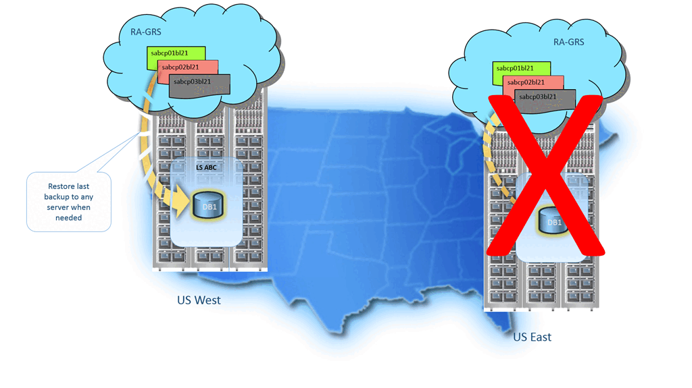

# Recover using automated database backups - Azure SQL Managed Instance
[!INCLUDE[appliesto-sqlmi](../includes/appliesto-sqldb-sqlmi.md)]

<!---
The content in this article is also duplicated in /azure-sql/database/recovery-using-backups.md. Any relevant changes made to this article should be made in the other article as well. 
--->

> [!div class="op_single_selector"]
> * [Azure SQL Database](../database/recovery-using-backups.md)
> * [Azure SQL Managed Instance](recovery-using-backups.md)

This article provides steps to recover a database from a backup in Azure SQL Managed Instance. For Azure SQL Database, see [recovery using backup](../database/recovery-using-backups.md). 

Automatic backups protect your databases from user and application errors, accidental database deletion, and prolonged outages. This built-in capability is available for all service tiers and compute sizes. The following options are available for database recovery by using [automated database backups](automated-backups-overview.md). You can:

- Create a new database on the same managed instance, recovered to a specified point in time within the retention period.
- Create a database on the same managed instance, recovered to the deletion time for a deleted database.
- Create a new database on any managed instance in the same region, recovered to the point of the most recent backups.

Cross-region and cross-subscription point-in-time restore for SQL Managed Instance isn't currently supported. 

If you configured [backup long-term retention](../database/long-term-retention-overview.md), you can also create a new database from any long-term retention backup on any server.

> [!IMPORTANT]
> You can't overwrite an existing database during restore.

When you're using the General Purpose or Business Critical service tier, your database restore might incur an extra storage cost. The extra cost is incurred when the maximum size of the restored database is greater than the amount of storage included with the target database's service tier and performance level. For pricing details of extra storage, see the [SQL Database pricing page](https://azure.microsoft.com/pricing/details/sql-managed-instance/). If the actual amount of used space is less than the amount of storage included, you can avoid this extra cost by setting the maximum database size to the included amount.

## Recovery time

The recovery time to restore a database by using automated database backups is affected by several factors:

- The size of the database.
- The compute size of the database.
- The number of transaction logs involved.
- The amount of activity that needs to be replayed to recover to the restore point.
- The network bandwidth if the restore is to a different region.
- The number of concurrent restore requests being processed in the target region.

For a large or very active database, the restore might take several hours. If there is a prolonged outage in a region, it's possible that a high number of geo-restore requests will be initiated for disaster recovery. When there are many requests, the recovery time for individual databases can increase. Most database restores finish in less than 12 hours.

For a single subscription, there are limitations on the number of concurrent restore requests. These limitations apply to any combination of point-in-time restores, geo-restores, and restores from long-term retention backup: 
- **Max # of concurrent requests being processed**: ??
- **Max # of concurrent requests being submitted**: ??

> [!TIP]
> For Azure SQL Managed Instance, system updates will take precedence over database restores in progress. If there a system update for SQL Managed Instance, all pending restores will be suspended and resumed once the update has been applied. This system behavior might prolong the time of restores and might be especially impactful to long-running restores. To achieve a predictable time of database restores, consider configuring [maintenance windows](../database/maintenance-window.md) that allow scheduling of system updates at a specific day/time, and consider running database restores outside of the scheduled maintenance window day/time.

## Permissions 

To recover by using automated backups, you must be a member of the SQL Server Contributor role or SQL Managed Instance Contributor role (depending on the recovery destination) in the subscription, or you must be the subscription owner. For more information, see [Azure RBAC: Built-in roles](/azure/role-based-access-control/built-in-roles). You can recover by using the Azure portal, PowerShell, or the REST API. You can't use Transact-SQL.

## Point-in-time restore

You can restore a database to an earlier point in time.  The request can specify any service tier or compute size for the restored database. Ensure that you have sufficient resources on the instance to which you are restoring the database. 

When complete, the restore creates a new database on the same instance as the original database. The restored database is charged at normal rates, based on its service tier and compute size. You don't incur charges until the database restore is complete.

You generally restore a database to an earlier point for recovery purposes. You can treat the restored database as a replacement for the original database or use it as a data source to update the original database.

- **Database replacement**

  If you intend the restored database to be a replacement for the original database, you should specify the original database's compute size and service tier. You can then rename the original database and give the restored database the original name by using the [ALTER DATABASE](/sql/t-sql/statements/alter-database-azure-sql-database) command in T-SQL.

- **Data recovery**

  If you plan to retrieve data from the restored database to recover from a user or application error, you need to write and execute a data recovery script that extracts data from the restored database and applies to the original database. Although the restore operation may take a long time to complete, the restoring database is visible in the database list throughout the restore process. If you delete the database during the restore, the restore operation will be canceled and you will not be charged for the database that did not complete the restore.
  
### [Azure portal](#tab/azure-portal)

To recover a database in SQL Managed Instance to a point in time by using the Azure portal, open the database overview page, and select **Restore** on the toolbar. Choose the point-in-time backup point from which a new database will be created.

  

### [Azure CLI](#tab/azure-cli)

To restore a database in SQL Managed Instance by using the Azure CLI, see [az sql midb restore](/cli/azure/sql/midb#az-sql-midb-restore).

### [PowerShell](#tab/powershell)

[!INCLUDE [updated-for-az](../includes/updated-for-az.md)]
> [!IMPORTANT]
> The PowerShell Azure Resource Manager module is still supported by SQL Database and SQL Managed Instance, but all future development is for the Az.Sql module. For these cmdlets, see [AzureRM.Sql](/powershell/module/AzureRM.Sql/). Arguments for the commands in the Az module and in Azure Resource Manager modules are to a great extent identical.

> [!NOTE]
> Restore points represent a period between the earliest restore point and the latest log backup point. Information on latest restore point is currently unavailable on Azure PowerShell.

To restore a database in SQL Managed Instance, see [Restore-AzSqlInstanceDatabase](/powershell/module/az.sql/restore-azsqlinstancedatabase).

  | Cmdlet | Description |
  | --- | --- |
  | [Get-AzSqlInstance](/powershell/module/az.sql/get-azsqlinstance) |Gets one or more managed instances. |
  | [Get-AzSqlInstanceDatabase](/powershell/module/az.sql/get-azsqlinstancedatabase) | Gets an instance database. |
  | [Restore-AzSqlInstanceDatabase](/powershell/module/az.sql/restore-azsqlinstancedatabase) |Restores an instance database. |

---

## Deleted database restore

You can restore a deleted database to the deletion time, or an earlier point in time, on the same managed instance. You restore a deleted database by creating a new database from the backup.

> [!IMPORTANT]
> If you delete a managed instance, all its databases are also deleted and can't be recovered. You can't restore a deleted  managed instance.

### [Azure portal](#tab/azure-portal)

To recover a managed database by using the Azure portal, open the managed instance overview page, and select **Deleted databases**. Select a deleted database that you want to restore, and type the name for the new database that will be created with data restored from the backup.

  

> [!TIP]
> It may take several minutes for recently deleted databases to appear on the **Deleted databases** page in Azure portal, or when displaying deleted databases using the command line. 

### [Azure CLI](#tab/azure-cli)

To restore a database in SQL Managed Instance by using the Azure CLI, see [az sql midb restore](/cli/azure/sql/midb#az-sql-midb-restore).

### [PowerShell](#tab/powershell)

For a sample PowerShell script showing how to restore a deleted instance database, see [Restore deleted instance database using PowerShell](point-in-time-restore.md#restore-a-deleted-database)

---

## Geo-restore

> [!IMPORTANT]
> - Geo-restore is available only for managed instances configured with geo-redundant [backup storage](automated-backups-overview.md#backup-storage-redundancy). If you are not currently using geo-replicated backups for a database, you can change this by [configuring backup storage redundancy](automated-backups-change-settings.md#configure-backup-storage-redundancy).
> - Geo-restore can be performed on managed instances residing in the same subscription only.

You can restore a database on any managed instance in any Azure region from the most recent geo-replicated backups. Geo-restore uses a geo-replicated backup as its source. You can request geo-restore even if the database or datacenter is inaccessible due to an outage.

Geo-restore is the default recovery option when your database is unavailable because of an incident in the hosting region. You can restore the database to a server in any other region. There is a delay between when a backup is taken and when it is geo-replicated to an Azure blob in a different region. As a result, the restored database can be up to one hour behind the original database. The following illustration shows a database restore from the last available backup in another region.

### [Azure portal](#tab/azure-portal)

From the Azure portal, you create a new managed instance and select an available geo-restore backup. The newly created database contains the geo-restored backup data.

To geo-restore a database from the Azure portal to an existing managed instance in a region of your choice, select a managed instance on which you want a database to be restored. Follow these steps:

1. Select **New database**.
2. Type a desired database name.
3. Under **Use existing data**, select **Backup**.
4. Select a backup from the list of available geo-restore backups.

    

Complete the process of creating a new database. When you create the instance database, it contains the restored geo-restore backup.

### [Azure CLI](#tab/azure-cli)

To restore a database in SQL Managed Instance by using the Azure CLI, see [az sql midb restore](/cli/azure/sql/midb#az-sql-midb-restore).

### [PowerShell](#tab/powershell)

For a PowerShell script that shows how to perform geo-restore for a database in SQL Managed Instance, see [Use PowerShell to restore a database to another geo-region](scripts/restore-geo-backup.md).

---

### Geo-restore considerations

You can't perform a point-in-time restore on a geo-secondary database. You can do so only on a primary database. For detailed information about using geo-restore to recover from an outage, see [Recover from an outage](../database/disaster-recovery-guidance.md#recover-using-geo-restore).

> [!IMPORTANT]
> Geo-restore is the most basic disaster-recovery solution available in SQL Managed Instance. It relies on automatically created geo-replicated backups with a recovery point objective (RPO) up to 1 hour and an estimated recovery time of up to 12 hours. It doesn't guarantee that the target region will have the capacity to restore your databases after a regional outage, because a sharp increase of demand is likely. If your application uses relatively small databases and is not critical to the business, geo-restore is an appropriate disaster-recovery solution. 
>
> For business-critical applications that require large databases and must ensure business continuity, use [Auto-failover groups](auto-failover-group-sql-mi.md). It offers a much lower RPO and recovery time objective, and the capacity is always guaranteed. 
>
> For more information about business continuity choices, see [Overview of business continuity](../database/business-continuity-high-availability-disaster-recover-hadr-overview.md).

## Next steps

- [Business continuity overview](../database/business-continuity-high-availability-disaster-recover-hadr-overview.md)
- [SQL Managed Instance automated backups](automated-backups-overview.md)
- [Long-term retention](../database/long-term-retention-overview.md)
- To learn about faster recovery options, see [Auto-failover groups](auto-failover-group-sql-mi.md).
