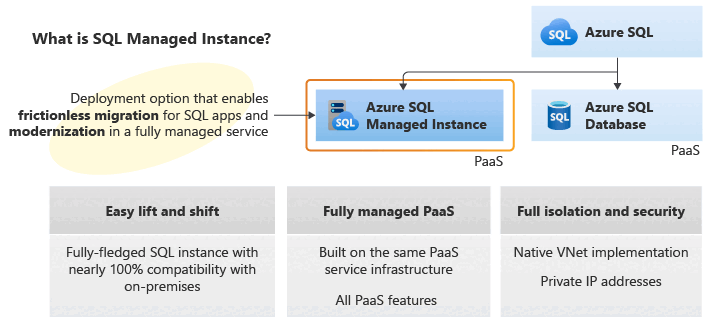
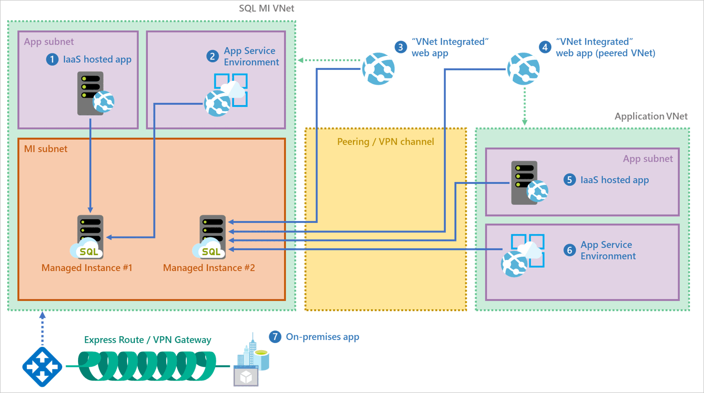

# What is Azure SQL Managed Instance?

[!INCLUDE[appliesto-sqlmi](../includes/appliesto-sqlmi.md)]

This article provides an overview of Azure SQL Managed Instance, a fully managed platform as a service (PaaS) database engine that handles most database management functions such as upgrading, patching, backups, and monitoring without user involvement.

[!INCLUDE [azure-sql-managed-instance-free-offer-note](../includes/azure-sql-managed-instance-free-offer-note.md)]

Azure SQL Managed Instance is a scalable cloud database service that's always running on the latest stable version of the [Microsoft SQL Server database engine](/sql/sql-server/sql-server-technical-documentation) and a  patched OS with [99.99% built-in high availability](https://azure.microsoft.com/support/legal/sla/azure-sql-database), offering close to 100% feature compatibility with SQL Server. PaaS capabilities built into Azure SQL Managed enable you to focus on domain-specific database administration and optimization activities that are critical for your business while Microsoft handles backups, as well as patching and updating of the SQL and operating system code, which removes the burden on managing the underlying infrastructure.

If you're new to Azure SQL Managed Instance, check out the *Azure SQL Managed Instance* video from our in-depth [Azure SQL video series](/shows/Azure-SQL-for-Beginners/?WT.mc_id=azuresql4beg_azuresql-ch9-niner):
> [!VIDEO https://learn.microsoft.com/shows/Azure-SQL-for-Beginners/Azure-SQL-Managed-Instance-Overview-6-of-61/player]

[!INCLUDE [entra-id](../includes/entra-id.md)]

## Overview

Azure SQL Managed Instance is a PaaS service that has near 100% compatibility with the latest Enterprise Edition SQL Server database engine, providing a native [virtual network (VNet)](/azure/virtual-network/virtual-networks-overview) implementation that addresses common security concerns, and a [business model](https://azure.microsoft.com/pricing/details/sql-database/) favorable to existing SQL Server customers. SQL Managed Instance allows existing SQL Server customers to lift and shift their on-premises applications to the cloud with minimal application and database changes. At the same time, SQL Managed Instance provides all PaaS capabilities (automatic patching and version updates, [automated backups](automated-backups-overview.md), [high availability](high-availability-sla-local-zone-redundancy.md)) to drastically reduce management overhead and the total cost of ownership (TCO).

SQL Managed Instance is designed for customers looking to migrate a large number of apps from an on-premises or IaaS, self-built, or ISV provided environment to a fully managed PaaS cloud environment, with as low a migration effort as possible. Using the fully automated [Azure Data Migration Service](/azure/dms/tutorial-sql-server-to-managed-instance#create-an-azure-database-migration-service-instance), or the [Managed Instance link](managed-instance-link-feature-overview.md), customers can lift and shift their existing SQL Server database or SQL Server instance to Azure SQL Managed Instance, which offers compatibility with SQL Server and complete isolation of customer instances with native VNet support. 

With Software Assurance, you can exchange your existing licenses for discounted rates on SQL Managed Instance using the [Azure Hybrid Benefit for SQL Server](https://azure.microsoft.com/pricing/hybrid-benefit/). SQL Managed Instance is the best migration destination in the cloud for SQL Server instances that require high security and a rich programmability surface.

For more information on migration options and tools, see [Migration overview: SQL Server to Azure SQL Managed Instance](../migration-guides/managed-instance/sql-server-to-managed-instance-overview.md).

The following diagram outlines key benefits of SQL Managed Instance:

> [!IMPORTANT]
> For a list of regions where SQL Managed Instance is currently available, see [Supported regions](resource-limits.md#supported-regions).

## Key features and capabilities

SQL Managed Instance runs with all of the features of the most recent version of SQL Server, including online operations, automatic plan corrections, and other enterprise performance enhancements. A comparison of the features available is explained in [Feature comparison: Azure SQL Managed Instance versus SQL Server](../database/features-comparison.md).

SQL Managed Instance combines the best features that are available both in Azure SQL Database and the SQL Server database engine: 

| **PaaS benefits** | **Business continuity** |
| --- | --- |
|No purchasing or managing hardware  No management overhead to manage underlying infrastructure  Quick provisioning and service scaling   Automated patching and version upgrade   You can [stop and start](instance-stop-start-how-to.md) the instance to save on costs  Integration with other PaaS data services |99.99% uptime SLA   Built-in [high availability](high-availability-sla-local-zone-redundancy.md)   [SQL Server disaster recovery to SQL Managed Instance](managed-instance-link-feature-overview.md)   Data protected with [automated backups](automated-backups-overview.md)  Customer configurable backup retention period  User-initiated [backups](/sql/t-sql/statements/backup-transact-sql?preserve-view=true&view=azuresqldb-mi-current) that can be [restored to SQL Server 2022](restore-database-to-sql-server.md)  [Point-in-time database restore](../database/recovery-using-backups.md#point-in-time-restore) capability |
|**Security and compliance** | **Management**|
|Isolated environment ([VNet integration](connectivity-architecture-overview.md), single tenant service, dedicated compute and storage)   Adheres to the same compliance standards as Azure SQL Database  [Transparent data encryption (TDE)](/sql/relational-databases/security/encryption/transparent-data-encryption-azure-sql) [Microsoft Entra authentication](../database/authentication-aad-overview.md), single sign-on support   [Microsoft Entra server principals (logins)](/sql/t-sql/statements/create-login-transact-sql?view=azuresqldb-mi-current&preserve-view=true)  [Windows authentication for Microsoft Entra principals](winauth-azuread-overview.md)   [SQL auditing](auditing-configure.md)  [Advanced Threat Protection](threat-detection-configure.md) |Azure Resource Manager API for automating service provisioning and scaling  Azure portal functionality for manual service provisioning and scaling  Data Migration Service

> [!IMPORTANT]
> Azure SQL Managed Instance has been certified against a number of compliance standards. For more information, see the [Microsoft Azure Compliance Offerings](https://servicetrust.microsoft.com/ViewPage/MSComplianceGuideV3?command=Download&downloadType=Document&downloadId=44bbae63-bf4d-4e3b-9d3d-c96fb25ec363&tab=7027ead0-3d6b-11e9-b9e1-290b1eb4cdeb&docTab=7027ead0-3d6b-11e9-b9e1-290b1eb4cdeb_FAQ_and_White_Papers), where you can find the most current list of SQL Managed Instance compliance certifications, listed under **SQL Database**.

The following table shows key details of SQL Managed Instance: 

|Feature | Description|
|---|---|
| Azure portal management | Yes|
| SQL Server version/build | The latest stable SQL Server database engine1 |
| Managed automated backups | Yes |
| Automatic software patching | Yes |
| The latest database engine features | Yes |
| Built-in instance and database monitoring and metrics | Yes |
| SQL Server agent jobs | Yes | 
| Number of data files (ROWS) per the database | Multiple |
| Number of log files (LOG) per database | 1 |
| VNet - Azure Resource Manager deployment | Yes |
| VNet - Classic deployment model | No |

1 Based on the [**Always-up-to-date** update policy](update-policy.md#always-up-to-date-update-policy). Instances configured with the **SQL Server 2022** update policy have updates from the latest stable SQL Server 2022 database engine. 

## Supported SQL features

SQL Managed Instance aims to deliver close to 100% surface area compatibility with the latest SQL Server version through a staged release plan, which means that most features of SQL Server are also compatible with Azure SQL Managed Instance.  

SQL Managed Instance supports backward compatibility to SQL Server 2008 databases. Direct migration from SQL Server 2005 is supported, and the compatibility level for migrated SQL Server 2005 databases is updated to SQL Server 2008.
  
The following briefly lists SQL Server features that are compatible with Azure SQL Managed Instance: 

:::row:::
    :::column:::
    **Data migration**
    - [Native backup and restore](restore-sample-database-quickstart.md)
    - Configurable database file layout
    - Migrations at scale with [DMS](/azure/dms/tutorial-sql-server-managed-instance-online-ads)
    - [Migrate with Managed Instance link](managed-instance-link-feature-overview.md)
    :::column-end:::
    :::column:::
    **Operational**
    - [DMVs](monitoring-with-dmvs.md) and [Extended events](/sql/relational-databases/extended-events/extended-events)
    - [Query store](/sql/relational-databases/performance/monitoring-performance-by-using-the-query-store)
    - [SQL Server Agent](/sql/ssms/agent/sql-server-agent)
    - [Database mail (external SMTP)](/sql/relational-databases/database-mail/database-mail)
    :::column-end:::
    :::column:::
    **Scenario enablers**
    - [Service Broker](/sql/database-engine/configure-windows/sql-server-service-broker)
    - [Transactional Replication](replication-transactional-overview.md)
    - [Change Data Capture](/sql/relational-databases/track-changes/about-change-data-capture-sql-server)
    - [Disaster recovery with Managed Instance link](managed-instance-link-feature-overview.md)
    :::column-end:::
:::row-end:::
:::row:::
    :::column:::
    **Programmability**
    - [Global temporary tables](../temporal-tables.md)
    - [Cross-database queries and transactions](distributed-transaction-coordinator-dtc.md)
    - [Linked servers](/sql/relational-databases/linked-servers/linked-servers-database-engine)
    - [CLR modules](/sql/relational-databases/clr-integration/common-language-runtime-clr-integration-programming-concepts)
    :::column-end:::
    :::column:::
    **Security**
    - [Integrated authentication with Microsoft Entra ID](../database/authentication-aad-overview.md)
    - [TDE](/sql/relational-databases/security/encryption/transparent-data-encryption-azure-sql)
    - [Always Encrypted](/sql/relational-databases/security/encryption/always-encrypted-database-engine)
    - [SQL Auditing](auditing-configure.md)
    - [Row-Level Security (RLS)](/sql/relational-databases/security/row-level-security)
    - [Dynamic Data Masking](/sql/relational-databases/security/dynamic-data-masking)
    :::column-end:::
    :::column:::
    :::column-end:::
:::row-end:::

For a comprehensive list of SQL Server and Azure SQL Managed Instance features, review [SQL Managed Instance feature comparison](../database/features-comparison.md).   
For a list of T-SQL differences between SQL Managed Instance and SQL Server, review [SQL Managed Instance T-SQL differences from SQL Server](transact-sql-tsql-differences-sql-server.md).

> [!NOTE]
> Some SQL Managed Instance feature availability depends on the configured [update policy](update-policy.md). 

### Key differences between SQL Server on-premises and SQL Managed Instance

SQL Managed Instance benefits from being always-up-to-date in the cloud, which means that some features in SQL Server might be obsolete, retired, or have alternatives. There are specific cases when tools need to recognize that a particular feature works in a slightly different way or that the service is running in an environment you don't fully control.

Some key differences:

- High availability is built in and preconfigured using technology similar to [Always On availability groups](/sql/database-engine/availability-groups/windows/always-on-availability-groups-sql-server).
- There are only automated backups and point-in-time restore. Customers can initiate `copy-only` backups that don't interfere with the automatic backup chain.
- Specifying full physical paths is unsupported, so all corresponding scenarios have to be supported differently: RESTORE DB doesn't support WITH MOVE, CREATE DB doesn't allow physical paths, BULK INSERT works with Azure blobs only, etc.
- SQL Managed Instance supports [Microsoft Entra authentication](../database/authentication-aad-overview.md) and [Windows Authentication for Microsoft Entra principals (Preview)](winauth-azuread-overview.md).
- SQL Managed Instance automatically manages XTP filegroups and files for databases containing In-Memory OLTP objects.
- SQL Managed Instance supports SQL Server Integration Services (SSIS) and can host an SSIS catalog (SSISDB) that stores SSIS packages, but they're executed on a managed Azure-SSIS Integration Runtime (IR) in Azure Data Factory. See [Create Azure-SSIS IR in Data Factory](/azure/data-factory/create-azure-ssis-integration-runtime). To compare the SSIS features, see [Compare SQL Database to SQL Managed Instance](/azure/data-factory/create-azure-ssis-integration-runtime#comparison-of-sql-database-and-sql-managed-instance).
- SQL Managed Instance supports connectivity only through the TCP protocol. It doesn't support connectivity through named pipes.
- You can [stop and start](instance-stop-start-how-to.md) the instance to save on costs. 

### Business intelligence

Azure SQL Managed Instance doesn't have the Business Intelligence suite natively built-in, but you can use the following services: 

- **SQL Server Integration Service (SSIS)** is part of [Azure Data Factory PaaS](/azure/data-factory/tutorial-deploy-ssis-packages-azure). 
- **SQL Server Analysis Service (SSAS)**  is a separate [PaaS](/azure/analysis-services/analysis-services-overview) service in Azure. 
- **SQL Server Reporting Service (SSRS)**, you can use [Power BI paginated reports](/power-bi/paginated-reports/paginated-reports-report-builder-power-bi) instead or host SSRS on an Azure Virtual Machine. While SQL Managed Instance can't run SSRS as a service, it can host [SSRS catalog databases](/sql/reporting-services/install-windows/ssrs-report-server-create-a-report-server-database#database-server-version-requirements) for a reporting server installed on Azure Virtual Machine, using SQL Server authentication. 

### Administration features

SQL Managed Instance enables system administrators to spend less time on administrative tasks because the service either performs them for you or greatly simplifies those tasks. For example, [OS/RDBMS installation and patching](../database/high-availability-sla-local-zone-redundancy.md), [dynamic instance resizing and configuration](../database/single-database-scale.md), [backups](automated-backups-overview.md), [database replication](replication-between-two-instances-configure-tutorial.md) (including system databases), [high availability configuration](high-availability-sla-local-zone-redundancy.md), and configuration of health and [performance monitoring](/azure/azure-monitor/insights/azure-sql) data streams.

For more information, see [a list of supported and unsupported SQL Managed Instance features](../database/features-comparison.md), and [T-SQL differences between SQL Managed Instance and SQL Server](transact-sql-tsql-differences-sql-server.md).

## vCore-based purchasing model

The [vCore-based purchasing model](service-tiers-managed-instance-vcore.md) for SQL Managed Instance gives you flexibility, control, transparency, and a straightforward way to translate on-premises workload requirements to the cloud. This model allows you to change compute, memory, and storage based upon your workload needs. The vCore model is also eligible for up to 55 percent savings with the [Azure Hybrid Benefit](https://azure.microsoft.com/pricing/hybrid-benefit/) for SQL Server.

In the vCore model, you can choose hardware configurations as follows:

- **Standard Series (Gen5)** logical CPUs are based on Intel&reg; E5-2673 v4 (Broadwell) 2.3 GHz, Intel&reg; SP-8160 (Skylake), and  Intel&reg; 8272CL (Cascade Lake) 2.5-GHz processors, with **5.1 GB of RAM per CPU vCore**, fast NVMe SSD, hyper-threaded logical core, and compute sizes between 4 and 80 cores.
- **Premium Series** logical CPUs are based on Intel&reg; 8370C (Ice Lake) 2.8-GHz processors, with **7 GB of RAM per CPU vCore** (up to 128 vCores), fast NVMe SSD, hyper-threaded logical core, and compute sizes between 4 and 128 cores.
- **Premium Series Memory-Optimized** logical CPUs are based on Intel&reg; 8370C (Ice Lake) 2.8-GHz processors, with **13.6 GB of RAM per CPU vCore** (up to 64 vCores), fast NVMe SSD, hyper-threaded logical core, and compute sizes between 4 and 64 cores.

Find more information about the difference between hardware configurations in [SQL Managed Instance resource limits](resource-limits.md#hardware-configuration-characteristics).

## Service tiers

The [service tier](service-tiers-managed-instance-vcore.md#compute-tiers) generally defines the storage architecture, space and I/O limits, and business continuity options related to availability and disaster recovery. 

SQL Managed Instance is available in two service tiers:

- **General Purpose**: Designed for applications with typical performance and I/O latency requirements. You can use the upgraded [Next-gen General Purpose service tier (preview)](service-tiers-next-gen-general-purpose-use.md) for improved performance metrics, and greater resource flexibility. 
- **Business Critical**: Designed for applications with low I/O latency requirements and minimal impact of underlying maintenance operations on the workload.

## Management operations

Azure SQL Managed Instance provides management operations that you can use to automatically deploy new managed instances, update instance properties, and delete instances when no longer needed. Detailed explanation of management operations can be found in [Azure SQL Managed Instance management operations overview](management-operations-overview.md).

## Managed Instance link 

The [Managed Instance link](managed-instance-link-feature-overview.md) uses distributed availability group technology to synchronize databases between SQL Server and Azure SQL Managed Instance, unlocking a number of scenarios, such as: 

- Using Azure services without migrating to the cloud 
- Offloading read-only workloads to Azure 
- Disaster recovery 
- Migrating to Azure

## License-free DR benefit 

With Azure SQL Managed Instance, you can save on vCore licensing costs by designating a secondary replica for disaster recovery (DR) only. To learn more, review [License-free DR benefit](business-continuity-high-availability-disaster-recover-hadr-overview.md#license-free-dr-replicas). 

## Advanced security and compliance

SQL Managed Instance comes with advanced security features provided by the Azure platform and the SQL Server database engine.

### Security isolation

SQL Managed Instance provides additional security isolation from other tenants on the Azure platform. Security isolation includes:

- [Native virtual network implementation](connectivity-architecture-overview.md) and connectivity to your on-premises environment using Azure ExpressRoute or VPN Gateway.
- In a default deployment, the SQL endpoint is exposed only through a private IP address, allowing safe connectivity from private Azure or hybrid networks.
- Single-tenant with dedicated underlying infrastructure (compute, storage).

The following diagram outlines various connectivity options for your applications:

  

To learn more details about VNet integration and networking policy enforcement at the subnet level, see [VNet architecture for managed instances](connectivity-architecture-overview.md) and [Connect your application to a managed instance](connect-application-instance.md).

> [!IMPORTANT]
> Place multiple managed instances in the same subnet, wherever that is allowed by your security requirements, as that will bring you additional benefits. Co-locating instances in the same subnet significantly simplifies networking infrastructure maintenance and reduces instance provisioning time, since a long provisioning duration is associated with the cost of deploying the first managed instance in a subnet.

### Security features

Azure SQL Managed Instance provides a set of advanced security features that can be used to protect your data.

- [SQL Managed Instance auditing](auditing-configure.md) tracks database events and writes them to an audit log file placed in your Azure storage account. Auditing can help you maintain regulatory compliance, understand database activity, and gain insight into discrepancies and anomalies that could indicate business concerns or suspected security violations.
- Data encryption in motion - SQL Managed Instance secures your data by providing encryption for data in motion using Transport Layer Security (TLS). In addition to TLS, SQL Managed Instance offers protection of sensitive data in-flight, at-rest, and during query processing with [Always Encrypted](/sql/relational-databases/security/encryption/always-encrypted-database-engine). Always Encrypted offers data security against breaches involving theft of critical data. For example, with Always Encrypted, credit card numbers are always stored encrypted in the database, even during query processing, allowing decryption at the point of use by authorized staff or applications that need to process that data.
- [Advanced Threat Protection](threat-detection-configure.md) complements [auditing](auditing-configure.md) by providing an additional layer of security intelligence built into the service that detects unusual and potentially harmful attempts to access or exploit databases. You're alerted about suspicious activities, potential vulnerabilities, and SQL injection attacks, as well as anomalous database access patterns. Advanced Threat Protection alerts can be viewed from [Microsoft Defender for Cloud](https://azure.microsoft.com/services/security-center/). They provide details of suspicious activity and recommend actions to investigate and mitigate the threat.  
- [Dynamic data masking](/sql/relational-databases/security/dynamic-data-masking) limits sensitive data exposure by masking it to nonprivileged users. Dynamic data masking helps prevent unauthorized access to sensitive data by enabling you to designate how much of the sensitive data to reveal with minimal impact on the application layer. It's a policy-based security feature that hides sensitive data in the result set of a query over designated database fields, while the data in the database is unchanged.
- [Row-level security](/sql/relational-databases/security/row-level-security) (RLS) enables you to control access to rows in a database table based on the characteristics of the user executing a query (such as by group membership or execution context). RLS simplifies the design and coding of security in your application. RLS enables you to implement restrictions on data row access. For example, ensuring that workers can only access data rows that are pertinent to their department, or restricting data access only to relevant users.
- [Transparent data encryption (TDE)](/sql/relational-databases/security/encryption/transparent-data-encryption-azure-sql) encrypts SQL Managed Instance data files, known as encrypting data at-rest. TDE performs real-time I/O encryption and decryption of data and log files. The encryption uses a database encryption key (DEK), which is stored in the database boot record for availability during recovery. You can protect all your databases in a managed instance with transparent data encryption. TDE is proven SQL Server encryption-at-rest technology that is required by many compliance standards to protect against theft of storage media.

Migration of an encrypted database to SQL Managed Instance is supported via Azure Database Migration Service or native restore. If you plan to migrate an encrypted database using native restore, migration of the existing TDE certificate from the SQL Server instance to SQL Managed Instance is a required step. For more information about migration options, see [SQL Server to Azure SQL Managed Instance Guide](../migration-guides/managed-instance/sql-server-to-managed-instance-guide.md).

## Microsoft Entra integration

SQL Managed Instance supports traditional SQL Server database engine logins and logins integrated with Microsoft Entra ID ([formerly Azure Active Directory](/entra/fundamentals/new-name)). Microsoft Entra server principals (logins) are an Azure cloud version of on-premises database logins that use in your on-premises environment. Microsoft Entra server principals (logins) enable you to specify users and groups from your Microsoft Entra tenant as true instance-scoped principals, capable of performing any instance-level operation, including cross-database queries within the same managed instance.

SQL Managed Instance enables you to centrally manage identities of database users and other Microsoft services with [Microsoft Entra integration](../database/authentication-aad-overview.md). This capability simplifies permission management and enhances security. Microsoft Entra ID supports [multifactor authentication](../database/authentication-mfa-ssms-overview.md) to increase data and application security while supporting a single sign-on process.

A new syntax is introduced to create Microsoft Entra server principals (logins), **FROM EXTERNAL PROVIDER**. For more information on the syntax, see [CREATE LOGIN](/sql/t-sql/statements/create-login-transact-sql?view=azuresqldb-mi-current&preserve-view=true), and review the [Provision a Microsoft Entra administrator for SQL Managed Instance](../database/authentication-aad-configure.md#provision-azure-ad-admin-sql-managed-instance) article.

## Authentication

SQL Managed Instance authentication refers to how users prove their identity when connecting to the database. SQL Managed Instance supports three types of authentication:  

- **SQL Authentication**: This authentication method uses a username and password.
- **Microsoft Entra authentication**: This authentication method uses identities managed by Microsoft Entra ID and is supported for managed and integrated domains. Use Active Directory authentication (integrated security) [whenever possible](/sql/relational-databases/security/choose-an-authentication-mode).
- **Windows authentication for Microsoft Entra principals**: [Kerberos authentication for Microsoft Entra principals](../managed-instance/winauth-azuread-overview.md) enables Windows authentication for Azure SQL Managed Instance. Windows authentication for managed instances empowers customers to move existing services to the cloud while maintaining a seamless user experience and provides the basis for infrastructure modernization.

### Authorization

Authorization refers to what a user can do within a database in Azure SQL Managed Instance, and is controlled by your user account's database role memberships and object-level permissions. SQL Managed Instance has the same authorization capabilities as SQL Server 2022.

## Database migration

SQL Managed Instance targets user scenarios with mass database migration from on-premises or IaaS database implementations. SQL Managed Instance supports several database migration options that are discussed in the migration guides. See [Migration overview: SQL Server to Azure SQL Managed Instance](../migration-guides/managed-instance/sql-server-to-managed-instance-overview.md) for more information.

### Back up and restore  

The migration approach leverages SQL backups to Azure Blob storage. Backups stored in Azure Blob Storage can be directly restored into a managed instance using the [T-SQL RESTORE command](/sql/t-sql/statements/restore-statements-transact-sql?preserve-view=true&view=azuresqldb-mi-current).

- For a quickstart showing how to restore the Wide World Importers - Standard database backup file, see [Restore a backup file to a managed instance](restore-sample-database-quickstart.md). This quickstart shows that you have to upload a backup file to Azure Blob Storage and secure it using a shared access signature (SAS).
- For information about restore from URL, see [Native RESTORE from URL](../migration-guides/managed-instance/sql-server-to-managed-instance-guide.md#back-up-and-restore).

> [!IMPORTANT]
> Backups from a managed instance can only be restored to other managed instances, or to SQL Server 2022. They cannot be restored to other versions of SQL Server, or to Azure SQL Database.

### Database Migration Service

Azure Database Migration Service is a fully managed service designed to enable seamless migrations from multiple database sources to Azure data platforms with minimal downtime. This service streamlines the tasks required to move existing third-party and SQL Server databases to Azure SQL Database, Azure SQL Managed Instance, and SQL Server on Azure VM. See [How to migrate your on-premises database to SQL Managed Instance using Database Migration Service](/azure/dms/tutorial-sql-server-to-managed-instance).

### Managed Instance link

The [Managed Instance link](managed-instance-link-feature-overview.md) uses distributed availability groups to extend your SQL Server on-premises Always On availability group hosted anywhere to Azure SQL Managed Instance in a safe and secure manner, replicating data in near real-time. 

The link feature facilitates migrating from SQL Server to SQL Managed Instance, which enables:

- The most performant, minimal downtime migration, compared to all other solutions available today.
- True online migration to SQL Managed Instance in any service tier.
 
Because the link feature enables minimal downtime migration, you can migrate to your managed instance as you maintain your primary workload online. Although it's currently possible to achieve online migrations to the General Purpose service tier with other solutions, the link feature is the only solution that allows true online migrations to the Business Critical tier.

## Programmatically identify a managed instance

The following table shows several properties, accessible through Transact-SQL, that you can use to detect that your application is working with SQL Managed Instance and retrieve important properties.

|Property|Value|Comment|
|---|---|---|
|`@@VERSION`|Microsoft SQL Azure (RTM) - 12.0.2000.8 2018-03-07 Copyright (C) 2018 Microsoft Corporation.|This value is same as in SQL Database. This **does not** indicate SQL engine version 12 (SQL Server 2014). SQL Managed Instance always runs the latest stable SQL engine version, which is equal to or higher than latest available RTM version of SQL Server.  |
|`SERVERPROPERTY('Edition')`|SQL Azure|This value is same as in SQL Database.|
|`SERVERPROPERTY('EngineEdition')`|8|This value uniquely identifies a managed instance.|
|`@@SERVERNAME`, `SERVERPROPERTY('ServerName')`|Full instance DNS name in the following format:`<instanceName>`.`<dnsPrefix>`.database.windows.net, where `<instanceName>` is name provided by the customer, while `<dnsPrefix>` is autogenerated part of the name guaranteeing global DNS name uniqueness ("wcus17662feb9ce98", for example)|Example: my-managed-instance.wcus17662feb9ce98.database.windows.net|
| `SERVERPROPERTY('ProductUpdateType')`| CU, or Continuous | Update cadence the instance follows. Corresponds to the Azure SQL Managed Instance [update policy](/azure/azure-sql/managed-instance/update-policy).   CU = Updates are deployed via cumulative updates (CUs) for the corresponding major SQL Server release (**SQL Server 2022** update policy).  Continuous = New features are brought to Azure SQL Managed Instance as soon as they are available, independent of the SQL Server release cadence (**Always-up-to-date** update policy).|

## Next steps

- To learn how to create your first managed instance, see [Quickstart guide](instance-create-quickstart.md).
- For a features and comparison list, see [SQL common features](../database/features-comparison.md).
- For more information about VNet configuration, see [SQL Managed Instance VNet configuration](connectivity-architecture-overview.md).
- For a quickstart that creates a managed instance and restores a database from a backup file, see [Create a managed instance](instance-create-quickstart.md).
- For a tutorial about using Azure Database Migration Service for migration, see [SQL Managed Instance migration using Database Migration Service](/azure/dms/tutorial-sql-server-to-managed-instance).
- For advanced monitoring of SQL Managed Instance, see [database watcher](../database-watcher-overview.md).
- For pricing information, see [SQL Database pricing](https://azure.microsoft.com/pricing/details/sql-database/managed/).
