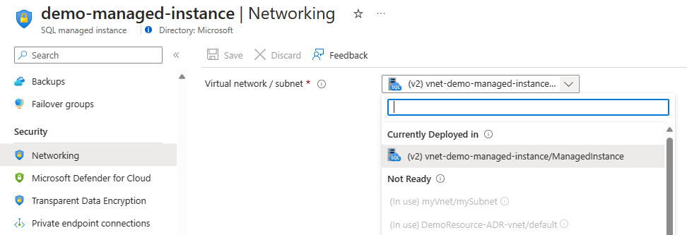
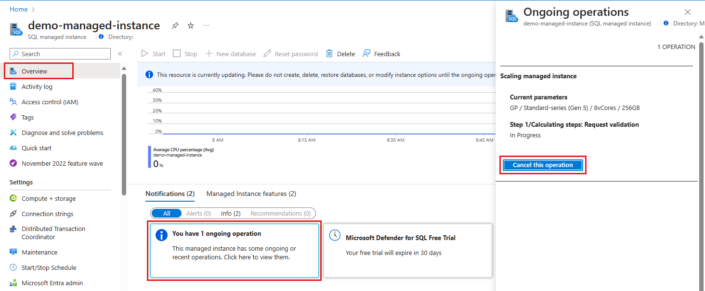

# Move Azure SQL Managed Instance across subnets
[!INCLUDE[appliesto-sqlmi](../includes/appliesto-sqlmi.md)]

Azure SQL Managed Instance must be deployed inside a dedicated subnet within an Azure [virtual network](/azure/virtual-network/virtual-networks-overview). The number of managed instances that can be deployed within the subnet depends on the size of the subnet (subnet range).

This article teaches you to move your managed instance from one subnet to another (in the same VNet or a different one), similar to scaling vCores or changing the instance service tier. SQL Managed Instance is available during the move, except during a short downtime caused by a failover at the end of the update - typically lasting up to 10 seconds, even if long-running transactions are interrupted. 

Moving the instance to another subnet triggers the following virtual cluster operations:
- The virtual cluster will build out or resize the underlying infrastructure in destination subnet.
- The virtual cluster is removed or defragmented in the source subnet. 

Before moving your instance to another subnet, consider familiarizing yourself with the following concepts: 
- [Determine required subnet size and range for Azure SQL Managed Instance](vnet-subnet-determine-size.md).
- Choose between moving the instance to a [new subnet](virtual-network-subnet-create-arm-template.md) or [using an existing subnet](vnet-existing-add-subnet.md).
- Use [management operations](management-operations-overview.md) to automatically deploy new managed instances, update instance properties, or delete instances. It's possible to [monitor](management-operations-monitor.md) these management operations. 


## Requirements and limitations 

To deploy a managed instance, or move it to another subnet, the destination subnet must have certain [network requirements](connectivity-architecture-overview.md#service-aided-subnet-configuration).

### Subnet readiness 

Before you move your managed instance, confirm the subnet is marked as **Ready for Managed Instance**. 

In the **Virtual network** UI of the Azure portal, virtual networks that meet the prerequisites for a managed instance are categorized as **Ready for Managed Instance**. Virtual networks that have subnets with managed instances already deployed to them display an SQL Managed Instance icon before the virtual network name. Empty subnets that are ready for a managed instance display a Virtual network subnet icon. 

Subnets that are marked as **Not ready** don't fulfill all the requirements for SQL Managed Instance deployment. Use the info icon on the right of the subnet name to learn why the subnet isn't ready and if subnet can meet [network requirements](connectivity-architecture-overview.md#service-aided-subnet-configuration). These requirements include:

- delegating to the Microsoft.Sql/managedInstances resource provider
- attaching a route table
- attaching a network security group

In the case that subnet is part of some other virtual network, extra requirement is
 - [bi-directional peering](/azure/virtual-network/virtual-network-peering-overview) between current and destination virtual network.

After all requirements are satisfied, the subnet moves from the **Not ready** to the **Ready for Managed Instance** category and can be used for a managed instance. 

Subnet that is already in use (subnets used for instance deployments can't contain other resources), or the subnet has a different DNS zone (a cross-subnet instance move limitation) are always part of the **Not ready** category.

> [!div class="mx-imgBorder"]
> 


Depending on the subnet state and designation, the following adjustments may be made to the destination subnet: 

- **Ready for Managed Instance (contains existing SQL Managed Instance)**: No adjustments are made. These subnets already contain managed instances, and making any change to the subnet could impact existing instances. 
- **Ready for Managed Instance (empty)**: The workflow validates all the required rules in the network security group and route table, and adds any rules that are necessary but missing. <sup>1</sup>

> [!Note]
> <sup>1</sup> Custom rules added to the source subnet configuration are not copied to the destination subnet. Any customization of the source subnet configuration must be replicated manually to the destination subnet. One way to achieve this is by using the same route table and network security group for the source and destination subnet.


### Destination subnet limitations

Consider the following limitations when choosing a destination subnet for an existing instance:
- SQL Managed Instance can be moved to the subnet that is either:
    - In the same virtual network as the currently used,
    - In a [peered virtual network](/azure/virtual-network/tutorial-connect-virtual-networks-portal), if moving to a subnet in another virtual network.

- The DNS zone of the instances in destination subnet must match the DNS zone of the instance being moved. This limitation applies if you plan to move to a non-empty subnet.
    - You can specially prepare the destination subnet to retain the DNS zone of SQL Managed Instance that is being moved. Preparation can be done by creating new SQL Managed Instance in an empty subnet and providing dnsZonePartner parameter in create request. This [parameter as a value accepts the ID of SQL Managed Instance](api-references-create-manage-instance.md), and in this case you can use the instance that would later be moved to the new subnet<sup>1</sup>.

> [!Note]
> <sup>1</sup> Apart from this approach there is no other way for you to dictate the DNS zone of SQL Managed Instance since it is randomly generated. There also, as of now, doesn't exist a way to update the DNS zone of an existing SQL Managed Instance.


- If you want to migrate a SQL Managed Instance with an [auto-failover group](auto-failover-group-sql-mi.md), the following prerequisites apply: 
    - The target subnet needs to have the same security rules needed for failover group replication as the source subnet: 
Open both inbound and outbound ports 5022 and the range 11000~11999 in the Network Security Group (NSG) for connections from the other managed instance subnet (the one that holds the failover group replica) to allow replication traffic between the two instances. 
    - The target subnet can't have an overlapping address range with the subnet that holds the secondary instance replica of the failover group. 
For example, if MI1 is in subnet S1, the secondary instance in the failover group is MI2 in subnet S2. We want to move MI1 to subnet S3. Subnet S3 can't have an overlapping address range with subnet S2. 

To learn more about configuring the network for auto-failover groups, review [Enable geo-replication between managed instances](auto-failover-group-configure-sql-mi.md#enabling-connectivity-between-the-instances). 

### Migration from Gen4 hardware

Instances running on Gen4 hardware must be upgraded to newer hardware since Gen4 is being retired. Upgrading hardware and moving to another subnet can be performed in one operation.

[!INCLUDE[azure-sql-gen4-hardware-retirement](../includes/azure-sql-gen4-hardware-retirement.md)]

## Operation steps

The following table details the operation steps that occur during the instance move operation: 

|Step name  |Step description  |
|----|---------|
|Request validation |Validates the submitted parameters. If a misconfiguration is detected, the operation fails with an error. |
|Virtual cluster resizing / creation |Depending on the state of the destination subnet, the virtual cluster is either created or resized.  |
|New instance startup |The SQL process starts on the deployed virtual cluster in the destination subnet. |
|Seeding database files / attaching database files |Depending on the service tier, either the database is seeded or the database files are attached. |
|Preparing failover and failover |After data has been seeded or database files reattached, the system prepares for failover. When everything is ready, the system performs a failover **with a short downtime**, usually less than 10 seconds.  |
|Old SQL instance cleanup |Removes the old SQL process from the source virtual cluster.  |
|Virtual cluster deletion |If it's the last instance within the source subnet, the final step deletes the virtual cluster synchronously. Otherwise, the virtual cluster is asynchronously defragmented.  |

A detailed explanation of the operation steps can be found in the [overview of Azure SQL Managed Instance management operations](management-operations-overview.md#management-operations-steps)

## Move the instance

A cross-subnet instance move is part of the instance update operation. Existing instance update API, Azure PowerShell, and Azure CLI commands have been enhanced with a subnet ID property. 

In the Azure portal, use the subnet field on the **Networking** blade to move the instance to the destination subnet. When using Azure PowerShell or the Azure CLI, provide a different subnet ID in the update command to move the instance from an existing subnet to the destination subnet. 

For a full reference of instance management commands, see [Management API reference for Azure SQL Managed Instance](api-references-create-manage-instance.md). 

# [Portal](#tab/azure-portal)

The option to choose the instance subnet is located on the **Networking** blade of the Azure portal. The instance move operation starts when you select a subnet and save your changes. 

The first step of the move operation is to prepare the destination subnet for deployment, which may take several minutes. Once the subnet is ready, the instance move management operation starts and becomes visible in the Azure portal. 


> [!div class="mx-imgBorder"]
> 


Monitor instance move operations from the **Overview** blade of the Azure portal. Select the notification to open an additional blade containing information about the current step, the total steps, and a button to cancel the operation. 

> [!div class="mx-imgBorder"]
> 


# [PowerShell](#tab/azure-powershell)

Use the Azure PowerShell command [Set-AzSqlInstance](/powershell/module/az.sql/set-azsqlinstance) to move an instance after you create your subnet in the same virtual network as your destination subnet. If you want to use an existing subnet, provide that subnet name in the PowerShell command.

The example PowerShell commands in this section prepare the destination subnet for instance deployment and move the managed instance. 


Use the following PowerShell command to specify your parameters: 

```powershell-interactive
### PART 1 - DEFINE PARAMETERS

#Generating basic parameters
$currentSubscriptionID = 'subscription-id'
$sqlMIResourceGroupName = 'resource-group-name-of-sql-mi'
$sqlMIName = 'sql-mi-name'
$sqlMIResourceVnetName = 'vnet-name-of-sql-mi'
$destinationSubnetName = 'name-of-the-destination-subnet-for-sql-mi'
```

Skip this command if your subnet already has instances deployed to it. If you're using a new subnet, use the following Azure PowerShell command to prepare your subnet: 

```powershell-interactive
### PART 2 - PREPARE DESTINATION SUBNET

#Loading the url of script used for preparing the subnet for SQL MI deployment
$scriptUrlBase = 'https://raw.githubusercontent.com/Microsoft/sql-server-samples/master/samples/manage/azure-sql-db-managed-instance/delegate-subnet'

#Generating destination subnet parameters
$parameters = @{
    subscriptionId = $currentSubscriptionID
    resourceGroupName = $sqlMIResourceGroupName
    virtualNetworkName = $sqlMIResourceVnetName
    subnetName = $destinationSubnetName
}

#Initiating subnet prepartion script
Invoke-Command -ScriptBlock ([Scriptblock]::Create((iwr ($scriptUrlBase+'/delegateSubnet.ps1?t='+ [DateTime]::Now.Ticks)).Content)) -ArgumentList $parameters
```

> [!Note]
> To learn more about the script that prepares the subnet, see [Configure an existing virtual network for Azure SQL Managed Instance](vnet-existing-add-subnet.md). 

The following Azure PowerShell command moves the instance to the source subnet: 

```powershell-interactive
### PART 3 - MOVE INSTANCE TO THE NEW SUBNET

Set-AzSqlInstance -Name $sqlMIName -ResourceGroupName $sqlMIResourceGroupName `
-SubnetId "/subscriptions/$currentSubscriptionID/resourceGroups/$sqlMIResourceGroupName/providers/Microsoft.Network/virtualNetworks/$sqlMIResourceVnetName/subnets/$destinationSubnetName"
```

The following Azure PowerShell command moves the instance, and also provides a way to monitor progress: 

```powershell-interactive
###PART 3 EXTENDED - MOVE INSTANCE AND MONITOR PROGRESS

# Extend the Set-AzSqlInstance command with -AsJob -Force parameters to be able to monitor the progress or proceed with script execution as moving the instance to another subnet is long running operation 
Set-AzSqlInstance -Name $sqlMIName -ResourceGroupName $sqlMIResourceGroupName `
-SubnetId "/subscriptions/$currentSubscriptionID/resourceGroups/$sqlMIResourceGroupName/providers/Microsoft.Network/virtualNetworks/$sqlMIResourceVnetName/subnets/$destinationSubnetName" -AsJob -Force

$operationProgress = Get-AzSqlInstanceOperation -ManagedInstanceName $sqlMIName -ResourceGroupName $sqlMIResourceGroupName
#checking the operation step status
Write-Host "Checking the ongoing step" -ForegroundColor Yellow
$operationProgress.OperationSteps.StepsList
```


# [Azure CLI](#tab/azure-cli)

Use the Azure CLI [az sql mi update](/cli/azure/sql/mi#az-sql-mi-update) command to move your instance to another subnet. 

Provide the destination by either specifying the subnet ID as the `--subnet` property, or by specifying the virtual network name as the `--vnet-name` property, and subnet name as the `--subnet` property. 

The following example moves the managed instance to another subnet by specifying the subnet ID: 


```azurecli-interactive
az sql mi update -g myResourceGroup -n mySqlManagedInstance --subnet /subscriptions/xxxxxxx-xxxx-xxxx-xxxx-xxxxxxxxxxxx/resourceGroups/myResourceGroup/providers/Microsoft.Network/virtualNetworks/myVirtualNetworkName/subnets/destinationSubnetName
```

The following example moves the managed instance to another subnet by specifying the virtual network name and subnet name:

```azurecli-interactive
az sql mi update -g myResourceGroup -n mySqlManagedInstance --vnet-name myVirtualNetworkName --subnet destinationSubnetName
```

Use the following command to monitor the progress of the management operation: 

```azurecli-interactive
az sql mi op list -g myResourceGroup --mi mySqlManagedInstance
```
---

## Next steps

- To learn how to create your first managed instance, see [Quickstart guide](instance-create-quickstart.md).
- For a features and comparison list, see [common SQL features](../database/features-comparison.md).
- For more information about VNet configuration, see [SQL Managed Instance VNet configuration](connectivity-architecture-overview.md).
- For a quickstart that creates a managed instance and restores a database from a backup file, see [Create a managed instance](instance-create-quickstart.md).
- For a tutorial about using Azure Database Migration Service for migration, see [SQL Managed Instance migration using Database Migration Service](/azure/dms/tutorial-sql-server-to-managed-instance).
