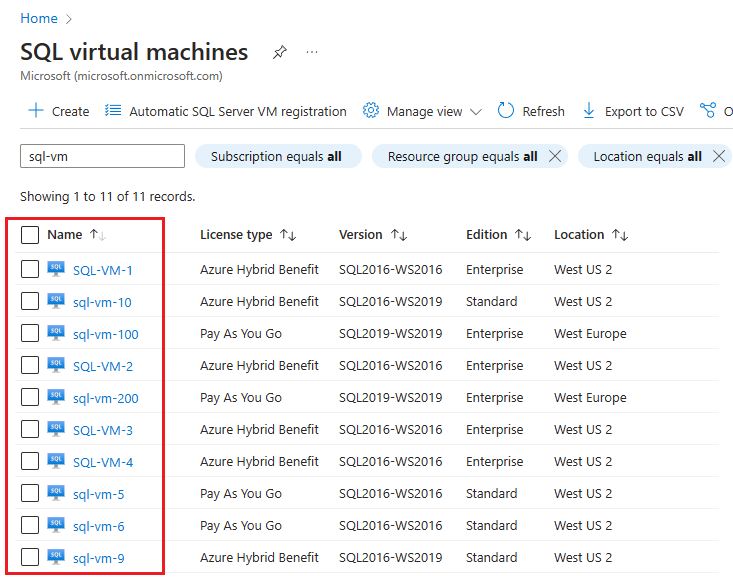
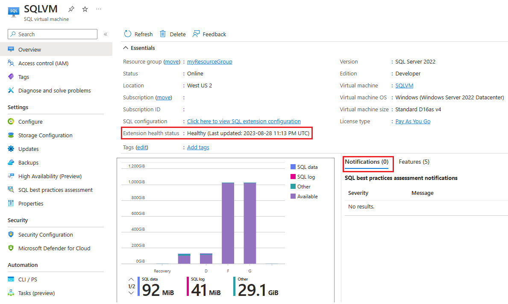
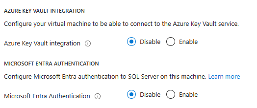

# Manage SQL Server VMs by using the Azure portal
[!INCLUDE[appliesto-sqlvm](../../includes/appliesto-sqlvm.md)]

In the [Azure portal](https://portal.azure.com), the [**SQL virtual machines**](https://portal.azure.com/#blade/HubsExtension/BrowseResource/resourceType/Microsoft.SqlVirtualMachine%2FSqlVirtualMachines) resource is an independent management service to manage SQL Server on Azure Virtual Machines (VMs) that have been registered with the SQL Server IaaS Agent extension. You can use the resource to view all of your SQL Server VMs simultaneously and modify settings dedicated to SQL Server: 

The **SQL virtual machines** resource management point is different to the **Virtual machine** resource used to manage the VM such as start it, stop it, or restart it. 

## Prerequisite 

The **SQL virtual machines** resource is only available to SQL Server VMs that have been [registered with the SQL IaaS Agent extension](sql-agent-extension-manually-register-single-vm.md). 

## Access the resource

To access the **SQL virtual machines** resource, do the following:

1. Open the [Azure portal](https://portal.azure.com). 
1. Select **All Services**. 
1. Enter **SQL virtual machines** in the search box.
1. (Optional): Select the star next to **SQL virtual machines** to add this option to your **Favorites** menu. 
1. Select **SQL virtual machines**. 

   

1. The portal lists all SQL Server VMs available within the subscription. Select the one that you want to manage to open the **SQL virtual machines** resource. Use the search box if your SQL Server VM isn't appearing. 

   

   Selecting your SQL Server VM opens the **SQL virtual machines** resource: 

   

> [!TIP]
> The **SQL virtual machines** resource is for dedicated SQL Server settings. Select the name of the VM in the **Virtual machine** box to open settings that are specific to the VM, but not exclusive to SQL Server. 

## License and edition 

Use the **Configure** page of the SQL virtual machine resource to change your SQL Server licensing metadata to **Pay as you go**, **Azure Hybrid Benefit**, or **HA/DR** for your [free Azure replica for disaster recovery](business-continuity-high-availability-disaster-recovery-hadr-overview.md#free-dr-replica-in-azure).

You can also modify the edition of SQL Server from the **Configure** page as well, such as **Enterprise**, **Standard**, or **Developer**. 

Changing the license and edition metadata in the Azure portal is only supported once the version and edition of SQL Server has been modified internally to the VM. To learn more see, change the [version](change-sql-server-version.md) and [edition](change-sql-server-edition.md) of SQL Server on Azure VMs. 

## Storage 

Use the **Storage Configuration** page of the SQL virtual machines resource to extend your data, log, and tempdb drives. Review [storage configuration](storage-configuration.md) to learn more. 

For example, you can extend your storage: 

It's also possible to modify your tempdb settings using the **Storage configuration** page, such as the number of tempdb files, as well as the initial size, and the autogrowth ratio. Select **Configure** next to **tempdb** to open the **tempdb Configuration** page. 

Choose **Yes** next to **Configure tempdb data files** to modify your settings, and then choose **Yes** next to **Manage tempdb database folders on restart** to allow Azure to manage your tempdb configuration and implement your settings the next time your SQL Server service starts: 

:::image type="content" source="media/manage-sql-vm-portal/tempdb-configuration.png" alt-text="Screenshot of the tempdb configuration page of the Azure portal from the SQL virtual machines resource page. ":::

Restart your SQL Server service to apply your changes. 

## Patching

Use the **Patching** page of the SQL virtual machines resource to enable auto patching of your VM and automatically install Windows and SQL Server updates marked as Important. You can also configure a maintenance schedule here, such as running patching daily, as well as a local start time for maintenance, and a maintenance window. 

To learn more, see, [Automated patching](automated-patching.md). 

## Backups

Use the **Backups** page of the SQL virtual machines resource to configure your automated backup settings, such as the retention period, which storage account to use, encryption, whether or not to back up system databases, and a backup schedule. 

To learn more, see, [Automated patching](automated-backup.md). 

## Additional features

Manage additional features of SQL Server on the **Additional features** tab, such as enabling [R Services (Advanced analytics)](/sql/machine-learning/r/sql-server-r-services) or [least privilege mode](sql-server-iaas-agent-extension-automate-management.md). 

## High availability (Preview)

Once you've configured your [availability group by using the Azure portal](availability-group-azure-portal-configure.md), use the **High Availability** page of the SQL virtual machines resource to monitor the health of your existing Always On availability group. 

:::image type="content" source="media/availability-group-az-portal-configure/healthy-availability-group.png" alt-text="Screenshot of the Azure portal, SQL virtual machines resource, showing where to check the status of your availability group from the high availability page.":::

## Security Configuration 

Use the **Security Configuration** page of the SQL virtual machines resource to configure SQL Server security settings such as which port to use, or to enable Azure Key Vault integration, or enable authentication methods to connect to your SQL Server instance - such as SQL authentication, or if you're on SQL Server 2022, [Azure Active Directory (Azure AD) authentication (currently in preview)](security-considerations-best-practices.md#azure-ad-authentication-preview). 

To learn more, see the [Security best practices](security-considerations-best-practices.md).

## Defender for Cloud 

Use the **Defender for SQL** page of the SQL virtual machine's resource to view Defender for Cloud recommendations directly in the SQL virtual machine blade. Enable [Microsoft Defender for SQL](/azure/security-center/defender-for-sql-usage) to leverage this feature. 

## SQL best practices assessment

Use the **SQL best practices assessment** page of the SQL virtual machines resource to assess the health of your SQL Server VM. Once the feature is enabled, your SQL Server instances and databases are scanned and recommendations are surfaced to improve performance (indexes, statistics, trace flags, and so on) and identify missing best practices configurations.  

To learn more, see [SQL best practices assessment for SQL Server on Azure VMs](sql-assessment-for-sql-vm.md).

## Next steps

For more information, see the following articles: 

* [Overview of SQL Server on a Windows VM](sql-server-on-azure-vm-iaas-what-is-overview.md)
* [FAQ for SQL Server on a Windows VM](frequently-asked-questions-faq.yml)
* [Pricing guidance for SQL Server on a Windows VM](pricing-guidance.md)
* [What's new for SQL Server on Azure VMs](doc-changes-updates-release-notes-whats-new.md)
