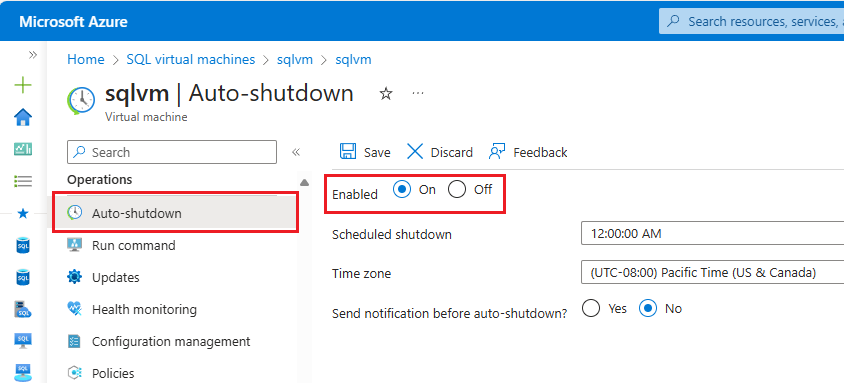

# Pricing guidance for SQL Server on Azure VMs
[!INCLUDE[appliesto-sqlvm](../../includes/appliesto-sqlvm.md)]

This article provides pricing guidance for [SQL Server on Azure Virtual Machines](sql-server-on-azure-vm-iaas-what-is-overview.md). There are several options that affect cost, and it is important to pick the right image that balances costs with business requirements.

> [!TIP]
> If you only need to find out a cost estimate for a specific combination of SQL Server edition and virtual machine (VM) size, see the pricing page for [Windows](https://azure.microsoft.com/pricing/details/virtual-machines/windows) or [Linux](https://azure.microsoft.com/pricing/details/virtual-machines/linux). Select your platform and SQL Server edition from the **OS/Software** list.
>
> 
>
> Or use the [pricing calculator](https://azure.microsoft.com/pricing/#explore-cost) to add and configure a virtual machine. 

## Free-licensed SQL Server editions

If you want to develop, test, or build a proof of concept, then use the freely licensed **SQL Server Developer edition**. This edition has all the features of SQL Server Enterprise edition, allowing you to build and test any type of application. However, you cannot run the Developer edition in production. A SQL Server Developer edition VM only incurs charges for the cost of the VM, because there are no associated SQL Server licensing costs.

If you want to run a lightweight workload in production (<4 cores, <1-GB memory, <10 GB/database), use the freely licensed **SQL Server Express edition**. A SQL Server Express edition VM also only incurs charges for the cost of the VM.

For these development/test and lightweight production workloads, you can also save money by choosing a smaller VM size that matches these workloads. The [D2as_v5](/azure/virtual-machines/dasv5-dadsv5-series) might be a good choice in some scenarios.

To create an Azure VM running SQL Server 2022 with one of these images, see the following links:

| Platform | Freely licensed images |
|---|---|
| Windows Server 2022 | [SQL Server 2022 Developer Azure VM](https://portal.azure.com/#create/microsoftsqlserver.sql2022-ws2022sqldev-gen2) |
| Ubuntu Pro 20.04 LTS | [SQL Server 2022 Developer Azure VM](https://portal.azure.com/#create/microsoftsqlserver.sql2019-ubuntupro2004sqldev_upro-ARM) |

## Paid SQL Server editions

If you have a non-lightweight production workload, use one of the following SQL Server editions:

| SQL Server edition | Workload |
|-----|-----|
| Web | Small web sites |
| Standard | Small to medium workloads |
| Enterprise | Large or mission-critical workloads|

You have two options to pay for SQL Server licensing for these editions: *pay per usage* or *Azure Hybrid Benefit*.

## Pay per usage

**Paying the SQL Server license per usage** (also known as **pay as you go**) means that the per-second cost of running the Azure VM includes the cost of the SQL Server license. You can see the pricing for the different SQL Server editions (Web, Standard, Enterprise) in the Azure Virtual Machines pricing page for [Windows](https://azure.microsoft.com/pricing/details/virtual-machines/windows) or [Linux](https://azure.microsoft.com/pricing/details/virtual-machines/linux).

The cost is the same for all versions of SQL Server (2012 SP3 to 2022). The per-second licensing cost depends on the number of VM vCPUs.

Paying the SQL Server licensing per usage is recommended for:

- **Temporary or periodic workloads**. For example, an app that needs to support an event for a couple of months every year, or business analysis on Mondays.

- **Workloads with unknown lifetime or scale**. For example, an app that may not be required in a few months, or which may require more, or less compute power, depending on demand.

To create an Azure VM running SQL Server 2022 with one of these pay-as-you-go images, see the following links:

| Platform | Licensed images |
|---|---|
| Windows Server 2022 | [SQL Server 2022 Web Azure VM](https://portal.azure.com/#create/microsoftsqlserver.sql2022-ws2022web-gen2) [SQL Server 2022 Standard Azure VM](https://portal.azure.com/#create/microsoftsqlserver.sql2022-ws2022standard-gen2) [SQL Server 2022 Enterprise Azure VM](https://portal.azure.com/#create/microsoftsqlserver.sql2022-ws2022enterprise-gen2) |
| Ubuntu Pro 20.04 LTS | [SQL Server 2022 Web Azure VM](https://portal.azure.com/#create/microsoftsqlserver.sql2022-ubuntupro2004web_upro) [SQL Server 2022 Standard Azure VM](https://portal.azure.com/#create/microsoftsqlserver.sql2022-ubuntupro2004standard_upro) [SQL Server 2022 Enterprise Azure VM](https://portal.azure.com/#create/microsoftsqlserver.sql2022-ubuntupro2004enterprise_upro) |

> [!IMPORTANT]
> When you create a SQL Server virtual machine in the Azure portal, the **Choose a size** window shows an estimated cost. It is important to note that this estimate is only the compute costs for running the VM along with any OS licensing costs (Windows or third-party Linux operating systems).
>
> 
>
>It does not include additional SQL Server licensing costs for Web, Standard, and Enterprise editions. To get the most accurate pricing estimate, select your operating system and SQL Server edition on the pricing page for [Windows](https://azure.microsoft.com/pricing/details/virtual-machines/windows/) or [Linux](https://azure.microsoft.com/pricing/details/virtual-machines/linux/).

> [!NOTE]
> It is now possible to change the licensing model from pay-as-you-go to Azure Hybrid Benefit and back. For more information, see [How to change the licensing model for a SQL Server VM](licensing-model-azure-hybrid-benefit-ahb-change.md). 

##  Azure Hybrid Benefit (AHB)

[**Azure Hybrid Benefit**](https://azure.microsoft.com/pricing/hybrid-benefit/#overview), also referred to as **AHB**, is a program that allows customers to use existing SQL Server core licenses with Software Assurance in an Azure VM. A SQL Server VM using AHB only charges for the cost of running the VM, not for SQL Server licensing, given that you have already acquired licenses and Software Assurance through a Volume Licensing program or through a Cloud Solution Partner (CSP).

Bringing your own SQL Server licensing through Azure Hybrid Benefit is recommended for:

- **Continuous workloads**. For example, an app that needs to support business operations 24x7.

- **Workloads with known lifetime and scale**. For example, an app that is required for the whole year and which demand has been forecasted.

To use AHB with a SQL Server VM, you must have a license for SQL Server Standard or Enterprise and [Software Assurance](https://www.microsoft.com/licensing/licensing-programs/software-assurance-default.aspx#tab=1), which is a required option through some volume licensing programs and an optional purchase with others. The pricing level provided through Volume Licensing programs varies, based on the type of agreement and the quantity and or commitment to SQL Server. But as a rule of thumb, Azure Hybrid Benefit for continuous production workloads has the following benefits:

| AHB benefit | Description |
|-----|-----|
| **Cost savings** | The [Azure Hybrid Benefit](https://azure.microsoft.com/pricing/hybrid-benefit/) offers up to 55% savings. For more information, see [Switch licensing model](licensing-model-azure-hybrid-benefit-ahb-change.md) |
| **Free passive secondary replica** | Another benefit of bringing your own license is the [free licensing for one passive secondary replica](https://azure.microsoft.com/pricing/licensing-faq/) for high availability and one passive secondary for disaster recovery per SQL Server. This cuts the licensing cost of a highly available SQL Server deployment (for example, using Always On availability groups) by more than half. |

> [!NOTE]
> As of November 2022, it's possible to use free licensing for one passive secondary replica for high availability and one passive secondary replica for disaster recovery when using [pay-as-you-go licensing as well as AHB](https://cloudblogs.microsoft.com/sqlserver/2022/11/16/new-sql-server-on-azure-virtual-machines-and-azure-sql-managed-instance-dr-benefits/). 

## Reduce costs

To avoid unnecessary costs, choose an optimal virtual machine size and consider intermittent shutdowns for non-continuous workloads.

###  Correctly size your VM

The licensing cost of SQL Server is directly related to the number of vCPUs. Choose a VM size that matches your expected needs for CPU, memory, storage, and I/O bandwidth. For a complete list of machine size options, see [Windows VM sizes](/azure/virtual-machines/sizes) and [Linux VM sizes](/azure/virtual-machines/sizes?toc=%2fazure%2fvirtual-machines%2flinux%2ftoc.json).

For more information on choosing the best VM size for your workload, see [VM size best practices](performance-guidelines-best-practices-vm-size.md).

### Shut down your VM when possible

If you are using any workloads that do not run continuously, consider shutting down the virtual machine during the inactive periods. You only pay for what you use.

For example, if you are simply trying out SQL Server on an Azure VM, you would not want to incur charges by accidentally leaving it running for weeks. One solution is to use the [automatic shutdown feature](/azure/virtual-machines/auto-shutdown-vm) for the underlying virtual machine:

Automatic shutdown is part of a larger set of similar features provided by [Azure DevTest Labs](https://azure.microsoft.com/services/devtest-lab).

For other workflows, consider automatically shutting down and restarting Azure VMs with a scripting solution, such as [Azure Automation](https://azure.microsoft.com/services/automation/).

> [!IMPORTANT]
> Shutting down and deallocating your VM is the only way to avoid charges. Simply stopping or using power options to shut down the VM still incurs usage charges.

## Next steps

For general Azure pricing guidance, see [Prevent unexpected costs with Azure billing and cost management](/azure/cost-management-billing/cost-management-billing-overview). For the latest Azure Virtual Machines pricing, including SQL Server, see the Azure Virtual Machines pricing page for [Windows VMs](https://azure.microsoft.com/pricing/details/virtual-machines/windows/) and [Linux VMs](https://azure.microsoft.com/pricing/details/virtual-machines/linux/).

For an overview of SQL Server on Azure Virtual Machines, see the following articles:

- [Overview of SQL Server on Windows VMs](sql-server-on-azure-vm-iaas-what-is-overview.md)
- [Overview of SQL Server on Linux VMs](../linux/sql-server-on-linux-vm-what-is-iaas-overview.md)
