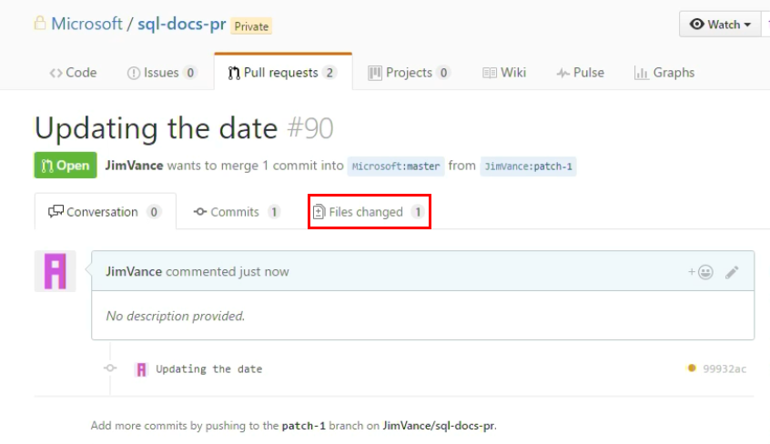

# Git commands for creating a new article or updating an existing article
This article explains how to use the Git comamnds from the command-line to make changes to SQL Server documentation on github. If you have not setup a github account, permissions, and tools, see how to [Install and set up tools for authoring in GitHub](tools-and-setup.md).

## Standard process (working from master)
Follow the steps in this article to create a local working branch on your computer so that you can create or update articles in the SQL Server documentation on github.

1. Start Git Bash (or the command-line tool you use for Git).

    > **Note:** If you are working in the public repository, change **sql-docs-pr** to **sql-docs** in all the commands.

2. Change to sql-docs-pr:

        cd sql-docs-pr

3. Check out the master branch:

        git checkout master

4. Create a fresh local working branch derived from the master branch:

        git pull upstream master:<working branch>

5. Move into the new working branch:

        git checkout <working branch>

6. Let your fork know you created the local working branch:

        git push origin <working branch>

7. Create your new article or make changes to an existing article. Use Windows Explorer to open and create new markdown files, and use a markdown editor (for example, Atom (http://atom.io) or Visual Studio Code). After you have created or modified your article and images, go to the next step.

8. Add and commit the changes you made:

        git add .
        git commit –m "<comment>"
        
   Or, to add only the specific files you modified:

        git add <file path>
        git commit –m "<comment>"

   If you deleted files, you have to use this:
   
        git add --all
        git commit -m "<comment>"

9. Update your local working branch with changes from upstream:

        git pull upstream master

10. Push the changes to your fork on GitHub:

        git push origin <working branch>

12. When you are ready to submit your content to the upstream master branch for staging, validation, and/or publishing, in the GitHub UI, create a pull request from your fork to the master branch.

## Pull requests
1. When you create a pull request in the github UI, it immediately takes you to the pull request window. 

    

2. After several minutes, you should see a link to a staged version of your topic with the changes you made. 

3. If you need to make further edits, you click the **Files changed** option at the top of the PR window. Then you can repeat these steps by clicking the edit button on the changed files and committing them to the same branch for this PR. Each change results in a new link to review the staged changes.

## Sign-off
When you are ready to publish your changes, type **#sign-off** in the comment window of your pull request. Click the **Comment** button. Your request will be reviewed and merged.

> [!NOTE]
> If you are working in the private repository, after you sign off your changes are merged and published to the staging site.

## Troubleshooting

If you are having problems accessing the repository on github, make sure you have followed the github account and permissions steps in the [tools and setup](tools-and-setup.md) guide.

If you get a **all checks have failed** error in the pull request window, you must [log onto the OPS portal](tools-and-setup.md#log-onto-the-ops-portal) as is described in the tools and setup guide.

## Working with release branches

When you are working with a release branch, the best way to create a local working branch from the release branch is to use this command syntax:

    git checkout upstream/<upstream branch name> -b <local working branch name>

This creates the local branch directly from the upstream branch, avoiding any local merging.
