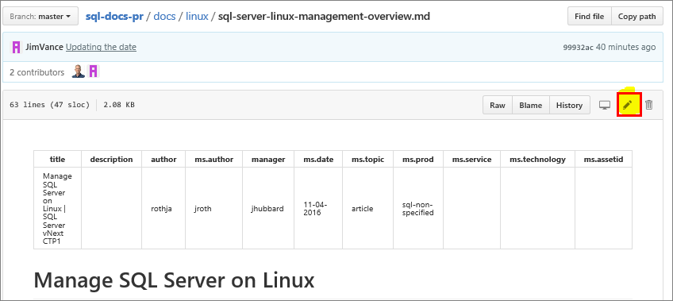
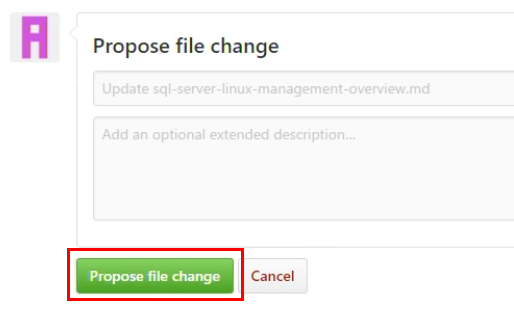
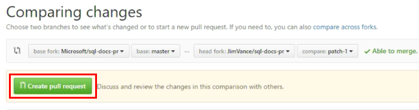
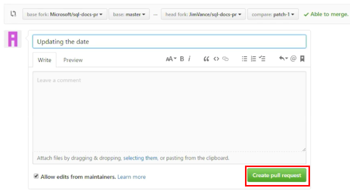

# How to edit a topic in the Github web interface
This article shows you how to make simple changes to a topic using the Github web interface.

> [!NOTE]
> For larger changes over time, screenshots, and other more involved edits, we recommend using the 
> Git tools on your local machine. You can learn how to set these up [here](tools-and-setup.md). And 
> the command-line workflow is explained [here](git-commands-for-master.md).

## Locate a topic to edit

The first step is to locate the topic that you want to edit in the repository. One way to do this is to find it in the table-of-contents file, TOC.MD. 

1. If you are a Microsoft employee, open the private [sql-docs-pr](https://github.com/Microsoft/sql-docs-pr/tree/master/docs) repository.

2. Open the folder related to your topic area. For example, if you are editing a topic on SQL Server for Linux, select the Linux folder.

3. Select the **TOC.md** file to view the table of contents.

4. In the table of contents, select the file you want to edit. It should display the topic in github.

5. Click the pencil icon to edit the topic.

    

6. Make your changes to the markdown topic. Don't forget to update the **ms.date** attribute at the top of the article.

7. When finished, click the **Propose file change** button at the bottom of the screen.

    

8. On the next screen, review your changes, and then click **Create pull request**.

     

9. Finally, give your pull request a descriptive title, and click **Create pull request** again.

    

## Pull requests
1. When you create a pull request in the github UI, it immediately takes you to the pull request window. 

    

2. After several minutes, you should see a link to a staged version of your topic with the changes you made. 

3. If you need to make further edits, you click the **Files changed** option at the top of the PR window. Then you can repeat these steps by clicking the edit button on the changed files and committing them to the same branch for this PR. Each change results in a new link to review the staged changes.

## Sign-off
When you are ready to publish your changes, type **#sign-off** in the comment window of your pull request. Click the **Comment** button. Your request will be reviewed and merged.

> [!NOTE]
> If you are working in the private repository, after you sign off your changes are merged and published to the staging site.

## Troubleshooting

If you are having problems accessing the repository on github, make sure you have followed the github account and permissions steps in the [tools and setup](tools-and-setup.md) guide.

If you get a **all checks have failed** error in the pull request window, you must [log onto the OPS portal](tools-and-setup.md#log-onto-the-ops-portal) as is described in the tools and setup guide.

