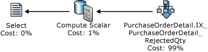
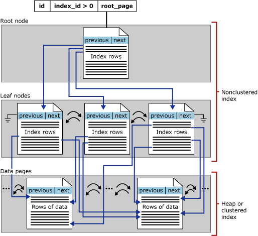

# SQL Server Index Design Guide

  Poorly designed indexes and a lack of indexes are primary sources of database application bottlenecks. Designing efficient indexes is paramount to achieving good database and application performance. This SQL Server index design guide contains information and best practices to help you design effective indexes to meet the needs of your application.  
  
**Applies to**: [!INCLUDE[ssVersion2005](../includes/ssversion2005-md.md)] through [!INCLUDE[ssCurrent](../includes/sscurrent-md.md)] unless noted otherwise.  
  
 This guide assumes the reader has a general understanding of the index types available in [!INCLUDE[ssNoVersion](../includes/ssnoversion-md.md)]. For a general description of index types, see [Index Types](../relational-databases/indexes/indexes.md).  
  
##  <a name="Top"></a> In This Guide  

 [Index Design Basics](#Basics)  
  
 [General Index Design Guidelines](#General_Design)  
  
 [Clustered Index Design Guidelines](#Clustered)  
  
 [Nonclustered Index Design Guidelines](#Nonclustered)  
  
 [Unique Index Design Guidelines](#Unique)  
  
 [Filtered Index Design Guidelines](#Filtered)  
  
 [Additional Reading](#Additional_Reading)  
  
##  <a name="Basics"></a> Index Design Basics  

 An index is an on-disk structure associated with a table or view that speeds retrieval of rows from the table or view. An index contains keys built from one or more columns in the table or view. These keys are stored in a structure (B-tree) that enables SQL Server to find the row or rows associated with the key values quickly and efficiently.  
  
 The selection of the right indexes for a database and its workload is a complex balancing act between query speed and update cost. Narrow indexes, or indexes with few columns in the index key, require less disk space and maintenance overhead. Wide indexes, on the other hand, cover more queries. You may have to experiment with several different designs before finding the most efficient index. Indexes can be added, modified, and dropped without affecting the database schema or application design. Therefore, you should not hesitate to experiment with different indexes.  
  
 The query optimizer in [!INCLUDE[ssNoVersion](../includes/ssnoversion-md.md)] reliably chooses the most effective index in the vast majority of cases. Your overall index design strategy should provide a variety of indexes for the query optimizer to choose from and trust it to make the right decision. This reduces analysis time and produces good performance over a variety of situations. To see which indexes the query optimizer uses for a specific query, in [!INCLUDE[ssManStudioFull](../includes/ssmanstudiofull-md.md)], on the **Query** menu, select **Include Actual Execution Plan**.  
  
 Do not always equate index usage with good performance, and good performance with efficient index use. If using an index always helped produce the best performance, the job of the query optimizer would be simple. In reality, an incorrect index choice can cause less than optimal performance. Therefore, the task of the query optimizer is to select an index, or combination of indexes, only when it will improve performance, and to avoid indexed retrieval when it will hinder performance.  
  
### Index Design Tasks  

 The follow tasks make up our recommended strategy for designing indexes:  
  
1.  Understand the characteristics of the database itself. For example, is it an online transaction processing (OLTP) database with frequent data modifications, or a Decision Support System (DSS) or data warehousing (OLAP) database that contains primarily read-only data and must process very large data sets quickly. In [!INCLUDE[ssSQL11](../includes/sssql11-md.md)], *xVelocity memory optimized columnstore* index is especially appropriate for typical data warehousing data sets. Columnstore indexes can transform the data warehousing experience for users by enabling faster performance for common data warehousing queries such as filtering, aggregating, grouping, and star-join queries. For more information, see [Columnstore Indexes Described](../relational-databases/indexes/columnstore-indexes-described.md).  
  
2.  Understand the characteristics of the most frequently used queries. For example, knowing that a frequently used query joins two or more tables will help you determine the best type of indexes to use.  
  
3.  Understand the characteristics of the columns used in the queries. For example, an index is ideal for columns that have an integer data type and are also unique or nonnull columns. For columns that have well-defined subsets of data, you can use a filtered index in [!INCLUDE[ssKatmai](../includes/sskatmai-md.md)] and higher versions. For more information, see [Filtered Index Design Guidelines](#Filtered) in this guide.  
  
4.  Determine which index options might enhance performance when the index is created or maintained. For example, creating a clustered index on an existing large table would benefit from the ONLINE index option. The ONLINE option allows for concurrent activity on the underlying data to continue while the index is being created or rebuilt. For more information, see [Set Index Options](../relational-databases/indexes/set-index-options.md).  
  
5.  Determine the optimal storage location for the index. A nonclustered index can be stored in the same filegroup as the underlying table, or on a different filegroup. The storage location of indexes can improve query performance by increasing disk I/O performance. For example, storing a nonclustered index on a filegroup that is on a different disk than the table filegroup can improve performance because multiple disks can be read at the same time.  
  
     Alternatively, clustered and nonclustered indexes can use a partition scheme across multiple filegroups. Partitioning makes large tables or indexes more manageable by letting you access or manage subsets of data quickly and efficiently, while maintaining the integrity of the overall collection. For more information, see [Partitioned Tables and Indexes](../relational-databases/partitions/partitioned-tables-and-indexes.md). When you consider partitioning, determine whether the index should be aligned, that is, partitioned in essentially the same manner as the table, or partitioned independently.  
  
##  <a name="General_Design"></a> General Index Design Guidelines  

 Experienced database administrators can design a good set of indexes, but this task is very complex, time-consuming, and error-prone even for moderately complex databases and workloads. Understanding the characteristics of your database, queries, and data columns can help you design optimal indexes.  
  
### Database Considerations  

 When you design an index, consider the following database guidelines:  
  
-   Large numbers of indexes on a table affect the performance of INSERT, UPDATE, DELETE, and MERGE statements because all indexes must be adjusted appropriately as data in the table changes. For example, if a column is used in several indexes and you execute an UPDATE statement that modifies that column's data, each index that contains that column must be updated as well as the column in the underlying base table (heap or clustered index).  
  
    -   Avoid over-indexing heavily updated tables and keep indexes narrow, that is, with as few columns as possible.  
  
    -   Use many indexes to improve query performance on tables with low update requirements, but large volumes of data. Large numbers of indexes can help the performance of queries that do not modify data, such as SELECT statements, because the query optimizer has more indexes to choose from to determine the fastest access method.  
  
-   Indexing small tables may not be optimal because it can take the query optimizer longer to traverse the index searching for data than to perform a simple table scan. Therefore, indexes on small tables might never be used, but must still be maintained as data in the table changes.  
  
-   Indexes on views can provide significant performance gains when the view contains aggregations, table joins, or a combination of aggregations and joins. The view does not have to be explicitly referenced in the query for the query optimizer to use it.  
  
-   Use the Database Engine Tuning Advisor to analyze your database and make index recommendations. For more information, see [Database Engine Tuning Advisor](../relational-databases/performance/database-engine-tuning-advisor.md).  
  
### Query Considerations  

 When you design an index, consider the following query guidelines:  
  
-   Create nonclustered indexes on the columns that are frequently used in predicates and join conditions in queries. However, you should avoid adding unnecessary columns. Adding too many index columns can adversely affect disk space and index maintenance performance.  
  
-   Covering indexes can improve query performance because all the data needed to meet the requirements of the query exists within the index itself. That is, only the index pages, and not the data pages of the table or clustered index, are required to retrieve the requested data; therefore, reducing overall disk I/O. For example, a query of columns **a** and **b** on a table that has a composite index created on columns **a**, **b**, and **c** can retrieve the specified data from the index alone.  
  
-   Write queries that insert or modify as many rows as possible in a single statement, instead of using multiple queries to update the same rows. By using only one statement, optimized index maintenance could be exploited.  
  
-   Evaluate the query type and how columns are used in the query. For example, a column used in an exact-match query type would be a good candidate for a nonclustered or clustered index.  
  
### Column Considerations  

 When you design an index consider the following column guidelines:  
  
-   Keep the length of the index key short for clustered indexes. Additionally, clustered indexes benefit from being created on unique or nonnull columns.  
  
-   Columns that are of the `ntext`, `text`, `image`, `varchar(max)`, `nvarchar(max)`, and `varbinary(max)` data types cannot be specified as index key columns. However, `varchar(max)`, `nvarchar(max)`, `varbinary(max)`, and `xml` data types can participate in a nonclustered index as nonkey index columns. For more information, see the section ['Index with Included Columns](#Included_Columns)' in this guide.  
  
-   An `xml` data type can only be a key column only in an XML index. For more information, see [XML Indexes &#40;SQL Server&#41;](../relational-databases/xml/xml-indexes-sql-server.md). SQL Server 2012 SP1 introduces a new type of XML index known as a Selective XML Index. This new index can improve querying performance over data stored as XML in SQL Server, allow for much faster indexing of large XML data workloads, and improve scalability by reducing storage costs of the index itself. For more information, see [Selective XML Indexes &#40;SXI&#41;](../relational-databases/xml/selective-xml-indexes-sxi.md).  
  
-   Examine column uniqueness. A unique index instead of a nonunique index on the same combination of columns provides additional information for the query optimizer that makes the index more useful. For more information, see [Unique Index Design Guidelines](#Unique) in this guide.  
  
-   Examine data distribution in the column. Frequently, a long-running query is caused by indexing a column with few unique values, or by performing a join on such a column. This is a fundamental problem with the data and query, and generally cannot be resolved without identifying this situation. For example, a physical telephone directory sorted alphabetically on last name will not expedite locating a person if all people in the city are named Smith or Jones. For more information about data distribution, see [Statistics](../relational-databases/statistics/statistics.md).  
  
-   Consider using filtered indexes on columns that have well-defined subsets, for example sparse columns, columns with mostly NULL values, columns with categories of values, and columns with distinct ranges of values. A well-designed filtered index can improve query performance, reduce index maintenance costs, and reduce storage costs.  
  
-   Consider the order of the columns if the index will contain multiple columns. The column that is used in the WHERE clause in an equal to (=), greater than (>), less than (<), or BETWEEN search condition, or participates in a join, should be placed first. Additional columns should be ordered based on their level of distinctness, that is, from the most distinct to the least distinct.  
  
     For example, if the index is defined as `LastName`, `FirstName` the index will be useful when the search criterion is `WHERE LastName = 'Smith'` or `WHERE LastName = Smith AND FirstName LIKE 'J%'`. However, the query optimizer would not use the index for a query that searched only on `FirstName (WHERE FirstName = 'Jane')`.  
  
-   Consider indexing computed columns. For more information, see [Indexes on Computed Columns](../relational-databases/indexes/indexes-on-computed-columns.md).  
  
### Index Characteristics  

 After you have determined that an index is appropriate for a query, you can select the type of index that best fits your situation. Index characteristics include the following:  
  
-   Clustered versus nonclustered  
  
-   Unique versus nonunique  
  
-   Single column versus multicolumn  
  
-   Ascending or descending order on the columns in the index  
  
-   Full-table versus filtered for nonclustered indexes  
  
 You can also customize the initial storage characteristics of the index to optimize its performance or maintenance by setting an option such as FILLFACTOR. Also, you can determine the index storage location by using filegroups or partition schemes to optimize performance.  
  
###  <a name="Index_placement"></a> Index Placement on Filegroups or Partitions Schemes  

 As you develop your index design strategy, you should consider the placement of the indexes on the filegroups associated with the database. Careful selection of the filegroup or partition scheme can improve query performance.  
  
 By default, indexes are stored in the same filegroup as the base table on which the index is created. A nonpartitioned clustered index and the base table always reside in the same filegroup. However, you can do the following:  
  
-   Create nonclustered indexes on a filegroup other than the filegroup of the base table or clustered index.  
  
-   Partition clustered and nonclustered indexes to span multiple filegroups.  
  
-   Move a table from one filegroup to another by dropping the clustered index and specifying a new filegroup or partition scheme in the MOVE TO clause of the DROP INDEX statement or by using the CREATE INDEX statement with the DROP_EXISTING clause.  
  
 By creating the nonclustered index on a different filegroup, you can achieve performance gains if the filegroups are using different physical drives with their own controllers. Data and index information can then be read in parallel by the multiple disk heads. For example, if `Table_A` on filegroup `f1` and `Index_A` on filegroup `f2` are both being used by the same query, performance gains can be achieved because both filegroups are being fully used without contention. However, if `Table_A` is scanned by the query but `Index_A` is not referenced, only filegroup `f1` is used. This creates no performance gain.  
  
 Because you cannot predict what type of access will occur and when it will occur, it could be a better decision to spread your tables and indexes across all filegroups. This would guarantee that all disks are being accessed because all data and indexes are spread evenly across all disks, regardless of which way the data is accessed. This is also a simpler approach for system administrators.  
  
#### Partitions Across Multiple Filegroups  

 You can also consider partitioning clustered and nonclustered indexes across multiple filegroups. Partitioned indexes are partitioned horizontally, or by row, based on a partition function. The partition function defines how each row is mapped to a set of partitions based on the values of certain columns, called partitioning columns. A partition scheme specifies the mapping of the partitions to a set of filegroups.  
  
 Partitioning an index can provide the following benefits:  
  
-   Provide scalable systems that make large indexes more manageable. OLTP systems, for example, can implement partition-aware applications that deal with large indexes.  
  
-   Make queries run faster and more efficiently. When queries access several partitions of an index, the query optimizer can process individual partitions at the same time and exclude partitions that are not affected by the query.  
  
 For more information, see [Partitioned Tables and Indexes](../relational-databases/partitions/partitioned-tables-and-indexes.md).  
  
###  <a name="Sort_Order"></a> Index Sort Order Design Guidelines  

 When defining indexes, you should consider whether the data for the index key column should be stored in ascending or descending order. Ascending is the default and maintains compatibility with earlier versions of [!INCLUDE[ssNoVersion](../includes/ssnoversion-md.md)]. The syntax of the CREATE INDEX, CREATE TABLE, and ALTER TABLE statements supports the keywords ASC (ascending) and DESC (descending) on individual columns in indexes and constraints.  
  
 Specifying the order in which key values are stored in an index is useful when queries referencing the table have ORDER BY clauses that specify different directions for the key column or columns in that index. In these cases, the index can remove the need for a SORT operator in the query plan; therefore, this makes the query more efficient. For example, the buyers in the [!INCLUDE[ssSampleDBCoFull](../includes/sssampledbcofull-md.md)] purchasing department have to evaluate the quality of products they purchase from vendors. The buyers are most interested in finding products sent by these vendors with a high rejection rate. As shown in the following query, retrieving the data to meet this criteria requires the `RejectedQty` column in the `Purchasing.PurchaseOrderDetail` table to be sorted in descending order (large to small) and the `ProductID` column to be sorted in ascending order (small to large).  
  
```sql
SELECT RejectedQty, ((RejectedQty/OrderQty)*100) AS RejectionRate,  
    ProductID, DueDate  
FROM Purchasing.PurchaseOrderDetail  
ORDER BY RejectedQty DESC, ProductID ASC;  
```  
  
 The following execution plan for this query shows that the query optimizer used a SORT operator to return the result set in the order specified by the ORDER BY clause.  
  
   
  
 If an index is created with key columns that match those in the ORDER BY clause in the query, the SORT operator can be eliminated in the query plan and the query plan is more efficient.  
  
```sql
CREATE NONCLUSTERED INDEX IX_PurchaseOrderDetail_RejectedQty  
ON Purchasing.PurchaseOrderDetail  
    (RejectedQty DESC, ProductID ASC, DueDate, OrderQty);  
```  
  
 After the query is executed again, the following execution plan shows that the SORT operator has been eliminated and the newly created nonclustered index is used.  
  
   
  
 The [!INCLUDE[ssDE](../includes/ssde-md.md)] can move equally efficiently in either direction. An index defined as `(RejectedQty DESC, ProductID ASC)` can still be used for a query in which the sort direction of the columns in the ORDER BY clause are reversed. For example, a query with the ORDER BY clause `ORDER BY RejectedQty ASC, ProductID DESC` can use the index.  
  
 Sort order can be specified only for key columns. The [sys.index_columns](/sql/relational-databases/system-catalog-views/sys-indexes-transact-sql) catalog view and the INDEXKEY_PROPERTY function report whether an index column is stored in ascending or descending order.  
  
  [In This Guide](#Top)  
  
##  <a name="Clustered"></a> Clustered Index Design Guidelines  

 Clustered indexes sort and store the data rows in the table based on their key values. There can only be one clustered index per table, because the data rows themselves can only be sorted in one order. With few exceptions, every table should have a clustered index defined on the column, or columns, that offer the following:  
  
-   Can be used for frequently used queries.  
  
-   Provide a high degree of uniqueness.  
  
    > [!NOTE]  
    >  When you create a PRIMARY KEY constraint, a unique index on the column, or columns, is automatically created. By default, this index is clustered; however, you can specify a nonclustered index when you create the constraint.  
  
-   Can be used in range queries.  
  
 If the clustered index is not created with the UNIQUE property, the [!INCLUDE[ssDE](../includes/ssde-md.md)] automatically adds a 4-byte uniqueifier column to the table. When it is required, the [!INCLUDE[ssDE](../includes/ssde-md.md)] automatically adds a uniqueifier value to a row to make each key unique. This column and its values are used internally and cannot be seen or accessed by users.  
  
### Clustered Index Architecture  

 In [!INCLUDE[ssNoVersion](../includes/ssnoversion-md.md)], indexes are organized as B-trees. Each page in an index B-tree is called an index node. The top node of the B-tree is called the root node. The bottom nodes in the index are called the leaf nodes. Any index levels between the root and the leaf nodes are collectively known as intermediate levels. In a clustered index, the leaf nodes contain the data pages of the underlying table. The root and intermediate level nodes contain index pages holding index rows. Each index row contains a key value and a pointer to either an intermediate level page in the B-tree, or a data row in the leaf level of the index. The pages in each level of the index are linked in a doubly-linked list.  
  
 Clustered indexes have one row in [sys.partitions](/sql/relational-databases/system-catalog-views/sys-partitions-transact-sql), with **index_id** = 1 for each partition used by the index. By default, a clustered index has a single partition. When a clustered index has multiple partitions, each partition has a B-tree structure that contains the data for that specific partition. For example, if a clustered index has four partitions, there are four B-tree structures; one in each partition.  
  
 Depending on the data types in the clustered index, each clustered index structure will have one or more allocation units in which to store and manage the data for a specific partition. At a minimum, each clustered index will have one IN_ROW_DATA allocation unit per partition. The clustered index will also have one LOB_DATA allocation unit per partition if it contains large object (LOB) columns. It will also have one ROW_OVERFLOW_DATA allocation unit per partition if it contains variable length columns that exceed the 8,060 byte row size limit.  
  
 The pages in the data chain and the rows in them are ordered on the value of the clustered index key. All inserts are made at the point where the key value in the inserted row fits in the ordering sequence among existing rows.  
  
 This illustration shows the structure of a clustered index in a single partition.  
  
   
  
### Query Considerations  

 Before you create clustered indexes, understand how your data will be accessed. Consider using a clustered index for queries that do the following:  
  
-   Return a range of values by using operators such as BETWEEN, >, >=, <, and <=.  
  
     After the row with the first value is found by using the clustered index, rows with subsequent indexed values are guaranteed to be physically adjacent. For example, if a query retrieves records between a range of sales order numbers, a clustered index on the column `SalesOrderNumber` can quickly locate the row that contains the starting sales order number, and then retrieve all successive rows in the table until the last sales order number is reached.  
  
-   Return large result sets.  
  
-   Use JOIN clauses; typically these are foreign key columns.  
  
-   Use ORDER BY, or GROUP BY clauses.  
  
     An index on the columns specified in the ORDER BY or GROUP BY clause may remove the need for the [!INCLUDE[ssDE](../includes/ssde-md.md)] to sort the data, because the rows are already sorted. This improves query performance.  
  
### Column Considerations  

 Generally, you should define the clustered index key with as few columns as possible. Consider columns that have one or more of the following attributes:  
  
-   Are unique or contain many distinct values  
  
     For example, an employee ID uniquely identifies employees. A clustered index or PRIMARY KEY constraint on the `EmployeeID` column would improve the performance of queries that search for employee information based on the employee ID number. Alternatively, a clustered index could be created on `LastName`, `FirstName`, `MiddleName` because employee records are frequently grouped and queried in this way, and the combination of these columns would still provide a high degree of difference.  
  
-   Are accessed sequentially  
  
     For example, a product ID uniquely identifies products in the `Production.Product` table in the [!INCLUDE[ssSampleDBobject](../includes/sssampledbobject-md.md)] database. Queries in which a sequential search is specified, such as `WHERE ProductID BETWEEN 980 and 999`, would benefit from a clustered index on `ProductID`. This is because the rows would be stored in sorted order on that key column.  
  
-   Defined as IDENTITY.  
  
-   Used frequently to sort the data retrieved from a table.  
  
     It can be a good idea to cluster, that is physically sort, the table on that column to save the cost of a sort operation every time the column is queried.  
  
 Clustered indexes are not a good choice for the following attributes:  
  
-   Columns that undergo frequent changes  
  
     This causes in the whole row to move, because the [!INCLUDE[ssDE](../includes/ssde-md.md)] must keep the data values of a row in physical order. This is an important consideration in high-volume transaction processing systems in which data is typically volatile.  
  
-   Wide keys  
  
     Wide keys are a composite of several columns or several large-size columns. The key values from the clustered index are used by all nonclustered indexes as lookup keys. Any nonclustered indexes defined on the same table will be significantly larger because the nonclustered index entries contain the clustering key and also the key columns defined for that nonclustered index.  
  
  [In This Guide](#Top)  
  
##  <a name="Nonclustered"></a> Nonclustered Index Design Guidelines  

 A nonclustered index contains the index key values and row locators that point to the storage location of the table data. You can create multiple nonclustered indexes on a table or indexed view. Generally, nonclustered indexes should be designed to improve the performance of frequently used queries that are not covered by the clustered index.  
  
 Similar to the way you use an index in a book, the query optimizer searches for a data value by searching the nonclustered index to find the location of the data value in the table and then retrieves the data directly from that location. This makes nonclustered indexes the optimal choice for exact match queries because the index contains entries describing the exact location in the table of the data values being searched for in the queries. For example, to query the `HumanResources. Employee` table for all employees that report to a specific manager, the query optimizer might use the nonclustered index `IX_Employee_ManagerID`; this has `ManagerID` as its key column. The query optimizer can quickly find all entries in the index that match the specified `ManagerID`. Each index entry points to the exact page and row in the table, or clustered index, in which the corresponding data can be found. After the query optimizer finds all entries in the index, it can go directly to the exact page and row to retrieve the data.  
  
### Nonclustered Index Architecture  

 Nonclustered indexes have the same B-tree structure as clustered indexes, except for the following significant differences:  
  
-   The data rows of the underlying table are not sorted and stored in order based on their nonclustered keys.  
  
-   The leaf layer of a nonclustered index is made up of index pages instead of data pages.  
  
 The row locators in nonclustered index rows are either a pointer to a row or are a clustered index key for a row, as described in the following:  
  
-   If the table is a heap, which means it does not have a clustered index, the row locator is a pointer to the row. The pointer is built from the file identifier (ID), page number, and number of the row on the page. The whole pointer is known as a Row ID (RID).  
  
-   If the table has a clustered index, or the index is on an indexed view, the row locator is the clustered index key for the row.  
  
 Nonclustered indexes have one row in [sys.partitions](/sql/relational-databases/system-catalog-views/sys-partitions-transact-sql) with **index_id** >1 for each partition used by the index. By default, a nonclustered index has a single partition. When a nonclustered index has multiple partitions, each partition has a B-tree structure that contains the index rows for that specific partition. For example, if a nonclustered index has four partitions, there are four B-tree structures, with one in each partition.  
  
 Depending on the data types in the nonclustered index, each nonclustered index structure will have one or more allocation units in which to store and manage the data for a specific partition. At a minimum, each nonclustered index will have one IN_ROW_DATA allocation unit per partition that stores the index B-tree pages. The nonclustered index will also have one LOB_DATA allocation unit per partition if it contains large object (LOB) columns . Additionally, it will have one ROW_OVERFLOW_DATA allocation unit per partition if it contains variable length columns that exceed the 8,060 byte row size limit.  
  
 The following illustration shows the structure of a nonclustered index in a single partition.  
  
   
  
### Database Considerations  

 Consider the characteristics of the database when designing nonclustered indexes.  
  
-   Databases or tables with low update requirements, but large volumes of data can benefit from many nonclustered indexes to improve query performance. Consider creating filtered indexes for well-defined subsets of data to improve query performance, reduce index storage costs, and reduce index maintenance costs compared with full-table nonclustered indexes.  
  
     Decision Support System applications and databases that contain primarily read-only data can benefit from many nonclustered indexes. The query optimizer has more indexes to choose from to determine the fastest access method, and the low update characteristics of the database mean index maintenance will not impede performance.  
  
-   Online Transaction Processing applications and databases that contain heavily updated tables should avoid over-indexing. Additionally, indexes should be narrow, that is, with as few columns as possible.  
  
     Large numbers of indexes on a table affect the performance of INSERT, UPDATE, DELETE, and MERGE  statements because all indexes must be adjusted appropriately as data in the table changes.  
  
### Query Considerations  

 Before you create nonclustered indexes, you should understand how your data will be accessed. Consider using a nonclustered index for queries that have the following attributes:  
  
-   Use JOIN or GROUP BY clauses.  
  
     Create multiple nonclustered indexes on columns involved in join and grouping operations, and a clustered index on any foreign key columns.  
  
-   Queries that do not return large result sets.  
  
     Create filtered indexes to cover queries that return a well-defined subset of rows from a large table.  
  
-   Contain columns frequently involved in search conditions of a query, such as WHERE clause, that return exact matches.  
  
### Column Considerations  

 Consider columns that have one or more of these attributes:  
  
-   Cover the query.  
  
     Performance gains are achieved when the index contains all columns in the query. The query optimizer can locate all the column values within the index; table or clustered index data is not accessed resulting in fewer disk I/O operations. Use index with included columns to add covering columns instead of creating a wide index key.  
  
     If the table has a clustered index, the column or columns defined in the clustered index are automatically appended to the end of each nonclustered index on the table. This can produce a covered query without specifying the clustered index columns in the definition of the nonclustered index. For example, if a table has a clustered index on column `C`, a nonclustered index on columns `B` and `A` will have as its key values columns `B`, `A`, and `C`.  
  
-   Lots of distinct values, such as a combination of last name and first name, if a clustered index is used for other columns.  
  
     If there are very few distinct values, such as only 1 and 0, most queries will not use the index because a table scan is generally more efficient. For this type of data, consider creating a filtered index on a distinct value that only occurs in a small number of rows. For example, if most of the values are 0, the query optimizer might use a filtered index for the data rows that contain 1.  
  
####  <a name="Included_Columns"></a> Use Included Columns to Extend Nonclustered Indexes  

 You can extend the functionality of nonclustered indexes by adding nonkey columns to the leaf level of the nonclustered index. By including nonkey columns, you can create nonclustered indexes that cover more queries. This is because the nonkey columns have the following benefits:  
  
-   They can be data types not allowed as index key columns.  
  
-   They are not considered by the [!INCLUDE[ssDE](../includes/ssde-md.md)] when calculating the number of index key columns or index key size.  
  
 An index with included nonkey columns can significantly improve query performance when all columns in the query are included in the index either as key or nonkey columns. Performance gains are achieved because the query optimizer can locate all the column values within the index; table or clustered index data is not accessed resulting in fewer disk I/O operations.  
  
> [!NOTE]  
>  When an index contains all the columns referenced by the query it is typically referred to as covering the query.  
  
 While key columns are stored at all levels of the index, nonkey columns are stored only at the leaf level.  
  
##### Using Included Columns to Avoid Size Limits  

 You can include nonkey columns in a nonclustered index to avoid exceeding the current index size limitations of a maximum of 16 key columns and a maximum index key size of 900 bytes. The [!INCLUDE[ssDE](../includes/ssde-md.md)] does not consider nonkey columns when calculating the number of index key columns or index key size.  
  
 For example, assume that you want to index the following columns in the `Document` table:  
  
 `Title nvarchar(50)`  
  
 `Revision nchar(5)`  
  
 `FileName nvarchar(400)`  
  
 Because the `nchar` and `nvarchar` data types require 2 bytes for each character, an index that contains these three columns would exceed the 900 byte size limitation by 10 bytes (455 * 2). By using the `INCLUDE` clause of the `CREATE INDEX` statement, the index key could be defined as (`Title, Revision`) and `FileName` defined as a nonkey column. In this way, the index key size would be 110 bytes (55 \* 2), and the index would still contain all the required columns. The following statement creates such an index.  
  
```sql
CREATE INDEX IX_Document_Title   
ON Production.Document (Title, Revision)   
INCLUDE (FileName);   
```  
  
##### Index with Included Columns Guidelines  

 When you design nonclustered indexes with included columns consider the following guidelines:  
  
-   Nonkey columns are defined in the INCLUDE clause of the CREATE INDEX statement.  
  
-   Nonkey columns can only be defined on nonclustered indexes on tables or indexed views.  
  
-   All data types are allowed except `text`, `ntext`, and `image`.  
  
-   Computed columns that are deterministic and either precise or imprecise can be included columns. For more information, see [Indexes on Computed Columns](../relational-databases/indexes/indexes-on-computed-columns.md).  
  
-   As with key columns, computed columns derived from `image`, `ntext`, and `text` data types can be nonkey (included) columns as long as the computed column data type is allowed as a nonkey index column.  
  
-   Column names cannot be specified in both the INCLUDE list and in the key column list.  
  
-   Column names cannot be repeated in the INCLUDE list.  
  
##### Column Size Guidelines  
  
-   At least one key column must be defined. The maximum number of nonkey columns is 1023 columns. This is the maximum number of table columns minus 1.  
  
-   Index key columns, excluding nonkeys, must follow the existing index size restrictions of 16 key columns maximum, and a total index key size of 900 bytes.  
  
-   The total size of all nonkey columns is limited only by the size of the columns specified in the INCLUDE clause; for example, `varchar(max)` columns are limited to 2 GB.  
  
##### Column Modification Guidelines  

 When you modify a table column that has been defined as an included column, the following restrictions apply:  
  
-   Nonkey columns cannot be dropped from the table unless the index is dropped first.  
  
-   Nonkey columns cannot be changed, except to do the following:  
  
    -   Change the nullability of the column from NOT NULL to NULL.  
  
    -   Increase the length of `varchar`, `nvarchar`, or `varbinary` columns.  
  
        > [!NOTE]  
        >  These column modification restrictions also apply to index key columns.  
  
##### Design Recommendations  

 Redesign nonclustered indexes with a large index key size so that only columns used for searching and lookups are key columns. Make all other columns that cover the query included nonkey columns. In this way, you will have all columns needed to cover the query, but the index key itself is small and efficient.  
  
 For example, assume that you want to design an index to cover the following query.  
  
```sql
SELECT AddressLine1, AddressLine2, City, StateProvinceID, PostalCode  
FROM Person.Address  
WHERE PostalCode BETWEEN N'98000' and N'99999';  
```  
  
 To cover the query, each column must be defined in the index. Although you could define all columns as key columns, the key size would be 334 bytes. Because the only column actually used as search criteria is the `PostalCode` column, having a length of 30 bytes, a better index design would define `PostalCode` as the key column and include all other columns as nonkey columns.  
  
 The following statement creates an index with included columns to cover the query.  
  
```sql
CREATE INDEX IX_Address_PostalCode  
ON Person.Address (PostalCode)  
INCLUDE (AddressLine1, AddressLine2, City, StateProvinceID);  
```  
  
##### Performance Considerations  

 Avoid adding unnecessary columns. Adding too many index columns, key or nonkey, can have the following performance implications:  
  
-   Fewer index rows will fit on a page. This could create I/O increases and reduced cache efficiency.  
  
-   More disk space will be required to store the index. In particular, adding `varchar(max)`, `nvarchar(max)`, `varbinary(max)`, or `xml` data types as nonkey index columns may significantly increase disk space requirements. This is because the column values are copied into the index leaf level. Therefore, they reside in both the index and the base table.  
  
-   Index maintenance may increase the time that it takes to perform modifications, inserts, updates, or deletes, to the underlying table or indexed view.  
  
 You will have to determine whether the gains in query performance outweigh the affect to performance during data modification and in additional disk space requirements.  
  
  [In This Guide](#Top)  
  
##  <a name="Unique"></a> Unique Index Design Guidelines  

 A unique index guarantees that the index key contains no duplicate values and therefore every row in the table is in some way unique. Specifying a unique index makes sense only when uniqueness is a characteristic of the data itself. For example, if you want to make sure that the values in the `NationalIDNumber` column in the `HumanResources.Employee` table are unique, when the primary key is `EmployeeID`, create a UNIQUE constraint on the `NationalIDNumber` column. If the user tries to enter the same value in that column for more than one employee, an error message is displayed and the duplicate value is not entered.  
  
 With multicolumn unique indexes, the index guarantees that each combination of values in the index key is unique. For example, if a unique index is created on a combination of `LastName`, `FirstName`, and `MiddleName` columns, no two rows in the table could have the same combination of values for these columns.  
  
 Both clustered and nonclustered indexes can be unique. Provided that the data in the column is unique, you can create both a unique clustered index and multiple unique nonclustered indexes on the same table.  
  
 The benefits of unique indexes include the following:  
  
-   Data integrity of the defined columns is ensured.  
  
-   Additional information helpful to the query optimizer is provided.  
  
 Creating a PRIMARY KEY or UNIQUE constraint automatically creates a unique index on the specified columns. There are no significant differences between creating a UNIQUE constraint and creating a unique index independent of a constraint. Data validation occurs in the same manner and the query optimizer does not differentiate between a unique index created by a constraint or manually created. However, you should create a UNIQUE or PRIMARY KEY constraint on the column when data integrity is the objective. By doing this the objective of the index will be clear.  
  
### Considerations  
  
-   A unique index, UNIQUE constraint, or PRIMARY KEY constraint cannot be created if duplicate key values exist in the data.  
  
-   If the data is unique and you want uniqueness enforced, creating a unique index instead of a nonunique index on the same combination of columns provides additional information for the query optimizer that can produce more efficient execution plans. Creating a unique index (preferably by creating a UNIQUE constraint) is recommended in this case.  
  
-   A unique nonclustered index can contain included nonkey columns. For more information, see [Index with Included Columns](#Included_Columns).  
  
  [In This Guide](#Top)  
  
##  <a name="Filtered"></a> Filtered Index Design Guidelines  

 A filtered index is an optimized nonclustered index, especially suited to cover queries that select from a well-defined subset of data. It uses a filter predicate to index a portion of rows in the table. A well-designed filtered index can improve query performance, reduce index maintenance costs, and reduce index storage costs compared with full-table indexes.  
  
||  
|-|  
|**Applies to**: [!INCLUDE[ssKatmai](../includes/sskatmai-md.md)] through [!INCLUDE[ssCurrent](../includes/sscurrent-md.md)].|  
  
 Filtered indexes can provide the following advantages over full-table indexes:  
  
-   **Improved query performance and plan quality**  
  
     A well-designed filtered index improves query performance and execution plan quality because it is smaller than a full-table nonclustered index and has filtered statistics. The filtered statistics are more accurate than full-table statistics because they cover only the rows in the filtered index.  
  
-   **Reduced index maintenance costs**  
  
     An index is maintained only when data manipulation language (DML) statements affect the data in the index. A filtered index reduces index maintenance costs compared with a full-table nonclustered index because it is smaller and is only maintained when the data in the index is affected. It is possible to have a large number of filtered indexes, especially when they contain data that is affected infrequently. Similarly, if a filtered index contains only the frequently affected data, the smaller size of the index reduces the cost of updating the statistics.  
  
-   **Reduced index storage costs**  
  
     Creating a filtered index can reduce disk storage for nonclustered indexes when a full-table index is not necessary. You can replace a full-table nonclustered index with multiple filtered indexes without significantly increasing the storage requirements.  
  
 Filtered indexes are useful when columns contain well-defined subsets of data that queries reference in SELECT statements. Examples are:  
  
-   Sparse columns that contain only a few non-NULL values.  
  
-   Heterogeneous columns that contain categories of data.  
  
-   Columns that contain ranges of values such as dollar amounts, time, and dates.  
  
-   Table partitions that are defined by simple comparison logic for column values.  
  
 Reduced maintenance costs for filtered indexes are most noticeable when the number of rows in the index is small compared with a full-table index. If the filtered index includes most of the rows in the table, it could cost more to maintain than a full-table index. In this case, you should use a full-table index instead of a filtered index.  
  
 Filtered indexes are defined on one table and only support simple comparison operators. If you need a filter expression that references multiple tables or has complex logic, you should create a view.  
  
### Design Considerations  

 In order to design effective filtered indexes, it is important to understand what queries your application uses and how they relate to subsets of your data. Some examples of data that have well-defined subsets are columns with mostly NULL values, columns with heterogeneous categories of values and columns with distinct ranges of values. The following design considerations give a variety of scenarios for when a filtered index can provide advantages over full-table indexes.  
  
#### Filtered Indexes for Subsets of Data  

 When a column only has a small number of relevant values for queries, you can create a filtered index on the subset of values. For example, when the values in a column are mostly NULL and the query selects only from the non-NULL values, you can create a filtered index for the non-NULL data rows. The resulting index will be smaller and cost less to maintain than a full-table nonclustered index defined on the same key columns.  
  
 For example, the `AdventureWorks2012` database has a `Production.BillOfMaterials` table with 2679 rows. The `EndDate` column has only 199 rows that contain a non-NULL value and the other 2480 rows contain NULL. The following filtered index would cover queries that return the columns defined in the index and that select only rows with a non-NULL value for `EndDate`.  
  
```sql
CREATE NONCLUSTERED INDEX FIBillOfMaterialsWithEndDate  
    ON Production.BillOfMaterials (ComponentID, StartDate)  
    WHERE EndDate IS NOT NULL ;  
GO  
```  
  
 The filtered index `FIBillOfMaterialsWithEndDate` is valid for the following query. You can display the query execution plan to determine if the query optimizer used the filtered index.  
  
```sql
SELECT ProductAssemblyID, ComponentID, StartDate   
FROM Production.BillOfMaterials  
WHERE EndDate IS NOT NULL   
    AND ComponentID = 5   
    AND StartDate > '20080101' ;  
```  
  
 For more information about how to create filtered indexes and how to define the filtered index predicate expression, see [Create Filtered Indexes](../relational-databases/indexes/create-filtered-indexes.md).  
  
#### Filtered Indexes for Heterogeneous Data  

 When a table has heterogeneous data rows, you can create a filtered index for one or more categories of data.  
  
 For example, the products listed in the `Production.Product` table are each assigned to a `ProductSubcategoryID`, which are in turn associated with the product categories Bikes, Components, Clothing, or Accessories. These categories are heterogeneous because their column values in the `Production.Product` table are not closely correlated. For example, the columns `Color`, `ReorderPoint`, `ListPrice`, `Weight`, `Class`, and `Style` have unique characteristics for each product category. Suppose that there are frequent queries for accessories which have subcategories between 27 and 36 inclusive. You can improve the performance of queries for accessories by creating a filtered index on the accessories subcategories as shown in the following example.  
  
```sql
CREATE NONCLUSTERED INDEX FIProductAccessories  
    ON Production.Product (ProductSubcategoryID, ListPrice)   
        Include (Name)  
WHERE ProductSubcategoryID >= 27 AND ProductSubcategoryID <= 36;
```  
  
 The filtered index `FIProductAccessories` covers the following query because the query  
  
 results are contained in the index and the query plan does not include a base table lookup. For example, the query predicate expression `ProductSubcategoryID = 33` is a subset of the filtered index predicate `ProductSubcategoryID >= 27` and `ProductSubcategoryID <= 36`, the `ProductSubcategoryID` and `ListPrice` columns in the query predicate are both key columns in the index, and name is stored in the leaf level of the index as an included column.  
  
```sql
SELECT Name, ProductSubcategoryID, ListPrice  
FROM Production.Product  
WHERE ProductSubcategoryID = 33 AND ListPrice > 25.00 ;  
```  
  
#### Key Columns  

 It is a best practice to include a small number of key or included columns in a filtered index definition, and to incorporate only the columns that are necessary for the query optimizer to choose the filtered index for the query execution plan. The query optimizer can choose a filtered index for the query regardless of whether it does or does not cover the query. However, the query optimizer is more likely to choose a filtered index if it covers the query.  
  
 In some cases, a filtered index covers the query without including the columns in the filtered index expression as key or included columns in the filtered index definition. The following guidelines explain when a column in the filtered index expression should be a key or included column in the filtered index definition. The examples refer to the filtered index, `FIBillOfMaterialsWithEndDate` that was created previously.  
  
 A column in the filtered index expression does not need to be a key or included column in the filtered index definition if the filtered index expression is equivalent to the query predicate and the query does not return the column in the filtered index expression with the query results. For example, `FIBillOfMaterialsWithEndDate` covers the following query because the query predicate is equivalent to the filter expression, and `EndDate` is not returned with the query results. `FIBillOfMaterialsWithEndDate` does not need `EndDate` as a key or included column in the filtered index definition.  
  
```sql
SELECT ComponentID, StartDate FROM Production.BillOfMaterials  
WHERE EndDate IS NOT NULL;   
```  
  
 A column in the filtered index expression should be a key or included column in the filtered index definition if the query predicate uses the column in a comparison that is not equivalent to the filtered index expression. For example, `FIBillOfMaterialsWithEndDate` is valid for the following query because it selects a subset of rows from the filtered index. However, it does not cover the following query because `EndDate` is used in the comparison `EndDate > '20040101'`, which is not equivalent to the filtered index expression. The query processor cannot execute this query without looking up the values of `EndDate`. Therefore, `EndDate` should be a key or included column in the filtered index definition.  
  
```sql
SELECT ComponentID, StartDate FROM Production.BillOfMaterials  
WHERE EndDate > '20040101';   
```  
  
 A column in the filtered index expression should be a key or included column in the filtered index definition if the column is in the query result set. For example, `FIBillOfMaterialsWithEndDate` does not cover the following query because it returns the `EndDate` column in the query results. Therefore, `EndDate` should be a key or included column in the filtered index definition.  
  
```sql
SELECT ComponentID, StartDate, EndDate FROM Production.BillOfMaterials  
WHERE EndDate IS NOT NULL;  
```  
  
 The clustered index key of the table does not need to be a key or included column in the filtered index definition. The clustered index key is automatically included in all nonclustered indexes, including filtered indexes.  
  
#### Data Conversion Operators in the Filter Predicate  

 If the comparison operator specified in the filtered index expression of the filtered index results in an implicit or explicit data conversion, an error will occur if the conversion occurs on the left side of a comparison operator. A solution is to write the filtered index expression with the data conversion operator (CAST or CONVERT) on the right side of the comparison operator.  
  
 The following example creates a table with a variety of data types.  
  
```sql
USE AdventureWorks2012;  
GO  
CREATE TABLE dbo.TestTable (a int, b varbinary(4));  
```  
  
 In the following filtered index definition, column `b` is implicitly converted to an integer data type for the purpose of comparing it to the constant 1. This generates error message 10611 because the conversion occurs on the left hand side of the operator in the filtered predicate.  
  
```sql
CREATE NONCLUSTERED INDEX TestTabIndex ON dbo.TestTable(a,b)  
WHERE b = 1;  
```  
  
 The solution is to convert the constant on the right hand side to be of the same type as column `b`, as seen in the following example:  
  
```sql
CREATE INDEX TestTabIndex ON dbo.TestTable(a,b)  
WHERE b = CONVERT(Varbinary(4), 1);  
```  
  
 Moving the data conversion from the left side to the right side of a comparison operator might change the meaning of the conversion. In the above example, when the CONVERT operator was added to the right side, the comparison changed from an integer comparison to a `varbinary` comparison.  
  
  [In This Guide](#Top)  
  
##  <a name="Additional_Reading"></a> Additional Reading  

 [Improving Performance with SQL Server 2008 Indexed Views](https://msdn.microsoft.com/library/dd171921(v=sql.100).aspx)  
  
 [Partitioned Tables and Indexes](../relational-databases/partitions/partitioned-tables-and-indexes.md)  
  
  
