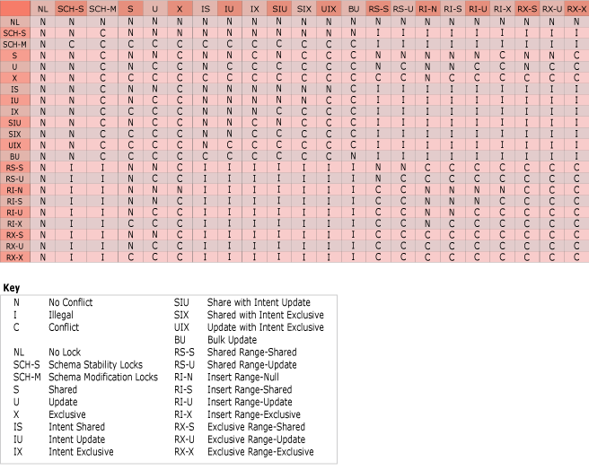
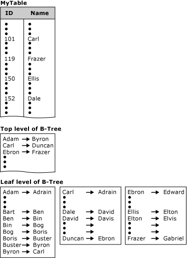
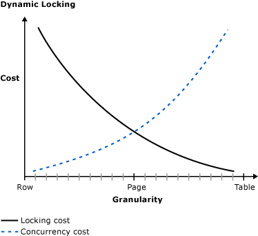
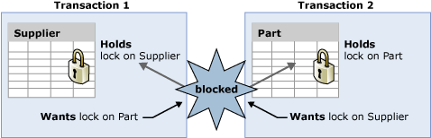
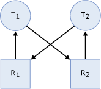

# SQL Server Transaction Locking and Row Versioning Guide
  In any database, mismanagement of transactions often leads to contention and performance problems in systems that have many users. As the number of users that access the data increases, it becomes important to have applications that use transactions efficiently. This guide describes the locking and row versioning mechanisms the [!INCLUDE[ssDEnoversion](../includes/ssdenoversion-md.md)] uses to ensure the physical integrity of each transaction and provides information on how applications can control transactions efficiently.  
  
**Applies to**: [!INCLUDE[ssVersion2005](../includes/ssversion2005-md.md)] through [!INCLUDE[ssCurrent](../includes/sscurrent-md.md)] unless noted otherwise.  
  
##  <a name="Top"></a> In This Guide  
 [Transaction Basics](#Basics)  
  
 [Locking and Row Versioning Basics](#Lock_Basics)  
  
 [Locking in the Database Engine](#Lock_Engine)  
  
 [Row Versioning-based Isolation Levels in the Database Engine](#Row_versioning)  
  
 [Customizing Locking for an Index](#Customize)  
  
 [Advanced Transaction Information](#Advanced)  
  
##  <a name="Basics"></a> Transaction Basics  
 A transaction is a sequence of operations performed as a single logical unit of work. A logical unit of work must exhibit four properties, called the atomicity, consistency, isolation, and durability (ACID) properties, to qualify as a transaction.  
  
 Atomicity  
 A transaction must be an atomic unit of work; either all of its data modifications are performed, or none of them are performed.  
  
 Consistency  
 When completed, a transaction must leave all data in a consistent state. In a relational database, all rules must be applied to the transaction's modifications to maintain all data integrity. All internal data structures, such as B-tree indexes or doubly-linked lists, must be correct at the end of the transaction.  
  
 Isolation  
 Modifications made by concurrent transactions must be isolated from the modifications made by any other concurrent transactions. A transaction either recognizes data in the state it was in before another concurrent transaction modified it, or it recognizes the data after the second transaction has completed, but it does not recognize an intermediate state. This is referred to as serializability because it results in the ability to reload the starting data and replay a series of transactions to end up with the data in the same state it was in after the original transactions were performed.  
  
 Durability  
 After a fully durable transaction has completed, its effects are permanently in place in the system. The modifications persist even in the event of a system failure. [!INCLUDE[ssSQL14](../includes/sssql14-md.md)] and later enable delayed durable transactions. Delayed durable transactions commit before the transaction log record is persisted to disk. For more information on delayed transaction durability see the topic [Transaction Durability](../relational-databases/logs/control-transaction-durability.md).  
  
 SQL programmers are responsible for starting and ending transactions at points that enforce the logical consistency of the data. The programmer must define the sequence of data modifications that leave the data in a consistent state relative to the organization's business rules. The programmer includes these modification statements in a single transaction so that the [!INCLUDE[ssDEnoversion](../includes/ssdenoversion-md.md)] can enforce the physical integrity of the transaction.  
  
 It is the responsibility of an enterprise database system, such as an instance of the [!INCLUDE[ssDE](../includes/ssde-md.md)], to provide mechanisms ensuring the physical integrity of each transaction. The [!INCLUDE[ssDE](../includes/ssde-md.md)] provides:  
  
-   Locking facilities that preserve transaction isolation.  
  
-   Logging facilities ensure transaction durability. For fully durable transactions the log record is hardened to disk before the transactions commits. Thus, even if the server hardware, operating system, or the instance of the [!INCLUDE[ssDE](../includes/ssde-md.md)] itself fails, the instance uses the transaction logs upon restart to automatically roll back any uncompleted transactions to the point of the system failure. Delayed durable transactions commit before the transaction log record is hardened to disk. Such transactions may be lost if there is a system failure before the log record is hardened to disk. For more information on delayed transaction durability see the topic [Transaction Durability](../relational-databases/logs/control-transaction-durability.md).  
  
-   Transaction management features that enforce transaction atomicity and consistency. After a transaction has started, it must be successfully completed (committed), or the [!INCLUDE[ssDE](../includes/ssde-md.md)] undoes all of the data modifications made since the transaction started. This operation is referred to as rolling back a transaction because it returns the data to the state it was prior to those changes.  
  
### Controlling Transactions  
 Applications control transactions mainly by specifying when a transaction starts and ends. This can be specified by using either [!INCLUDE[tsql](../includes/tsql-md.md)] statements or database application programming interface (API) functions. The system must also be able to correctly handle errors that terminate a transaction before it completes. For more information, see [Transaction Statements &#40;Transact-SQL&#41;](/sql/t-sql/language-elements/transactions-transact-sql), [Transactions in ODBC](https://technet.microsoft.com/library/ms131281.aspx) and [Transactions in SQL Server Native Client (OLEDB)](https://msdn.microsoft.com/library/ms130918.aspx).  
  
 By default, transactions are managed at the connection level. When a transaction is started on a connection, all [!INCLUDE[tsql](../includes/tsql-md.md)] statements executed on that connection are part of the transaction until the transaction ends. However, under a multiple active result set (MARS) session, a [!INCLUDE[tsql](../includes/tsql-md.md)] explicit or implicit transaction becomes a batch-scoped transaction that is managed at the batch level. When the batch completes, if the batch-scoped transaction is not committed or rolled back, it is automatically rolled back by [!INCLUDE[ssNoVersion](../includes/ssnoversion-md.md)]. For more information, see [Multiple Active Result Sets (MARS) in SQL Server](https://msdn.microsoft.com/library/ms345109(v=SQL.90).aspx).  
  
#### Starting Transactions  
 Using API functions and [!INCLUDE[tsql](../includes/tsql-md.md)] statements, you can start transactions in an instance of the [!INCLUDE[ssDEnoversion](../includes/ssdenoversion-md.md)] as explicit, autocommit, or implicit transactions.  
  
 **Explicit Transactions**  
 An explicit transaction is one in which you explicitly define both the start and end of the transaction through an API function or by issuing the [!INCLUDE[tsql](../includes/tsql-md.md)] BEGIN TRANSACTION, COMMIT TRANSACTION, COMMIT WORK, ROLLBACK TRANSACTION, or ROLLBACK WORK [!INCLUDE[tsql](../includes/tsql-md.md)] statements. When the transaction ends, the connection returns to the transaction mode it was in before the explicit transaction was started, either implicit or autocommit mode.  
  
 You can use all [!INCLUDE[tsql](../includes/tsql-md.md)] statements in an explicit transaction, except for the following statements:  
  
||||  
|-|-|-|  
|ALTER DATABASE|CREATE DATABASE|DROP FULLTEXT INDEX|  
|ALTER FULLTEXT CATALOG|CREATE FULLTEXT CATALOG|RECONFIGURE|  
|ALTER FULLTEXT INDEX|CREATE FULLTEXT INDEX|RESTORE|  
|BACKUP|DROP DATABASE|Full-text system stored procedures|  
|CREATE DATABASE|DROP FULLTEXT CATALOG|sp_dboption to set database options or any system procedure that modifies the master database inside explicit or implicit transactions.|  
  
> [!NOTE]  
>  UPDATE STATISTICS can be used inside an explicit transaction. However, UPDATE STATISTICS commits independently of the enclosing transaction and cannot be rolled back.  
  
 **Autocommit Transactions**  
 Autocommit mode is the default transaction management mode of the SQL Server Database Engine. Every Transact-SQL statement is committed or rolled back when it completes. If a statement completes successfully, it is committed; if it encounters any error, it is rolled back. A connection to an instance of the Database Engine operates in autocommit mode whenever this default mode has not been overridden by either explicit or implicit transactions. Autocommit mode is also the default mode for ADO, OLE DB, ODBC, and DB-Library.  
  
 **Implicit Transactions**  
 When a connection is operating in implicit transaction mode, the instance of the Database Engine automatically starts a new transaction after the current transaction is committed or rolled back. You do nothing to delineate the start of a transaction; you only commit or roll back each transaction. Implicit transaction mode generates a continuous chain of transactions. Set implicit transaction mode on through either an API function or the [!INCLUDE[tsql](../includes/tsql-md.md)] SET IMPLICIT_TRANSACTIONS ON statement.  
  
 After implicit transaction mode has been set on for a connection, the instance of the [!INCLUDE[ssDE](../includes/ssde-md.md)] automatically starts a transaction when it first executes any of these statements:  
  
||||  
|-|-|-|  
|ALTER TABLE|FETCH|REVOKE|  
|CREATE|GRANT|SELECT|  
|DELETE|INSERT|TRUNCATE TABLE|  
|DROP|OPEN|UPDATE|  
  
 **Batch-scoped Transactions**  
 Applicable only to multiple active result sets (MARS), a [!INCLUDE[tsql](../includes/tsql-md.md)] explicit or implicit transaction that starts under a MARS session becomes a batch-scoped transaction. A batch-scoped transaction that is not committed or rolled back when a batch completes is automatically rolled back by [!INCLUDE[ssNoVersion](../includes/ssnoversion-md.md)].  
  
 **Distributed Transactions**  
 Distributed transactions span two or more servers known as resource managers. The management of the transaction must be coordinated between the resource managers by a server component called a transaction manager. Each instance of the [!INCLUDE[ssDEnoversion](../includes/ssdenoversion-md.md)] can operate as a resource manager in distributed transactions coordinated by transaction managers, such as [!INCLUDE[msCoName](../includes/msconame-md.md)] Distributed Transaction Coordinator (MS DTC), or other transaction managers that support the Open Group XA specification for distributed transaction processing. For more information, see the MS DTC documentation.  
  
 A transaction within a single instance of the [!INCLUDE[ssDE](../includes/ssde-md.md)] that spans two or more databases is actually a distributed transaction. The instance manages the distributed transaction internally; to the user, it operates as a local transaction.  
  
 At the application, a distributed transaction is managed much the same as a local transaction. At the end of the transaction, the application requests the transaction to be either committed or rolled back. A distributed commit must be managed differently by the transaction manager to minimize the risk that a network failure may result in some resource managers successfully committing while others roll back the transaction. This is achieved by managing the commit process in two phases (the prepare phase and the commit phase), which is known as a two-phase commit (2PC).  
  
 Prepare phase  
 When the transaction manager receives a commit request, it sends a prepare command to all of the resource managers involved in the transaction. Each resource manager then does everything required to make the transaction durable, and all buffers holding log images for the transaction are flushed to disk. As each resource manager completes the prepare phase, it returns success or failure of the prepare to the transaction manager. [!INCLUDE[ssSQL14](../includes/sssql14-md.md)] introduced delayed transaction durability. Delayed durable transactions commit before log images for the transaction are flushed to disk. For more information on delayed transaction durability see the topic [Transaction Durability](../relational-databases/logs/control-transaction-durability.md).  
  
 Commit phase  
 If the transaction manager receives successful prepares from all of the resource managers, it sends commit commands to each resource manager. The resource managers can then complete the commit. If all of the resource managers report a successful commit, the transaction manager then sends a success notification to the application. If any resource manager reported a failure to prepare, the transaction manager sends a rollback command to each resource manager and indicates the failure of the commit to the application.  
  
 [!INCLUDE[ssDE](../includes/ssde-md.md)] applications can manage distributed transactions either through [!INCLUDE[tsql](../includes/tsql-md.md)] or the database API. For more information, see [BEGIN DISTRIBUTED TRANSACTION &#40;Transact-SQL&#41;](/sql/t-sql/language-elements/begin-distributed-transaction-transact-sql).  
  
#### Ending Transactions  
 You can end transactions with either a COMMIT or ROLLBACK statement, or through a corresponding API function.  
  
 COMMIT  
 If a transaction is successful, commit it. A COMMIT statement guarantees all of the transaction's modifications are made a permanent part of the database. A COMMIT also frees resources, such as locks, used by the transaction.  
  
 ROLLBACK  
 If an error occurs in a transaction, or if the user decides to cancel the transaction, then roll the transaction back. A ROLLBACK statement backs out all modifications made in the transaction by returning the data to the state it was in at the start of the transaction. A ROLLBACK also frees resources held by the transaction.  
  
> [!NOTE]  
>  Under connections enabled to support multiple active result sets (MARS), an explicit transaction started through an API function cannot be committed while there are pending requests for execution. Any attempt to commit this type of  transaction while there are outstanding operations running will result in an error.  
  
#### Errors During Transaction Processing  
 If an error prevents the successful completion of a transaction, [!INCLUDE[ssNoVersion](../includes/ssnoversion-md.md)] automatically rolls back the transaction and frees all resources held by the transaction. If the client's network connection to an instance of the [!INCLUDE[ssDE](../includes/ssde-md.md)] is broken, any outstanding transactions for the connection are rolled back when the network notifies the instance of the break. If the client application fails or if the client computer goes down or is restarted, this also breaks the connection, and the instance of the [!INCLUDE[ssDE](../includes/ssde-md.md)] rolls back any outstanding connections when the network notifies it of the break. If the client logs off the application, any outstanding transactions are rolled back.  
  
 If a run-time statement error (such as a constraint violation) occurs in a batch, the default behavior in the [!INCLUDE[ssDE](../includes/ssde-md.md)] is to roll back only the statement that generated the error. You can change this behavior using the SET XACT_ABORT statement. After SET XACT_ABORT ON is executed, any run-time statement error causes an automatic rollback of the current transaction. Compile errors, such as syntax errors, are not affected by SET XACT_ABORT. For more information, see [SET XACT_ABORT &#40;Transact-SQL&#41;](/sql/t-sql/statements/set-xact-abort-transact-sql).  
  
 When errors occur, corrective action (COMMIT or ROLLBACK) should be included in application code. One effective tool for handling errors, including those in transactions, is the [!INCLUDE[tsql](../includes/tsql-md.md)] TRY...CATCH construct. For more information with examples that include transactions, see [TRY...CATCH &#40;Transact-SQL&#41;](/sql/t-sql/language-elements/try-catch-transact-sql). Beginning with [!INCLUDE[ssSQL11](../includes/sssql11-md.md)], you can use the THROW statement to raise an exception and transfers execution to a CATCH block of a TRY...CATCH construct. For more information, see [THROW &#40;Transact-SQL&#41;](/sql/t-sql/language-elements/throw-transact-sql).  
  
##### Compile and Run-time Errors in Autocommit mode  
 In autocommit mode, it sometimes appears as if an instance of the [!INCLUDE[ssDE](../includes/ssde-md.md)] has rolled back an entire batch instead of just one SQL statement. This happens if the error encountered is a compile error, not a run-time error. A compile error prevents the [!INCLUDE[ssDE](../includes/ssde-md.md)] from building an execution plan, so nothing in the batch is executed. Although it appears that all of the statements before the one generating the error were rolled back, the error prevented anything in the batch from being executed. In the following example, none of the `INSERT` statements in the third batch are executed because of a compile error. It appears that the first two `INSERT` statements are rolled back when they are never executed.  
  
```sql
CREATE TABLE TestBatch (Cola INT PRIMARY KEY, Colb CHAR(3));  
GO  
INSERT INTO TestBatch VALUES (1, 'aaa');  
INSERT INTO TestBatch VALUES (2, 'bbb');  
INSERT INTO TestBatch VALUSE (3, 'ccc');  -- Syntax error.  
GO  
SELECT * FROM TestBatch;  -- Returns no rows.  
GO  
```  
  
 In the following example, the third `INSERT` statement generates a run-time duplicate primary key error. The first two `INSERT` statements are successful and committed, so they remain after the run-time error.  
  
```sql  
CREATE TABLE TestBatch (Cola INT PRIMARY KEY, Colb CHAR(3));  
GO  
INSERT INTO TestBatch VALUES (1, 'aaa');  
INSERT INTO TestBatch VALUES (2, 'bbb');  
INSERT INTO TestBatch VALUES (1, 'ccc');  -- Duplicate key error.  
GO  
SELECT * FROM TestBatch;  -- Returns rows 1 and 2.  
GO  
```  
  
 The [!INCLUDE[ssDE](../includes/ssde-md.md)] uses deferred name resolution, in which object names are not resolved until execution time. In the following example, the first two `INSERT` statements are executed and committed, and those two rows remain in the `TestBatch` table after the third `INSERT` statement generates a run-time error by referring to a table that does not exist.  
  
```sql
CREATE TABLE TestBatch (Cola INT PRIMARY KEY, Colb CHAR(3));  
GO  
INSERT INTO TestBatch VALUES (1, 'aaa');  
INSERT INTO TestBatch VALUES (2, 'bbb');  
INSERT INTO TestBch VALUES (3, 'ccc');  -- Table name error.  
GO  
SELECT * FROM TestBatch;  -- Returns rows 1 and 2.  
GO  
```  
  
  [In This Guide](#Top)  
  
##  <a name="Lock_Basics"></a> Locking and Row Versioning Basics  
 The [!INCLUDE[ssDEnoversion](../includes/ssdenoversion-md.md)] uses the following mechanisms to ensure the integrity of transactions and maintain the consistency of databases when multiple users are accessing data at the same time:  
  
-   Locking  
  
     Each transaction requests locks of different types on the resources, such as rows, pages, or tables, on which the transaction is dependent. The locks block other transactions from modifying the resources in a way that would cause problems for the transaction requesting the lock. Each transaction frees its locks when it no longer has a dependency on the locked resources.  
  
-   Row versioning  
  
     When a row versioning-based isolation level is enabled, the [!INCLUDE[ssDE](../includes/ssde-md.md)] maintains versions of each row that is modified. Applications can specify that a transaction use the row versions to view data as it existed at the start of the transaction or query instead of protecting all reads with locks. By using row versioning, the chance that a read operation will block other transactions is greatly reduced.  
  
 Locking and row versioning prevent users from reading uncommitted data and prevent multiple users from attempting to change the same data at the same time. Without locking or row versioning, queries executed against that data could produce unexpected results by returning data that has not yet been committed in the database.  
  
 Applications can choose transaction isolation levels, which define the level of protection for the transaction from modifications made by other transactions. Table-level hints can be specified for individual [!INCLUDE[tsql](../includes/tsql-md.md)] statements to further tailor behavior to fit the requirements of the application.  
  
### Managing Concurrent Data Access  
 Users who access a resource at the same time are said to be accessing the resource concurrently. Concurrent data access requires mechanisms to prevent adverse effects when multiple users try to modify resources that other users are actively using.  
  
#### Concurrency Effects  
 Users modifying data can affect other users who are reading or modifying the same data at the same time. These users are said to be accessing the data concurrently. If a data storage system has no concurrency control, users could see the following side effects:  
  
-   Lost updates  
  
     Lost updates occur when two or more transactions select the same row and then update the row based on the value originally selected. Each transaction is unaware of the other transactions. The last update overwrites updates made by the other transactions, which results in lost data.  
  
     For example, two editors make an electronic copy of the same document. Each editor changes the copy independently and then saves the changed copy thereby overwriting the original document. The editor who saves the changed copy last overwrites the changes made by the other editor. This problem could be avoided if one editor could not access the file until the other editor had finished and committed the transaction.  
  
-   Uncommitted dependency (dirty read)  
  
     Uncommitted dependency occurs when a second transaction selects a row that is being updated by another transaction. The second transaction is reading data that has not been committed yet and may be changed by the transaction updating the row.  
  
     For example, an editor is making changes to an electronic document. During the changes, a second editor takes a copy of the document that includes all the changes made so far, and distributes the document to the intended audience. The first editor then decides the changes made so far are wrong and removes the edits and saves the document. The distributed document contains edits that no longer exist and should be treated as if they never existed. This problem could be avoided if no one could read the changed document until the first editor does the final save of modifications and commits the transaction.  
  
-   Inconsistent analysis (nonrepeatable read)  
  
     Inconsistent analysis occurs when a second transaction accesses the same row several times and reads different data each time. Inconsistent analysis is similar to uncommitted dependency in that another transaction is changing the data that a second transaction is reading. However, in inconsistent analysis, the data read by the second transaction was committed by the transaction that made the change. Also, inconsistent analysis involves multiple reads (two or more) of the same row, and each time the information is changed by another transaction; thus, the term nonrepeatable read.  
  
     For example, an editor reads the same document twice, but between each reading the writer rewrites the document. When the editor reads the document for the second time, it has changed. The original read was not repeatable. This problem could be avoided if the writer could not change the document until the editor has finished reading it for the last time.  
  
-   Phantom reads  
  
     A phantom read is a situation that occurs when two identical queries are executed and the collection of rows returned by the second query is different. The example below shows how this may occur. Assume the two transactions below are executing at the same time. The two SELECT statements in the first transaction may return different results because the INSERT statement in the second transaction changes the data used by both.  
  
    ```  
    --Transaction 1  
    BEGIN TRAN;  
    SELECT ID FROM dbo.employee  
    WHERE ID > 5 and ID < 10;  
    --The INSERT statement from the second transaction occurs here.  
    SELECT ID FROM dbo.employee  
    WHERE ID > 5 and ID < 10;  
    COMMIT;  
  
    ```  
  
    ```  
    --Transaction 2  
    BEGIN TRAN;  
    INSERT INTO dbo.employee  
       SET name = 'New' WHERE ID = 5;  
    COMMIT;   
    ```  
  
-   Missing and double reads caused by row updates  
  
    -   Missing a updated row or seeing an updated row multiple times  
  
         Transactions that are running at the READ UNCOMMITTED level do not issue shared locks to prevent other transactions from modifying data read by the current transaction. Transactions that are running at the READ COMMITTED level do issue shared locks, but the row or page locks are released after the row is read. In either case, when you are scanning an index, if another user changes the index key column of the row during your read, the row might appear again if the key change moved the row to a position ahead of your scan. Similarly, the row might not appear if the key change moved the row to a position in the index that you had already read. To avoid this, use the SERIALIZABLE or HOLDLOCK hint, or row versioning. For more information, see [Table Hints &#40;Transact-SQL&#41;](/sql/t-sql/queries/hints-transact-sql-table).  
  
    -   Missing one or more rows that were not the target of update  
  
         When you are using READ UNCOMMITTED, if your query reads rows using an allocation order scan (using IAM pages), you might miss rows if another transaction is causing a page split. This cannot occur when you are using read committed because a table lock is held during a page split and does not happen if the table does not have a clustered index, because updates do not cause page splits.  
  
#### Types of Concurrency  
 When many people attempt to modify data in a database at the same time, a system of controls must be implemented so that modifications made by one person do not adversely affect those of another person. This is called concurrency control.  
  
 Concurrency control theory has two classifications for the methods of instituting concurrency control:  
  
-   Pessimistic concurrency control  
  
     A system of locks prevents users from modifying data in a way that affects other users. After a user performs an action that causes a lock to be applied, other users cannot perform actions that would conflict with the lock until the owner releases it. This is called pessimistic control because it is mainly used in environments where there is high contention for data, where the cost of protecting data with locks is less than the cost of rolling back transactions if concurrency conflicts occur.  
  
-   Optimistic concurrency control  
  
     In optimistic concurrency control, users do not lock data when they read it. When a user updates data, the system checks to see if another user changed the data after it was read. If another user updated the data, an error is raised. Typically, the user receiving the error rolls back the transaction and starts over. This is called optimistic because it is mainly used in environments where there is low contention for data, and where the cost of occasionally rolling back a transaction is lower than the cost of locking data when read.  
  
 [!INCLUDE[ssNoVersion](../includes/ssnoversion-md.md)] supports a range of concurrency control. Users specify the type of concurrency control by selecting transaction isolation levels for connections or concurrency options on cursors. These attributes can be defined using [!INCLUDE[tsql](../includes/tsql-md.md)] statements, or through the properties and attributes of database application programming interfaces (APIs) such as ADO, ADO.NET, OLE DB, and ODBC.  
  
#### Isolation Levels in the Database Engine  
 Transactions specify an isolation level that defines the degree to which one transaction must be isolated from resource or data modifications made by other transactions. Isolation levels are described in terms of which concurrency side-effects, such as dirty reads or phantom reads, are allowed.  
  
 Transaction isolation levels control:  
  
-   Whether locks are taken when data is read, and what type of locks are requested.  
  
-   How long the read locks are held.  
  
-   Whether a read operation referencing rows modified by another transaction:  
  
    -   Blocks until the exclusive lock on the row is freed.  
  
    -   Retrieves the committed version of the row that existed at the time the statement or transaction started.  
  
    -   Reads the uncommitted data modification.  
  
> [!IMPORTANT]  
>  Choosing a transaction isolation level does not affect the locks acquired to protect data modifications. A transaction always gets an exclusive lock on any data it modifies, and holds that lock until the transaction completes, regardless of the isolation level set for that transaction. For read operations, transaction isolation levels primarily define the level of protection from the effects of modifications made by other transactions.  
  
 A lower isolation level increases the ability of many users to access data at the same time, but increases the number of concurrency effects (such as dirty reads or lost updates) users might encounter. Conversely, a higher isolation level reduces the types of concurrency effects that users may encounter, but requires more system resources and increases the chances that one transaction will block another. Choosing the appropriate isolation level depends on balancing the data integrity requirements of the application against the overhead of each isolation level. The highest isolation level, serializable, guarantees that a transaction will retrieve exactly the same data every time it repeats a read operation, but it does this by performing a level of locking that is likely to impact other users in multi-user systems. The lowest isolation level, read uncommitted, may retrieve data that has been modified but not committed by other transactions. All of the concurrency side effects can happen in read uncommitted, but there is no read locking or versioning, so overhead is minimized.  
  
##### Database Engine Isolation Levels  
 The ISO standard defines the following isolation levels, all of which are supported by the [!INCLUDE[ssDEnoversion](../includes/ssdenoversion-md.md)]:  
  
|Isolation Level|Definition|  
|---------------------|----------------|  
|Read uncommitted|The lowest isolation level where transactions are isolated only enough to ensure that physically corrupt data is not read. In this level, dirty reads are allowed, so one transaction may see not-yet-committed changes made by other transactions.|  
|Read committed|Allows a transaction to read data previously read (not modified) by another transaction without waiting for the first transaction to complete. The [!INCLUDE[ssDE](../includes/ssde-md.md)] keeps write locks (acquired on selected data) until the end of the transaction, but read locks are released as soon as the SELECT operation is performed. This is the [!INCLUDE[ssDE](../includes/ssde-md.md)] default level.|  
|Repeatable read|The [!INCLUDE[ssDE](../includes/ssde-md.md)] keeps read and write locks that are acquired on selected data until the end of the transaction. However, because range-locks are not managed, phantom reads can occur.|  
|Serializable|The highest level where transactions are completely isolated from one another. The [!INCLUDE[ssDE](../includes/ssde-md.md)] keeps read and write locks acquired on selected data to be released at the end of the transaction. Range-locks are acquired when a SELECT operation uses a ranged WHERE clause, especially to avoid phantom reads.<br /><br /> **Note:** DDL operations and transactions on replicated tables may fail when serializable isolation level is requested. This is because replication queries use hints that may be incompatible with serializable isolation level.|  
  
 [!INCLUDE[ssNoVersion](../includes/ssnoversion-md.md)] also supports two additional transaction isolation levels that use row versioning. One is an implementation of read committed isolation, and one is a transaction isolation level, snapshot.  
  
|Row Versioning Isolation Level|Definition|  
|------------------------------------|----------------|  
|Read Committed Snapshot|When the READ_COMMITTED_SNAPSHOT database option is set ON, read committed isolation uses row versioning to provide statement-level read consistency. Read operations require only SCH-S table level locks and no page or row locks. That is, the Database Engine uses row versioning to present each statement with a transactionally consistent snapshot of the data as it existed at the start of the statement. Locks are not used to protect the data from updates by other transactions. A user-defined function can return data that was committed after the time the statement containing the UDF began.<br /><br /> When the READ_COMMITTED_SNAPSHOT database option is set OFF, which is the default setting, read committed isolation uses shared locks to prevent other transactions from modifying rows while the current transaction is running a read operation. The shared locks also block the statement from reading rows modified by other transactions until the other transaction is completed. Both implementations meet the ISO definition of read committed isolation.|  
|Snapshot|The snapshot isolation level uses row versioning to provide transaction-level read consistency. Read operations acquire no page or row locks; only SCH-S table locks are acquired. When reading rows modified by another transaction, they retrieve the version of the row that existed when the transaction started. You can only use Snapshot isolation against a database when the ALLOW_SNAPSHOT_ISOLATION database option is set ON. By default, this option is set OFF for user databases.<br /><br /> **Note:**  [!INCLUDE[ssNoVersion](../includes/ssnoversion-md.md)] does not support versioning of metadata. For this reason, there are restrictions on what DDL operations can be performed in an explicit transaction that is running under snapshot isolation. The following DDL statements are not permitted under snapshot isolation after a BEGIN TRANSACTION statement: ALTER TABLE, CREATE INDEX, CREATE XML INDEX, ALTER INDEX, DROP INDEX, DBCC REINDEX, ALTER PARTITION FUNCTION, ALTER PARTITION SCHEME, or any common language runtime (CLR) DDL statement. These statements are permitted when you are using snapshot isolation within implicit transactions. An implicit transaction, by definition, is a single statement that makes it possible to enforce the semantics of snapshot isolation, even with DDL statements. Violations of this principle can cause error 3961: "Snapshot isolation transaction failed in database '%.*ls' because the object accessed by the statement has been modified by a DDL statement in another concurrent transaction since the start of this transaction. It is not allowed because the metadata is not versioned. A concurrent update to metadata could lead to inconsistency if mixed with snapshot isolation."|  
  
 The following table shows the concurrency side effects enabled by the different isolation levels.  
  
|Isolation level|Dirty read|Nonrepeatable read|Phantom|  
|---------------------|----------------|------------------------|-------------|  
|**Read uncommitted**|Yes|Yes|Yes|  
|**Read committed**|No|Yes|Yes|  
|**Repeatable read**|No|No|Yes|  
|**Snapshot**|No|No|No|  
|**Serializable**|No|No|No|  
  
 For more information about the specific types of locking or row versioning controlled by each transaction isolation level, see [SET TRANSACTION ISOLATION LEVEL &#40;Transact-SQL&#41;](/sql/t-sql/statements/set-transaction-isolation-level-transact-sql).  
  
 Transaction isolation levels can be set using [!INCLUDE[tsql](../includes/tsql-md.md)] or through a database API.  
  
 [!INCLUDE[tsql](../includes/tsql-md.md)]  
 [!INCLUDE[tsql](../includes/tsql-md.md)] scripts use the SET TRANSACTION ISOLATION LEVEL statement.  
  
 ADO  
 ADO applications set the `IsolationLevel` property of the **Connection** object to adXactReadUncommitted, adXactReadCommitted, adXactRepeatableRead, or adXactReadSerializable.  
  
 ADO.NET  
 ADO.NET applications using the `System.Data.SqlClient` managed namespace can call the `SqlConnection.BeginTransaction` method and set the *IsolationLevel* option to Unspecified, Chaos, ReadUncommitted, ReadCommitted, RepeatableRead, Serializable, and Snapshot.  
  
 OLE DB  
 When starting a transaction, applications using OLE DB call `ITransactionLocal::StartTransaction` with *isoLevel* set to ISOLATIONLEVEL_READUNCOMMITTED, ISOLATIONLEVEL_READCOMMITTED, ISOLATIONLEVEL_REPEATABLEREAD, ISOLATIONLEVEL_SNAPSHOT, or ISOLATIONLEVEL_SERIALIZABLE.  
  
 When specifying the transaction isolation level in autocommit mode, OLE DB applications can set the DBPROPSET_SESSION property DBPROP_SESS_AUTOCOMMITISOLEVELS to DBPROPVAL_TI_CHAOS, DBPROPVAL_TI_READUNCOMMITTED, DBPROPVAL_TI_BROWSE, DBPROPVAL_TI_CURSORSTABILITY, DBPROPVAL_TI_READCOMMITTED, DBPROPVAL_TI_REPEATABLEREAD, DBPROPVAL_TI_SERIALIZABLE, DBPROPVAL_TI_ISOLATED, or DBPROPVAL_TI_SNAPSHOT.  
  
 ODBC  
 ODBC applications call `SQLSetConnectAttr` with *Attribute* set to SQL_ATTR_TXN_ISOLATION and *ValuePtr* set to SQL_TXN_READ_UNCOMMITTED, SQL_TXN_READ_COMMITTED, SQL_TXN_REPEATABLE_READ, or SQL_TXN_SERIALIZABLE.  
  
 For snapshot transactions, applications call `SQLSetConnectAttr` with Attribute set to SQL_COPT_SS_TXN_ISOLATION and ValuePtr set to SQL_TXN_SS_SNAPSHOT. A snapshot transaction can be retrieved using either SQL_COPT_SS_TXN_ISOLATION or SQL_ATTR_TXN_ISOLATION.  
  
  [In This Guide](#Top)  
  
##  <a name="Lock_Engine"></a> Locking in the Database Engine  
 Locking is a mechanism used by the [!INCLUDE[ssDEnoversion](../includes/ssdenoversion-md.md)] to synchronize access by multiple users to the same piece of data at the same time.  
  
 Before a transaction acquires a dependency on the current state of a piece of data, such as by reading or modifying the data, it must protect itself from the effects of another transaction modifying the same data. The transaction does this by requesting a lock on the piece of data. Locks have different modes, such as shared or exclusive. The lock mode defines the level of dependency the transaction has on the data. No transaction can be granted a lock that would conflict with the mode of a lock already granted on that data to another transaction. If a transaction requests a lock mode that conflicts with a lock that has already been granted on the same data, the instance of the [!INCLUDE[ssDE](../includes/ssde-md.md)] will pause the requesting transaction until the first lock is released.  
  
 When a transaction modifies a piece of data, it holds the lock protecting the modification until the end of the transaction. How long a transaction holds the locks acquired to protect read operations depends on the transaction isolation level setting. All locks held by a transaction are released when the transaction completes (either commits or rolls back).  
  
 Applications do not typically request locks directly. Locks are managed internally by a part of the [!INCLUDE[ssDE](../includes/ssde-md.md)] called the lock manager. When an instance of the [!INCLUDE[ssDE](../includes/ssde-md.md)] processes a [!INCLUDE[tsql](../includes/tsql-md.md)] statement, the [!INCLUDE[ssDE](../includes/ssde-md.md)] query processor determines which resources are to be accessed. The query processor determines what types of locks are required to protect each resource based on the type of access and the transaction isolation level setting. The query processor then requests the appropriate locks from the lock manager. The lock manager grants the locks if there are no conflicting locks held by other transactions.  
  
### Lock Granularity and Hierarchies  
 The [!INCLUDE[ssDEnoversion](../includes/ssdenoversion-md.md)] has multigranular locking that allows different types of resources to be locked by a transaction. To minimize the cost of locking, the [!INCLUDE[ssDE](../includes/ssde-md.md)] locks resources automatically at a level appropriate to the task. Locking at a smaller granularity, such as rows, increases concurrency but has a higher overhead because more locks must be held if many rows are locked. Locking at a larger granularity, such as tables, are expensive in terms of concurrency because locking an entire table restricts access to any part of the table by other transactions. However, it has a lower overhead because fewer locks are being maintained.  
  
 The [!INCLUDE[ssDE](../includes/ssde-md.md)] often has to acquire locks at multiple levels of granularity to fully protect a resource. This group of locks at multiple levels of granularity is called a lock hierarchy. For example, to fully protect a read of an index, an instance of the [!INCLUDE[ssDE](../includes/ssde-md.md)] may have to acquire share locks on rows and intent share locks on the pages and table.  
  
 The following table shows the resources that the [!INCLUDE[ssDE](../includes/ssde-md.md)] can lock.  
  
|Resource|Description|  
|--------------|-----------------|  
|RID|A row identifier used to lock a single row within a heap.|  
|KEY|A row lock within an index used to protect key ranges in serializable transactions.|  
|PAGE|An 8-kilobyte (KB) page in a database, such as data or index pages.|  
|EXTENT|A contiguous group of eight pages, such as data or index pages.|  
|HoBT|A heap or B-tree. A lock protecting a B-tree (index) or the heap data pages in a table that does not have a clustered index.|  
|TABLE|The entire table, including all data and indexes.|  
|FILE|A database file.|  
|APPLICATION|An application-specified resource.|  
|METADATA|Metadata locks.|  
|ALLOCATION_UNIT|An allocation unit.|  
|DATABASE|The entire database.|  
  
> [!NOTE]  
>  HoBT and TABLE locks can be affected by the LOCK_ESCALATION option of [ALTER TABLE](/sql/t-sql/statements/alter-table-transact-sql).  
  
### Lock Modes  
 The [!INCLUDE[ssDEnoversion](../includes/ssdenoversion-md.md)] locks resources using different lock modes that determine how the resources can be accessed by concurrent transactions.  
  
 The following table shows the resource lock modes that the [!INCLUDE[ssDE](../includes/ssde-md.md)] uses.  
  
|Lock mode|Description|  
|---------------|-----------------|  
|Shared (S)|Used for read operations that do not change or update data, such as a SELECT statement.|  
|Update (U)|Used on resources that can be updated. Prevents a common form of deadlock that occurs when multiple sessions are reading, locking, and potentially updating resources later.|  
|Exclusive (X)|Used for data-modification operations, such as INSERT, UPDATE, or DELETE. Ensures that multiple updates cannot be made to the same resource at the same time.|  
|Intent|Used to establish a lock hierarchy. The types of intent locks are: intent shared (IS), intent exclusive (IX), and shared with intent exclusive (SIX).|  
|Schema|Used when an operation dependent on the schema of a table is executing. The types of schema locks are: schema modification (Sch-M) and schema stability (Sch-S).|  
|Bulk Update (BU)|Used when bulk copying data into a table and the **TABLOCK** hint is specified.|  
|Key-range|Protects the range of rows read by a query when using the serializable transaction isolation level. Ensures that other transactions cannot insert rows that would qualify for the queries of the serializable transaction if the queries were run again.|  
  
#### Shared Locks  
 Shared (S) locks allow concurrent transactions to read (SELECT) a resource under pessimistic concurrency control. No other transactions can modify the data while shared (S) locks exist on the resource. Shared (S) locks on a resource are released as soon as the read operation completes, unless the transaction isolation level is set to repeatable read or higher, or a locking hint is used to retain the shared (S) locks for the duration of the transaction.  
  
#### Update Locks  
 Update (U) locks prevent a common form of deadlock. In a repeatable read or serializable transaction, the transaction reads data, acquiring a shared (S) lock on the resource (page or row), and then modifies the data, which requires lock conversion to an exclusive (X) lock. If two transactions acquire shared-mode locks on a resource and then attempt to update data concurrently, one transaction attempts the lock conversion to an exclusive (X) lock. The shared-mode-to-exclusive lock conversion must wait because the exclusive lock for one transaction is not compatible with the shared-mode lock of the other transaction; a lock wait occurs. The second transaction attempts to acquire an exclusive (X) lock for its update. Because both transactions are converting to exclusive (X) locks, and they are each waiting for the other transaction to release its shared-mode lock, a deadlock occurs.  
  
 To avoid this potential deadlock problem, update (U) locks are used. Only one transaction can obtain an update (U) lock to a resource at a time. If a transaction modifies a resource, the update (U) lock is converted to an exclusive (X) lock.  
  
#### Exclusive Locks  
 Exclusive (X) locks prevent access to a resource by concurrent transactions. With an exclusive (X) lock, no other transactions can modify data; read operations can take place only with the use of the NOLOCK hint or read uncommitted isolation level.  
  
 Data modification statements, such as INSERT, UPDATE, and DELETE combine both modification and read operations. The statement first performs read operations to acquire data before performing the required modification operations. Data modification statements, therefore, typically request both shared locks and exclusive locks. For example, an UPDATE statement might modify rows in one table based on a join with another table. In this case, the UPDATE statement requests shared locks on the rows read in the join table in addition to requesting exclusive locks on the updated rows.  
  
#### Intent Locks  
 The [!INCLUDE[ssDE](../includes/ssde-md.md)] uses intent locks to protect placing a shared (S) lock or exclusive (X) lock on a resource lower in the lock hierarchy. Intent locks are named intent locks because they are acquired before a lock at the lower level, and therefore signal intent to place locks at a lower level.  
  
 Intent locks serve two purposes:  
  
-   To prevent other transactions from modifying the higher-level resource in a way that would invalidate the lock at the lower level.  
  
-   To improve the efficiency of the [!INCLUDE[ssDE](../includes/ssde-md.md)] in detecting lock conflicts at the higher level of granularity.  
  
 For example, a shared intent lock is requested at the table level before shared (S) locks are requested on pages or rows within that table. Setting an intent lock at the table level prevents another transaction from subsequently acquiring an exclusive (X) lock on the table containing that page. Intent locks improve performance because the [!INCLUDE[ssDE](../includes/ssde-md.md)] examines intent locks only at the table level to determine if a transaction can safely acquire a lock on that table. This removes the requirement to examine every row or page lock on the table to determine if a transaction can lock the entire table.  
  
 Intent locks include intent shared (IS), intent exclusive (IX), and shared with intent exclusive (SIX).  
  
|Lock mode|Description|  
|---------------|-----------------|  
|Intent shared (IS)|Protects requested or acquired shared locks on some (but not all) resources lower in the hierarchy.|  
|Intent exclusive (IX)|Protects requested or acquired exclusive locks on some (but not all) resources lower in the hierarchy. IX is a superset of IS, and it also protects requesting shared locks on lower level resources.|  
|Shared with intent exclusive (SIX)|Protects requested or acquired shared locks on all resources lower in the hierarchy and intent exclusive locks on some (but not all) of the lower level resources. Concurrent IS locks at the top-level resource are allowed. For example, acquiring a SIX lock on a table also acquires intent exclusive locks on the pages being modified and exclusive locks on the modified rows. There can be only one SIX lock per resource at one time, preventing updates to the resource made by other transactions, although other transactions can read resources lower in the hierarchy by obtaining IS locks at the table level.|  
|Intent update (IU)|Protects requested or acquired update locks on all resources lower in the hierarchy. IU locks are used only on page resources. IU locks are converted to IX locks if an update operation takes place.|  
|Shared intent update (SIU)|A combination of S and IU locks, as a result of acquiring these locks separately and simultaneously holding both locks. For example, a transaction executes a query with the PAGLOCK hint and then executes an update operation. The query with the PAGLOCK hint acquires the S lock, and the update operation acquires the IU lock.|  
|Update intent exclusive (UIX)|A combination of U and IX locks, as a result of acquiring these locks separately and simultaneously holding both locks.|  
  
#### Schema Locks  
 The [!INCLUDE[ssDE](../includes/ssde-md.md)] uses schema modification (Sch-M) locks during a table data definition language (DDL) operation, such as adding a column or dropping a table. During the time that it is held, the Sch-M lock prevents concurrent access to the table. This means the Sch-M lock blocks all outside operations until the lock is released.  
  
 Some data manipulation language (DML) operations, such as table truncation, use Sch-M locks to prevent access to affected tables by concurrent operations.  
  
 The [!INCLUDE[ssDE](../includes/ssde-md.md)] uses schema stability (Sch-S) locks when compiling and executing queries. Sch-S locks do not block any transactional locks, including exclusive (X) locks. Therefore, other transactions, including those with X locks on a table, continue to run while a query is being compiled. However, concurrent DDL operations, and concurrent DML operations that acquire Sch-M locks, cannot be performed on the table.  
  
#### Bulk Update Locks  
 Bulk update (BU) locks allow multiple threads to bulk load data concurrently into the same table while preventing other processes that are not bulk loading data from accessing the table. The [!INCLUDE[ssDE](../includes/ssde-md.md)] uses bulk update (BU) locks when both of the following conditions are true.  
  
-   You use the Transact-SQL BULK INSERT statement, or the OPENROWSET(BULK) function, or you use one of the Bulk Insert API commands such as .NET SqlBulkCopy, OLEDB Fast Load APIs, or the ODBC Bulk Copy APIs to bulk copy data into a table.  
  
-   The **TABLOCK** hint is specified or the **table lock on bulk load** table option is set using **sp_tableoption**.  
  
> [!TIP]  
>  Unlike the BULK INSERT statement, which holds a less restrictive Bulk Update lock, INSERT INTO...SELECT with the TABLOCK hint holds an exclusive (X) lock on the table. This means that you cannot insert rows using parallel insert operations.  
  
#### Key-Range Locks  
 Key-range locks protect a range of rows implicitly included in a record set being read by a [!INCLUDE[tsql](../includes/tsql-md.md)] statement while using the serializable transaction isolation level. Key-range locking prevents phantom reads. By protecting the ranges of keys between rows, it also prevents phantom insertions or deletions into a record set accessed by a transaction.  
  
### Lock Compatibility  
 Lock compatibility controls whether multiple transactions can acquire locks on the same resource at the same time. If a resource is already locked by another transaction, a new lock request can be granted only if the mode of the requested lock is compatible with the mode of the existing lock. If the mode of the requested lock is not compatible with the existing lock, the transaction requesting the new lock waits for the existing lock to be released or for the lock timeout interval to expire. For example, no lock modes are compatible with exclusive locks. While an exclusive (X) lock is held, no other transaction can acquire a lock of any kind (shared, update, or exclusive) on that resource until the exclusive (X) lock is released. Alternatively, if a shared (S) lock has been applied to a resource, other transactions can also acquire a shared lock or an update (U) lock on that item even if the first transaction has not completed. However, other transactions cannot acquire an exclusive lock until the shared lock has been released.  
  
 The following table shows the compatibility of the most commonly encountered lock modes.  
  
||Existing granted mode||||||  
|------|---------------------------|------|------|------|------|------|  
|**Requested mode**|**IS**|**S**|**U**|**IX**|**SIX**|**X**|  
|**Intent shared (IS)**|Yes|Yes|Yes|Yes|Yes|No|  
|**Shared (S)**|Yes|Yes|Yes|No|No|No|  
|**Update (U)**|Yes|Yes|No|No|No|No|  
|**Intent exclusive (IX)**|Yes|No|No|Yes|No|No|  
|**Shared with intent exclusive (SIX)**|Yes|No|No|No|No|No|  
|**Exclusive (X)**|No|No|No|No|No|No|  
  
> [!NOTE]  
>  An intent exclusive (IX) lock is compatible with an IX lock mode because IX means the intention is to update only some of the rows rather than all of them. Other transactions that attempt to read or update some of the rows are also permitted as long as they are not the same rows being updated by other transactions. Further, if two transactions attempt to update the same row, both transactions will be granted an IX lock at table and page level. However, one transaction will be granted an X lock at row level. The other transaction must wait until the row-level lock is removed.  
  
 Use the following table to determine the compatibility of all the lock modes available in [!INCLUDE[ssNoVersion](../includes/ssnoversion-md.md)].  
  
   
  
### Key-Range Locking  
 Key-range locks protect a range of rows implicitly included in a record set being read by a [!INCLUDE[tsql](../includes/tsql-md.md)] statement while using the serializable transaction isolation level. The serializable isolation level requires that any query executed during a transaction must obtain the same set of rows every time it is executed during the transaction. A key range lock protects this requirement by preventing other transactions from inserting new rows whose keys would fall in the range of keys read by the serializable transaction.  
  
 Key-range locking prevents phantom reads. By protecting the ranges of keys between rows, it also prevents phantom insertions into a set of records accessed by a transaction.  
  
 A key-range lock is placed on an index, specifying a beginning and ending key value. This lock blocks any attempt to insert, update, or delete any row with a key value that falls in the range because those operations would first have to acquire a lock on the index. For example, a serializable transaction could issue a SELECT statement that reads all rows whose key values are between **'**AAA**'** and **'**CZZ**'**. A key-range lock on the key values in the range from **'**AAA**'** to **'**CZZ**'** prevents other transactions from inserting rows with key values anywhere in that range, such as **'**ADG**'**, **'**BBD**'**, or **'**CAL**'**.  
  
#### Key-Range Lock Modes  
 Key-range locks include both a range and a row component specified in range-row format:  
  
-   Range represents the lock mode protecting the range between two consecutive index entries.  
  
-   Row represents the lock mode protecting the index entry.  
  
-   Mode represents the combined lock mode used. Key-range lock modes consist of two parts. The first represents the type of lock used to lock the index range (Range*T*) and the second represents the lock type used to lock a specific key (*K*). The two parts are connected with a hyphen (-), such as Range*T*-*K*.  
  
    |Range|Row|Mode|Description|  
    |-----------|---------|----------|-----------------|  
    |RangeS|S|RangeS-S|Shared range, shared resource lock; serializable range scan.|  
    |RangeS|U|RangeS-U|Shared range, update resource lock; serializable update scan.|  
    |RangeI|Null|RangeI-N|Insert range, null resource lock; used to test ranges before inserting a new key into an index.|  
    |RangeX|X|RangeX-X|Exclusive range, exclusive resource lock; used when updating a key in a range.|  
  
> [!NOTE]  
>  The internal Null lock mode is compatible with all other lock modes.  
  
 Key-range lock modes have a compatibility matrix that shows which locks are compatible with other locks obtained on overlapping keys and ranges.  
  
||Existing granted mode|||||||  
|------|---------------------------|------|------|------|------|------|------|  
|**Requested mode**|**S**|**U**|**X**|**RangeS-S**|**RangeS-U**|**RangeI-N**|**RangeX-X**|  
|**Shared (S)**|Yes|Yes|No|Yes|Yes|Yes|No|  
|**Update (U)**|Yes|No|No|Yes|No|Yes|No|  
|**Exclusive (X)**|No|No|No|No|No|Yes|No|  
|**RangeS-S**|Yes|Yes|No|Yes|Yes|No|No|  
|**RangeS-U**|Yes|No|No|Yes|No|No|No|  
|**RangeI-N**|Yes|Yes|Yes|No|No|Yes|No|  
|**RangeX-X**|No|No|No|No|No|No|No|  
  
#### Conversion Locks  
 Conversion locks are created when a key-range lock overlaps another lock.  
  
|Lock 1|Lock 2|Conversion lock|  
|------------|------------|---------------------|  
|S|RangeI-N|RangeI-S|  
|U|RangeI-N|RangeI-U|  
|X|RangeI-N|RangeI-X|  
|RangeI-N|RangeS-S|RangeX-S|  
|RangeI-N|RangeS-U|RangeX-U|  
  
 Conversion locks can be observed for a short period of time under different complex circumstances, sometimes while running concurrent processes.  
  
#### Serializable Range Scan, Singleton Fetch, Delete, and Insert  
 Key-range locking ensures that the following operations are serializable:  
  
-   Range scan query  
  
-   Singleton fetch of nonexistent row  
  
-   Delete operation  
  
-   Insert operation  
  
 Before key-range locking can occur, the following conditions must be satisfied:  
  
-   The transaction-isolation level must be set to SERIALIZABLE.  
  
-   The query processor must use an index to implement the range filter predicate. For example, the WHERE clause in a SELECT statement could establish a range condition with this predicate: ColumnX BETWEEN N**'**AAA**'** AND N**'**CZZ**'**. A key-range lock can only be acquired if **ColumnX** is covered by an index key.  
  
#### Examples  
 The following table and index are used as a basis for the key-range locking examples that follow.  
  
   
  
##### Range Scan Query  
 To ensure a range scan query is serializable, the same query should return the same results each time it is executed within the same transaction. New rows must not be inserted within the range scan query by other transactions; otherwise, these become phantom inserts. For example, the following query uses the table and index in the previous illustration:  
  
```  
SELECT name  
    FROM mytable  
    WHERE name BETWEEN 'A' AND 'C';  
```  
  
 Key-range locks are placed on the index entries corresponding to the range of data rows where the name is between the values Adam and Dale, preventing new rows qualifying in the previous query from being added or deleted. Although the first name in this range is Adam, the RangeS-S mode key-range lock on this index entry ensures that no new names beginning with the letter A can be added before Adam, such as Abigail. Similarly, the RangeS-S key-range lock on the index entry for Dale ensures that no new names beginning with the letter C can be added after Carlos, such as Clive.  
  
> [!NOTE]  
>  The number of RangeS-S locks held is *n*+1, where *n* is the number of rows that satisfy the query.  
  
##### Singleton Fetch of Nonexistent Data  
 If a query within a transaction attempts to select a row that does not exist, issuing the query at a later point within the same transaction has to return the same result. No other transaction can be allowed to insert that nonexistent row. For example, given this query:  
  
```  
SELECT name  
    FROM mytable  
    WHERE name = 'Bill';  
```  
  
 A key-range lock is placed on the index entry corresponding to the name range from `Ben` to `Bing` because the name `Bill` would be inserted between these two adjacent index entries. The RangeS-S mode key-range lock is placed on the index entry `Bing`. This prevents any other transaction from inserting values, such as `Bill`, between the index entries `Ben` and `Bing`.  
  
##### Delete Operation  
 When deleting a value within a transaction, the range the value falls into does not have to be locked for the duration of the transaction performing the delete operation. Locking the deleted key value until the end of the transaction is sufficient to maintain serializability. For example, given this DELETE statement:  
  
```  
DELETE mytable  
    WHERE name = 'Bob';  
```  
  
 An exclusive (X) lock is placed on the index entry corresponding to the name `Bob`. Other transactions can insert or delete values before or after the deleted value `Bob`. However, any transaction that attempts to read, insert, or delete the value `Bob` will be blocked until the deleting transaction either commits or rolls back.  
  
 Range delete can be executed using three basic lock modes: row, page, or table lock. The row, page, or table locking strategy is decided by query optimizer or can be specified by the user through optimizer hints such as ROWLOCK, PAGLOCK, or TABLOCK. When PAGLOCK or TABLOCK is used, the [!INCLUDE[ssDE](../includes/ssde-md.md)] immediately deallocates an index page if all rows are deleted from this page. In contrast, when ROWLOCK is used, all deleted rows are marked only as deleted; they are removed from the index page later using a background task.  
  
##### Insert Operation  
 When inserting a value within a transaction, the range the value falls into does not have to be locked for the duration of the transaction performing the insert operation. Locking the inserted key value until the end of the transaction is sufficient to maintain serializability. For example, given this INSERT statement:  
  
```  
INSERT mytable VALUES ('Dan');  
```  
  
 The RangeI-N mode key-range lock is placed on the index entry corresponding to the name David to test the range. If the lock is granted, `Dan` is inserted and an exclusive (X) lock is placed on the value `Dan`. The RangeI-N mode key-range lock is necessary only to test the range and is not held for the duration of the transaction performing the insert operation. Other transactions can insert or delete values before or after the inserted value `Dan`. However, any transaction attempting to read, insert, or delete the value `Dan` will be locked until the inserting transaction either commits or rolls back.  
  
### Dynamic Locking  
 Using low-level locks, such as row locks, increases concurrency by decreasing the probability that two transactions will request locks on the same piece of data at the same time. Using low-level locks also increases the number of locks and the resources needed to manage them. Using high-level table or page locks lowers overhead, but at the expense of lowering concurrency.  
  
   
  
 The [!INCLUDE[msCoName](../includes/msconame-md.md)] [!INCLUDE[ssDEnoversion](../includes/ssdenoversion-md.md)] uses a dynamic locking strategy to determine the most cost-effective locks. The [!INCLUDE[ssDE](../includes/ssde-md.md)] automatically determines what locks are most appropriate when the query is executed, based on the characteristics of the schema and query. For example, to reduce the overhead of locking, the optimizer may choose page-level locks in an index when performing an index scan.  
  
 Dynamic locking has the following advantages:  
  
-   Simplified database administration. Database administrators do not have to adjust lock escalation thresholds.  
  
-   Increased performance. The [!INCLUDE[ssDE](../includes/ssde-md.md)] minimizes system overhead by using locks appropriate to the task.  
  
-   Application developers can concentrate on development. The [!INCLUDE[ssDE](../includes/ssde-md.md)] adjusts locking automatically.  
  
 In [!INCLUDE[ssKatmai](../includes/sskatmai-md.md)] and later versions, the behavior of lock escalation has changed with the introduction of the LOCK_ESCALATION option. For more information, see the LOCK_ESCALATION option of [ALTER TABLE](/sql/t-sql/statements/alter-table-transact-sql).  
  
### Deadlocking  
 A deadlock occurs when two or more tasks permanently block each other by each task having a lock on a resource which the other tasks are trying to lock. For example:  
  
-   Transaction A acquires a share lock on row 1.  
  
-   Transaction B acquires a share lock on row 2.  
  
-   Transaction A now requests an exclusive lock on row 2, and is blocked until transaction B finishes and releases the share lock it has on row 2.  
  
-   Transaction B now requests an exclusive lock on row 1, and is blocked until transaction A finishes and releases the share lock it has on row 1.  
  
 Transaction A cannot complete until transaction B completes, but transaction B is blocked by transaction A. This condition is also called a cyclic dependency: Transaction A has a dependency on transaction B, and transaction B closes the circle by having a dependency on transaction A.  
  
 Both transactions in a deadlock will wait forever unless the deadlock is broken by an external process. The [!INCLUDE[ssDEnoversion](../includes/ssdenoversion-md.md)] deadlock monitor periodically checks for tasks that are in a deadlock. If the monitor detects a cyclic dependency, it chooses one of the tasks as a victim and terminates its transaction with an error. This allows the other task to complete its transaction. The application with the transaction that terminated with an error can retry the transaction, which usually completes after the other deadlocked transaction has finished.  
  
 Deadlocking is often confused with normal blocking. When a transaction requests a lock on a resource locked by another transaction, the requesting transaction waits until the lock is released. By default, [!INCLUDE[ssNoVersion](../includes/ssnoversion-md.md)] transactions do not time out, unless LOCK_TIMEOUT is set. The requesting transaction is blocked, not deadlocked, because the requesting transaction has not done anything to block the transaction owning the lock. Eventually, the owning transaction will complete and release the lock, and then the requesting transaction will be granted the lock and proceed.  
  
 Deadlocks are sometimes called a deadly embrace.  
  
 Deadlock is a condition that can occur on any system with multiple threads, not just on a relational database management system, and can occur for resources other than locks on database objects. For example, a thread in a multithreaded operating system might acquire one or more resources, such as blocks of memory. If the resource being acquired is currently owned by another thread, the first thread may have to wait for the owning thread to release the target resource. The waiting thread is said to have a dependency on the owning thread for that particular resource. In an instance of the [!INCLUDE[ssDE](../includes/ssde-md.md)], sessions can deadlock when acquiring nondatabase resources, such as memory or threads.  
  
   
  
 In the illustration, transaction T1 has a dependency on transaction T2 for the **Part** table lock resource. Similarly, transaction T2 has a dependency on transaction T1 for the **Supplier** table lock resource. Because these dependencies form a cycle, there is a deadlock between transactions T1 and T2.  
  
 Deadlocks can also occur when a table is partitioned and the LOCK_ESCALATION setting of ALTER TABLE is set to AUTO. When LOCK_ESCALATION is set to AUTO, concurrency increases by allowing the [!INCLUDE[ssDE](../includes/ssde-md.md)] to lock table partitions at the HoBT level instead of at the TABLE level. However, when separate transactions hold partition locks in a table and want a lock somewhere on the other transactions partition, this causes a deadlock. This type of deadlock can be avoided by setting LOCK_ESCALATION to TABLE; although this setting will reduce concurrency by forcing large updates to a partition to wait for a table lock.  
  
#### Detecting and Ending Deadlocks  
 A deadlock occurs when two or more tasks permanently block each other by each task having a lock on a resource which the other tasks are trying to lock. The following graph presents a high level view of a deadlock state where:  
  
-   Task T1 has a lock on resource R1 (indicated by the arrow from R1 to T1) and has requested a lock on resource R2 (indicated by the arrow from T1 to R2).  
  
-   Task T2 has a lock on resource R2 (indicated by the arrow from R2 to T2) and has requested a lock on resource R1 (indicated by the arrow from T2 to R1).  
  
-   Because neither task can continue until a resource is available and neither resource can be released until a task continues, a deadlock state exists.  
  
   
  
 The [!INCLUDE[ssDEnoversion](../includes/ssdenoversion-md.md)] automatically detects deadlock cycles within [!INCLUDE[ssNoVersion](../includes/ssnoversion-md.md)]. The [!INCLUDE[ssDE](../includes/ssde-md.md)] chooses one of the sessions as a deadlock victim and the current transaction is terminated with an error to break the deadlock.  
  
##### Resources That Can Deadlock  
 Each user session might have one or more tasks running on its behalf where each task might acquire or wait to acquire a variety of resources. The following types of resources can cause blocking that could result in a deadlock.  
  
-   **Locks**. Waiting to acquire locks on resources, such as objects, pages, rows, metadata, and applications can cause deadlock. For example, transaction T1 has a shared (S) lock on row r1 and is waiting to get an exclusive (X) lock on r2. Transaction T2 has a shared (S) lock on r2 and is waiting to get an exclusive (X) lock on row r1. This results in a lock cycle in which T1 and T2 wait for each other to release the locked resources.  
  
-   **Worker threads**. A queued task waiting for an available worker thread can cause deadlock. If the queued task owns resources that are blocking all worker threads, a deadlock will result. For example, session S1 starts a transaction and acquires a shared (S) lock on row r1 and then goes to sleep. Active sessions running on all available worker threads are trying to acquire exclusive (X) locks on row r1. Because session S1 cannot acquire a worker thread, it cannot commit the transaction and release the lock on row r1. This results in a deadlock.  
  
-   **Memory**. When concurrent requests are waiting for memory grants that cannot be satisfied with the available memory, a deadlock can occur. For example, two concurrent queries, Q1 and Q2, execute as user-defined functions that acquire 10MB and 20MB of memory respectively. If each query needs 30MB and the total available memory is 20MB, then Q1 and Q2 must wait for each other to release memory, and this results in a deadlock.  
  
-   **Parallel query execution-related resources** Coordinator, producer, or consumer threads associated with an exchange port may block each other causing a deadlock usually when including at least one other process that is not a part of the parallel query. Also, when a parallel query starts execution, [!INCLUDE[ssNoVersion](../includes/ssnoversion-md.md)] determines the degree of parallelism, or the number of worker threads, based upon the current workload. If the system workload unexpectedly changes, for example, where new queries start running on the server or the system runs out of worker threads, then a deadlock could occur.  
  
-   **Multiple Active Result Sets (MARS) resources**. These resources are used to control interleaving of multiple active requests under MARS. For more information, see [Multiple Active Result Sets (MARS) in SQL Server](https://msdn.microsoft.com/library/ms345109(v=SQL.90).aspx).  
  
    -   **User resource**. When a thread is waiting for a resource that is potentially controlled by a user application, the resource is considered to be an external or user resource and is treated like a lock.  
  
    -   **Session mutex**. The tasks running in one session are interleaved, meaning that only one task can run under the session at a given time. Before the task can run, it must have exclusive access to the session mutex.  
  
    -   **Transaction mutex**. All tasks running in one transaction are interleaved, meaning that only one task can run under the transaction at a given time. Before the task can run, it must have exclusive access to the transaction mutex.  
  
     In order for a task to run under MARS, it must acquire the session mutex. If the task is running under a transaction, it must then acquire the transaction mutex. This guarantees that only one task is active at one time in a given session and a given transaction. Once the required mutexes have been acquired, the task can execute. When the task finishes, or yields in the middle of the request, it will first release transaction mutex followed by the session mutex in reverse order of acquisition. However, deadlocks can occur with these resources. In the following code example, two tasks, user request U1 and user request U2, are running in the same session.  
  
    ```  
    U1:    Rs1=Command1.Execute("insert sometable EXEC usp_someproc");  
    U2:    Rs2=Command2.Execute("select colA from sometable");  
    ```  
  
     The stored procedure executing from user request U1 has acquired the session mutex. If the stored procedure takes a long time to execute, it is assumed by the [!INCLUDE[ssDE](../includes/ssde-md.md)] that the stored procedure is waiting for input from the user. User request U2 is waiting for the session mutex while the user is waiting for the result set from U2, and U1 is waiting for a user resource. This is deadlock state logically illustrated as:  
  
   
  
##### Deadlock Detection  
 All of the resources listed in the section above participate in the [!INCLUDE[ssDE](../includes/ssde-md.md)] deadlock detection scheme. Deadlock detection is performed by a lock monitor thread that periodically initiates a search through all of the tasks in an instance of the [!INCLUDE[ssDE](../includes/ssde-md.md)]. The following points describe the search process:  
  
-   The default interval is 5 seconds.  
  
-   If the lock monitor thread finds deadlocks, the deadlock detection interval will drop from 5 seconds to as low as 100 milliseconds depending on the frequency of deadlocks.  
  
-   If the lock monitor thread stops finding deadlocks, the [!INCLUDE[ssDE](../includes/ssde-md.md)] increases the intervals between searches to 5 seconds.  
  
-   If a deadlock has just been detected, it is assumed that the next threads that must wait for a lock are entering the deadlock cycle. The first couple of lock waits after a deadlock has been detected will immediately trigger a deadlock search rather than wait for the next deadlock detection interval. For example, if the current interval is 5 seconds, and a deadlock was just detected, the next lock wait will kick off the deadlock detector immediately. If this lock wait is part of a deadlock, it will be detected right away rather than during next deadlock search.  
  
 The [!INCLUDE[ssDE](../includes/ssde-md.md)] typically performs periodic deadlock detection only. Because the number of deadlocks encountered in the system is usually small, periodic deadlock detection helps to reduce the overhead of deadlock detection in the system.  
  
 When the lock monitor initiates deadlock search for a particular thread, it identifies the resource on which the thread is waiting. The lock monitor then finds the owner(s) for that particular resource and recursively continues the deadlock search for those threads until it finds a cycle. A cycle identified in this manner forms a deadlock.  
  
 After a deadlock is detected, the [!INCLUDE[ssDE](../includes/ssde-md.md)] ends a deadlock by choosing one of the threads as a deadlock victim. The [!INCLUDE[ssDE](../includes/ssde-md.md)] terminates the current batch being executed for the thread, rolls back the transaction of the deadlock victim, and returns a 1205 error to the application. Rolling back the transaction for the deadlock victim releases all locks held by the transaction. This allows the transactions of the other threads to become unblocked and continue. The 1205 deadlock victim error records information about the threads and resources involved in a deadlock in the error log.  
  
 By default, the [!INCLUDE[ssDE](../includes/ssde-md.md)] chooses as the deadlock victim the session running the transaction that is least expensive to roll back. Alternatively, a user can specify the priority of sessions in a deadlock situation using the SET DEADLOCK_PRIORITY statement. DEADLOCK_PRIORITY can be set to LOW, NORMAL, or HIGH, or alternatively can be set to any integer value in the range (-10 to 10). The deadlock priority defaults to NORMAL. If two sessions have different deadlock priorities, the session with the lower priority is chosen as the deadlock victim. If both sessions have the same deadlock priority, the session with the transaction that is least expensive to roll back is chosen. If sessions involved in the deadlock cycle have the same deadlock priority and the same cost, a victim is chosen randomly.  
  
 When working with CLR, the deadlock monitor automatically detects deadlock for synchronization resources (monitors, reader/writer lock and thread join) accessed inside managed procedures. However, the deadlock is resolved by throwing an exception in the procedure that was selected to be the deadlock victim. It is important to understand that the exception does not automatically release resources currently owned by the victim; the resources must be explicitly released. Consistent with exception behavior, the exception used to identify a deadlock victim can be caught and dismissed.  
  
##### Deadlock Information Tools  
 To view deadlock information, the [!INCLUDE[ssDE](../includes/ssde-md.md)] provides monitoring tools in the form of two trace flags, and the deadlock graph event in [!INCLUDE[ssSqlProfiler](../includes/sssqlprofiler-md.md)].  
  
###### Trace Flag 1204 and Trace Flag 1222  
 When deadlocks occur, trace flag 1204 and trace flag 1222 return information that is captured in the [!INCLUDE[ssNoVersion](../includes/ssnoversion-md.md)] error log. Trace flag 1204 reports deadlock information formatted by each node involved in the deadlock. Trace flag 1222 formats deadlock information, first by processes and then by resources. It is possible to enable both trace flags to obtain two representations of the same deadlock event.  
  
 In addition to defining the properties of trace flag 1204 and 1222, the following table also shows the similarities and differences.  
  
|Property|Trace Flag 1204 and Trace Flag 1222|Trace Flag 1204 only|Trace Flag 1222 only|  
|--------------|-----------------------------------------|--------------------------|--------------------------|  
|Output format|Output is captured in the [!INCLUDE[ssNoVersion](../includes/ssnoversion-md.md)] error log.|Focused on the nodes involved in the deadlock. Each node has a dedicated section, and the final section describes the deadlock victim.|Returns information in an XML-like format that does not conform to an XML Schema Definition (XSD) schema. The format has three major sections. The first section declares the deadlock victim. The second section describes each process involved in the deadlock. The third section describes the resources that are synonymous with nodes in trace flag 1204.|  
|Identifying attributes|**SPID:\<x> ECID:\<x>.** Identifies the system process ID thread in cases of parallel processes. The entry `SPID:<x> ECID:0`, where \<x> is replaced by the SPID value, represents the main thread. The entry `SPID:<x> ECID:<y>`, where \<x> is replaced by the SPID value and \<y> is greater than 0, represents the sub-threads for the same SPID.<br /><br /> **BatchID** (**sbid** for trace flag 1222). Identifies the batch from which code execution is requesting or holding a lock. When Multiple Active Result Sets (MARS) is disabled, the BatchID value is 0. When MARS is enabled, the value for active batches is 1 to *n*. If there are no active batches in the session, BatchID is 0.<br /><br /> **Mode**. Specifies the type of lock for a particular resource that is requested, granted, or waited on by a thread. Mode can be IS (Intent Shared), S (Shared), U (Update), IX (Intent Exclusive), SIX (Shared with Intent Exclusive), and X (Exclusive).<br /><br /> **Line #** (**line** for trace flag 1222). Lists the line number in the current batch of statements that was being executed when the deadlock occurred.<br /><br /> **Input Buf** (**inputbuf** for trace flag 1222). Lists all the statements in the current batch.|**Node**. Represents the entry number in the deadlock chain.<br /><br /> **Lists**. The lock owner can be part of these lists:<br /><br /> **Grant List**. Enumerates the current owners of the resource.<br /><br /> **Convert List**. Enumerates the current owners that are trying to convert their locks to a higher level.<br /><br /> **Wait List**. Enumerates current new lock requests for the resource.<br /><br /> **Statement Type**. Describes the type of DML statement (SELECT, INSERT, UPDATE, or DELETE) on which the threads have permissions.<br /><br /> **Victim Resource Owner**. Specifies the participating thread that [!INCLUDE[ssNoVersion](../includes/ssnoversion-md.md)] chooses as the victim to break the deadlock cycle. The chosen thread and all existing sub-threads are terminated.<br /><br /> **Next Branch**. Represents the two or more sub-threads from the same SPID that are involved in the deadlock cycle.|**deadlock victim**. Represents the physical memory address of the task (see [sys.dm_os_tasks &#40;Transact-SQL&#41;](/sql/relational-databases/system-dynamic-management-views/sys-dm-os-tasks-transact-sql)) that was selected as a deadlock victim. It may be 0 (zero) in the case of an unresolved deadlock. A task that is rolling back cannot be chosen as a deadlock victim.<br /><br /> **executionstack**. Represents [!INCLUDE[tsql](../includes/tsql-md.md)] code that is being executed at the time the deadlock occurs.<br /><br /> **priority**. Represents deadlock priority. In certain cases, the [!INCLUDE[ssDE](../includes/ssde-md.md)] may opt to alter the deadlock priority for a short duration to achieve better concurrency.<br /><br /> **logused**. Log space used by the task.<br /><br /> **owner id**. The ID of the transaction that has control of the request.<br /><br /> **status**. State of the task. It is one of the following values:<br /><br /> >> **pending**. Waiting for a worker thread.<br /><br /> >> **runnable**. Ready to run but waiting for a quantum.<br /><br /> >> **running**. Currently running on the scheduler.<br /><br /> >> **suspended**. Execution is suspended.<br /><br /> >> **done**. Task has completed.<br /><br /> >> **spinloop**. Waiting for a spinlock to become free.<br /><br /> **waitresource**. The resource needed by the task.<br /><br /> **waittime**. Time in milliseconds waiting for the resource.<br /><br /> **schedulerid**. Scheduler associated with this task. See [sys.dm_os_schedulers &#40;Transact-SQL&#41;](/sql/relational-databases/system-dynamic-management-views/sys-dm-os-schedulers-transact-sql).<br /><br /> **hostname**. The name of the workstation.<br /><br /> **isolationlevel**. The current transaction isolation level.<br /><br /> **Xactid**. The ID of the transaction that has control of the request.<br /><br /> **currentdb**. The ID of the database.<br /><br /> **lastbatchstarted**. The last time a client process started batch execution.<br /><br /> **lastbatchcompleted**. The last time a client process completed batch execution.<br /><br /> **clientoption1 and clientoption2**. Set options on this client connection. This is a bitmask that includes information about options usually controlled by SET statements such as SET NOCOUNT and SET XACTABORT.<br /><br /> **associatedObjectId**. Represents the HoBT (heap or b-tree) ID.|  
|Resource attributes|**RID**. Identifies the single row within a table on which a lock is held or requested. RID is represented as RID: *db_id:file_id:page_no:row_no*. For example, `RID: 6:1:20789:0`.<br /><br /> **OBJECT**. Identifies the table on which a lock is held or requested. OBJECT is represented as OBJECT: *db_id:object_id*. For example, `TAB: 6:2009058193`.<br /><br /> **KEY**. Identifies the key range within an index on which a lock is held or requested. KEY is represented as KEY: *db_id:hobt_id* (*index key hash value*). For example, `KEY: 6:72057594057457664 (350007a4d329)`.<br /><br /> **PAG**. Identifies the page resource on which a lock is held or requested. PAG is represented as PAG: *db_id:file_id:page_no*. For example, `PAG: 6:1:20789`.<br /><br /> **EXT**. Identifies the extent structure. EXT is represented as EXT: *db_id:file_id:extent_no*. For example, `EXT: 6:1:9`.<br /><br /> **DB**. Identifies the database lock. **DB is represented in one of the following ways:**<br /><br /> DB: *db_id*<br /><br /> DB: *db_id*[BULK-OP-DB], which identifies the database lock taken by the backup database.<br /><br /> DB: *db_id*[BULK-OP-LOG], which identifies the lock taken by the backup log for that particular database.<br /><br /> **APP**. Identifies the lock taken by an application resource. APP is represented as APP: *lock_resource*. For example, `APP: Formf370f478`.<br /><br /> **METADATA**. Represents metadata resources involved in a deadlock. Because METADATA has many subresources, the value returned depends upon the subresource that has deadlocked. For example, METADATA.USER_TYPE returns `user_type_id =` \<*integer_value*>. For more information about METADATA resources and subresources, see [sys.dm_tran_locks &#40;Transact-SQL&#41;](/sql/relational-databases/system-dynamic-management-views/sys-dm-tran-locks-transact-sql).<br /><br /> **HOBT**. Represents a heap or b-tree involved in a deadlock.|None exclusive to this trace flag.|None exclusive to this trace flag.|  
  
###### Trace Flag 1204 Example  
 The following example shows the output when trace flag 1204 is turned on. In this case, the table in Node 1 is a heap with no indexes, and the table in Node 2 is a heap with a nonclustered index. The index key in Node 2 is being updated when the deadlock occurs.  
  
```  
Deadlock encountered .... Printing deadlock information  
Wait-for graph  
  
Node:1  
  
RID: 6:1:20789:0               CleanCnt:3 Mode:X Flags: 0x2  
 Grant List 0:  
   Owner:0x0315D6A0 Mode: X          
     Flg:0x0 Ref:0 Life:02000000 SPID:55 ECID:0 XactLockInfo: 0x04D9E27C  
   SPID: 55 ECID: 0 Statement Type: UPDATE Line #: 6  
   Input Buf: Language Event:   
BEGIN TRANSACTION  
   EXEC usp_p2  
 Requested By:   
   ResType:LockOwner Stype:'OR'Xdes:0x03A3DAD0   
     Mode: U SPID:54 BatchID:0 ECID:0 TaskProxy:(0x04976374) Value:0x315d200 Cost:(0/868)  
  
Node:2  
  
KEY: 6:72057594057457664 (350007a4d329) CleanCnt:2 Mode:X Flags: 0x0  
 Grant List 0:  
   Owner:0x0315D140 Mode: X          
     Flg:0x0 Ref:0 Life:02000000 SPID:54 ECID:0 XactLockInfo: 0x03A3DAF4  
   SPID: 54 ECID: 0 Statement Type: UPDATE Line #: 6  
   Input Buf: Language Event:   
     BEGIN TRANSACTION  
       EXEC usp_p1  
 Requested By:   
   ResType:LockOwner Stype:'OR'Xdes:0x04D9E258   
     Mode: U SPID:55 BatchID:0 ECID:0 TaskProxy:(0x0475E374) Value:0x315d4a0 Cost:(0/380)  
  
Victim Resource Owner:  
 ResType:LockOwner Stype:'OR'Xdes:0x04D9E258   
     Mode: U SPID:55 BatchID:0 ECID:0 TaskProxy:(0x0475E374) Value:0x315d4a0 Cost:(0/380)  
```  
  
###### Trace Flag 1222 Example  
 The following example shows the output when trace flag 1222 is turned on. In this case, one table is a heap with no indexes, and the other table is a heap with a nonclustered index. In the second table, the index key is being updated when the deadlock occurs.  
  
```  
deadlock-list  
 deadlock victim=process689978  
  process-list  
   process id=process6891f8 taskpriority=0 logused=868   
   waitresource=RID: 6:1:20789:0 waittime=1359 ownerId=310444   
   transactionname=user_transaction   
   lasttranstarted=2005-09-05T11:22:42.733 XDES=0x3a3dad0   
   lockMode=U schedulerid=1 kpid=1952 status=suspended spid=54   
   sbid=0 ecid=0 priority=0 transcount=2   
   lastbatchstarted=2005-09-05T11:22:42.733   
   lastbatchcompleted=2005-09-05T11:22:42.733   
   clientapp=Microsoft SQL Server Management Studio - Query   
   hostname=TEST_SERVER hostpid=2216 loginname=DOMAIN\user   
   isolationlevel=read committed (2) xactid=310444 currentdb=6   
   lockTimeout=4294967295 clientoption1=671090784 clientoption2=390200  
    executionStack  
     frame procname=AdventureWorks2012.dbo.usp_p1 line=6 stmtstart=202   
     sqlhandle=0x0300060013e6446b027cbb00c69600000100000000000000  
     UPDATE T2 SET COL1 = 3 WHERE COL1 = 1;       
     frame procname=adhoc line=3 stmtstart=44   
     sqlhandle=0x01000600856aa70f503b8104000000000000000000000000  
     EXEC usp_p1       
    inputbuf  
      BEGIN TRANSACTION  
       EXEC usp_p1  
   process id=process689978 taskpriority=0 logused=380   
   waitresource=KEY: 6:72057594057457664 (350007a4d329)     
   waittime=5015 ownerId=310462 transactionname=user_transaction   
   lasttranstarted=2005-09-05T11:22:44.077 XDES=0x4d9e258 lockMode=U   
   schedulerid=1 kpid=3024 status=suspended spid=55 sbid=0 ecid=0   
   priority=0 transcount=2 lastbatchstarted=2005-09-05T11:22:44.077   
   lastbatchcompleted=2005-09-05T11:22:44.077   
   clientapp=Microsoft SQL Server Management Studio - Query   
   hostname=TEST_SERVER hostpid=2216 loginname=DOMAIN\user   
   isolationlevel=read committed (2) xactid=310462 currentdb=6   
   lockTimeout=4294967295 clientoption1=671090784 clientoption2=390200  
    executionStack  
     frame procname=AdventureWorks2012.dbo.usp_p2 line=6 stmtstart=200   
     sqlhandle=0x030006004c0a396c027cbb00c69600000100000000000000  
     UPDATE T1 SET COL1 = 4 WHERE COL1 = 1;       
     frame procname=adhoc line=3 stmtstart=44   
     sqlhandle=0x01000600d688e709b85f8904000000000000000000000000  
     EXEC usp_p2       
    inputbuf  
      BEGIN TRANSACTION  
        EXEC usp_p2      
  resource-list  
   ridlock fileid=1 pageid=20789 dbid=6 objectname=AdventureWorks2012.dbo.T2   
   id=lock3136940 mode=X associatedObjectId=72057594057392128  
    owner-list  
     owner id=process689978 mode=X  
    waiter-list  
     waiter id=process6891f8 mode=U requestType=wait  
   keylock hobtid=72057594057457664 dbid=6 objectname=AdventureWorks2012.dbo.T1   
   indexname=nci_T1_COL1 id=lock3136fc0 mode=X   
   associatedObjectId=72057594057457664  
    owner-list  
     owner id=process6891f8 mode=X  
    waiter-list  
     waiter id=process689978 mode=U requestType=wait  
```  
  
###### Profiler Deadlock Graph Event  
 This is an event in [!INCLUDE[ssSqlProfiler](../includes/sssqlprofiler-md.md)] that presents a graphical depiction of the tasks and resources involved in a deadlock. The following example shows the output from [!INCLUDE[ssSqlProfiler](../includes/sssqlprofiler-md.md)] when the deadlock graph event is turned on.  
  
   
  
 For more information about running the [!INCLUDE[ssSqlProfiler](../includes/sssqlprofiler-md.md)] deadlock graph, see [Save Deadlock Graphs &#40;SQL Server Profiler&#41;](../relational-databases/performance/save-deadlock-graphs-sql-server-profiler.md).  
  
#### Handling Deadlocks  
 When an instance of the [!INCLUDE[ssDEnoversion](../includes/ssdenoversion-md.md)] chooses a transaction as a deadlock victim, it terminates the current batch, rolls back the transaction, and returns error message 1205 to the application.  
  
 `Your transaction (process ID #52) was deadlocked on {lock | communication buffer | thread} resources with another process and has been chosen as the deadlock victim. Rerun your transaction.`  
  
 Because any application submitting [!INCLUDE[tsql](../includes/tsql-md.md)] queries can be chosen as the deadlock victim, applications should have an error handler that can trap error message 1205. If an application does not trap the error, the application can proceed unaware that its transaction has been rolled back and errors can occur.  
  
 Implementing an error handler that traps error message 1205 allows an application to handle the deadlock situation and take remedial action (for example, automatically resubmitting the query that was involved in the deadlock). By resubmitting the query automatically, the user does not need to know that a deadlock occurred.  
  
 The application should pause briefly before resubmitting its query. This gives the other transaction involved in the deadlock a chance to complete and release its locks that formed part of the deadlock cycle. This minimizes the likelihood of the deadlock reoccurring when the resubmitted query requests its locks.  
  
#### Minimizing Deadlocks  
 Although deadlocks cannot be completely avoided, following certain coding conventions can minimize the chance of generating a deadlock. Minimizing deadlocks can increase transaction throughput and reduce system overhead because fewer transactions are:  
  
-   Rolled back, undoing all the work performed by the transaction.  
  
-   Resubmitted by applications because they were rolled back when deadlocked.  
  
 To help minimize deadlocks:  
  
-   Access objects in the same order.  
  
-   Avoid user interaction in transactions.  
  
-   Keep transactions short and in one batch.  
  
-   Use a lower isolation level.  
  
-   Use a row versioning-based isolation level.  
  
    -   Set READ_COMMITTED_SNAPSHOT database option ON to enable read-committed transactions to use row versioning.  
  
    -   Use snapshot isolation.  
  
-   Use bound connections.  
  
##### Access Objects in the Same Order  
 If all concurrent transactions access objects in the same order, deadlocks are less likely to occur. For example, if two concurrent transactions obtain a lock on the **Supplier** table and then on the **Part** table, one transaction is blocked on the **Supplier** table until the other transaction is completed. After the first transaction commits or rolls back, the second continues, and a deadlock does not occur. Using stored procedures for all data modifications can standardize the order of accessing objects.  
  
   
  
##### Avoid User Interaction in Transactions  
 Avoid writing transactions that include user interaction, because the speed of batches running without user intervention is much faster than the speed at which a user must manually respond to queries, such as replying to a prompt for a parameter requested by an application. For example, if a transaction is waiting for user input and the user goes to lunch or even home for the weekend, the user delays the transaction from completing. This degrades system throughput because any locks held by the transaction are released only when the transaction is committed or rolled back. Even if a deadlock situation does not arise, other transactions accessing the same resources are blocked while waiting for the transaction to complete.  
  
##### Keep Transactions Short and in One Batch  
 A deadlock typically occurs when several long-running transactions execute concurrently in the same database. The longer the transaction, the longer the exclusive or update locks are held, blocking other activity and leading to possible deadlock situations.  
  
 Keeping transactions in one batch minimizes network roundtrips during a transaction, reducing possible delays in completing the transaction and releasing locks.  
  
##### Use a Lower Isolation Level  
 Determine whether a transaction can run at a lower isolation level. Implementing read committed allows a transaction to read data previously read (not modified) by another transaction without waiting for the first transaction to complete. Using a lower isolation level, such as read committed, holds shared locks for a shorter duration than a higher isolation level, such as serializable. This reduces locking contention.  
  
##### Use a Row Versioning-based Isolation Level  
 When the READ_COMMITTED_SNAPSHOT database option is set ON, a transaction running under read committed isolation level uses row versioning rather than shared locks during read operations.  
  
> [!NOTE]  
>  Some applications rely upon locking and blocking behavior of read committed isolation. For these applications, some change is required before this option can be enabled.  
  
 Snapshot isolation also uses row versioning, which does not use shared locks during read operations. Before a transaction can run under snapshot isolation, the ALLOW_SNAPSHOT_ISOLATION database option must be set ON.  
  
 Implement these isolation levels to minimize deadlocks that can occur between read and write operations.  
  
##### Use Bound Connections  
 Using bound connections, two or more connections opened by the same application can cooperate with each other. Any locks acquired by the secondary connections are held as if they were acquired by the primary connection, and vice versa. Therefore they do not block each other.  
  
### Lock Partitioning  
 For large computer systems, locks on frequently referenced objects can become a performance bottleneck as acquiring and releasing locks place contention on internal locking resources. Lock partitioning enhances locking performance by splitting a single lock resource into multiple lock resources. This feature is only available for systems with 16 or more CPUs, and is automatically enabled and cannot be disabled. Only object locks can be partitioned.Object locks that have a subtype are not partitioned. For more information, see [sys.dm_tran_locks &#40;Transact-SQL&#41;](/sql/relational-databases/system-dynamic-management-views/sys-dm-tran-locks-transact-sql).  
  
#### Understanding Lock Partitioning  
 Locking tasks access several shared resources, two of which are optimized by lock partitioning:  
  
-   **Spinlock**. This controls access to a lock resource, such as a row or a table.  
  
     Without lock partitioning, one spinlock manages all lock requests for a single lock resource. On systems that experience a large volume of activity, contention can occur as lock requests wait for the spinlock to become available. Under this situation, acquiring locks can become a bottleneck and can negatively impact performance.  
  
     To reduce contention on a single lock resource, lock partitioning splits a single lock resource into multiple lock resources to distribute the load across multiple spinlocks.  
  
-   **Memory**. This is used to store the lock resource structures.  
  
     Once the spinlock is acquired, lock structures are stored in memory and then accessed and possibly modified. Distributing lock access across multiple resources helps to eliminate the need to transfer memory blocks between CPUs, which will help to improve performance.  
  
#### Implementing and Monitoring Lock Partitioning  
 Lock partitioning is turned on by default for systems with 16 or more CPUs. When lock partitioning is enabled, an informational message is recorded in the [!INCLUDE[ssNoVersion](../includes/ssnoversion-md.md)] error log.  
  
 When acquiring locks on a partitioned resource:  
  
-   Only NL, SCH-S, IS, IU, and IX lock modes are acquired on a single partition.  
  
-   Shared (S), exclusive (X), and other locks in modes other than NL, SCH-S, IS, IU, and IX must be acquired on all partitions starting with partition ID 0 and following in partition ID order. These locks on a partitioned resource will use more memory than locks in the same mode on a non-partitioned resource since each partition is effectively a separate lock. The memory increase is determined by the number of partitions. The [!INCLUDE[ssNoVersion](../includes/ssnoversion-md.md)] lock counters in the Windows Performance Monitor will display information about memory used by partitioned and non-partitioned locks.  
  
 A transaction is assigned to a partition when the transaction starts. For the transaction, all lock requests that can be partitioned use the partition assigned to that transaction. By this method, access to lock resources of the same object by different transactions is distributed across different partitions.  
  
 The resource_lock_partition column in the sys.dm_tran_locks Dynamic Management View provides the lock partition ID for a lock partitioned resource. For more information, see [sys.dm_tran_locks &#40;Transact-SQL&#41;](/sql/relational-databases/system-dynamic-management-views/sys-dm-tran-locks-transact-sql).  
  
 Under the Locks event in [!INCLUDE[ssSqlProfiler](../includes/sssqlprofiler-md.md)], the BigintData1 column provides the lock partition ID for a lock partitioned resource.  
  
#### Working with Lock Partitioning  
 The following code examples illustrate lock partitioning. In the examples, two transactions are executed in two different sessions in order to show lock partitioning behavior on a computer system with 16 CPUs.  
  
 These [!INCLUDE[tsql](../includes/tsql-md.md)] statements create test objects that are used in the examples that follow.  
  
```  
-- Create a test table.  
CREATE TABLE TestTable  
    (col1        int);  
GO  
  
-- Create a clustered index on the table.  
CREATE CLUSTERED INDEX ci_TestTable   
    ON TestTable (col1);  
GO  
  
-- Populate the table.  
INSERT INTO TestTable VALUES (1);  
GO  
```  
  
##### Example A  
 Session 1:  
  
 A `SELECT` statement is executed under a transaction. Because of the `HOLDLOCK` lock hint, this statement will acquire and retain an Intent shared (IS) lock on the table (for this illustration, row and page locks are ignored). The IS lock will be acquired only on the partition assigned to the transaction. For this example, it is assumed that the IS lock is acquired on partition ID 7.  
  
```  
-- Start a transaction.  
BEGIN TRANSACTION  
    -- This SELECT statement will acquire an IS lock on the table.  
    SELECT col1  
        FROM TestTable  
        WITH (HOLDLOCK);  
```  
  
 Session 2:  
  
 A transaction is started, and the `SELECT` statement running under this transaction will acquire and retain a shared (S) lock on the table. The S lock will be acquired on all partitions which results in multiple table locks, one for each partition. For example, on a 16-cpu system, 16 S locks will be issued across lock partition IDs 0-15. Because the S lock is compatible with the IS lock being held on partition ID 7 by the transaction in session 1, there is no blocking between transactions.  
  
```  
BEGIN TRANSACTION  
    SELECT col1  
        FROM TestTable  
        WITH (TABLOCK, HOLDLOCK);  
```  
  
 Session 1:  
  
 The following `SELECT` statement is executed under the transaction that is still active under session 1. Because of the exclusive (X) table lock hint, the transaction will attempt to acquire an X lock on the table. However, the S lock that is being held by the transaction in session 2 will block the X lock at partition ID 0.  
  
```  
SELECT col1  
    FROM TestTable  
    WITH (TABLOCKX);  
```  
  
##### Example B  
 Session 1:  
  
 A `SELECT` statement is executed under a transaction. Because of the `HOLDLOCK` lock hint, this statement will acquire and retain an Intent shared (IS) lock on the table (for this illustration, row and page locks are ignored). The IS lock will be acquired only on the partition assigned to the transaction. For this example, it is assumed that the IS lock is acquired on partition ID 6.  
  
```  
-- Start a transaction.  
BEGIN TRANSACTION  
    -- This SELECT statement will acquire an IS lock on the table.  
    SELECT col1  
        FROM TestTable  
        WITH (HOLDLOCK);  
```  
  
 Session 2:  
  
 A `SELECT` statement is executed under a transaction. Because of the `TABLOCKX` lock hint, the transaction tries to acquire an exclusive (X) lock on the table. Remember that the X lock must be acquired on all partitions starting with partition ID 0. The X lock will be acquired on all partitions IDs 0-5 but will be blocked by the IS lock that is acquired on partition ID 6.  
  
 On partition IDs 7-15 that the X lock has not yet reached, other transactions can continue to acquire locks.  
  
```  
BEGIN TRANSACTION  
    SELECT col1  
        FROM TestTable  
        WITH (TABLOCKX, HOLDLOCK);  
```  
  
  [In This Guide](#Top)  
  
##  <a name="Row_versioning"></a> Row Versioning-based Isolation Levels in the Database Engine  
 Starting with SQL Server 2005, the Database Engine offers an implementation of an existing transaction isolation level, read committed, that provides a statement level snapshot using row versioning. SQL Server Database Engine also offers a transaction isolation level, snapshot, that provides a transaction level snapshot also using row versioning.  
  
 Row versioning is a general framework in [!INCLUDE[ssNoVersion](../includes/ssnoversion-md.md)] that invokes a copy-on-write mechanism when a row is modified or deleted. This requires that while the transaction is running, the old version of the row must be available for transactions that require an earlier transactionally consistent state. Row versioning is used to do the following:  
  
-   Build the **inserted** and **deleted** tables in triggers. Any rows modified by the trigger are versioned. This includes the rows modified by the statement that launched the trigger, as well as any data modifications made by the trigger.  
  
-   Support Multiple Active Result Sets (MARS). If a MARS session issues a data modification statement (such as INSERT, UPDATE, or DELETE) at a time there is an active result set, the rows affected by the modification statement are versioned.  
  
-   Support index operations that specify the ONLINE option.  
  
-   Support row versioning-based transaction isolation levels:  
  
    -   A new implementation of read committed isolation level that uses row versioning to provide statement-level read consistency.  
  
    -   A new isolation level, snapshot, to provide transaction-level read consistency.  
  
 The `tempdb` database must have enough space for the version store. When `tempdb` is full, update operations will stop generating versions and continue to succeed, but read operations might fail because a particular row version that is needed no longer exists. This affects operations like triggers, MARS, and online indexing.  
  
 Using row versioning for read-committed and snapshot transactions is a two-step process:  
  
1.  Set either or both the READ_COMMITTED_SNAPSHOT and ALLOW_SNAPSHOT_ISOLATION database options ON.  
  
2.  Set the appropriate transaction isolation level in an application:  
  
    -   When the READ_COMMITTED_SNAPSHOT database option is ON, transactions setting the read committed isolation level use row versioning.  
  
    -   When the ALLOW_SNAPSHOT_ISOLATION database option is ON, transactions can set the snapshot isolation level.  
  
 When either READ_COMMITTED_SNAPSHOT or ALLOW_SNAPSHOT_ISOLATION database option is set ON, the [!INCLUDE[ssDEnoversion](../includes/ssdenoversion-md.md)] assigns a transaction sequence number (XSN) to each transaction that manipulates data using row versioning. Transactions start at the time a BEGIN TRANSACTION statement is executed. However, the transaction sequence number starts with the first read or write operation after the BEGIN TRANSACTION statement. The transaction sequence number is incremented by one each time it is assigned.  
  
 When either the READ_COMMITTED_SNAPSHOT or ALLOW_SNAPSHOT_ISOLATION database options are ON, logical copies (versions) are maintained for all data modifications performed in the database. Every time a row is modified by a specific transaction, the instance of the [!INCLUDE[ssDE](../includes/ssde-md.md)] stores a version of the previously committed image of the row in `tempdb`. Each version is marked with the transaction sequence number of the transaction that made the change. The versions of modified rows are chained using a link list. The newest row value is always stored in the current database and chained to the versioned rows stored in `tempdb`.  
  
> [!NOTE]  
>  For modification of large objects (LOBs), only the changed fragment is copied to the version store in `tempdb`.  
  
 Row versions are held long enough to satisfy the requirements of transactions running under row versioning-based isolation levels. The [!INCLUDE[ssDE](../includes/ssde-md.md)] tracks the earliest useful transaction sequence number and periodically deletes all row versions stamped with transaction sequence numbers that are lower than the earliest useful sequence number.  
  
 When both database options are set to OFF, only rows modified by triggers or MARS sessions, or read by ONLINE index operations, are versioned. Those row versions are released when no longer needed. A background thread periodically executes to remove stale row versions.  
  
> [!NOTE]  
>  For short-running transactions, a version of a modified row may get cached in the buffer pool without getting written into the disk files of the `tempdb` database. If the need for the versioned row is short-lived, it will simply get dropped from the buffer pool and may not necessarily incur I/O overhead.  
  
### Behavior When Reading Data  
 When transactions running under row versioning-based isolation read data, the read operations do not acquire shared (S) locks on the data being read, and therefore do not block transactions that are modifying data. Also, the overhead of locking resources is minimized as the number of locks acquired is reduced. Read committed isolation using row versioning and snapshot isolation are designed to provide statement-level or transaction-level read consistencies of versioned data.  
  
 All queries, including transactions running under row versioning-based isolation levels, acquire Sch-S (schema stability) locks during compilation and execution. Because of this, queries are blocked when a concurrent transaction holds a Sch-M (schema modification) lock on the table. For example, a data definition language (DDL) operation acquires a Sch-M lock before it modifies the schema information of the table. Query transactions, including those running under a row versioning-based isolation level, are blocked when attempting to acquire a Sch-S lock. Conversely, a query holding a Sch-S lock blocks a concurrent transaction that attempts to acquire a Sch-M lock.  
  
 When a transaction using the snapshot isolation level starts, the instance of the [!INCLUDE[ssDE](../includes/ssde-md.md)] records all of the currently active transactions. When the snapshot transaction reads a row that has a version chain, the [!INCLUDE[ssDE](../includes/ssde-md.md)] follows the chain and retrieves the row where the transaction sequence number is:  
  
-   Closest to but lower than the sequence number of the snapshot transaction reading the row.  
  
-   Not in the list of the transactions active when the snapshot transaction started.  
  
 Read operations performed by a snapshot transaction retrieve the last version of each row that had been committed at the time the snapshot transaction started. This provides a transactionally consistent snapshot of the data as it existed at the start of the transaction.  
  
 Read-committed transactions using row versioning operate in much the same way. The difference is that the read-committed transaction does not use its own transaction sequence number when choosing row versions. Each time a statement is started, the read-committed transaction reads the latest transaction sequence number issued for that instance of the [!INCLUDE[ssDE](../includes/ssde-md.md)]. This is the transaction sequence number used to select the correct row versions for that statement. This allows read-committed transactions to see a snapshot of the data as it exists at the start of each statement.  
  
> [!NOTE]  
>  Even though read-committed transactions using row versioning provides a transactionally consistent view of the data at a statement level, row versions generated or accessed by this type of transaction are maintained until the transaction completes.  
  
### Behavior When Modifying Data  
 In a read-committed transaction using row versioning, the selection of rows to update is done using a blocking scan where an update (U) lock is taken on the data row as data values are read. This is the same as a read-committed transaction that does not use row versioning. If the data row does not meet the update criteria, the update lock is released on that row and the next row is locked and scanned.  
  
 Transactions running under snapshot isolation take an optimistic approach to data modification by acquiring locks on data before performing the modification only to enforce constraints. Otherwise, locks are not acquired on data until the data is to be modified. When a data row meets the update criteria, the snapshot transaction verifies that the data row has not been modified by a concurrent transaction that committed after the snapshot transaction began. If the data row has been modified outside of the snapshot transaction, an update conflict occurs and the snapshot transaction is terminated. The update conflict is handled by the [!INCLUDE[ssDE](../includes/ssde-md.md)] and there is no way to disable the update conflict detection.  
  
> [!NOTE]  
>  Update operations running under snapshot isolation internally execute under read committed isolation when the snapshot transaction accesses any of the following:  
>   
>  A table with a FOREIGN KEY constraint.  
>   
>  A table that is referenced in the FOREIGN KEY constraint of another table.  
>   
>  An indexed view referencing more than one table.  
>   
>  However, even under these conditions the update operation will continue to verify that the data has not been modified by another transaction. If data has been modified by another transaction, the snapshot transaction encounters an update conflict and is terminated.  
  
### Behavior in Summary  
 The following table summarizes the differences between snapshot isolation and read committed isolation using row versioning.  
  
|Property|Read-committed isolation level using row versioning|Snapshot isolation level|  
|--------------|----------------------------------------------------------|------------------------------|  
|The database option that must be set to ON to enable the required support.|READ_COMMITTED_SNAPSHOT|ALLOW_SNAPSHOT_ISOLATION|  
|How a session requests the specific type of row versioning.|Use the default read-committed isolation level, or run the SET TRANSACTION ISOLATION LEVEL statement to specify the READ COMMITTED isolation level. This can be done after the transaction starts.|Requires the execution of SET TRANSACTION ISOLATION LEVEL to specify the SNAPSHOT isolation level before the start of the transaction.|  
|The version of data read by statements.|All data that was committed before the start of each statement.|All data that was committed before the start of each transaction.|  
|How updates are handled.|Reverts from row versions to actual data to select rows to update and uses update locks on the data rows selected. Acquires exclusive locks on actual data rows to be modified. No update conflict detection.|Uses row versions to select rows to update. Tries to acquire an exclusive lock on the actual data row to be modified, and if the data has been modified by another transaction, an update conflict occurs and the snapshot transaction is terminated.|  
|Update conflict detection.|None.|Integrated support. Cannot be disabled.|  
  
### Row Versioning Resource Usage  
 The row versioning framework supports the following features available in [!INCLUDE[ssNoVersion](../includes/ssnoversion-md.md)]:  
  
-   Triggers  
  
-   Multiple Active Results Sets (MARS)  
  
-   Online indexing  
  
 The row versioning framework also supports the following row versioning-based transaction isolation levels, which by default are not enabled:  
  
-   When the READ_COMMITTED_SNAPSHOT database option is ON, READ_COMMITTED transactions provide statement-level read consistency using row versioning.  
  
-   When the ALLOW_SNAPSHOT_ISOLATION database option is ON, SNAPSHOT transactions provide transaction-level read consistency using row versioning.  
  
 Row versioning-based isolation levels reduce the number of locks acquired by transaction by eliminating the use of shared locks on read operations. This increases system performance by reducing the resources used to manage locks. Performance is also increased by reducing the number of times a transaction is blocked by locks acquired by other transactions.  
  
 Row versioning-based isolation levels increase the resources needed by data modifications. Enabling these options causes all data modifications for the database to be versioned. A copy of the data before modification is stored in tempdb even when there are no active transactions using row versioning-based isolation. The data after modification includes a pointer to the versioned data stored in tempdb. For large objects, only part of the object that changed is copied to tempdb.  
  
#### Space Used in tempdb  
 For each instance of the [!INCLUDE[ssDE](../includes/ssde-md.md)], tempdb must have enough space to hold the row versions generated for every database in the instance. The database administrator must ensure that tempdb has ample space to support the version store. There are two version stores in tempdb:  
  
-   The online index build version store is used for online index builds in all databases.  
  
-   The common version store is used for all other data modification operations in all databases.  
  
 Row versions must be stored for as long as an active transaction needs to access it. Once every minute, a background thread removes row versions that are no longer needed and frees up the version space in tempdb. A long-running transaction prevents space in the version store from being released if it meets any of the following conditions:  
  
-   It uses row versioning-based isolation.  
  
-   It uses triggers, MARS, or online index build operations.  
  
-   It generates row versions.  
  
> [!NOTE]  
>  When a trigger is invoked inside a transaction, the row versions created by the trigger are maintained until the end of the transaction, even though the row versions are no longer needed after the trigger completes. This also applies to read-committed transactions that use row versioning. With this type of transaction, a transactionally consistent view of the database is needed only for each statement in the transaction. This means that the row versions created for a statement in the transaction are no longer needed after the statement completes. However, row versions created by each statement in the transaction are maintained until the transaction completes.  
  
 When tempdb runs out of space, the [!INCLUDE[ssDE](../includes/ssde-md.md)] forces the version stores to shrink. During the shrink process, the longest running transactions that have not yet generated row versions are marked as victims. A message 3967 is generated in the error log for each victim transaction. If a transaction is marked as a victim, it can no longer read the row versions in the version store. When it attempts to read row versions, message 3966 is generated and the transaction is rolled back. If the shrinking process succeeds, space becomes available in tempdb. Otherwise, tempdb runs out of space and the following occurs:  
  
-   Write operations continue to execute but do not generate versions. An information message (3959) appears in the error log, but the transaction that writes data is not affected.  
  
-   Transactions that attempt to access row versions that were not generated because of a tempdb full rollback terminate with an error 3958.  
  
#### Space Used in Data Rows  
 Each database row may use up to 14 bytes at the end of the row for row versioning information. The row versioning information contains the transaction sequence number of the transaction that committed the version and the pointer to the versioned row. These 14 bytes are added the first time the row is modified, or when a new row is inserted, under any of these conditions:  
  
-   READ_COMMITTED_SNAPSHOT or ALLOW_SNAPSHOT_ISOLATION options are ON.  
  
-   The table has a trigger.  
  
-   Multiple Active Results Sets (MARS) is being used.  
  
-   Online index build operations are currently running on the table.  
  
 These 14 bytes are removed from the database row the first time the row is modified under all of these conditions:  
  
-   READ_COMMITTED_SNAPSHOT and ALLOW_SNAPSHOT_ISOLATION options are OFF.  
  
-   The trigger no longer exists on the table.  
  
-   MARS is not being used.  
  
-   Online index build operations are not currently running.  
  
 If you use any of the row versioning features, you might need to allocate additional disk space for the database to accommodate the 14 bytes per database row. Adding the row versioning information can cause index page splits or the allocation of a new data page if there is not enough space available on the current page. For example, if the average row length is 100 bytes, the additional 14 bytes cause an existing table to grow up to 14 percent.  
  
 Decreasing the [fill factor](../relational-databases/indexes/specify-fill-factor-for-an-index.md) might help to prevent or decrease fragmentation of index pages. To view fragmentation information for the data and indexes of a table or view, you can use [DBCC SHOWCONTIG](/sql/t-sql/database-console-commands/dbcc-showcontig-transact-sql).  
  
#### Space Used in Large Objects  
 The [!INCLUDE[ssDEnoversion](../includes/ssdenoversion-md.md)] supports six data types that can hold large strings up to 2 gigabytes (GB) in length: `nvarchar(max)`, `varchar(max)`, `varbinary(max)`, `ntext`, `text`, and `image`. Large strings stored using these data types are stored in a series of data fragments that are linked to the data row. Row versioning information is stored in each fragment used to store these large strings. Data fragments are a collection of pages dedicated to large objects in a table.  
  
 As new large values are added to a database, they are allocated using a maximum of 8040 bytes of data per fragment. Earlier versions of the [!INCLUDE[ssDE](../includes/ssde-md.md)] stored up to 8080 bytes of `ntext`, `text`, or `image` data per fragment.  
  
 Existing `ntext`, `text`, and `image` large object (LOB) data is not updated to make space for the row versioning information when a database is upgraded to [!INCLUDE[ssNoVersion](../includes/ssnoversion-md.md)] from an earlier version of [!INCLUDE[ssNoVersion](../includes/ssnoversion-md.md)]. However, the first time the LOB data is modified, it is dynamically upgraded to enable storage of versioning information. This will happen even if row versions are not generated. After the LOB data is upgraded, the maximum number of bytes stored per fragment is reduced from 8080 bytes to 8040 bytes. The upgrade process is equivalent to deleting the LOB value and reinserting the same value. The LOB data is upgraded even if only one byte is modified. This is a one-time operation for each `ntext`, `text`, or `image` column, but each operation may generate a large amount of page allocations and I/O activity depending upon the size of the LOB data. It may also generate a large amount of logging activity if the modification is fully logged. WRITETEXT and UPDATETEXT operations are minimally logged if database recovery mode is not set to FULL.  
  
 The `nvarchar(max)`, `varchar(max)`, and `varbinary(max)` data types are not available in earlier versions of [!INCLUDE[ssNoVersion](../includes/ssnoversion-md.md)]. Therefore, they have no upgrade issues.  
  
 Enough disk space should be allocated to accommodate this requirement.  
  
#### Monitoring Row Versioning and the Version Store  
 For monitoring row versioning, version store, and snapshot isolation processes for performance and problems, [!INCLUDE[ssNoVersion](../includes/ssnoversion-md.md)] provides tools in the form of Dynamic Management Views (DMVs) and performance counters in Windows System Monitor.  
  
##### DMVs  
 The following DMVs provide information about the current system state of tempdb and the version store, as well as transactions using row versioning.  
  
 sys.dm_db_file_space_usage. Returns space usage information for each file in the database. For more information, see [sys.dm_db_file_space_usage &#40;Transact-SQL&#41;](/sql/relational-databases/system-dynamic-management-views/sys-dm-db-file-space-usage-transact-sql).  
  
 sys.dm_db_session_space_usage. Returns page allocation and deallocation activity by session for the database. For more information, see [sys.dm_db_session_space_usage &#40;Transact-SQL&#41;](/sql/relational-databases/system-dynamic-management-views/sys-dm-db-session-space-usage-transact-sql).  
  
 sys.dm_db_task_space_usage. Returns page allocation and deallocation activity by task for the database. For more information, see [sys.dm_db_task_space_usage &#40;Transact-SQL&#41;](/sql/relational-databases/system-dynamic-management-views/sys-dm-db-task-space-usage-transact-sql).  
  
 sys.dm_tran_top_version_generators. Returns a virtual table for the objects producing the most versions in the version store. It groups the top 256 aggregated record lengths by database_id and rowset_id. Use this function to find the largest consumers of the version store. For more information, see [sys.dm_tran_top_version_generators &#40;Transact-SQL&#41;](/sql/relational-databases/system-dynamic-management-views/sys-dm-tran-top-version-generators-transact-sql).  
  
 sys.dm_tran_version_store. Returns a virtual table that displays all version records in the common version store. For more information, see [sys.dm_tran_version_store &#40;Transact-SQL&#41;](/sql/relational-databases/system-dynamic-management-views/sys-dm-tran-version-store-transact-sql).  
  
> [!NOTE]  
>  sys.dm_tran_top_version_generators and sys.dm_tran_version_store are potentially very expensive functions to run, since both query the entire version store, which could be very large.  
  
 sys.dm_tran_active_snapshot_database_transactions. Returns a virtual table for all active transactions in all databases within the [!INCLUDE[ssNoVersion](../includes/ssnoversion-md.md)] instance that use row versioning. System transactions do not appear in this DMV. For more information, see [sys.dm_tran_active_snapshot_database_transactions &#40;Transact-SQL&#41;](/sql/relational-databases/system-dynamic-management-views/sys-dm-tran-active-snapshot-database-transactions-transact-sql).  
  
 sys.dm_tran_transactions_snapshot. Returns a virtual table that displays snapshots taken by each transaction. The snapshot contains the sequence number of the active transactions that use row versioning. For more information, see [sys.dm_tran_transactions_snapshot &#40;Transact-SQL&#41;](/sql/relational-databases/system-dynamic-management-views/sys-dm-tran-transactions-snapshot-transact-sql).  
  
 sys.dm_tran_current_transaction. Returns a single row that displays row versioning-related state information of the transaction in the current session. For more information, see [sys.dm_tran_current_transaction &#40;Transact-SQL&#41;](/sql/relational-databases/system-dynamic-management-views/sys-dm-tran-current-transaction-transact-sql).  
  
 sys.dm_tran_current_snapshot. Returns a virtual table that displays all active transactions at the time the current snapshot isolation transaction starts. If the current transaction is using snapshot isolation, this function returns no rows. sys.dm_tran_current_snapshot is similar to sys.dm_tran_transactions_snapshot, except that it returns only the active transactions for the current snapshot. For more information, see [sys.dm_tran_current_snapshot &#40;Transact-SQL&#41;](/sql/relational-databases/system-dynamic-management-views/sys-dm-tran-current-snapshot-transact-sql).  
  
##### Performance Counters  
 [!INCLUDE[ssNoVersion](../includes/ssnoversion-md.md)] performance counters provide information about the system performance impacted by [!INCLUDE[ssNoVersion](../includes/ssnoversion-md.md)] processes. The following performance counters monitor tempdb and the version store, as well as transactions using row versioning. The performance counters are contained in the SQLServer:Transactions performance object.  
  
 **Free Space in tempdb (KB)**. Monitors the amount, in kilobytes (KB), of free space in the tempdb database. There must be enough free space in tempdb to handle the version store that supports snapshot isolation.  
  
 The following formula provides a rough estimate of the size of the version store. For long-running transactions, it may be useful to monitor the generation and cleanup rate to estimate the maximum size of the version store.  
  
 [size of common version store] = 2 * [version store data generated per minute] \* [longest running time (minutes) of the transaction]  
  
 The longest running time of transactions should not include online index builds. Because these operations may take a long time on very large tables, online index builds use a separate version store. The approximate size of the online index build version store equals the amount of data modified in the table, including all indexes, while the online index build is active.  
  
 **Version Store Size (KB)**. Monitors the size in KB of all version stores. This information helps determine the amount of space needed in the tempdb database for the version store. Monitoring this counter over a period of time provides a useful estimate of additional space needed for tempdb.  
  
 `Version Generation rate (KB/s)`. Monitors the version generation rate in KB per second in all version stores.  
  
 `Version Cleanup rate (KB/s)`. Monitors the version cleanup rate in KB per second in all version stores.  
  
> [!NOTE]  
>  Information from Version Generation rate (KB/s) and Version Cleanup rate (KB/s) can be used to predict tempdb space requirements.  
  
 **Version Store unit count**. Monitors the count of version store units.  
  
 **Version Store unit creation**. Monitors the total number of version store units created to store row versions since the instance was started.  
  
 **Version Store unit truncation**. Monitors the total number of version store units truncated since the instance was started. A version store unit is truncated when [!INCLUDE[ssNoVersion](../includes/ssnoversion-md.md)] determines that none of the version rows stored in the version store unit are needed to run active transactions.  
  
 **Update conflict ratio**. Monitors the ratio of update snapshot transaction that have update conflicts to the total number of update snapshot transactions.  
  
 **Longest Transaction Running Time**. Monitors the longest running time in seconds of any transaction using row versioning. This can be used to determine if any transaction is running for an unreasonable amount of time.  
  
 **Transactions**. Monitors the total number of active transactions. This does not include system transactions.  
  
 `Snapshot Transactions`. Monitors the total number of active snapshot transactions.  
  
 `Update Snapshot Transactions`. Monitors the total number of active snapshot transactions that perform update operations.  
  
 `NonSnapshot Version Transactions`. Monitors the total number of active non-snapshot transactions that generate version records.  
  
> [!NOTE]  
>  The sum of Update Snapshot Transactions and NonSnapshot Version Transactions represents the total number of transactions that participate in version generation. The difference of Snapshot Transactions and Update Snapshot Transactions reports the number of read-only snapshot transactions.  
  
### Row Versioning-based Isolation Level Example  
 The following examples show the differences in behavior between snapshot isolation transactions and read-committed transactions that use row versioning.  
  
#### A. Working with snapshot isolation  
 In this example, a transaction running under snapshot isolation reads data that is then modified by another transaction. The snapshot transaction does not block the update operation executed by the other transaction, and it continues to read data from the versioned row, ignoring the data modification. However, when the snapshot transaction attempts to modify the data that has already been modified by the other transaction, the snapshot transaction generates an error and is terminated.  
  
 On session 1:  
  
```  
USE AdventureWorks2012;  -- Or the 2008 or 2008R2 version of the AdventureWorks database.  
GO  
  
-- Enable snapshot isolation on the database.  
ALTER DATABASE AdventureWorks2012  
    SET ALLOW_SNAPSHOT_ISOLATION ON;  
GO  
  
-- Start a snapshot transaction  
SET TRANSACTION ISOLATION LEVEL SNAPSHOT;  
GO  
  
BEGIN TRANSACTION;  
    -- This SELECT statement will return  
    -- 48 vacation hours for the employee.  
    SELECT BusinessEntityID, VacationHours  
        FROM HumanResources.Employee  
        WHERE BusinessEntityID = 4;  
```  
  
 On session 2:  
  
```  
USE AdventureWorks2012;  
GO  
  
-- Start a transaction.  
BEGIN TRANSACTION;  
    -- Subtract a vacation day from employee 4.  
    -- Update is not blocked by session 1 since  
    -- under snapshot isolation shared locks are  
    -- not requested.  
    UPDATE HumanResources.Employee  
        SET VacationHours = VacationHours - 8  
        WHERE BusinessEntityID = 4;  
  
    -- Verify that the employee now has 40 vacation hours.  
    SELECT VacationHours  
        FROM HumanResources.Employee  
        WHERE BusinessEntityID = 4;  
```  
  
 On session 1:  
  
```  
    -- Reissue the SELECT statement - this shows  
    -- the employee having 48 vacation hours.  The  
    -- snapshot transaction is still reading data from  
    -- the versioned row.  
    SELECT BusinessEntityID, VacationHours  
        FROM HumanResources.Employee  
        WHERE BusinessEntityID = 4;  
```  
  
 On session 2:  
  
```  
-- Commit the transaction; this commits the data  
-- modification.  
COMMIT TRANSACTION;  
GO  
```  
  
 On session 1:  
  
```  
    -- Reissue the SELECT statement - this still   
    -- shows the employee having 48 vacation hours  
    -- even after the other transaction has committed  
    -- the data modification.  
    SELECT BusinessEntityID, VacationHours  
        FROM HumanResources.Employee  
        WHERE BusinessEntityID = 4;  
  
    -- Because the data has been modified outside of the  
    -- snapshot transaction, any further data changes to   
    -- that data by the snapshot transaction will cause   
    -- the snapshot transaction to fail. This statement   
    -- will generate a 3960 error and the transaction will   
    -- terminate.  
    UPDATE HumanResources.Employee  
        SET SickLeaveHours = SickLeaveHours - 8  
        WHERE BusinessEntityID = 4;  
  
-- Undo the changes to the database from session 1.   
-- This will not undo the change from session 2.  
ROLLBACK TRANSACTION  
GO  
```  
  
#### B. Working with read-committed using row versioning  
 In this example, a read-committed transaction using row versioning runs concurrently with another transaction. The read-committed transaction behaves differently than a snapshot transaction. Like a snapshot transaction, the read-committed transaction will read versioned rows even after the other transaction has modified data. However, unlike a snapshot transaction, the read-committed transaction will:  
  
-   Read the modified data after the other transaction commits the data changes.  
  
-   Be able to update the data modified by the other transaction where the snapshot transaction could not.  
  
 On session 1:  
  
```  
USE AdventureWorks2012;  -- Or any earlier version of the AdventureWorks database.  
GO  
  
-- Enable READ_COMMITTED_SNAPSHOT on the database.  
-- For this statement to succeed, this session  
-- must be the only connection to the AdventureWorks2012  
-- database.  
ALTER DATABASE AdventureWorks2012  
    SET READ_COMMITTED_SNAPSHOT ON;  
GO  
  
-- Start a read-committed transaction  
SET TRANSACTION ISOLATION LEVEL READ COMMITTED;  
GO  
  
BEGIN TRANSACTION;  
    -- This SELECT statement will return  
    -- 48 vacation hours for the employee.  
    SELECT BusinessEntityID, VacationHours  
        FROM HumanResources.Employee  
        WHERE BusinessEntityID = 4;  
  
```  
  
 On session 2:  
  
```  
USE AdventureWorks2012;  
GO  
  
-- Start a transaction.  
BEGIN TRANSACTION;  
    -- Subtract a vacation day from employee 4.  
    -- Update is not blocked by session 1 since  
    -- under read-committed using row versioning shared locks are  
    -- not requested.  
    UPDATE HumanResources.Employee  
        SET VacationHours = VacationHours - 8  
        WHERE BusinessEntityID = 4;  
  
    -- Verify that the employee now has 40 vacation hours.  
    SELECT VacationHours  
        FROM HumanResources.Employee  
        WHERE BusinessEntityID = 4;  
  
```  
  
 On session 1:  
  
```  
    -- Reissue the SELECT statement - this still shows  
    -- the employee having 48 vacation hours.  The  
    -- read-committed transaction is still reading data   
    -- from the versioned row and the other transaction   
    -- has not committed the data changes yet.  
    SELECT BusinessEntityID, VacationHours  
        FROM HumanResources.Employee  
        WHERE BusinessEntityID = 4;  
  
```  
  
 On session 2:  
  
```  
-- Commit the transaction.  
COMMIT TRANSACTION;  
GO  
  
```  
  
 On session 1:  
  
```  
    -- Reissue the SELECT statement which now shows the   
    -- employee having 40 vacation hours.  Being   
    -- read-committed, this transaction is reading the   
    -- committed data. This is different from snapshot  
    -- isolation which reads from the versioned row.  
    SELECT BusinessEntityID, VacationHours  
        FROM HumanResources.Employee  
        WHERE BusinessEntityID = 4;  
  
    -- This statement, which caused the snapshot transaction   
    -- to fail, will succeed with read-committed using row versioning.  
    UPDATE HumanResources.Employee  
        SET SickLeaveHours = SickLeaveHours - 8  
        WHERE BusinessEntityID = 4;  
  
-- Undo the changes to the database from session 1.   
-- This will not undo the change from session 2.  
ROLLBACK TRANSACTION;  
GO  
```  
  
### Enabling Row Versioning-Based Isolation Levels  
 Database administrators control the database-level settings for row versioning by using the READ_COMMITTED_SNAPSHOT and ALLOW_SNAPSHOT_ISOLATION database options in the ALTER DATABASE statement.  
  
 When the READ_COMMITTED_SNAPSHOT database option is set ON, the mechanisms used to support the option are activated immediately. When setting the READ_COMMITTED_SNAPSHOT option, only the connection executing the ALTER DATABASE command is allowed in the database. There must be no other open connection in the database until ALTER DATABASE is complete. The database does not have to be in single-user mode.  
  
 The following [!INCLUDE[tsql](../includes/tsql-md.md)] statement enables READ_COMMITTED_SNAPSHOT:  
  
```  
ALTER DATABASE AdventureWorks2012  
    SET READ_COMMITTED_SNAPSHOT ON;  
```  
  
 When the ALLOW_SNAPSHOT_ISOLATION database option is set ON, the instance of the [!INCLUDE[ssDEnoversion](../includes/ssdenoversion-md.md)] does not generate row versions for modified data until all active transactions that have modified data in the database complete. If there are active modification transactions, [!INCLUDE[ssNoVersion](../includes/ssnoversion-md.md)] sets the state of the option to PENDING_ON. After all of the modification transactions complete, the state of the option is changed to ON. Users cannot start a snapshot transaction in that database until the option is fully ON. The database passes through a PENDING_OFF state when the database administrator sets the ALLOW_SNAPSHOT_ISOLATION option to OFF.  
  
 The following [!INCLUDE[tsql](../includes/tsql-md.md)] statement will enable ALLOW_SNAPSHOT_ISOLATION:  
  
```  
ALTER DATABASE AdventureWorks2012  
    SET ALLOW_SNAPSHOT_ISOLATION ON;  
```  
  
 The following table lists and describes the states of the ALLOW_SNAPSHOT_ISOLATION option. Using ALTER DATABASE with the ALLOW_SNAPSHOT_ISOLATION option does not block users who are currently accessing the database data.  
  
|State of snapshot isolation framework for current database|Description|  
|----------------------------------------------------------------|-----------------|  
|OFF|The support for snapshot isolation transactions is not activated. No snapshot isolation transactions are allowed.|  
|PENDING_ON|The support for snapshot isolation transactions is in transition state (from OFF to ON). Open transactions must complete.<br /><br /> No snapshot isolation transactions are allowed.|  
|ON|The support for snapshot isolation transactions is activated.<br /><br /> Snapshot transactions are allowed.|  
|PENDING_OFF|The support for snapshot isolation transactions is in transition state (from ON to OFF).<br /><br /> Snapshot transactions started after this time cannot access this database. Update transactions still pay the cost of versioning in this database. Existing snapshot transactions can still access this database without a problem. The state PENDING_OFF does not become OFF until all snapshot transactions that were active when the database snapshot isolation state was ON finish.|  
  
 Use the sys.databases catalog view to determine the state of both row versioning database options.  
  
 All updates to user tables and some system tables stored in master and msdb generate row versions.  
  
 The ALLOW_SNAPSHOT_ISOLATION option is automatically set ON in the master and msdb databases, and cannot be disabled.  
  
 Users cannot set the READ_COMMITTED_SNAPSHOT option ON in master, tempdb, or msdb.  
  
### Using Row Versioning-based Isolation Levels  
 The row versioning framework is always enabled in [!INCLUDE[ssNoVersion](../includes/ssnoversion-md.md)], and is used by multiple features. Besides providing row versioning-based isolation levels, it is used to support modifications made in triggers and multiple active result sets (MARS) sessions, and to support data reads for ONLINE index operations.  
  
 Row versioning-based isolation levels are enabled at the database level. Any application accessing objects from enabled databases can run queries using the following isolation levels:  
  
-   Read-committed that uses row versioning by setting the `READ_COMMITTED_SNAPSHOT` database option to `ON` as shown in the following code example:  
  
    ```  
    ALTER DATABASE AdventureWorks2012  
        SET READ_COMMITTED_SNAPSHOT ON;  
    ```  
  
     When the database is enabled for READ_COMMITTED_SNAPSHOT, all queries running under the read committed isolation level use row versioning, which means that read operations do not block update operations.  
  
-   Snapshot isolation by setting the `ALLOW_SNAPSHOT_ISOLATION` database option to `ON` as shown in the following code example:  
  
    ```  
    ALTER DATABASE AdventureWorks2012  
        SET ALLOW_SNAPSHOT_ISOLATION ON;  
    ```  
  
     A transaction running under snapshot isolation can access tables in the database that have been enabled for snapshot. To access tables that have not been enabled for snapshot, the isolation level must be changed. For example, the following code example shows a `SELECT` statement that joins two tables while running under a snapshot transaction. One table belongs to a database in which snapshot isolation is not enabled. When the `SELECT` statement runs under snapshot isolation, it fails to execute successfully.  
  
    ```  
    SET TRANSACTION ISOLATION LEVEL SNAPSHOT;  
    BEGIN TRAN  
        SELECT t1.col5, t2.col5  
            FROM Table1 as t1  
            INNER JOIN SecondDB.dbo.Table2 as t2  
                ON t1.col1 = t2.col2;  
    ```  
  
     The following code example shows the same `SELECT` statement that has been modified to change the transaction isolation level to read-committed. Because of this change, the `SELECT` statement executes successfully.  
  
    ```  
    SET TRANSACTION ISOLATION LEVEL SNAPSHOT;  
    BEGIN TRAN  
        SELECT t1.col5, t2.col5  
            FROM Table1 as t1  
            WITH (READCOMMITTED)  
            INNER JOIN SecondDB.dbo.Table2 as t2  
                ON t1.col1 = t2.col2;  
    ```  
  
#### Limitations of Transactions Using Row Versioning-based Isolation Levels  
 Consider the following limitations when working with row versioning-based isolation levels:  
  
-   READ_COMMITTED_SNAPSHOT cannot be enabled in tempdb, msdb, or master.  
  
-   Global temp tables are stored in tempdb. When accessing global temp tables inside a snapshot transaction, one of the following must happen:  
  
    -   Set the ALLOW_SNAPSHOT_ISOLATION database option ON in tempdb.  
  
    -   Use an isolation hint to change the isolation level for the statement.  
  
-   Snapshot transactions fail when:  
  
    -   A database is made read-only after the snapshot transaction starts, but before the snapshot transaction accesses the database.  
  
    -   If accessing objects from multiple databases, a database state was changed in such a way that database recovery occurred after a snapshot transaction starts, but before the snapshot transaction accesses the database. For example: the database was set to OFFLINE and then to ONLINE, database autoclose and open, or database detach and attach.  
  
-   Distributed transactions, including queries in distributed partitioned databases, are not supported under snapshot isolation.  
  
-   [!INCLUDE[ssNoVersion](../includes/ssnoversion-md.md)] does not keep multiple versions of system metadata. Data definition language (DDL) statements on tables and other database objects (indexes, views, data types, stored procedures, and common language runtime functions) change metadata. If a DDL statement modifies an object, any concurrent reference to the object under snapshot isolation causes the snapshot transaction to fail. Read-committed transactions do not have this limitation when the READ_COMMITTED_SNAPSHOT database option is ON.  
  
     For example, a database administrator executes the following `ALTER INDEX` statement.  
  
    ```  
    USE AdventureWorks2012;  
    GO  
    ALTER INDEX AK_Employee_LoginID  
        ON HumanResources.Employee REBUILD;  
    GO  
    ```  
  
     Any snapshot transaction that is active when the `ALTER INDEX` statement is executed receives an error if it attempts to reference the `HumanResources.Employee` table after the `ALTER INDEX` statement is executed. Read-committed transactions using row versioning are not affected.  
  
    > [!NOTE]  
    >  BULK INSERT operations may cause changes to target table metadata (for example, when disabling constraint checks). When this happens, concurrent snapshot isolation transactions accessing bulk inserted tables fail.  
  
  [In This Guide](#Top)  
  
## Customizing Locking and Row Versioning  
  
### Customizing the Lock Time-Out  
 When an instance of the [!INCLUDE[msCoName](../includes/msconame-md.md)] [!INCLUDE[ssDEnoversion](../includes/ssdenoversion-md.md)] cannot grant a lock to a transaction because another transaction already owns a conflicting lock on the resource, the first transaction becomes blocked waiting for the existing lock to be released. By default, there is no mandatory time-out period and no way to test whether a resource is locked before locking it, except to attempt to access the data (and potentially get blocked indefinitely).  
  
> [!NOTE]  
>  In [!INCLUDE[ssNoVersion](../includes/ssnoversion-md.md)], use the **sys.dm_os_waiting_tasks** dynamic management view to determine whether a process is being blocked and who is blocking it. In earlier versions of [!INCLUDE[ssNoVersion](../includes/ssnoversion-md.md)], use the **sp_who** system stored procedure.  
  
 The LOCK_TIMEOUT setting allows an application to set a maximum time that a statement waits on a blocked resource. When a statement has waited longer than the LOCK_TIMEOUT setting, the blocked statement is canceled automatically, and error message 1222 (`Lock request time-out period exceeded`) is returned to the application. Any transaction containing the statement, however, is not rolled back or canceled by [!INCLUDE[ssNoVersion](../includes/ssnoversion-md.md)]. Therefore, the application must have an error handler that can trap error message 1222. If an application does not trap the error, the application can proceed unaware that an individual statement within a transaction has been canceled, and errors can occur because statements later in the transaction might depend on the statement that was never executed.  
  
 Implementing an error handler that traps error message 1222 allows an application to handle the time-out situation and take remedial action, such as: automatically resubmitting the statement that was blocked or rolling back the entire transaction.  
  
 To determine the current LOCK_TIMEOUT setting, execute the @@LOCK_TIMEOUT function:  
  
```  
SELECT @@lock_timeout;  
GO  
```  
  
### Customizing Transaction Isolation Level  
 READ COMMITTED is the default isolation level for the [!INCLUDE[msCoName](../includes/msconame-md.md)] [!INCLUDE[ssDEnoversion](../includes/ssdenoversion-md.md)]. If an application must operate at a different isolation level, it can use the following methods to set the isolation level:  
  
-   Run the [SET TRANSACTION ISOLATION LEVEL](/sql/t-sql/statements/set-transaction-isolation-level-transact-sql) statement.  
  
-   ADO.NET applications that use the System.Data.SqlClient managed namespace can specify an *IsolationLevel* option by using the SqlConnection.BeginTransaction method.  
  
-   Applications that use ADO can set the `Autocommit Isolation Levels` property.  
  
-   When starting a transaction, applications using OLE DB can call ITransactionLocal::StartTransaction with *isoLevel* set to the desired transaction isolation level. When specifying the isolation level in autocommit mode, applications that use OLE DB can set the DBPROPSET_SESSION property DBPROP_SESS_AUTOCOMMITISOLEVELS to the desired transaction isolation level.  
  
-   Applications that use ODBC can set the SQL_COPT_SS_TXN_ISOLATION attribute by using SQLSetConnectAttr.  
  
 When the isolation level is specified, the locking behavior for all queries and data manipulation language (DML) statements in the [!INCLUDE[ssNoVersion](../includes/ssnoversion-md.md)] session operates at that isolation level. The isolation level remains in effect until the session terminates or until the isolation level is set to another level.  
  
 The following example sets the `SERIALIZABLE` isolation level:  
  
```  
USE AdventureWorks2012;  
GO  
SET TRANSACTION ISOLATION LEVEL SERIALIZABLE;  
GO  
BEGIN TRANSACTION;  
SELECT BusinessEntityID  
    FROM HumanResources.Employee;  
GO  
```  
  
 The isolation level can be overridden for individual query or DML statements, if necessary, by specifying a table-level hint. Specifying a table-level hint does not affect other statements in the session. We recommend that table-level hints be used to change the default behavior only when absolutely necessary.  
  
 The [!INCLUDE[ssDE](../includes/ssde-md.md)] might have to acquire locks when reading metadata even when the isolation level is set to a level where share locks are not requested when reading data. For example, a transaction running at the read-uncommitted isolation level does not acquire share locks when reading data, but might sometime request locks when reading a system catalog view. This means it is possible for a read uncommitted transaction to cause blocking when querying a table when a concurrent transaction is modifying the metadata of that table.  
  
 To determine the transaction isolation level currently set, use the `DBCC USEROPTIONS` statement as shown in the following example. The result set may vary from the result set on your system.  
  
```  
USE AdventureWorks2012;  
GO  
SET TRANSACTION ISOLATION LEVEL REPEATABLE READ;  
GO  
DBCC USEROPTIONS;  
GO  
```  
  
 [!INCLUDE[ssResult](../includes/ssresult-md.md)]  
  
 `Set Option                   Value`  
  
 `---------------------------- -------------------------------------------`  
  
 `textsize                     2147483647`  
  
 `language                     us_english`  
  
 `dateformat                   mdy`  
  
 `datefirst                    7`  
  
 `...                          ...`  
  
 `Isolation level              repeatable read`  
  
 ``  
  
 `(14 row(s) affected)`  
  
 ``  
  
 `DBCC execution completed. If DBCC printed error messages, contact your system administrator.`  
  
### Locking Hints  
 Locking hints can be specified for individual table references in the SELECT, INSERT, UPDATE, and DELETE statements. The hints specify the type of locking or row versioning the instance of the [!INCLUDE[ssDEnoversion](../includes/ssdenoversion-md.md)] uses for the table data. Table-level locking hints can be used when a finer control of the types of locks acquired on an object is required. These locking hints override the current transaction isolation level for the session.  
  
 For more information about the specific locking hints and their behaviors, see [Table Hints &#40;Transact-SQL&#41;](/sql/t-sql/queries/hints-transact-sql-table).  
  
> [!NOTE]  
>  The [!INCLUDE[ssDE](../includes/ssde-md.md)] query optimizer almost always chooses the correct locking level. We recommend that table-level locking hints be used to change the default locking behavior only when necessary. Disallowing a locking level can adversely affect concurrency.  
  
 The [!INCLUDE[ssDE](../includes/ssde-md.md)] might have to acquire locks when reading metadata, even when processing a select with a locking hint that prevents requests for share locks when reading data. For example, a SELECT using the NOLOCK hint does not acquire share locks when reading data, but might sometime request locks when reading a system catalog view. This means it is possible for a SELECT statement using NOLOCK to be blocked.  
  
 As shown in the following example, if the transaction isolation level is set to `SERIALIZABLE`, and the table-level locking hint `NOLOCK` is used with the `SELECT` statement, key-range locks typically used to maintain serializable transactions are not taken.  
  
```  
USE AdventureWorks2012;  
GO  
SET TRANSACTION ISOLATION LEVEL SERIALIZABLE;  
GO  
BEGIN TRANSACTION;  
GO  
SELECT JobTitle  
    FROM HumanResources.Employee WITH (NOLOCK);  
GO  
  
-- Get information about the locks held by   
-- the transaction.  
SELECT    
        resource_type,   
        resource_subtype,   
        request_mode  
    FROM sys.dm_tran_locks  
    WHERE request_session_id = @@spid;  
  
-- End the transaction.  
ROLLBACK;  
GO  
```  
  
 The only lock taken that references `HumanResources.Employee` is a schema stability (Sch-S) lock. In this case, serializability is no longer guaranteed.  
  
 In [!INCLUDE[ssCurrent](../includes/sscurrent-md.md)], the LOCK_ESCALATION option of ALTER TABLE can disfavor table locks, and enable HoBT locks on partitioned tables. This option is not a locking hint, but can but used to reduce lock escalation. For more information, see [ALTER TABLE &#40;Transact-SQL&#41;](/sql/t-sql/statements/alter-table-transact-sql).  
  
###  <a name="Customize"></a> Customizing Locking for an Index  
 The [!INCLUDE[ssDEnoversion](../includes/ssdenoversion-md.md)] uses a dynamic locking strategy that automatically chooses the best locking granularity for queries in most cases. We recommend that you do not override the default locking levels, which have page and row locking on, unless table or index access patterns are well understood and consistent, and there is a resource contention problem to solve. Overriding a locking level can significantly impede concurrent access to a table or index. For example, specifying only table-level locks on a large table that users access heavily can cause bottlenecks because users must wait for the table-level lock to be released before accessing the table.  
  
 There are a few cases where disallowing page or row locking can be beneficial, if the access patterns are well understood and consistent. For example, a database application uses a lookup table that is updated weekly in a batch process. Concurrent readers access the table with a shared (S) lock and the weekly batch update accesses the table with an exclusive (X) lock. Turning off page and row locking on the table reduces the locking overhead throughout the week by allowing readers to concurrently access the table through shared table locks. When the batch job runs, it can complete the update efficiently because it obtains an exclusive table lock.  
  
 Turning off page and row locking might or might not be acceptable because the weekly batch update will block the concurrent readers from accessing the table while the update runs. If the batch job only changes a few rows or pages, you can change the locking level to allow row or page level locking, which will enable other sessions to read from the table without blocking. If the batch job has a large number of updates, obtaining an exclusive lock on the table may be the best way to ensure the batch job finishes efficiently.  
  
 Occasionally a deadlock occurs when two concurrent operations acquire row locks on the same table and then block because they both need to lock the page. Disallowing row locks forces one of the operations to wait, avoiding the deadlock.  
  
 The granularity of locking used on an index can be set using the CREATE INDEX and ALTER INDEX statements. The lock settings apply to both the index pages and the table pages. In addition, the CREATE TABLE and ALTER TABLE statements can be used to set locking granularity on PRIMARY KEY and UNIQUE constraints. For backwards compatibility, the **sp_indexoption** system stored procedure can also set the granularity. To display the current locking option for a given index, use the INDEXPROPERTY function. Page-level locks, row-level locks, or a combination of page-level and row-level locks can be disallowed for a given index.  
  
|Disallowed locks|Index accessed by|  
|----------------------|-----------------------|  
|Page level|Row-level and table-level locks|  
|Row level|Page-level and table-level locks|  
|Page level and row level|Table-level locks|  
  
  [In This Guide](#Top)  
  
##  <a name="Advanced"></a> Advanced Transaction Information  
  
### Nesting Transactions  
 Explicit transactions can be nested. This is primarily intended to support transactions in stored procedures that can be called either from a process already in a transaction or from processes that have no active transaction.  
  
 The following example shows the intended use of nested transactions. The procedure `TransProc` enforces its transaction regardless of the transaction mode of any process that executes it. If `TransProc` is called when a transaction is active, the nested transaction in `TransProc` is largely ignored, and its INSERT statements are committed or rolled back based on the final action taken for the outer transaction. If `TransProc` is executed by a process that does not have an outstanding transaction, the COMMIT TRANSACTION at the end of the procedure effectively commits the INSERT statements.  
  
```  
SET QUOTED_IDENTIFIER OFF;  
GO  
SET NOCOUNT OFF;  
GO  
CREATE TABLE TestTrans(Cola INT PRIMARY KEY,  
               Colb CHAR(3) NOT NULL);  
GO  
CREATE PROCEDURE TransProc @PriKey INT, @CharCol CHAR(3) AS  
BEGIN TRANSACTION InProc  
INSERT INTO TestTrans VALUES (@PriKey, @CharCol)  
INSERT INTO TestTrans VALUES (@PriKey + 1, @CharCol)  
COMMIT TRANSACTION InProc;  
GO  
/* Start a transaction and execute TransProc. */  
BEGIN TRANSACTION OutOfProc;  
GO  
EXEC TransProc 1, 'aaa';  
GO  
/* Roll back the outer transaction, this will  
   roll back TransProc's nested transaction. */  
ROLLBACK TRANSACTION OutOfProc;  
GO  
EXECUTE TransProc 3,'bbb';  
GO  
/* The following SELECT statement shows only rows 3 and 4 are   
   still in the table. This indicates that the commit  
   of the inner transaction from the first EXECUTE statement of  
   TransProc was overridden by the subsequent rollback. */  
SELECT * FROM TestTrans;  
GO  
```  
  
 Committing inner transactions is ignored by the [!INCLUDE[ssDEnoversion](../includes/ssdenoversion-md.md)]. The transaction is either committed or rolled back based on the action taken at the end of the outermost transaction. If the outer transaction is committed, the inner nested transactions are also committed. If the outer transaction is rolled back, then all inner transactions are also rolled back, regardless of whether or not the inner transactions were individually committed.  
  
 Each call to COMMIT TRANSACTION or COMMIT WORK applies to the last executed BEGIN TRANSACTION. If the BEGIN TRANSACTION statements are nested, then a COMMIT statement applies only to the last nested transaction, which is the innermost transaction. Even if a COMMIT TRANSACTION *transaction_name* statement within a nested transaction refers to the transaction name of the outer transaction, the commit applies only to the innermost transaction.  
  
 It is not legal for the *transaction_name* parameter of a ROLLBACK TRANSACTION statement to refer to the inner transactions of a set of named nested transactions. *transaction_name* can refer only to the transaction name of the outermost transaction. If a ROLLBACK TRANSACTION *transaction_name* statement using the name of the outer transaction is executed at any level of a set of nested transactions, all of the nested transactions are rolled back. If a ROLLBACK WORK or ROLLBACK TRANSACTION statement without a *transaction_name* parameter is executed at any level of a set of nested transaction, it rolls back all of the nested transactions, including the outermost transaction.  
  
 The @@TRANCOUNT function records the current transaction nesting level. Each BEGIN TRANSACTION statement increments @@TRANCOUNT by one. Each COMMIT TRANSACTION or COMMIT WORK statement decrements @@TRANCOUNT by one. A ROLLBACK WORK or a ROLLBACK TRANSACTION statement that does not have a transaction name rolls back all nested transactions and decrements @@TRANCOUNT to 0. A ROLLBACK TRANSACTION that uses the transaction name of the outermost transaction in a set of nested transactions rolls back all of the nested transactions and decrements @@TRANCOUNT to 0. When you are unsure if you are already in a transaction, SELECT @@TRANCOUNT to determine if it is 1 or more. If @@TRANCOUNT is 0, you are not in a transaction.  
  
### Using Bound Sessions  
 Bound sessions ease the coordination of actions across multiple sessions on the same server. Bound sessions allow two or more sessions to share the same transaction and locks, and can work on the same data without lock conflicts. Bound sessions can be created from multiple sessions within the same application or from multiple applications with separate sessions.  
  
 To participate in a bound session, a session calls **sp_getbindtoken** or **srv_getbindtoken** (through Open Data Services) to get a bind token. A bind token is a character string that uniquely identifies each bound transaction. The bind token is then sent to the other sessions to be bound with the current session. The other sessions bind to the transaction by calling **sp_bindsession**, using the bind token received from the first session.  
  
> [!NOTE]  
>  A session must have an active user transaction in order for **sp_getbindtoken** or **srv_getbindtoken** to succeed.  
  
 Bind tokens must be transmitted from the application code that makes the first session to the application code that subsequently binds their sessions to the first session. There is no [!INCLUDE[tsql](../includes/tsql-md.md)] statement or API function that an application can use to get the bind token for a transaction started by another process. Some of the methods that can be used to transmit a bind token include the following:  
  
-   If the sessions are all initiated from the same application process, bind tokens can be stored in global memory or passed into functions as a parameter.  
  
-   If the sessions are made from separate application processes, bind tokens can be transmitted using interprocess communication (IPC), such as a remote procedure call (RPC) or dynamic data exchange (DDE).  
  
-   Bind tokens can be stored in a table in an instance of the [!INCLUDE[ssDEnoversion](../includes/ssdenoversion-md.md)] that can be read by processes wanting to bind to the first session.  
  
 Only one session in a set of bound sessions can be active at any time. If one session is executing a statement on the instance or has results pending from the instance, no other session bound to it can access the instance until the current session finishes processing or cancels the current statement. If the instance is busy processing a statement from another of the bound sessions, an error occurs indicating that the transaction space is in use and the session should retry later.  
  
 When you bind sessions, each session retains its isolation level setting. Using SET TRANSACTION ISOLATION LEVEL to change the isolation level setting of one session does not affect the setting of any other session bound to it.  
  
#### Types of Bound Sessions  
 The two types of bound sessions are local and distributed.  
  
-   Local bound session  
  
     Allows bound sessions to share the transaction space of a single transaction in a single instance of the [!INCLUDE[ssDE](../includes/ssde-md.md)].  
  
-   Distributed bound session  
  
     Allows bound sessions to share the same transaction across two or more instances until the entire transaction is either committed or rolled back by using [!INCLUDE[msCoName](../includes/msconame-md.md)] Distributed Transaction Coordinator (MS DTC).  
  
 Distributed bound sessions are not identified by a character string bind token; they are identified by distributed transaction identification numbers. If a bound session is involved in a local transaction and executes an RPC on a remote server with SET REMOTE_PROC_TRANSACTIONS ON, the local bound transaction is automatically promoted to a distributed bound transaction by MS DTC and an MS DTC session is started.  
  
#### When to Use Bound Sessions  
 In earlier versions of [!INCLUDE[ssNoVersion](../includes/ssnoversion-md.md)], bound sessions were primarily used in developing extended stored procedures that must execute [!INCLUDE[tsql](../includes/tsql-md.md)] statements on behalf of the process that calls them. Having the calling process pass in a bind token as one parameter of the extended stored procedure allows the procedure to join the transaction space of the calling process, thereby integrating the extended stored procedure with the calling process.  
  
 In the [!INCLUDE[ssDEnoversion](../includes/ssdenoversion-md.md)], stored procedures written using CLR are more secure, scalable, and stable than extended stored procedures. CLR-stored procedures use the **SqlContext** object to join the context of the calling session, not **sp_bindsession**.  
  
 Bound sessions can be used to develop three-tier applications in which business logic is incorporated into separate programs that work cooperatively on a single business transaction. These programs must be coded to carefully coordinate their access to a database. Because the two sessions share the same locks, the two programs must not try to modify the same data at the same time. At any point in time, only one session can be doing work as part of the transaction; there can be no parallel execution. The transaction can only be switched between sessions at well-defined yield points, such as when all DML statements have completed and their results have been retrieved.  
  
### Coding Efficient Transactions  
 It is important to keep transactions as short as possible. When a transaction is started, a database management system (DBMS) must hold many resources until the end of the transaction to protect the atomicity, consistency, isolation, and durability (ACID) properties of the transaction. If data is modified, the modified rows must be protected with exclusive locks that prevent any other transaction from reading the rows, and exclusive locks must be held until the transaction is committed or rolled back. Depending on transaction isolation level settings, SELECT statements may acquire locks that must be held until the transaction is committed or rolled back. Especially in systems with many users, transactions must be kept as short as possible to reduce locking contention for resources between concurrent connections. Long-running, inefficient transactions may not be a problem with small numbers of users, but they are intolerable in a system with thousands of users. Beginning with [!INCLUDE[ssSQL14](../includes/sssql14-md.md)][!INCLUDE[ssNoVersion](../includes/ssnoversion-md.md)] supports delayed durable transactions. Delayed durable transactions do not guarantee durability. See the topic [Transaction Durability](../relational-databases/logs/control-transaction-durability.md) for more information.  
  
#### Coding Guidelines  
 These are guidelines for coding efficient transactions:  
  
-   Do not require input from users during a transaction.  
  
     Get all required input from users before a transaction is started. If additional user input is required during a transaction, roll back the current transaction and restart the transaction after the user input is supplied. Even if users respond immediately, human reaction times are vastly slower than computer speeds. All resources held by the transaction are held for an extremely long time, which has the potential to cause blocking problems. If users do not respond, the transaction remains active, locking critical resources until they respond, which may not happen for several minutes or even hours.  
  
-   Do not open a transaction while browsing through data, if at all possible.  
  
     Transactions should not be started until all preliminary data analysis has been completed.  
  
-   Keep the transaction as short as possible.  
  
     After you know the modifications that have to be made, start a transaction, execute the modification statements, and then immediately commit or roll back. Do not open the transaction before it is required.  
  
-   To reduce blocking, consider using a row versioning-based isolation level for read-only queries.  
  
-   Make intelligent use of lower transaction isolation levels.  
  
     Many applications can be readily coded to use a read-committed transaction isolation level. Not all transactions require the serializable transaction isolation level.  
  
-   Make intelligent use of lower cursor concurrency options, such as optimistic concurrency options.  
  
     In a system with a low probability of concurrent updates, the overhead of dealing with an occasional "somebody else changed your data after you read it" error can be much lower than the overhead of always locking rows as they are read.  
  
-   Access the least amount of data possible while in a transaction.  
  
     This lessens the number of locked rows, thereby reducing contention between transactions.  
  
#### Avoiding Concurrency and Resource Problems  
 To prevent concurrency and resource problems, manage implicit transactions carefully. When using implicit transactions, the next [!INCLUDE[tsql](../includes/tsql-md.md)] statement after COMMIT or ROLLBACK automatically starts a new transaction. This can cause a new transaction to be opened while the application browses through data, or even when it requires input from the user. After completing the last transaction required to protect data modifications, turn off implicit transactions until a transaction is once again required to protect data modifications. This process lets the [!INCLUDE[ssDEnoversion](../includes/ssdenoversion-md.md)] use autocommit mode while the application is browsing data and getting input from the user.  
  
 In addition, when the snapshot isolation level is enabled, although a new transaction will not hold locks, a long-running transaction will prevent the old versions from being removed from `tempdb`.  
  
### Managing Long-Running Transactions  
 A *long-running transaction* is an active transaction that has not been committed or roll backed the transaction in a timely manner. For example, if the beginning and end of a transaction is controlled by the user, a typical cause of a long-running transaction is a user starting a transaction and then leaving while the transaction waits for a response from the user.  
  
 A long running transaction can cause serious problems for a database, as follows:  
  
-   If a server instance is shut down after an active transaction has performed many uncommitted modifications, the recovery phase of the subsequent restart can take much longer than the time specified by the **recovery interval** server configuration option or by the ALTER DATABASE... SET TARGET_RECOVERY_TIME option. These options control the frequency of active and indirect checkpoints, respectively. For more information about the types of checkpoints, see [Database Checkpoints &#40;SQL Server&#41;](../relational-databases/logs/database-checkpoints-sql-server.md).  
  
-   More importantly, although a waiting transaction might generate very little log, it holds up log truncation indefinitely, causing the transaction log to grow and possibly fill up. If the transaction log fills up, the database cannot perform any more updates. For more information, see [Troubleshoot a Full Transaction Log &#40;SQL Server Error 9002&#41;](../relational-databases/logs/troubleshoot-a-full-transaction-log-sql-server-error-9002.md), and [The Transaction Log &#40;SQL Server&#41;](../relational-databases/logs/the-transaction-log-sql-server.md).  
  
#### Discovering Long-Running Transactions  
 To look for long-running transactions, use one of the following:  
  
-   **sys.dm_tran_database_transactions**  
  
     This dynamic management view returns information about transactions at the database level. For a long-running transaction, columns of particular interest include the time of the first log record (**database_transaction_begin_time**), the current state of the transaction (**database_transaction_state**), and the log sequence number (LSN) of the begin record in the transaction log (**database_transaction_begin_lsn**).  
  
     For more information, see [sys.dm_tran_database_transactions &#40;Transact-SQL&#41;](/sql/relational-databases/system-dynamic-management-views/sys-dm-tran-database-transactions-transact-sql).  
  
-   DBCC OPENTRAN  
  
     This statement lets you identify the user ID of the owner of the transaction, so you can potentially track down the source of the transaction for a more orderly termination (committing it rather than rolling it back). For more information, see [DBCC OPENTRAN &#40;Transact-SQL&#41;](/sql/t-sql/database-console-commands/dbcc-opentran-transact-sql).  
  
#### Stopping a Transaction  
 You may have to use the KILL statement. Use this statement very carefully, however, especially when critical processes are running. For more information, see [KILL &#40;Transact-SQL&#41;](/sql/t-sql/language-elements/kill-transact-sql).  
  
  [In This Guide](#Top)  
  
## See Also  
 [SQL Server 2005 Row Versioning-Based Transaction Isolation](https://msdn.microsoft.com/library/ms345124(v=sql.90).aspx)   
 [Overhead of Row Versioning](https://blogs.msdn.com/b/sqlserverstorageengine/archive/2008/03/30/overhead-of-row-versioning.aspx)   
 [How to create an autonomous transaction in SQL Server 2008](https://blogs.msdn.com/b/sqlprogrammability/archive/2008/08/22/how-to-create-an-autonomous-transaction-in-sql-server-2008.aspx)  
  
  
