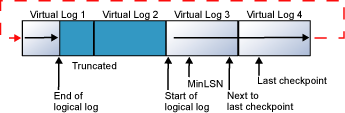
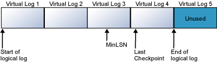

# SQL Server Transaction Log Architecture and Management

[!INCLUDE[appliesto-ss2008-xxxx-xxxx-xxx_md](../includes/appliesto-ss2008-xxxx-xxxx-xxx-md.md)]

  Every [!INCLUDE[ssNoVersion](../includes/ssnoversion-md.md)] database has a transaction log that records all transactions and the database modifications that are made by each transaction. The transaction log is a critical component of the database and, if there is a system failure, the transaction log might be required to bring your database back to a consistent state. This guide provides information about the physical and logical architecture of the transaction log. Understanding the architecture can improve your effectiveness in managing transaction logs.  

  
##   Transaction Log Logical Architecture  

 The [!INCLUDE[ssNoVersion](../includes/ssnoversion-md.md)] transaction log operates logically as if the transaction log is a string of log records. Each log record is identified by a log sequence number (LSN). Each new log record is written to the logical end of the log with an LSN that is higher than the LSN of the record before it. Log records are stored in a serial sequence as they are created. Each log record contains the ID of the transaction that it belongs to. For each transaction, all log records associated with the transaction are individually linked in a chain using backward pointers that speed the rollback of the transaction.  
  
 Log records for data modifications record either the logical operation performed or they record the before and after images of the modified data. The before image is a copy of the data before the operation is performed; the after image is a copy of the data after the operation has been performed.  
  
 The steps to recover an operation depend on the type of log record:  
  
-   Logical operation logged  
  
    -   To roll the logical operation forward, the operation is performed again.  
  
    -   To roll the logical operation back, the reverse logical operation is performed.  
  
-   Before and after image logged  
  
    -   To roll the operation forward, the after image is applied.  
  
    -   To roll the operation back, the before image is applied.  
  
 Many types of operations are recorded in the transaction log. These operations include:  
  
-   The start and end of each transaction.  
  
-   Every data modification (insert, update, or delete). This includes changes by system stored procedures or data definition language (DDL) statements to any table, including system tables.  
  
-   Every extent and page allocation or deallocation.  
  
-   Creating or dropping a table or index.  
  
 Rollback operations are also logged. Each transaction reserves space on the transaction log to make sure that enough log space exists to support a rollback that is caused by either an explicit rollback statement or if an error is encountered. The amount of space reserved depends on the operations performed in the transaction, but generally it is equal to the amount of space used to log each operation. This reserved space is freed when the transaction is completed.  
  
 The section of the log file from the first log record that must be present for a successful database-wide rollback to the last-written log record is called the active part of the log, or the *active log*. This is the section of the log required to a full recovery of the database. No part of the active log can ever be truncated. The log sequence number (LSN) of this first log record is known as the minimum recovery LSN (*MinLSN*).  
  
##   Transaction Log Physical Architecture  

 The transaction log in a database maps over one or more physical files. Conceptually, the log file is a string of log records. Physically, the sequence of log records is stored efficiently in the set of physical files that implement the transaction log. There must be at least one log file for each database.  
  
 The [!INCLUDE[ssDEnoversion](../includes/ssdenoversion-md.md)] divides each physical log file internally into a number of virtual log files. Virtual log files have no fixed size, and there is no fixed number of virtual log files for a physical log file. The [!INCLUDE[ssDE](../includes/ssde-md.md)] chooses the size of the virtual log files dynamically while it is creating or extending log files. The [!INCLUDE[ssDE](../includes/ssde-md.md)] tries to maintain a small number of virtual files. The size of the virtual files after a log file has been extended is the sum of the size of the existing log and the size of the new file increment. The size or number of virtual log files cannot be configured or set by administrators.  
  
 The only time virtual log files affect system performance is if the physical log files are defined by small *size* and *growth_increment* values. The *size* value is the initial size for the log file and the *growth_increment* value is the amount of space added to the file every time new space is required. If the log files grow to a large size because of many small increments, they will have many virtual log files. This can slow down database startup and also log backup and restore operations. We recommend that you assign log files a *size* value close to the final size required, and also have a relatively large *growth_increment* value. For more information about these parameters, see [ALTER DATABASE File and Filegroup Options &#40;Transact-SQL&#41;](/sql/t-sql/statements/alter-database-transact-sql-file-and-filegroup-options).  
  
 The transaction log is a wrap-around file. For example, consider a database with one physical log file divided into four virtual log files. When the database is created, the logical log file begins at the start of the physical log file. New log records are added at the end of the logical log and expand toward the end of the physical log. Log truncation frees any virtual logs whose records all appear in front of the minimum recovery log sequence number (MinLSN). The *MinLSN* is the log sequence number of the oldest log record that is required for a successful database-wide rollback. The transaction log in the example database would look similar to the one in the following illustration.  
  
   
  
 When the end of the logical log reaches the end of the physical log file, the new log records wrap around to the start of the physical log file.  
  
   
  
 This cycle repeats endlessly, as long as the end of the logical log never reaches the beginning of the logical log. If the old log records are truncated frequently enough to always leave sufficient room for all the new log records created through the next checkpoint, the log never fills. However, if the end of the logical log does reach the start of the logical log, one of two things occurs:  
  
-   If the FILEGROWTH setting is enabled for the log and space is available on the disk, the file is extended by the amount specified in the *growth_increment* parameter and the new log records are added to the extension. For more information about the FILEGROWTH setting, see [ALTER DATABASE File and Filegroup Options &#40;Transact-SQL&#41;](/sql/t-sql/statements/alter-database-transact-sql-file-and-filegroup-options).  
  
-   If the FILEGROWTH setting is not enabled, or the disk that is holding the log file has less free space than the amount specified in *growth_increment*, an 9002 error is generated.  
  
 If the log contains multiple physical log files, the logical log will move through all the physical log files before it wraps back to the start of the first physical log file.  
  
### Log Truncation  

 Log truncation is essential to keep the log from filling. Log truncation deletes inactive virtual log files from the logical transaction log of a [!INCLUDE[ssNoVersion](../includes/ssnoversion-md.md)] database, freeing space in the logical log for reuse by the physical transaction log. If a transaction log were never truncated, it would eventually fill all the disk space that is allocated to its physical log files. However, before the log can be truncated, a checkpoint operation must occur. A checkpoint writes the current in-memory modified pages (known as dirty pages) and transaction log information from memory to disk. When the checkpoint is performed, the inactive portion of the transaction log is marked as reusable. Thereafter, the inactive portion can be freed by log truncation. For more information about checkpoints, see [Database Checkpoints &#40;SQL Server&#41;](../relational-databases/logs/database-checkpoints-sql-server.md).  
  
 The following illustrations show a transaction log before and after truncation. The first illustration shows a transaction log that has never been truncated. Currently, four virtual log files are in use by the logical log. The logical log starts at the front of the first virtual log file and ends at virtual log 4. The MinLSN record is in virtual log 3. Virtual log 1 and virtual log 2 contain only inactive log records. These records can be truncated. Virtual log 5 is still unused and is not part of the current logical log.  
  
   
  
 The second illustration shows how the log appears after being truncated. Virtual log 1 and virtual log 2 have been freed for reuse. The logical log now starts at the beginning of virtual log 3. Virtual log 5 is still unused, and it is not part of the current logical log.  
  
   
  
 Log truncation occurs automatically after the following events, except when delayed for some reason:  
  
-   Under the simple recovery model, after a checkpoint.  
  
-   Under the full recovery model or bulk-logged recovery model, after a log backup, if a checkpoint has occurred since the previous backup.  
  
 Log truncation can be delayed by a variety of factors. In the event of a long delay in log truncation, the transaction log can fill up. For information, see [Factors That Can Delay Log Truncation](../relational-databases/logs/the-transaction-log-sql-server.md#FactorsThatDelayTruncation) and [Troubleshoot a Full Transaction Log &#40;SQL Server Error 9002&#41;](../relational-databases/logs/troubleshoot-a-full-transaction-log-sql-server-error-9002.md).  
  
##   Write-Ahead Transaction Log  

 This section describes the role of the write-ahead transaction log in recording data modifications to disk. [!INCLUDE[ssNoVersion](../includes/ssnoversion-md.md)] uses a write-ahead log (WAL), which guarantees that no data modifications are written to disk before the associated log record is written to disk. This maintains the ACID properties for a transaction.  
  
 To understand how the write-ahead log works, it is important for you to know how modified data is written to disk. [!INCLUDE[ssNoVersion](../includes/ssnoversion-md.md)] maintains a buffer cache into which it reads data pages when data must be retrieved. When a page is modified in the buffer cache, it is not immediately written back to disk; instead, the page is marked as *dirty*. A data page can have more than one logical write made before it is physically written to disk. For each logical write, a transaction log record is inserted in the log cache that records the modification. The log records must be written to disk before the associated dirty page is removed from the buffer cache and written to disk. The checkpoint process periodically scans the buffer cache for buffers with pages from a specified database and writes all dirty pages to disk. Checkpoints save time during a later recovery by creating a point at which all dirty pages are guaranteed to have been written to disk.  
  
 Writing a modified data page from the buffer cache to disk is called flushing the page. [!INCLUDE[ssNoVersion](../includes/ssnoversion-md.md)] has logic that prevents a dirty page from being flushed before the associated log record is written. Log records are written to disk when the transactions are committed.  
  
##   Transaction Log Backups  

 This section presents concepts about how to back up and restore (apply) transaction logs. Under the full and bulk-logged recovery models, taking routine backups of transaction logs (*log backups*) is necessary for recovering data. You can back up the log while any full backup is running. For more information about recovery models, see [Back Up and Restore of SQL Server Databases](../relational-databases/backup-restore/back-up-and-restore-of-sql-server-databases.md).  
  
 Before you can create the first log backup, you must create a full backup, such as a database backup or the first in a set of file backups. Restoring a database by using only file backups can become complex. Therefore, we recommend that you start with a full database backup when you can. Thereafter, backing up the transaction log regularly is necessary. This not only minimizes work-loss exposure but also enables truncation of the transaction log. Typically, the transaction log is truncated after every conventional log backup.  
  
 We recommend taking frequent enough log backups to support your business requirements, specifically your tolerance for work loss such as might be caused by a damaged log drive. The appropriate frequency for taking log backups depends on your tolerance for work-loss exposure balanced by how many log backups you can store, manage, and, potentially, restore. Taking a log backup every 15 to 30 minutes might be enough. If your business requires that you minimize work-loss exposure, consider taking log backups more frequently. More frequent log backups have the added advantage of increasing the frequency of log truncation, resulting in smaller log files.  
  
 To limit the number of log backups that you need to restore, it is essential to routinely back up your data. For example, you might schedule a weekly full database backup and daily differential database backups.  
  
### The Log Chain  

 A continuous sequence of log backups is called a *log chain*. A log chain starts with a full backup of the database. Usually, a new log chain is only started when the database is backed up for the first time or after the recovery model is switched from simple recovery to full or bulk-logged recovery. Unless you choose to overwrite existing backup sets when creating a full database backup, the existing log chain remains intact. With the log chain intact, you can restore your database from any full database backup in the media set, followed by all subsequent log backups up through your recovery point. The recovery point could be the end of the last log backup or a specific recovery point in any of the log backups. For more information, see [Transaction Log Backups &#40;SQL Server&#41;](../relational-databases/backup-restore/transaction-log-backups-sql-server.md).  
  
 To restore a database up to the point of failure, the log chain must be intact. That is, an unbroken sequence of transaction log backups must extend up to the point of failure. Where this sequence of log must start depends on the type of data backups you are restoring: database, partial, or file. For a database or partial backup, the sequence of log backups must extend from the end of a database or partial backup. For a set of file backups, the sequence of log backups must extend from the start of a full set of file backups. For more information, see [Apply Transaction Log Backups &#40;SQL Server&#41;](../relational-databases/backup-restore/apply-transaction-log-backups-sql-server.md).  
  
### Restore Log Backups  

 Restoring a log backup rolls forward the changes that were recorded in the transaction log to re-create the exact state of the database at the time the log backup operation started. When you restore a database, you will have to restore the log backups that were created after the full database backup that you restore, or from the start of the first file backup that you restore. Typically, after you restore the most recent data or differential backup, you must restore a series of log backups until you reach your recovery point. Then, you recover the database. This rolls back all transactions that were incomplete when the recovery started and brings the database online. After the database has been recovered, you cannot restore any more backups. For more information, see [Apply Transaction Log Backups &#40;SQL Server&#41;](../relational-databases/backup-restore/apply-transaction-log-backups-sql-server.md).  
  
## Additional Reading  

 We recommend the following articles and books for additional information about the transaction log.  
  
 [Understanding Logging and Recovery in SQL Server by Paul Randall](https://technet.microsoft.com/magazine/2009.02.logging.aspx)  
  
 [SQL Server Transaction Log Management by Tony Davis and Gail Shaw](http://www.simple-talk.com/books/sql-books/sql-server-transaction-log-management-by-tony-davis-and-gail-shaw/)  
  
  
