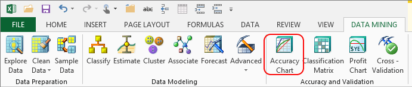

# Accuracy Chart (SQL Server Data Mining Add-ins)
    
  
 An accuracy chart enables you to apply a model to a new set of data and then evaluate how well the model performs. The accuracy chart created by this wizard is a *lift chart*, which is a type of chart that is frequently used to measure the accuracy of a data mining model. This type of accuracy chart displays a graphical representation of the improvement that you obtain from using the specified data mining model, as compared to random predictions, and to the ideal case where 100 percent of predictions are accurate. You can compare multiple models within a single chart.  
  
## Example  
 Consider the case in which the Marketing department at Adventure Works Cycles wants to create a targeted mailing campaign. From past campaigns, they know that a 10 percent response rate is typical. They have a list of 10,000 potential customers stored in a table in the database. Based on the typical response rate, they can expect 1,000 customers to respond.  
  
 However, because they can afford to mail an advertisement to only 5,000 customers, the Marketing department uses a mining model to target the 5,000 customers who are most likely to respond.  
  
 If the company randomly selects 5,000 customers, they can expect to receive only 500 positive responses, because only 10 percent of those who are targeted typically respond. This scenario is what the random line in the lift chart represents.  
  
 However, if the Marketing department uses a mining model to target their mailing, and if the model were perfect, the company could expect to receive 1,000 responses by mailing an advertisement to the 1,000 potential customers recommended by the model. This scenario is represented by the ideal line in the lift chart.  
  
## Using the Accuracy Chart Wizard  
 To create an accuracy chart, you must reference an existing data mining structure. You can measure the accuracy of multiple models that are based on that structure, as long as they predict the same thing.  
  
 If you are not sure which structures are available, you can browse the server. For more information, see [Browsing Models in Excel &#40;SQL Server Data Mining Add-ins&#41;](browsing-models-in-excel-sql-server-data-mining-add-ins.md).  
  
#### To create an accuracy chart  
  
1.  Click the **Data Mining Client** ribbon.  
  
2.  In the **Accuracy and Validation** group, click **Accuracy Chart**.  
  
3.  In the **Select Structure or Model** dialog box, choose the model that you want to evaluate. Click **Next**.  
  
    > [!NOTE]  
    >  You must choose a model that closely matches the data you intend to test.  
  
4.  In the **Specify Column to Predict and Value to Predict** dialog box, choose the column that you want to predict, and a target value, if appropriate. Click **Next**.  
  
     For example, in the example above, you might choose the column that models the customer response, and specify the target value as "Probably Will Buy".  
  
    > [!NOTE]  
    >  You cannot predict a continuous value. However, you can discretize the column by separating the values into discrete ranges. You must do this before creating the data mining model.  
  
5.  In the **Select Source Data** dialog box, specify the source of the data that you will pass through the model in order to create a prediction.  
  
6.  If you are using an external source of data, and not the test data that is stored with the model, in the **Specify Relationships** dialog box, map the columns in the new source data to the columns used in the data mining model.  
  
     If the column names are similar, the wizard will automatically map them. Although some columns in your input data may be irrelevant to analysis and can be ignored, some columns are required for the data mining model to process the input. Such columns might include a transaction ID, the target value, or columns used for prediction. If you fail to map a column that is required, the wizard will provide a warning message.  
  
7.  Click **Finish**.  
  
     The wizard creates a report that includes the lift chart and underlying data.  
  
### Requirements  
 If you are predicting a discrete value, you must select the target value that you want to predict. For example, if your data is categorized with a response "Yes: Buy" as 1 and the response "No: Do Not Buy" as 2, you must specify either 1 or 2 as the prediction values. However, if you want to predict a range of values, you can compare only two values at a time. For example, if you want to predict a score above 5, you might have to relabel your source data and create a new model that separates the results into two sets: those greater than 5 and those less than 5. You can then compare the accuracy of those two groups.  
  
## Understanding Accuracy  
 You can create two types of charts, one in which you specify a state of the predictable column, and one in which you do not specify the state.  
  
 If you specify the state of the predictable column, the x-axis of the chart represents the percentage of the test dataset that is used to compare the predictions. The y-axis of the chart represents the percentage of values that are predicted to be the specified state.  
  
 If you do not specify the state of the predictable column, the chart shows the accuracy of the model for all possible predictions.  
  
 For more information about how a lift chart works, and how accuracy is calculated based on the random and ideal prediction lines, see the topic "Lift Chart" in [!INCLUDE[ssNoVersion](../includes/ssnoversion-md.md)] Books Online.  
  
## See Also  
 [Validating Models and Using Models for Prediction &#40;Data Mining Add-ins for Excel&#41;](validating-models-and-using-models-for-prediction-data-mining-add-ins-for-excel.md)  
  
  
