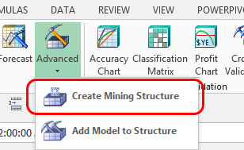
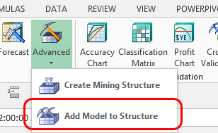

# Advanced Modeling (Data Mining Add-ins for Excel)
  You can use the **Advanced** data modeling options to create custom data mining structures and models with parameters different from those created by the wizards. The two wizards described in this section help you create a completely new data mining structure, and a new mining model to apply to an existing data mining structure.  
  
## Create Mining Structure  
   
  
 The **Create Mining Structure Wizard** helps you build a new data mining structure. A structure is a collection of data extracted from a specified data source.  A mining structure can be updated with new data at the source, but when you create the mining structure, you define data types and names that define how the data is used for analysis.  
  
 You can use the following data sources to build your structure: an Excel table, an Excel range, or any data in an external data source that has already been defined as an [!INCLUDE[ssASnoversion](../includes/ssasnoversion-md.md)] data source view.  
  
 For each structure, you have the option of setting aside some of the data to use for testing and validation. By creating this *holdout data set* when you set up your data sources, you can ensure that all models that are based on the structure are able to use a consistent data set for testing.  
  
 After you have created a mining structure, you can add multiple models to apply different methods of analysis.  
  
 For more information about how to use the **Create Mining Structure Wizard**, see [Create Mining Structure &#40;SQL Server Data Mining Add-ins&#41;](create-mining-structure-sql-server-data-mining-add-ins.md).  
  
## Add Model to Structure  
   
  
 When you add a new model to a structure, you analyze the data by using a different algorithm, or with different parameters. This option is particularly useful if you want to create a model using one of the algorithms not exposed in the Data Mining Client tools.  
  
 For example, you can use any of the algorithms supported by [!INCLUDE[ssASnoversion](../includes/ssasnoversion-md.md)], such as:  
  
-   Linear regression  
  
-   Sequence clustering  
  
-   Association analysis on nested data sets  
  
 To see what kind of mining structures are available, you can browse the models and structures stored in [!INCLUDE[ssASnoversion](../includes/ssasnoversion-md.md)] by clicking either **Manage Models** or **Browse**.  
  
 You are limited to data mining structures that were created during the current session, or mining structures that were saved to an instance of [!INCLUDE[ssASnoversion](../includes/ssasnoversion-md.md)].  
  
 For more information, see [Add Model to Structure &#40;Data Mining Add-ins for Excel&#41;](add-model-to-structure-data-mining-add-ins-for-excel.md).  
  
## See Also  
 [Manage Models &#40;SQL Server Data Mining Add-ins&#41;](manage-models-sql-server-data-mining-add-ins.md)   
 [Browsing Models in Excel &#40;SQL Server Data Mining Add-ins&#41;](browsing-models-in-excel-sql-server-data-mining-add-ins.md)  
  
  
