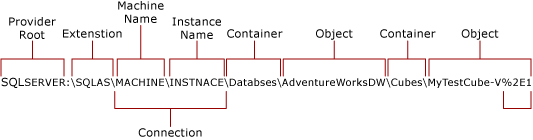
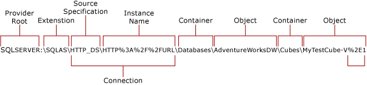

# Analysis Services PowerShell
  [!INCLUDE[ssASCurrent](../includes/ssascurrent-md.md)] includes an Analysis Services PowerShell (SQLAS) provider and cmdlets so that you can use Windows PowerShell to navigate, administer, and query Analysis Services objects.  
  
 Analysis Services PowerShell consists of the following:  
  
-   `SQLAS` provider used for navigating the Analysis Management Object (AMO) hierarchy.  
  
-   `Invoke-ASCmd` cmdlet used for executing MDX, DMX, or XMLA script.  
  
-   Task-specific cmdlets for routine operations, such as processing, role management, partition management, backup and restore.  
  
## In this article  
 [Prerequisites](#bkmk_prereq)  
  
 [Supported Versions and Modes of Analysis Services](#bkmk_vers)  
  
 [Authentication Requirements and Security Considerations](#bkmk_auth)  
  
 [Analysis Services PowerShell Tasks](#bkmk_tasks)  

For more information about syntax and examples, see [Analysis Services PowerShell Reference](/sql/analysis-services/powershell/analysis-services-powershell-reference).

##  <a name="bkmk_prereq"></a> Prerequisites  
 Windows PowerShell 2.0 must be installed. It is installed by default on newer versions of the Windows operating systems. For more information, see [Install Windows PowerShell 2.0](https://msdn.microsoft.com/library/ff637750.aspx)

<!-- ff637750.aspx above is linked to by:  (https://go.microsoft.com/fwlink/?LinkId=227613). -->
  
 You must install a SQL Server feature that includes the SQL Server PowerShell (SQLPS) module and client libraries. The easiest way to do this is by installing SQL Server Management Studio, which includes the PowerShell feature and client libraries automatically. The SQL Server PowerShell (SQLPS) module contains the PowerShell providers and cmdlets for all SQL Server features, including the SQLASCmdlets module and SQLAS provider used for navigating the Analysis Services object hierarchy.  
  
 You must import the **SQLPS** module before you can use the `SQLAS` provider and cmdlets. The SQLAS provider is an extension of the `SQLServer` provider. There are several ways to import the SQLPS module. For more information, see [Import the SQLPS Module](../../2014/database-engine/import-the-sqlps-module.md).  
  
 Remote access to an Analysis Services instance requires that you enable remote administration and file sharing. For more information, see [Enable Remote Administration](#bkmk_remote) in this topic.  
  
##  <a name="bkmk_vers"></a> Supported Versions and Modes of Analysis Services  
 Currently, Analysis Services PowerShell is supported on any edition of [!INCLUDE[ssCurrent](../includes/sscurrent-md.md)] Analysis Services running on Windows Server 2008 R2, Windows Server 2008 SP1, or Windows 7.  
  
 The following table shows the availability of Analysis Services PowerShell in different contexts.  
  
|Context|PowerShell Feature Availability|  
|-------------|-------------------------------------|  
|Multidimensional instances and databases|Supported for local and remote administration.<br /><br /> Merge-partition requires a local connection.|  
|Tabular instances and databases|Supported for local and remote administration.<br /><br /> For more information, see an August 2011 blog about [Manage Tabular Models Using PowerShell](https://go.microsoft.com/fwlink/?linkID=227685).|  
|PowerPivot for SharePoint instances and databases|Limited support. You can use HTTP connections and the SQLAS provider to view instance and database information.<br /><br /> However, using the cmdlets is not supported. You must not use Analysis Services PowerShell to backup and restore in-memory PowerPivot database, nor should you add or remove roles, process data, or run arbitrary XMLA script.<br /><br /> For configuration purposes, PowerPivot for SharePoint has built-in PowerShell support that is provided separately. For more information, see [PowerShell Reference for PowerPivot for SharePoint](/sql/analysis-services/powershell/powershell-reference-for-power-pivot-for-sharepoint).|  
|Native connections to local cubes<br /><br /> "Data Source=c:\backup\test.cub"|Not supported.|  
|HTTP connections to BI semantic model (.bism) connection files in SharePoint<br /><br /> "Data Source=http://server/shared_docs/name.bism"|Not supported.|  
|Embedded connections to PowerPivot databases<br /><br /> "Data Source=$Embedded$"|Not supported.|  
|Local server context in Analysis Services stored procedures<br /><br /> "Data Source=*"|Not supported.|  
  
##  <a name="bkmk_auth"></a> Authentication Requirements and Security Considerations  
 When connecting to Analysis Services, you must make the connection using a Windows user identity. For the most part, a connection is made using Windows integrated security, where the identity of the current user sets the security context under which server operations are performed. However, additional authentication methods become available when you configure HTTP access to Analysis Services. This section explains how the type of connection determines which authentication options you can use.  
  
 Connections to Analysis Services are characterized as either native connections or HTTP connections. A native connection is a direct connection from a client application to the server. In a PowerShell session, the PowerShell client uses the OLE DB provider for Analysis Services to connect directly to an Analysis Services instance. A native connection is always made using Windows integrated security, where Analysis Services PowerShell executes as the current user. Analysis Services does not support impersonation. If you want to perform an operation as a specific user, you must start the PowerShell session as that user.  
  
 HTTP connections are made indirectly through IIS, allowing for additional authentication options, such as Basic authentication, to connect to an Analysis Services instance. Because IIS supports impersonation, you can provide a connection string that includes credentials IIS will use to impersonate when making a connection. To provide credentials, you can use the -Credential parameter.  
  
 **Using the -Credential Parameter in PowerShell**  
  
 The -Credential parameter takes a PSCredential object that specifies a user name and password. In Analysis Services PowerShell, the -Credential parameter is available for cmdlets that make a connection request to Analysis Services, as opposed to cmdlets that run within the context of an existing connection. Cmdlets that make a connection request include Invoke-ASCmd, Backup-ASDatabase, and Restore-ASDatabase. For these cmdlets, the -Credential parameter can be used, assuming the following criteria are met:  
  
1.  The server is configured for HTTP access, which means that IIS handles the connection, reads the user name and password, and impersonates that user identity when connecting to Analysis Services. For more information, see [Configure HTTP Access to Analysis Services on Internet Information Services &#40;IIS&#41; 8.0](instances/configure-http-access-to-analysis-services-on-iis-8-0.md).  
  
2.  The IIS virtual directory that was created for Analysis Services HTTP access is configured for Basic authentication.  
  
3.  The user name and password provided by the credential object resolves to a Windows user identity. Analysis Services uses this identity as the current user. If the user is not a Windows user, or lacks sufficient permissions to perform the requested operation, the request will fail.  
  
 To create a credential object, you can use the Get-Credential cmdlet to collect the credentials from the operator. You can then use the credential object on a command that connects to Analysis Services. The following example illustrates one approach. In this example, the connection is to a local instance configured for HTTP access.  
  
```  
PS SQLSERVER:\SQLAS\HTTP_DS> $cred = Get-credential adventureworks\dbadmin  
PS SQLSERVER:\SQLAS\HTTP_DS> Invoke-ASCmd -Inputfile:"c:\discoverconnections.xmla" -Credential:$cred  
```  
  
 When using Basic authentication, you should always use HTTPS with SSL so that username and passwords are sent over an encrypted connection. For more information, see [Configure Secure Sockets Layer in IIS 7.0](https://go.microsoft.com/fwlink/?linkID=184299) and [Configure Basic Authentication (IIS 7)](https://go.microsoft.com/fwlink/?LinkId=230776).  
  
 Remember that credentials, queries, and commands that you provide in PowerShell are passed unchanged to the transport layer. Including sensitive content in your scripts increases the risk of a malicious injection attack.  
  
 **Providing a password as a Microsoft.Secure.String object**  
  
 Some operations, such as backup and restore, support encryption options that are activated when you provide a password in the command. Providing the password signals Analysis Services to encrypt or decrypt the backup file. In Analysis Services, this password is instantiated as a secure string object. The following example provides an illustration of how to collect a password from the operator at run time.  
  
```  
PS SQLSERVER:\SQLAS\Localhost\default> $pwd = read-host -AsSecureString -Prompt "Password"  
Password: ****  
PS SQLSERVER:\SQLAS\Localhost\default> $pwd -is [System.IDisposable]   
True  
```  
  
 You can now backup or restore an encrypted database file, passing the $pwd variable to the password parameter. To view a complete example that combines this illustration with other cmdlets, see [Backup-ASDatabase cmdlet](/sql/analysis-services/powershell/backup-asdatabase-cmdlet) and [Restore-ASDatabase cmdlet](/sql/analysis-services/powershell/restore-asdatabase-cmdlet).
  
 As a follow up step, remove both the password and variable from the session.  
  
```  
PS SQLSERVER:\SQLAS\Localhost\default> $pwd.Dispose()  
PS SQLSERVER:\SQLAS\Localhost\default> Remove-Variable -Name pwd  
```  
  
##  <a name="bkmk_tasks"></a> Analysis Services PowerShell Tasks  
 You can run Analysis Services PowerShell from the Windows PowerShell management shell or a Windows command prompt. Running Analysis Services PowerShell from [!INCLUDE[ssManStudioFull](../includes/ssmanstudiofull-md.md)] is not supported.  
  
 This section describes common tasks for using Analysis Services PowerShell.  
  
-   [Load the Analysis Services Provider and Cmdlets](#bkmk_load)  
  
-   [Enable Remote Administration](#bkmk_remote)  
  
-   [Connect to an Analysis Services Object](#bkmk_connect)  
  
-   [Administer the Service](#bkmk_admin)  
  
-   [Get Help for Analysis Services PowerShell](#bkmk_help)  
  
###  <a name="bkmk_load"></a> Load the Analysis Services Provider and Cmdlets  
 The Analysis Services provider is an extension of the SQL Server root provider that becomes available when you import the SQLPS module. Analysis Services cmdlets are loaded simultaneously; you can also load them independently if you want to use them without the provider.  
  
-   Run the Import-module cmdlet to load SQLPS that includes all of the Analysis Services PowerShell functionality. If you cannot import the module, you can temporarily change the execution policy to unrestricted for the purpose of the loading the module. For more information, see [Import the SQLPS Module](../../2014/database-engine/import-the-sqlps-module.md).  
  
    ```  
    Import-module "sqlps"  
    ```  
  
     Alternatively, use `import-module "sqlps" -disablenamechecking` to suppress the warning about unapproved verb names.  
  
-   To load just the task-specific Analysis Services cmdlets, without the Analysis Services provider or the Invoke-ASCmd cmdlet, you can load the SQLASCmdlets module as an independent operation.  
  
    ```  
    Import-module "sqlascmdlets"  
    ```  
  
###  <a name="bkmk_remote"></a> Enable Remote Administration  
 Before you can use Analysis Services PowerShell with a remote Analysis Services instance, you must first enable remote administration and file sharing. The following error indicates a firewall configuration issue: "The RPC server is unavailable. (Exception from HRESULT: 0x800706BA)".  
  
1.  Verify that both local and remote computers have the [!INCLUDE[ssASCurrent](../includes/ssascurrent-md.md)] versions of the client and server tools.  
  
2.  On the remote server that is hosting an Analysis Services instance, open TCP port 2383 in Windows Firewall. If you installed Analysis Services as a named instance or are using a custom port, the port number will be different. For more information, see [Configure the Windows Firewall to Allow Analysis Services Access](instances/configure-the-windows-firewall-to-allow-analysis-services-access.md).  
  
3.  On the remote server, verify that the followings services are started:  Remote Procedure Call (RPC) service, TCP/IP NetBIOS Helper service, Windows Management Instrumentation (WMI) service, Windows Remote Management (WS-Management) service.  
  
4.  On the remote server, start the Group Policy Object Editor snap-in (gpedit.msc).  
  
5.  Open Computer Configuration, open Administrative Templates, open Network, open Network Connections, open Windows Firewall, and then open Domain Profile.  
  
6.  Double-click **Windows Firewall: Allow inbound remote administration exception**, select **Enabled**, and then click **OK**.  
  
7.  Double-click **Windows Firewall: Allow inbound file and printer sharing exception**, select **Enabled**, and then click **OK**.  
  
8.  On the local computer that has the client tools, use the following cmdlets to verify remote administration, substituting the actual server name for the *remote-server-name* placeholder. Omit the instance name if Analysis Services is installed as the default instance. You must have previously imported the SQLPS module in order for the command to work.  
  
    ```  
    PS SQLSERVER:\> cd sqlas  
    PS SQLSERVER:\sqlas> cd <remote-server-name\instance-name>  
    PS SQLSERVER:\sqlas\<remote-server-name\instance-name> dir  
    ```  
  
 In some cases, additional configuration might be necessary. You might need to type the following on the remote server before you can issue commands to it from another computer:  
  
```  
Enable-psremoting  
```  
  
  
###  <a name="bkmk_connect"></a> Connect to an Analysis Services Object  
 The Analysis Services PowerShell provider supports navigation of the Analysis Services object hierarchy and sets the context for running commands. The provider is an extension of the SQLSERVER root provider available through the SQLPS module. After you load the SQLPS module, you can navigate the path.  
  
 You can connect to a local or remote instance, but some cmdlets only run on a local instance (namely, merge-partition). You can use a native connection or an HTTP connection for Analysis Services servers that you configured for HTTP access. The following illustrations show the navigation path for native and HTTP connections. The following illustrations show the navigation path for native and HTTP connections.  
  
 **Native Connections to Analysis Services**  
  
   
  
 The following example is a demonstration of how to use a native connection to navigate object hierarchy. From the provider, you can issue a `dir` to view instance information. You can use `cd` to view objects of that instance.  
  
```  
PS SQLSERVER:> cd sqlas  
PS SQLSERVER\sqlas:> dir  
PS SQLSERVER\sqlas:> cd localhost\default  
PS SQLSERVER\sqlas\localhost\default:> dir  
```  
  
 You should see the following collections: Assemblies, Databases, Roles, and Traces. Continuing to use `cd` and `dir`, you can view the contents of each collection.  
  
 **HTTP Connections to Analysis Services**  
  
   
  
 HTTP connections are useful if you configured your server for HTTP access using the instructions in this topic: [Configure HTTP Access to Analysis Services on Internet Information Services &#40;IIS&#41; 8.0](instances/configure-http-access-to-analysis-services-on-iis-8-0.md)  
  
 Assuming a server URL of http://localhost/olap/msmdpump.dll, a connection might look like the following:  
  
```  
PS SQLSERVER\sqlas:> cd http_ds  
PS SQLSERVER\sqlas\http_ds:> $Url=Encode-SqlName "http://localhost/olap/msmdpump.dll"  
PS SQLSERVER\sqlas\http_ds:> cd $Url  
PS SQLSERVER\sqlas\http_ds\http%3A%2F%2Flocalhost%2olap%2msmdpump%2Edll:> dir  
```  
  
 You should see the following collections: Assemblies, Databases, Roles, and Traces. If you cannot view the contents of these collections, check the authentication settings on the OLAP virtual directory. Make sure that Anonymous Access is disabled. If you are using Windows Authentication, be sure that your Windows user account has administrative permissions on the Analysis Services instance.  
  
###  <a name="bkmk_admin"></a> Administer the Service  
 Verify the service is running. Returns status, name, and display name for SQL Server services, including Analysis Services (MSSQLServerOLAPService) and the Database Engine.  
  
```  
Get-service mssql*  
```  
  
 Returns properties about a process, including process ID, handle count, and memory usage:  
  
```  
Get-process msmdsrv  
```  
  
 Restarts the service when you issue the following cmdlet from the administrator shell:  
  
```  
Restart-service mssqlserverolapservice  
```  
  
###  <a name="bkmk_help"></a> Get Help for Analysis Services PowerShell  
 Use any of the following cmdlets to verify cmdlet availability and to get more information about services, processes, and objects.  
  
1.  `Get-help` returns the built-in help for an Analysis Services cmdlet, including examples:  
  
    ```  
    Get-help invoke-ascmd -examples  
    ```  
  
2.  `Get-command` returns a list of the eleven Analysis Services PowerShell cmdlets:  
  
    ```  
    get-command -module SQLASCmdlets  
    ```  
  
3.  `Get-member` returns properties or methods of a service or process.  
  
    ```  
    Get-service mssqlserverolapservice | get-member -type Property  
    ```  
  
    ```  
    Get-service mssqlserverolapservice | get-member -type Method  
    ```  
  
    ```  
    Get-process msmdsrv | get-member -type Property  
    ```  
  
4.  `Get-member` can also be used to return properties or methods of an object (for example, AMO methods on the server object) using the SQLAS provider to specify the server instance.  
  
    ```  
    PS SQLSERVER:\sqlas\localhost\default > $serverObj = New-Object Microsoft.AnalysisServices.Server  
    PS SQLSERVER:\sqlas\localhost\default > $serverObj = | get-member -type Method  
    ```  
  
5.  `Get-PSdrive` returns a list of the providers that are currently installed. If you imported the SQLPS module, you will see the `SQLServer` provider in the list (SQLAS is part of the SQLServer provider and never appears separately in the list):  
  
    ```  
    Get-PSDrive  
    ```  
  
## See Also  
 [Install SQL Server PowerShell](../database-engine/install-windows/install-sql-server-powershell.md)   
 [Manage Tabular Models Using PowerShell (blog)](https://go.microsoft.com/fwlink/?linkID=227685)   
 [Configure HTTP Access to Analysis Services on Internet Information Services &#40;IIS&#41; 8.0](instances/configure-http-access-to-analysis-services-on-iis-8-0.md)  
  
  
