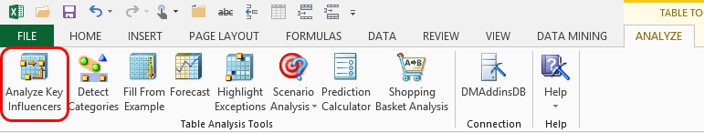

# Analyze Key Influencers (Table Analysis Tools for Excel)
    
  
 With the **Analyze Key Influencers** tool, you choose a column that contains a target outcome, and the algorithm determines which factors had the strongest influence on the outcome.  
  
 The tool creates new data tables that report the factors associated with each outcome and graphically displays the probability of the relationship. You can filter the tables by different factors and outcomes to explore the results in more depth.  
  
 You can also select a pair of possible outcomes and compare them. For example, you might compare different groups of consumers to determine possible decision-making factors.  
  
## Using the Analyze Key Influencers Tool  
  
1.  Open an Excel data table.  
  
2.  In **Table Tools**, on the **Analyze** ribbon, click **Analyze Key Influencers.**  
  
3.  Select the single column that is the target of analysis.  
  
4.  Optionally, click **Choose columns to be used for analysis**. In the **Advanced Columns Selection** dialog box, choose the columns that are most likely to contain relevant data. To improve performance and accuracy, deselect columns such as ID or name that are unimportant for pattern analysis. Click **OK** to close the **Advanced Columns Selection** dialog box.  
  
5.  Click **Run**.  
  
     The **Analyze Key Influencers** tool conducts an analysis of the data to determine the optimum settings, and sets all parameters automatically.  
  
6.  If no patterns were detected, the wizard creates a new worksheet that contains a description of the problem.  
  
7.  If patterns are detected, the wizard creates a report on a new worksheet that shows the patterns. The report is named **Key Influencers for \<column>**. You can customize the report as described in the following procedure.  
  
#### Create a custom report  
  
1.  In the **Discrimination based on key influencers** dialog box, choose the two values that you want to compare by selecting them from the **Value 1** and **Value 2** dropdown lists. For example, you might compare buyers to non-buyers.  
  
2.  Click **Add Report**.  
  
     The wizard creates a new worksheet and adds a table for each pair of key factor comparisons.  
  
3.  When you are done making comparisons, click **Close**.  
  
## Understanding the Key Influencers Report  
 After the data model has been created, the **Analyze Key Influencers** tool creates reports that help you explore and compare key influencers.  
  
-   The report on the left side is the one generated by default. It shows the strongest predictors of the outcome column (the dependent variable).  
  
-   The report on the right side is optional, which you can create by comparing two specific outcome values. This report compares buyers and non-buyers.  
  
-   Note that a new worksheet is added for each report that you create. You can move the tables after they are created; we placed them side by side for comparison.  
  
   
  
 **Relative Impact**  
 The shaded bar in the first report indicates the strength of the association of this attribute with the outcome.  
  
 The length of the bar indicates the probability that the factor contributes to the outcome; therefore, the longer the shaded bar, the stronger the association.  
  
 **Favors**  
 In the second report, the target values that you compare are listed in two columns, with the related factors listed in order of descending confidence.  
  
-   The **blue** bar shows attributes contributing to the outcome, "No" (=did not purchase).  
  
-   The **red** bar shows attributes contributing to the outcome, "Yes" (=purchased a bike).  
  
 The colors in the shading bar are arbitrary. You can change these colors by setting the options for table design in Excel.  
  
 In a report that contrasts two values, the second report ranks the key influencers by the amount of impact on the target values.  
  
 Because all the charts are based on Excel tables, you can filter and sort to focus on specific factors or outcomes.  
  
## More About the Analyze Key Influencers Tool  
 When the **Analyze Key Influencers** tool analyzes your data, it does the following:  
  
-   Creates a data structure that stores key information about the distribution of your data.  
  
-   Creates a model using the Microsoft Naïve Bayes algorithm.  
  
-   Creates predictions that correlates each column of data with the specified outcome.  
  
-   Uses the confidence score for each of the predictions to identify the factors that are the most influential in producing the targeted outcome.  
  
-   Creates a report describing the key influencers, ordered by confidence scores.  
  
### Requirements  
 If the target column contains continuous numeric values, the tool automatically segments the numeric values into groups. These groupings represent clusters of cases that have similar characteristics. However, numeric values might not be divided into user-friendly groups. For example, the report might contain a grouping such as "\<12.85701", whereas report users typically like to see groupings that use whole numbers, such as 10-19, 20-29, and so on.  
  
 If you want to group numeric data in a different way, you must segment the data the way you want before creating the analysis. For example, you can use the [Relabel](relabel-sql-server-data-mining-add-ins.md) tool in the Data Mining Client for Excel to create a new grouping label in a separate column, and then use only that new column in analysis.  
  
### Related Tools  
 The **Data Mining** ribbon provides more advanced tools, including the ability to customize data mining models  
  
 If you save your model by using the **Analyze Key Influencers** tool, you can use the Data Mining Client to browse the model and explore relationships in more detail. For information, see [Browsing Models in Excel &#40;SQL Server Data Mining Add-ins&#41;](browsing-models-in-excel-sql-server-data-mining-add-ins.md). You can also use Microsoft Office Visio to create charts and diagrams that display the relationships as cluster or as dependency networks. For more information, see [Troubleshooting Visio Data Mining Diagrams &#40;SQL Server Data Mining Add-ins&#41;](troubleshooting-visio-data-mining-diagrams-sql-server-data-mining-add-ins.md).  
  
> [!NOTE]  
>  The models that are created when you use the Table Analysis Tools are deleted when you close your worksheet or terminate the connection with the [!INCLUDE[ssASnoversion](../includes/ssasnoversion-md.md)] server. Therefore, you can only browse the models as long as the connection remains open. You cannot render the models in Visio if you close the connection or close the worksheet.  
  
 For more information about the algorithm used by the **Analyze Key Influencers** tool, see "Microsoft Naïve Bayes Algorithm" in SQL Server Books Online.  
  
## See Also  
 [Table Analysis Tools for Excel](table-analysis-tools-for-excel.md)   
 [Creating a Data Mining Model](creating-a-data-mining-model.md)  
  
  
