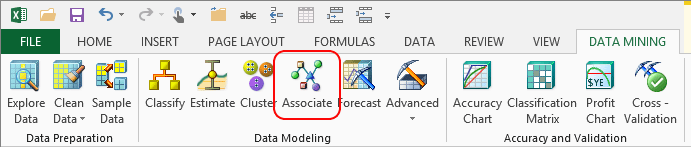

# Associate Wizard (Data Mining Client for Excel)
    
  
 The Associate wizard helps you create a data mining model using the [!INCLUDE[msCoName](../includes/msconame-md.md)] Association Rules algorithm. Such mining models are particularly useful for creating *recommendation systems*.  
  
 How it works is that the [!INCLUDE[msCoName](../includes/msconame-md.md)] Association Rules algorithm scans a dataset comprised of transactions or events, and finds the combinations that frequently appear together. There can be many thousand combinations, but the algorithm can be customized to find more or fewer, and to retain only the most probable combinations.  
  
 You can apply association analysis to many problems. The most popular application of this method is market basket analysis, which finds individual products that are often purchased together. You can then use that information to recommend products to customers based on items they have already bought.  
  
## Using the Associate Wizard  
  
1.  In the **Data Mining** ribbon, click **Associate**.  
  
2.  On the **Select Source Data** page, choose an Excel table or data range, and click **Next**.  
  
     The sample data workbook contains an example, in the Associate tab, of how transaction data is typically arranged if, for example, you have multiple products in each transaction or multiple purchasing records per customer that you want to analyze.  
  
     If you want to use external data to build an association model using the Associate wizard, you must add the data to Excel first, and *flatten* the data. For more information about preparing data for association modeling, see [Nested Tables &#40;Analysis Services - Data Mining&#41;](data-mining/nested-tables-analysis-services-data-mining.md), in SQL Server Books Online.  
  
3.  On the **Association** page, choose the column that identifies the transaction.  
  
     For market basket models, this identifier represents the unit you want to model. Do you want to analyze items that individual customers have purchased over time, or do you want to analyze many transactions involving multiple customers? In the first case, you would choose the customer ID; in the latter you would choose the purchase order or other transaction ID.  
  
4.  For **Item**, select the column that contains the things among which you need to find associations.  
  
     For example, in a market basket model, you would choose a products field, to analyze which products are often purchased together. If there are too many individual products to correlate them effectively, you might choose a product category or subcategory field.  
  
5.  In **Thresholds**, you can set values that control or affect the output of the model:  
  
    -   **Minimum support.** Specifies how many times a group of items must appear to be considered important. The algorithm will ignore any item combinations that do not meet this criterion. For example, you might want to see only itemsets where the items appeared together at least 10 times overall.  
  
    -   **Minimum rule probability**. Specifies the minimum probability value required for a rule to be saved. The entire data set is analyzed to find all combinations, and then probability is calculated. If the threshold is low, the wizard may associate items that are only loosely correlated. If the threshold is too high, some associations may be omitted because they do not have enough supporting data.  
  
     In general, changing these values has the following effects:  
  
    -   As you lower the value for support, you increase the number of combinations that are found.  
  
    -   As you decrease the maximum support, you filter out items that occur so often that they have little meaning.  
  
    -   As you lower the probability of a rule, you lower the requirements that a combination must meet to be considered important in the context of the total data set.  
  
     **Tip:** It is a good idea to create multiple mining models using different combinations of support and probability. To track which settings you used for each model, you can use the **Document Model** wizard, available in the Data Mining Client for Excel, and use the **Detailed** report option. For more information, see [Documenting Mining Models &#40;Data Mining Add-ins for Excel&#41;](documenting-mining-models-data-mining-add-ins-for-excel.md).  
  
6.  Optionally, click **Parameters** to change the algorithm parameters and customize the behavior of the mining model.  
  
     The Algorithm Parameters dialog box includes all of the parameters you set in the wizard, plus a few that are less commonly used, such as MAXIMUM_SUPPORT. For information about how to use these parameters, see [Microsoft Association Algorithm Technical Reference](data-mining/microsoft-association-algorithm-technical-reference.md).  
  
7.  On the **Finish** page, type a unique name for the data set and the model.  
  
8.  In **Options**, you define how you want to work with the model after it is completed:  
  
    -   **Browse**.  When the model is ready, the wizard opens a window that displays the rules, the itemsets, and a dependency network graph that depicts associations.  
  
         For more information about how to interpret the data in the association model viewer, see [Browsing an Association Rules Model](browsing-an-association-rules-model.md).  
  
    -   **Enable drillthrough**. Select this option to gain access to the underlying data, via the model.  
  
         Drillthrough is useful, for example, if you want to click on a particular itemset and see the source data.  
  
    -   **Use temporary model**. Select this option if you don't want the model saved on the server. Temporary models are deleted when you close Excel.  
  
9. The wizard analyzes all possible combinations and creates a report that contains the itemsets and rules.  
  
## More About Association Models  
 The [!INCLUDE[msCoName](../includes/msconame-md.md)] Association Rules algorithm examines the training data to find items that appear together in a transaction. Each group of items constitutes an *itemset*. The algorithm then counts the number of times each itemset appears and calculates the relative importance of each itemset across all transactions.  
  
 The algorithm uses this information about itemsets to generate rules that can be used to predict associations or make recommendations. For example, a rule could be "if the user purchased a book by Author 1 and a book by Author 2, then it is likely that the user will also purchase a book by Author 3". Each recommendation is assigned a probability, based on the strength of the associations.  
  
### Requirements  
 To use the Associate wizard, you must be connected to a [!INCLUDE[ssASnoversion](../includes/ssasnoversion-md.md)] database.  
  
 Your source data must be organized as a transaction table. The source data must contain one column that contains the transaction identifier. This column identifies each group of items. That transaction column must be in a one-to-many relationship with a second column, the item ID, which stores names or ID numbers for the individual items in the group.  
  
 Conceptually, this might be easiest to understand by recalling the shopping cart example. If the shopping cart is assigned an ID, the shopping cart ID serves as the identifier for the transaction. Each item in the shopping cart, such as potatoes or milk, is a member of that transaction. The Associate algorithm can track items across transactions: for example, to determine how many times potatoes and milk appear within any single transaction.  
  
 Your source data must be sorted by the transaction identifier column.  
  
## See Also  
 [Creating a Data Mining Model](creating-a-data-mining-model.md)   
 [Browsing an Association Rules Model](browsing-an-association-rules-model.md)   
 [Shopping Basket Analysis &#40;Table AnalysisTools for Excel&#41;](shopping-basket-analysis-table-analysistools-for-excel.md)   
 [Dependency Network Diagram Walkthrough &#40;Data Mining Add-ins&#41;](dependency-network-diagram-walkthrough-data-mining-add-ins.md)  
  
  
