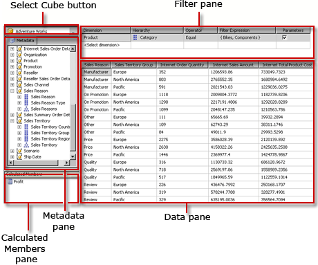

# Browser (Cube Designer) (Analysis Services - Multidimensional Data)
  Use the **Browser** tab in Cube Designer to explore dimensions, measures, and KPIS in a cube. In [!INCLUDE[ssCurrent](../includes/sscurrent-md.md)], the [!INCLUDE[ssASnoversion](../includes/ssasnoversion-md.md)] Cube browser has been integrated with the MDX Query Designer, and provides a graphical user interfaces to help you create MDX queries, filter and slice cubes, and drill down into hierarchies.  
  
 The **Browser** tab has two modes: **Design Mode** and **Query Mode**. In either mode, you can use the objects in the **Metadata** pane to explore the cube, or you can drag members from the **Metadata** pane into the query area, to build an MDX query that retrieves the data you want to use.  
  
 **Browse and Query Using Graphical Design Mode**  
  
 The following figure shows the **Browser** interface in the graphical **Design Mode**.  
  
   
  
 While you are working in graphical design mode, if the **AutoExecute** () toggle button on the toolbar is selected, the **Browser** runs a query each time that you drop a metadata object onto the Data pane. You can also manually run the query using the **Execute Query** () button on the toolbar.  
  
 To change the graphical query designer to **Query** mode and work with the text of the MDX statements, click the **Design Mode** button on the toolbar.  
  
 **Browse and Query Using MDX Text Mode**  
  
 While you are in MDX test design mode, you can work with MDX directly. The **Metadata** pane is still available so that you can add objects to the query design area, and you can drag and drop MDX functions and operators from the list in the **Functions** pane.  
  
 The following figure shows the **Browser** interface for Query mode.  
  
   
  
 You can begin working in graphical Design mode, add any required objects, add filters to slice the cube, and then switch to text mode to extend the default MDX query that was generated, and include additional member properties and cell properties.  
  
 The **Metadata** pane displays tabs for **Metadata** and **Functions**. From the **Metadata** tab, you can drag dimensions, hierarchies, KPIs, and measures onto the query design area. From the **Functions** tab, you can drag functions onto the query design area. When you execute the query, the query design area displays the results for the MDX query. You can also click **Analyze in Excel** on the **Toolbar** to export the data to Microsoft Office Excel and view the results as users would, in a PivotTable.The following sections describe the toolbar and all panes for each mode of the **Browser** in more detail.  
  
 Note that, while you are working in text mode, the **AutoExecute** () toggle button on the toolbar is not available. However, you can manually run queries by using the **Execute Query** () button on the toolbar.  
  
## Sections  
 **Toolbar**  
 The toolbar contains tool that can be used in either Design View or Query view. For more information about the toolbar and how to use these features, see [Toolbar &#40;Browser Tab, Cube Designer&#41; &#40;Analysis Services - Multidimensional Data&#41;](toolbar-browser-tab-cube-designer-analysis-services-multidimensional-data.md).  
  
 **Analyze in Excel**  
 Use the **Analyze in Excel** feature to send the current selection of cube data to Excel, so that you can preview the data in a PivotTable. The current selection of data is based on the items you added from the **Metadata** pane and any filters you might have defined by using the filter and query building functions. For more information, see [Analyze in Excel &#40;Browser Tab, Cube Designer&#41; &#40;Analysis Services - Multidimensional Data&#41;](analyze-in-excel-browser-cube-designer-analysis-services-multidimensional-data.md).  
  
 **Metadata**  
 Use the **Metadata** pane to view objects contained by the cube, to drill down into hierarchies, and to explore and use measures. After you have selected and to view the data associated with them in the **Report** pane. For more information about this pane, see [Metadata &#40;Browser Tab, Cube Designer&#41; &#40;Analysis Services - Multidimensional Data&#41;](metadata-browser-tab-cube-designer-analysis-services-multidimensional-data.md).  
  
 **Filter and Query**  
 Use this area of the design surface to build MDX queries, by dragging and dropping objects from the **Metadata** pane, and by specifying filter criteria on the source cube or dimension. For more information, see [Query and Filter &#40;Browser Tab, Cube Designer&#41; &#40;Analysis Services - Multidimensional Data&#41;](query-filter-browser-cube-designer-analysis-services-multidimensional-data.md).  
  
## See Also  
 [Cube Objects &#40;Analysis Services - Multidimensional Data&#41;](multidimensional-models-olap-logical-cube-objects/cube-objects-analysis-services-multidimensional-data.md)   
 [Cubes in Multidimensional Models](multidimensional-models/cubes-in-multidimensional-models.md)   
 [Cube Designer &#40;Analysis Services - Multidimensional Data&#41;](cube-designer-analysis-services-multidimensional-data.md)  
  
  
