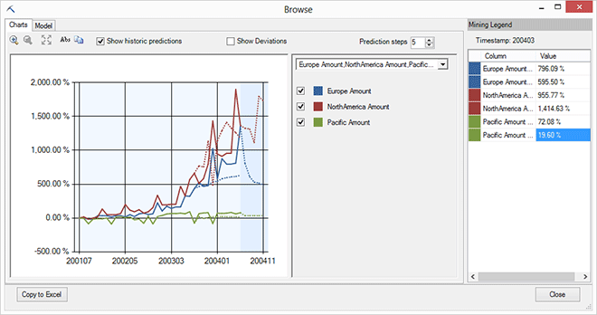
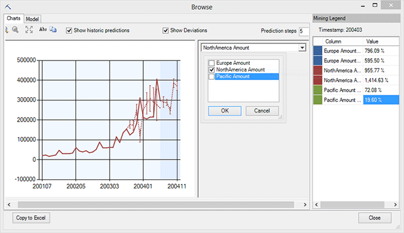
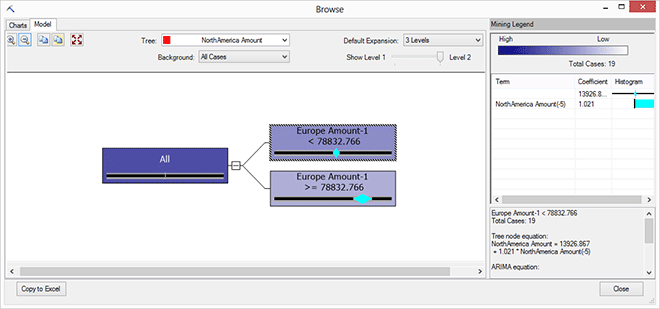

# Browsing a Forecasting Model
  When you open a forecasting model using **Browse**, the model is displayed in an interactive viewer, similar to the time series model viewer in [!INCLUDE[ssASnoversion](../includes/ssasnoversion-md.md)]. The viewer helps you explore trends, compare series, create predictions, and get information about the model and the underlying data.  
  
##   Explore the Model  
 The **Browse** viewer for forecasting models provides a chart view, which shows the trends over time and lets you create predictions, and a model view, which represents the time series as a decision tree or a regression tree.  
  
-   [Chart view](#bkmk_charts)  
  
-   [Model view](#bkmk_Model)  
  
 To experiment with a forecasting model, you can use the sample data on the Forecast tab of the sample data workbook, and build a time series model using the [Forecast Wizard &#40;Data Mining Add-ins for Excel&#41;](forecast-wizard-data-mining-add-ins-for-excel.md) in the **Data Mining** ribbon, or [Forecast &#40;Table Analysis Tools for Excel&#41;](forecast-table-analysis-tools-for-excel.md) in the **Analyze** ribbon.  
  
###   Chart  
 The **Chart** tab displays the trend in your data series over time, together with the predicted values. The vertical axis of the chart represents the values of the series, and the horizontal axis represents time.  
  
##### Explore the forecasting chart  
  
1.  This model contains multiple time series, but to simplify the chart, you can display a single series, or just a few related series.  
  
       
  
     Use the check boxes to select the forecast for just North America, and just for sales Amount.  
  
2.  Click **Prediction Steps** and type a new value to control how many future time values you want to see in the chart.  
  
     The default is 5.  
  
3.  Click any point in the line, either historical or future, to see the exact values for that point in time, displayed in the **Mining Legend**.  
  
4.  The chart displays both historical and future data. Note the dotted line, with a shaded background. These values are the future predictions, based on the model.  
  
     The historical data (which you used to build the model) is shown in the left side of the chart.  
  
5.  Select the **Show historic predictions** option to get a sense for the stability of the time series.  
  
       
  
     Historical predictions are values predicted based on the series to that point, which are compared to actual historical values. If the dotted line (with the predicted values) is far apart from the solid line (the actual values), it means the first part of the series perhaps does not accurately predict the later values. You might need more data, or it might simply be an indicator of volatility in the cycle.  
  
6.  Select the **Show Deviations** option to display error bars in the chart.  
  
     The error bars let you visually assess the variability of the predictions. The quality of predictions varies depending on your source data, but as you increase the number of prediction steps, you should see the deviations steadily increase.  
  
 **Tips**  
  
-   To toggle display of the **Mining Legend**, right-click any point in the chart.  
  
     You can view a specific time range by clicking the chart, dragging a time selection across the chart, and then clicking again to zoom in on the selected range.  
  
-   To get a copy of the current chart, click **Copy to Excel**, then click a worksheet in Excel. A graphic is inserted in the sheet using all the options you had set, including a legend.  
  
     However, this graphic is static so you cannot edit the legend or view the underlying data; if you need a more interactive chart view, use the [Visio viewers](viewing-data-mining-models-in-visio-data-mining-add-ins.md).  
  
-   Click **Abs** in the viewer menu bar to toggle between absolute and relative curves.  
  
     This option is useful if your chart contains multiple models, but the scale of the data for each model is very different.  
  
     For example, if the Pacific region stores were new and sales were low, and if absolute values are used, the line showing Pacific sales might appear flat, making it difficult to see actual changes, whereas the other models would be displayed at a more normal scale.  
  
     By switching the view to use relative values, you can normalize the scale of different models, and display differences as a percent of change. When change is relative to each model, they can be displayed in the same graph without significant distortion.  
  
 [Explore the Model](#bkmk_Top)  
  
###   Model  
 A forecasting model can also be represented as a decision tree, or, if the series is mostly linear, a regression model.  
  
 For example, in this model, there is a difference in the regression formula based on a certain condition, so the tree splits into two branches, each with a different regression formula.  
  
   
  
##### Explore the forecasting model as a tree  
  
1.  Click the **Tree** dropdown list and choose a model to display.  
  
     A separate tree or regression node is displayed for each predictable attribute. For example, if your data contains sales for Europe, North America, and the Pacific, there would three different models, one for each data series.  
  
2.  Drag the **Show Level** slider to filter out lower levels of the tree, and focus on the most important splits.  
  
3.  Click each node to view some descriptive statistics in the **Mining Legend**.  
  
     As you pause over a node with the mouse, a ToolTip also displays the same statistics, as well as the full formula describing that node.  
  
4.  If you want to copy the information in the **Mining Legend**, right-click the **Mining Legend**, select **Copy**, and click inside your Excel worksheet. The **Copy to Excel** option copies the graph, not the statistics.  
  
 [Explore the Model](#bkmk_Top)  
  
## See Also  
 [Browsing Models in Excel &#40;SQL Server Data Mining Add-ins&#41;](browsing-models-in-excel-sql-server-data-mining-add-ins.md)  
  
  
