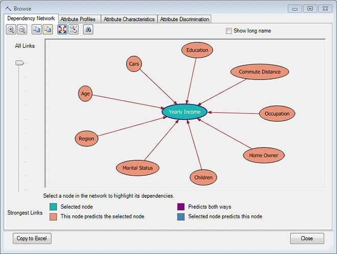
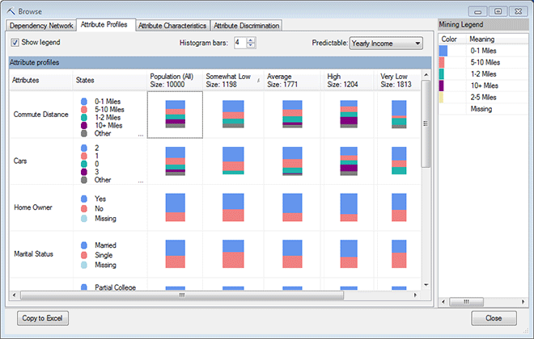
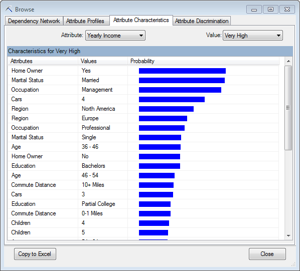
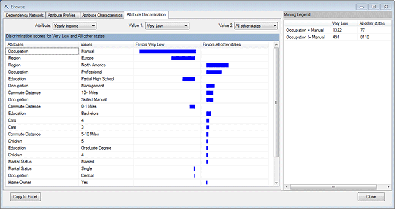

# Browsing a Naive Bayes Model
  When you open a Naïve Bayes model using **Browse**, the model is displayed in an interactive viewer with four different panes. Use the viewer to explore correlations, and get information about the model and the underlying data.  
  
-   [Dependency Network](#bkmk_DepNet)  
  
-   [Attribute Profiles](#bkmk_AttProf)  
  
-   [Attribute Characteristics](#bkmk_AttChar)  
  
-   [Attribute Discrimination](#bkmk_AttDisc)  
  
##   Explore the Model  
 The purpose of the viewer is to help you explore the interaction between input and output attributes (inputs and dependent variables) that were discovered by the [!INCLUDE[msCoName](../includes/msconame-md.md)] Naive Bayes model.  
  
 If you want to experiment with the Naïve Bayes viewer, use the [Classify Wizard &#40;Data Mining Add-ins for Excel&#41;](classify-wizard-data-mining-add-ins-for-excel.md) wizard in the Data Mining ribbon, click the **Advanced** option, and change the algorithm to use the Naïve Bayes algorithm  
  
 For these examples, we used the Source data in the sample workbook, and grouped the column, **Yearly Income**, into five income groups, from **Very Low** to **Very High**. The Naïve Bayes model then analyzed the factors correlated with each income category.  
  
###   Dependency Network  
 The first window you'll use is the **Dependency Network**. It shows you at a glance which inputs are closely correlated to the selected outcome.  
  
   
  
##### Explore the dependency network  
  
1.  First, click the target outcome, **Yearly Income**, which is represented as a node in the graph.  
  
     The highlighted nodes surrounding the target variable are those that are statistically correlated with this outcome. Use the legend at the bottom of the viewer to understand the nature of the relationship.  
  
2.  Click the slider at the left of the viewer and drag it downward.  
  
     This control filters the independent variables, based on the strengths of the dependencies. When you drag the slider down, only the strongest links remain in the graph.  
  
3.  After you have filtered the graph, click the button, **Copy Graph View**. Then select a worksheet in Excel, and press Ctrl+V.  
  
     This option copies the view that you have selected, including filters and highlighting.  
  
 [Back To Top](#BKMK_Tabs)  
  
###   Attribute Profiles  
 The **Attribute Profiles** windows gives you a visual indication of how all other variables are related to the individual outcomes.  
  
##### Explore the profiles  
  
1.  To hide some values so that you can more easily compare outcomes, click the column heading and drag it under another column.  
  
       
  
2.  Click in any cell to view the distribution of values in the **Mining Legend**.  
  
     Because the attributes associated with different outcomes are displayed visually, it is easy to spot interesting correlations, such as how incomes are distributed by region.  
  
3.  To obtain the data underlying this view, click **Copy to Excel**. A table is generated in a new worksheet that shows the correlations among individual attributes and outcomes. In this Excel table you can easily hide or filter columns.  
  
 [Back To Top](#BKMK_Tabs)  
  
###   Attribute Characteristics  
 The **Attribute Characteristics** view is useful for in-depth examination of a particular outcome variable and the contributing factors.  
  
   
  
##### Explore the attribute characteristics  
  
1.  Click **Value** and select an item from the **Value**.  
  
     As you select a target outcome, the graph updates to show the factors that are most strongly associated with the outcome, sorted by importance.  
  
     Note that if you create a model using the [Analyze Key Influencers &#40;Table Analysis Tools for Excel&#41;](analyze-key-influencers-table-analysis-tools-for-excel.md) option, you can create models that have more than one predictable attribute. However, all other wizards in the Data Mining add-ins limit you to one predictable attribute.  
  
2.  Click **Copy to Excel** to create a table, in a new worksheet, listing the scores for all attributes that are related to the selected target outcome.  
  
 [Back To Top](#BKMK_Tabs)  
  
###   Attribute Discrimination  
 The **Attribute Discrimination** view helps compare two outcomes, or one outcome vs. all other outcomes.  
  
   
  
##### Explore attribute discrimination  
  
1.  Use the controls, **Value 1** and **Value 2**, to select the outcomes that you want to compare.  
  
     For example, in this model there were some interesting attributes in the low income group, so we chose the lowest income group in the first dropdown list, and chose **All other states** in the second dropdown list.  
  
     The attributes are sorted by order of importance (calculated based on the training data). Therefore, occupation is the factor most closely correlated with income (for this target group, at least),  
  
     To see the exact figures, click the colored bar and view the **Mining Legend**.  
  
2.  Note that lower incomes are also correlated with the Europe region.  
  
     The Naïve Bayes model does not support drilldown; however, if you wanted to investigate the cases associated with this outcome group, you could use a query. For information about queries on this type of model, see [Naive Bayes Model Query Examples](data-mining/naive-bayes-model-query-examples.md).  
  
 [Back To Top](#BKMK_Tabs)  
  
## See Also  
 [Browsing Models in Excel &#40;SQL Server Data Mining Add-ins&#41;](browsing-models-in-excel-sql-server-data-mining-add-ins.md)  
  
  
