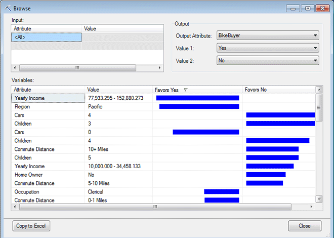
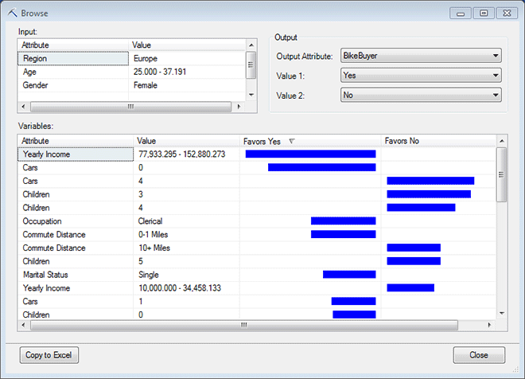

# Browsing a Neural Network Model
  When you open a neural network or logistic regression model using **Browse**, the model is displayed in an interactive viewer, similar to the neural network model viewer in [!INCLUDE[ssASnoversion](../includes/ssasnoversion-md.md)]. The viewer helps you explore correlations, and get information about the patterns in the model and the underlying data.  
  
##   Explore the Model  
 Models that are based on [!INCLUDE[msCoName](../includes/msconame-md.md)] Neural Network or Logistic Regression algorithms are similar in that they analyze data as a set of connections among known inputs and outputs. The **Browse** viewer helps you to explore those connections, using the following controls:  
  
-   [Variables](#BKMK_Variables)  
  
-   [Inputs](#BKMK_Inputs)  
  
-   [Outputs](#BKMK_Outputs)  
  
 If you want to experiment with this viewer, you can create a model using the [Classify Wizard &#40;Data Mining Add-ins for Excel&#41;](classify-wizard-data-mining-add-ins-for-excel.md) wizard, and use the **Advanced** option to change the algorithm to Microsoft Logistic Regression in the **Algorithm Parameters** dialog box.  
  
###   Variables  
 The **Variables** pane displays a list of input variables in order of their effect on the model. You use the **Input** and **Output** controls to filter the model, affecting the variables that are displayed, as well as their order.  
  
 Using this viewer, you can explore the factors that are most important in determining whether a customer more likely belongs to the bike buyer category or the non-buyer category.  
  
   
  
##### Explore variables  
  
1.  Initially, the **Variables** pane is sorted in order of the most important attributes, given the current filters. The length of the bar indicates the strength of the factor.  
  
     In the example, you can see that income is the most influential factor, followed by region. On the other hand, customers with many cars and many children are highly unlikely to buy a bike.  
  
2.  In the **Variables** pane, click the column heading for **Attribute**.  
  
     By sorting on attribute, you can see the bins that were created for each of the input columns. Columns with discrete values, such as occupation, are *binned* by the literal values.  
  
3.  Notice the ranges of values that were found for **Age** and **Income**.  
  
     If any of your input columns are numbers (that is, the entire column of data is a continuous numeric data type), the numbers are bucketed, or binned, into discrete ranges.  
  
     For Income, the column has been subdivided into groupings such as 78.4-154.06 (for the uppermost income range).  
  
       
  
     If you want different groupings, you should use the [Relabel &#40;SQL Server Data Mining Add-ins&#41;](relabel-sql-server-data-mining-add-ins.md) tool, or Excel functions, to create new income categories before building the model.  
  
4.  Click **Favors Yes** to restore the graph to the default view.  
  
     By default, the view is sorted by the value of **Favors** for the first outcome value. You can change which outcomes are assigned to the first and second columns by choosing a new value for **Value 1** and **Value 2** in **Output**.  
  
5.  Pause the mouse over the topmost colored bar in the chart.  
  
     A ToolTip appears that includes an *importance* score, a pair of *probability* scores, and a pair of *lift* values.  
  
    -   **Importance** is calculated across the entire dataset, and identifies the attribute that, given all inputs, is most correlated with the target outcome. The viewer sorts the values in the chart by the importance scores.  
  
    -   **Probability** is calculated for each set of attribute-value pairs, for the target outcomes, across the entire data set.  
  
    -   **Lift** tells you how useful this particular attribute-value pair is for promoting one outcome or another.  
  
     Note: The ToolTip contains the same information no matter whether you position the mouse over one column or the other.  
  
 [Back To Top](#BKMK_Tabs)  
  
###   Inputs  
 The **Inputs** pane lets you choose a set of inputs and apply that as a filter to the model, which lets you see the influence of those choices on the outcome, based on the training data  
  
##### Explore inputs  
  
1.  Suppose you want to target a particular group, and see the factors that most influence purchasing in that group.  
  
     In the **Input** pane, click the **\<All>** cell under **Attribute**, and select **Age**.  
  
     For **Value**, select the youngest age category.  
  
2.  Notice that even when you filter on a particular age group, the Pacific region comes to near the top of the list. This is because customers in the Pacific region are far more likely to buy a bike than customers in other regions.  
  
     Since region is not something you can influence, to remove this variable from consideration and see other factors, you can change the inputs again.  
  
     In the **Input** pane, click the empty cell under **Age**, and select **Region**.  
  
     For **Value**, select **Europe**.  
  
3.  Continue adding input filters to focus on a group of particular interest.  
  
     For example, for the input attribute, add **Gender**, and select **Female** as the value.  
  
       
  
     Notice how the list of variables changes. Now **Income** is the variable that is most important in predicting the target outcome.  
  
     The order in which you apply the input filters does not affect the results.  
  
 [Back To Top](#BKMK_Tabs)  
  
###   Outputs  
 In the **Outputs** pane, you can choose the outcome that you are interested in. Neural networks let you specify as many outcome columns as you like, although adding more outputs adds to the complexity of the model and may require a much longer time to process.  
  
 To compare two outputs, they must have been designated as **Predict** or **Predict Only** columns.  
  
##### Explore outputs  
  
1.  Use the **Output Attribute** list to select an attribute.  
  
2.  Select two outcomes from the Value 1 and Value 2 lists. These two states of the output attribute will be compared in the **Variables** pane.  
  
 [Back To Top](#BKMK_Tabs)  
  
## More About Neural Network Models  
 The information in the viewer is retrieved from the server using a stored procedure specific to this model type: System.Microsoft.AnalysisServices.System.DataMining.NeuralNet.GetAttributeScores.  
  
 If you want to create a model with multiple predictable attributes using the add-ins, use the **Advanced** modeling options.  
  
 For more information, see [Create Mining Structure &#40;SQL Server Data Mining Add-ins&#41;](create-mining-structure-sql-server-data-mining-add-ins.md) and [Add Model to Structure &#40;Data Mining Add-ins for Excel&#41;](add-model-to-structure-data-mining-add-ins-for-excel.md).  
  
## See Also  
 [Browsing Models in Excel &#40;SQL Server Data Mining Add-ins&#41;](browsing-models-in-excel-sql-server-data-mining-add-ins.md)  
  
  
