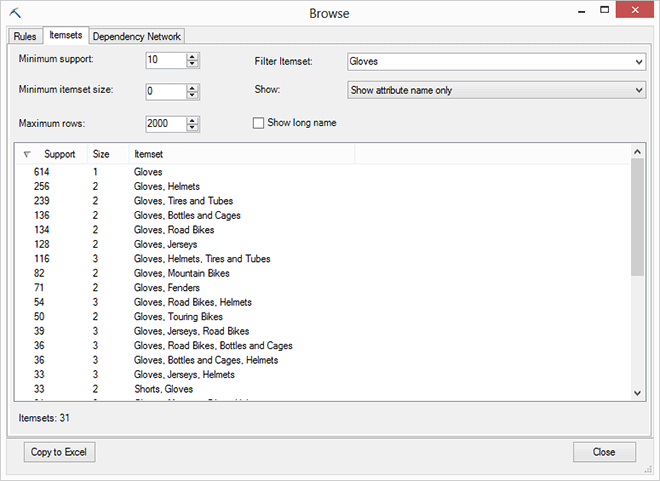
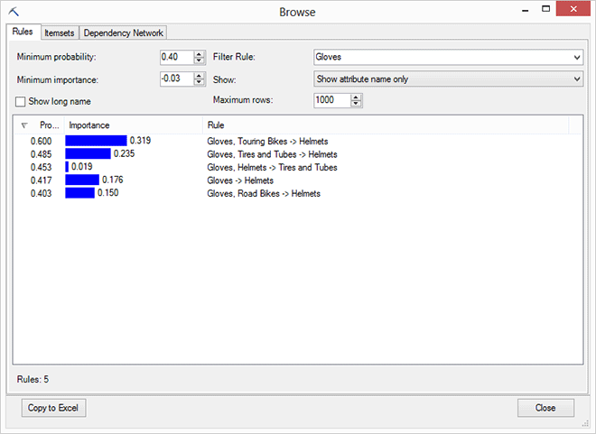
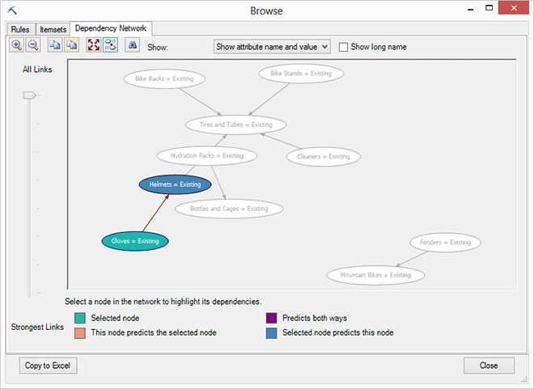

# Browsing an Association Rules Model
  When you open an association model using **Browse**, the model is displayed in an interactive viewer, similar to the Association Rules Viewer in [!INCLUDE[ssASnoversion](../includes/ssasnoversion-md.md)].  The viewer lets you see at a glance which items were correlated with each other, and displays rules that you can use for prediction or making recommendations.  
  
##   Explore the Model  
 When you open a mining model that was created using the [!INCLUDE[msCoName](../includes/msconame-md.md)] Association Rules algorithm, the **Browse** window includes the following views, each designed to let you explore a different aspect of the model:  
  
-   [Itemsets](#BKMK_Itemsets)  
  
-   [Rules](#BKMK_Rules)  
  
-   [Dependency Net](#BKMK_Dependency)  
  
 Take note of the option on each tab, **Show long name** . By selecting this option, you can show or hide the table from which the itemset originates, and shorten or lengthen the name of the rule or itemset. This option is particularly useful when your case data and attribute data are from different data sources.  
  
 To experiment with an association model, you can use the sample data on the Associate tab of the sample data workbook, and build an association model using all the defaults. You can also build a Shopping Basket Analysis model and open that using **Browse**.  
  
###   Itemsets  
 The **Itemsets** tab is a good place to begin exploring an association model. This tab shows a list of the items that the model frequently found together.  
  
   
  
 The most common example of itemsets is in a shopping basket model, where an itemset represents pairs or sets of products that lots of customers purchase at the same time. However, depending on how you group and order your items, the itemset might contain a sequence of movies that customers order over a period of time, or events that tend to occur in  a particular location.  
  
 An *itemset* can contain as few as one item to two, three, or however, many is set as the maximum itemset size for the model. For each itemset, the viewer displays the itemset  *support*,  *probability*, and *size*. Support and probability are the principal statistics used to rank the itemsets and rules generated by an association model. These values are also used to calculate and describe their importance.  
  
 **Support**. Support means the number of cases or rows of input data that have this item. For example, if an itemset contains two items that are found in a shopping cart, the number in the **Support** column indicates how many times that combination of items occurred in the source data.  
  
 **Size**. By changing itemset size, you can control the length of the lists of itemsets. If you don't want to see single products in the list, change the option, **Minimum itemset size**, to 2 or more.  Restricting the list by increasing the minimum size of itemsets lets you look for very specific patterns. This might be useful if you are working with a very large set of data.  
  
 You can filter the number of itemsets that are displayed in the tab by changing the **Minimum support** and **Maximum rows** values. If you increase the **Minimum Support** value, the list will show fewer itemsets, but the itemsets will be the more common ones in the input data. Whether common is the same as important is another question, which you can explore using the **Rules** tab.  
  
 Note that changing the support value or other controls on the **Itemsets** tab only changes the items that are displayed, and does not affect the underlying model. If you want to generate fewer or more itemsets, or limit their size, you should use the parameters, `MINIMUM_SUPPORT` and `MAXIMUM_SUPPORT`, available in the **Algorithm Parameters** dialog box.  
  
##### Explore the itemsets list  
  
1.  Click the **Support** column to sort by highest to lowest support. This will give you an idea of what customers are buying most often.  
  
2.  To focus on a particular itemset of interest, out of the many thousand combinations possible, type some text in the **Filter Itemset** box.  
  
     Here we typed `Gloves`. When you apply the filter, the list is refreshed to show only itemsets containing gloves. This lets you focus on the transactions where customers purchased gloves and some other item.  
  
     The **Filter Itemset** option also displays a list of the filters that you have used previously.  
  
3.  Change the value of **Minimum itemset size** to filter out the customers who bought only gloves and no other items.  
  
4.  Click the dropdown list for the option **Show**, to control how the attributes are displayed:  
  
    -   **Show attribute name and value**  
  
    -   **Show attribute value only**  
  
    -   **Show attribute name only**  
  
     Notice how the name changes. In the case of a market basket model, which is built on nested tables of products that were purchased by multiple customers, the attribute name is typically the product name, and the presence of the product in the list is marked as `Existing`, meaning that the customer did buy the item.  
  
     The opposite of `Existing` is `Missing`, which can be a very useful attribute to investigate in data mining. For example, suppose the itemset A +B is so very popular that you wanted to find customers who purchased Item A but not item B. You could do this by using a prediction query and retrieving the transactions with one but not the other, and do some further analysis on those. For information about how to create prediction queries on association models, see [Association Model Query Examples](data-mining/association-model-query-examples.md) in SQL Server Books Online  
  
5.  To force the list of itemsets to redisplay using your new filter criteria, you can select or clear the **Show long name** check box.  
  
 [Back to Top](#BKMK_ViewerTabs)  
  
###   Rules  
 The **Rules** tab combines information about the itemsets and their relative value.  
  
   
  
 *Probability* represents the fraction of cases in the dataset that contain the targeted combination of items. Probability is similar to the statistical concept of *confidence*, and gives you an indication of how likely the result of a rule is to occur. You can change the value of **Minimum probability** in this pane to filter the rules that are displayed.  
  
 The value for **Minimum probability** that you initially see is the threshold value that was used by the algorithm when building the model. After the model is complete, you can't decrease this value, but you can increase it to show only the higher probability items.  
  
 *Importance* is designed to measure the usefulness of a rule. A rule that is very common might be so ubiquitous that is has little information value. The greater the importance, the more valuable the rule is for predicting the outcome. In the [Shopping Basket Analysis &#40;Table AnalysisTools for Excel&#41;](shopping-basket-analysis-table-analysistools-for-excel.md) tool, importance can be combined with the price of items to determine the bundles that are potentially most valuable in terms of sales.  
  
##### Explore the rules list  
  
1.  Try clicking the column headings - **Probability**, **Importance**, and **Rule** - to see how the data changes.  
  
2.  Use the **Filter Rule** option to type in values and focus on targeted rules.  
  
     For example, if you want to see all the rules that predict what customers are likely to purchase along with gloves, type "gloves" in the text box and refresh the pane.  
  
     The **Filter Itemset** option also displays a list of the filters that you have used previously.  
  
3.  To force the list of rules to redisplay using filter criteria, you can select or clear the **Show long name** check box.  
  
4.  Use the option, **Show** to control the way that rule names are displayed.  
  
5.  Set the value for the **Maximum rows** option to 100, and then click **Copy to Excel**.  
  
     Note that changing this value doesn't have any effect on the amount of data in the model; it simply controls the number of rows in the display list. This option can be useful when working with very large models.  
  
 [Back to Top](#BKMK_ViewerTabs)  
  
###   Dependency Network  
 The **Dependency Network** tab is a visual map of the correlations among items. Each oval in the graph (referred to as a *node*) represents an attribute-value pair, such as "Vest = Existing" or "Age = 1-30".  Each line connecting the ovals (referred to as an *edge*) represents a type of correlation.  
  
   
  
##### Explore the dependency network  
  
1.  Click the **Find** button and use the **Find Node** dialog box to type an item of interest.  
  
     For example, type "gloves" and then maximize the graph in the window so that you can easily see the results.  
  
     The node that contains the item is highlighted, while the arrows pointing to the node represent a rule that connects the items.  
  
     The direction of the arrow tells you the direction of the rule. For example, if someone who buys gloves is also likely to buy a vest, the arrow will start from the "glove" node and terminate on the "vest" node.  
  
     To get additional statistics about this rule, you can click the **Rules** tab and look for a rule with the description, "Glove - Existing" -> "Vest - Existing.")  
  
2.  Click and drag the slider at the left of the viewer.  
  
     The slider acts as a filter on the probability of the rules. Lowering the slider shows only the strongest rules.  
  
3.  Click **Copy to Excel** to copy a snapshot of the current window to Excel.  
  
     You won't be able to work with the graph that you copy into Excel; if you need an interactive network graph, use the [Viewing Data Mining Models in Visio &#40;Data Mining Add-ins&#41;](viewing-data-mining-models-in-visio-data-mining-add-ins.md).  
  
 [Back to Top](#BKMK_ViewerTabs)  
  
## More about Association Models  
 You can use the **Browse** feature to open and explore any model that was created using the Microsoft Association Rules algorithm. This includes models built using the [Shopping Basket Analysis &#40;Table AnalysisTools for Excel&#41;](shopping-basket-analysis-table-analysistools-for-excel.md) tool, in the **Table Analysis Tools** ribbon, or in [!INCLUDE[ssASnoversion](../includes/ssasnoversion-md.md)].  
  
 If you create an association rules model using the Shopping Basket Analysis tool, many of the advanced options are configured automatically for you.  
  
 If you want to set advanced parameters or alter minimum probability and support, use the [Associate Wizard &#40;Data Mining Client for Excel&#41;](associate-wizard-data-mining-client-for-excel.md) wizard, or build your own model using the [Add Model to Structure &#40;Data Mining Add-ins for Excel&#41;](add-model-to-structure-data-mining-add-ins-for-excel.md) modeling option.  
  
-   **Itemsets:** When you create the model, you can also control the number of itemsets that are generated by assigning a value to the MINIMUM_PROBABILITY parameter. This parameter is available in the Algorithm Parameters dialog box.  
  
-   **Rules:** The [!INCLUDE[msCoName](../includes/msconame-md.md)] Association Rules algorithm uses probability values to restrict the number of rules that are generated. You can control the number of rules by setting the parameters, `MINIMUM_PROBABILITY` or `MINIMUM _IMPORTANCE`.  
  
 For more information about configuring advanced parameters, see [Data Mining Algorithms &#40;SQL Server Data Mining Add-ins&#41;](data-mining-algorithms-sql-server-data-mining-add-ins.md).  
  
## See Also  
 [Browsing Models in Excel &#40;SQL Server Data Mining Add-ins&#41;](browsing-models-in-excel-sql-server-data-mining-add-ins.md)  
  
  
