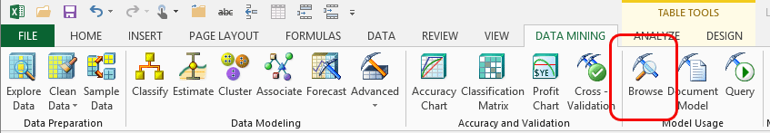

# Browsing Models in Excel (SQL Server Data Mining Add-ins)
    
  
 Visually exploring the model is usually the fastest and easiest way to get an understanding of the rules and relationships discovered by analysis. By using the Data Mining Client for Excel, you can browse both temporary models created during the current Excel session, and models stored in an instance of [!INCLUDE[ssASnoversion](../includes/ssasnoversion-md.md)].  
  
 To browse a model, you select a model and its associated structure from a list of available models, and the add-in automatically picks the viewer that is appropriate for that data mining algorithm. You can drill into the most interesting trends, filter the completed data mining model, and copy graphs and data to Excel or to Visio.  
  
## Using the Browse Model Wizard  
  
1.  Click the **Data Mining** tab.  
  
2.  In the **Model Usage** group, click **Browse**.  
  
3.  In the **Select Model** dialog box, choose a mining model from the list, and click **Next**.  
  
4.  The wizard opens a **Browse** window that is appropriate for the type of model that you selected.  
  
## List of Data Mining Viewers  
 Depending on the data mining algorithm that you used when you created the model, the **Browse** window will look a bit different. It can include graphs to help interpret the results, legends that contain additional detail, and controls for interacting with the data.  
  
 The following topics provide guidance in how to use each of the viewers, including tips on interpreting the complex graphs, and how to change, copy, or work with the results.  
  
 [Browsing an Association Rules Model](browsing-an-association-rules-model.md)  
  
 [Browsing a Clustering Model](browsing-a-clustering-model.md)  
  
 [Browsing a Decision Trees Model](browsing-a-decision-trees-model.md)  
  
 [Browsing a Forecasting Model](browsing-a-forecasting-model.md)  
  
 [Browsing a Naive Bayes Model](browsing-a-naive-bayes-model.md)  
  
 [Browsing a Neural Network Model](browsing-a-neural-network-model.md)  
  
## See Also  
 [Viewing Data Mining Models in Visio &#40;Data Mining Add-ins&#41;](viewing-data-mining-models-in-visio-data-mining-add-ins.md)   
 [Manage Models &#40;SQL Server Data Mining Add-ins&#41;](manage-models-sql-server-data-mining-add-ins.md)  
  
  
