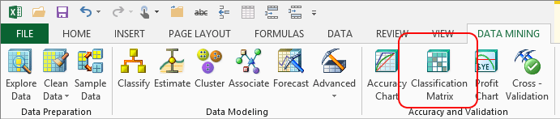

# Classification Matrix (SQL Server Data Mining Add-ins)
    
  
 You can use the classification matrix to assess the accuracy of a model for prediction. To generate a classification matrix, you run a set of testing data through the model, and the classification matrix tool compares the actual values from the testing set against the predictions made by the model. By looking at the matrix, you can tell at a glance how often the model is correct, and how often it predicts wrongly.  
  
 In these add-ins, use the **Classification Matrix** wizard to select a model, specify the testing data, and then generate a results matrix.  
  
## How to Read a Classification Matrix  
 Let's assume your objective is to design a customer loyalty program and then assign customers to appropriate categories, so that you can provide them with the appropriate level of incentives. You have implemented three levels for the reward program -- bronze, silver, and gold - and given these out to customers in a trial phase. You have also designed a model that analyzes customers and predicts the correct categories. Now you will use the classification matrix on the trial data to determine how good the model was at predicting the correct offer for all customers.  
  
 The table from the classification matrix tells you how many customers would be assigned to each category based on the model, and compares that result to the number of customers who actually signed up for each reward level.  
  
||Bronze (Actual)|Gold (Actual)|Silver (Actual)|  
|-|-----------------------|---------------------|-----------------------|  
|Bronze|**94.45%**|15.18%|1.70%|  
|Gold|2.72%|**84.82%**|0.00%|  
|Silver|1.84%|0.00%|**93.80%**|  
|*Correct*|*95.45%*|*84.82%*|*98.30%*|  
|*Misclassified*|*4.55%*|*15.18%*|*1.70%*|  
  
-   Each column shows the actual values in the testing dataset.  
  
-   Each row shows the predicted values.  
  
-   The values in boldface, which run diagonally from the upper-left corner to the lower-right corner of the matrix, give you the picture of what the model got right.  
  
-   All other values outside the diagonal represent errors. Some errors are false positives, meaning the model predicted the customer would join the gold program but was wrong.  Depending on your domain, false positives can be very costly.  
  
     Others are false negatives, meaning the model predicted the customer would not be interested though he or she did join the program. Again, depending on the problem domain, this lost opportunity cost might be significant.  
  
## Using the Classification Matrix Wizard  
  
1.  Select the mining model on which to base predictions.  
  
2.  Select a source of new test data, or use testing data that was saved with the structure.  
  
3.  Select the column for which you want to assess accuracy. You can choose only one column when creating a matrix, but the column can have multiple values.  
  
     Tip: It can be difficult to interpret a classification matrix if your predictable column has many columns to compare.  
  
     In the **Select Columns to Predict** page, you can also specify whether you want to display the count of incorrect and incorrect values, or display a percentage.  
  
4.  On the Select Source Data page, indicate whether you are using external testing data, or the test data saved with the model.  
  
5.  If you use external testing data, you need to map the model to the input columns on the **Specify Relationship** page of the wizard.  
  
     If you use the embedded test data set, the mapping is done for you  
  
6.  Click **Finish** to run predictions against the model and generate the classification matrix.  
  
     The wizard creates a report that contains the classification matrix and other details about the analysis. This report is saved as a table in Excel, with a summary above the report that indicates how many cases were correctly predicted and how many predictions were wrong.  
  
### Requirements  
  
-   To create a classification matrix, you must have access to an existing mining model that supports accuracy measurement. Forecasting models and association models cannot be measured using this tool.  
  
-   The model that you are measuring needs to predict a value that is either discrete or that has already been discretized.  
  
-   If you didn't use the option to save a testing set along with your structure or model, you need to obtain an input data set that has essentially the same number of columns, with matching data types, as those used in the model.  
  
-   Both the data mining model and the new data that you are using for testing must contain at least one column that can be predicted, and the columns must contain the same kind of data.  
  
### Known Issues  
 In SQL Server 2012 and SQL Server 2014, the ability to map the internal test data set to the model is not working in the **Classification Matrix** tool. However, you can specify an external data set, and then select the training set as the input to determine error on the original data set.  
  
## See Also  
 [Validating Models and Using Models for Prediction &#40;Data Mining Add-ins for Excel&#41;](validating-models-and-using-models-for-prediction-data-mining-add-ins-for-excel.md)   
 [Explore Data &#40;SQL Server Data Mining Add-ins&#41;](explore-data-sql-server-data-mining-add-ins.md)   
 [Detect Categories &#40;Table Analysis Tools for Excel&#41;](detect-categories-table-analysis-tools-for-excel.md)  
  
  
