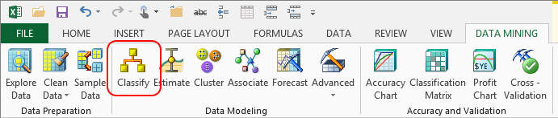

# Classify Wizard (Data Mining Add-ins for Excel)
    
  
 The **Classify** wizard helps you build a classification model based on existing data in an Excel table, an Excel range, or an external data source.  
  
 A classification model extracts patterns in your data that indicate similarities and helps you make predictions based on groupings of values. For example, a classification model might be used to predict risk based on income or spending patterns.  
  
## Using the Classify Wizard  
  
1.  In the **Data Mining** ribbon, click **Classify**, and then click **Next**.  
  
2.  In the **Select Source Data** page, choose the data to analyze.  
  
     This wizard supports multiple kinds of data: Excel tables, Excel ranges, and external data sources. With external data, you can either add it into Excel, or choose a set of tables or views in an Analysis Services data source. You can also add tables and change columns to create ad hoc data sources.  
  
3.  On the **Classification** page, choose the column that you want to classify.  
  
     Review the columns in the list, **Input columns**, and deselect any columns that have unique values and thus aren't useful for creating patterns, such as ID numbers, customer names, and so on. You should also remove columns that essentially duplicate the classifiable column.  
  
     For example, if you are classifying predicting the category of a product, you should exclude the subcategory field if there is a known business rule, or else the strength of that rule might prevent you from discovering other correlations.  
  
4.  Optionally, click **Parameters** to change the algorithm parameters and customize the behavior of the clustering model.  
  
5.  In the **Split data into training and testing sets** page, specify how much data to hold out for testing. The remainder is always used for training the model.  
  
     The default setting is 30% testing data and 70% training data.  
  
6.  On the **Finish** page, provide a descriptive name for your data set and model, and set the following options that control how you work with the finished model:  
  
    -   **Browse model**. When this option is selected, as soon as the wizard finishes processing the model, it opens a **Browse** window to help you explore the results. The contents of the viewer depend on the type of model you built. For more information, see [Browsing a Decision Trees Model](browsing-a-decision-trees-model.md) and [Browsing a Neural Network Model](browsing-a-neural-network-model.md).  
  
    -   **Enable drillthrough**. Select this option to view the underlying data from the finished model. This option is only available if you build a Decision Tree model.  
  
    -   **Use temporary model**. If you select this option, the model will not be saved to the server. Temporary models are deleted when you close Excel.  
  
## More About Classification Models  
 In the **Algorithm Parameters** dialog box, you can also choose the classification method from among these algorithms provided in Analysis Services:  
  
-   Microsoft Decision Tree  
  
-   Microsoft Logistic Regression  
  
-   Microsoft Naïve Bayes  
  
-   Microsoft Neural Network  
  
 Although the algorithms might yield similar results, they analyze the data differently, so we recommend trying several algorithms and comparing the results. The default method is Microsoft Decision Trees.  
  
 In the **Parameters** list, you can change advanced options, which depend on the type of algorithm you choose. The parameters for each algorithm are described in more detail in SQL Server Books Online.  
  
 [Microsoft Decision Trees Algorithm Technical Reference](data-mining/microsoft-decision-trees-algorithm-technical-reference.md)  
  
 [Microsoft Logistic Regression Algorithm Technical Reference](data-mining/microsoft-logistic-regression-algorithm-technical-reference.md)  
  
 [Microsoft Naive Bayes Algorithm Technical Reference](data-mining/microsoft-naive-bayes-algorithm-technical-reference.md)  
  
 [Microsoft Neural Network Algorithm Technical Reference](data-mining/microsoft-neural-network-algorithm-technical-reference.md)  
  
### Requirements  
 To use the **Classify** wizard, you must be connected to an [!INCLUDE[ssASnoversion](../includes/ssasnoversion-md.md)] database. For information about how to create a connection, see [Connect to Source Data &#40;Data Mining Client for Excel&#41;](connect-to-source-data-data-mining-client-for-excel.md).  
  
## See Also  
 [Creating a Data Mining Model](creating-a-data-mining-model.md)  
  
  
