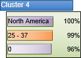
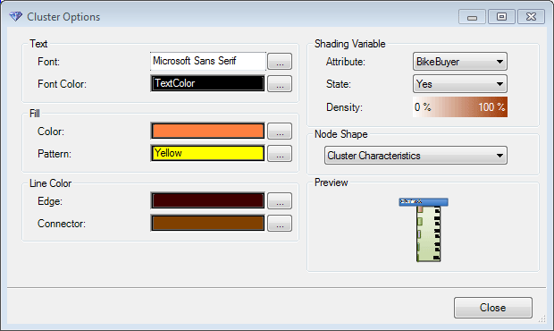
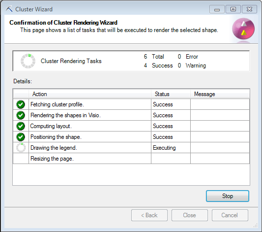
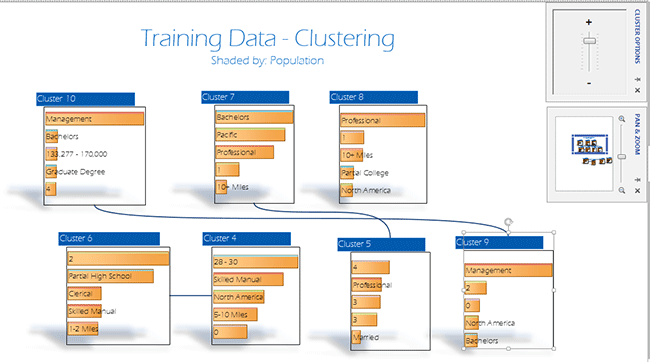
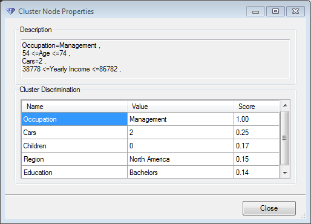

# Cluster Diagram Walkthrough (Data Mining Add-ins)
  After you have created a clustering model, you can import it into Visio using the **Cluster** shape and then continue to customize and enhance the layout. The **Data Mining Shapes for Visio** include the following custom controls for working with data mining diagrams:  
  
-   Rendering controls for the cluster diagram  
  
     These options are part of the **Cluster Wizard** that is launched when you drop a shape into the Visio workspace.  
  
-   **Data Mining Layout** toolbar  
  
     These options are added to the Visio workspace to help you interact with the data mining shape. The options are different depending on which type of data mining model you are using.  
  
## Build a Cluster Diagram  
 This walkthrough demonstrates how to build and customize a clustering diagram in Visio.  
  
 To follow along, you should have a clustering model already available. If you do not have a model, use the [Cluster Wizard &#40;Data Mining Add-ins for Excel&#41;](cluster-wizard-data-mining-add-ins-for-excel.md) wizard and create a model using the Training data set in the sample workbook, using all the defaults.  
  
#### Use the Cluster Visio Shape Wizard  
  
1.  If you do not see **Microsoft Data Mining Shapes** in the **Shapes** list, click **More Shapes**, select **Open Stencil**, and open the template from the default installation location.  
  
     \<drive>:\Program files\Microsoft SQL Server 2012 DM Add-Ins  
  
2.  Drag the **Cluster** shape onto the page.  
  
3.  On the welcome page of the **Cluster Visio Shape Wizard**, click **Next**.  
  
4.  On the **Select a Data Source** page of the **Cluster Wizard**, choose a connection to an [!INCLUDE[ssASnoversion](../includes/ssasnoversion-md.md)] server that contains the data mining models you want to visualize.  
  
5.  Select an appropriate mining model, and click **Next**.  
  
     To make sure you choose a clustering model, review the description in the **Properties** pane.  
  
6.  If the connection is successful, on the page, **Options for cluster diagram**, you decide which type of cluster diagram to include in your Visio presentation:  
  
     **Show cluster shapes only**  
     This option creates a simple cluster diagram, with each cluster represented by a rectangle or other shape you choose  
  
     **Show clusters with characteristics chart**  
     This option creates the same chart as above, but inside the shapes are histograms that describe the characteristics of the cluster.  
  
       
  
     **Show clusters with discrimination chart**  
     This option creates the same chart as the cluster diagram, but instead lists the characteristics of the current cluster that most strongly distinguish it from other clusters.  
  
     You can switch to another chart type after the wizard has built the diagram, by right-clicking a cluster and selecting a new chart type. For now, choose the option, **Show clusters with characteristics chart**.  
  
7.  Leave the option, **Number of rows in the chart**, as 5.  
  
     This option doesn't change the number of clusters in the model; it simply limits the number of attributes that can be displayed as features of each cluster.  
  
     However, the option acts as a filter on the chart data, so you can't increase the number of items later.  
  
8.  Click **Advanced**.  
  
     The **Cluster Options** dialog box is where you customize the visual appearance of shapes used in the diagram. You can change the colors used in the graph, and the shape used for clusters.  
  
     The **Shading Variable** control does not work in Office 2013.  
  
       
  
     **Tip:** Some colors can be altered later by using Visio themes and shape editing controls. However, Visio themes will also override some of these color selections, so we recommend starting with the default colors and gradually applying changes.  
  
9. Click **Finish** to create the graph.  
  
     The wizard retrieves information from the data mining model, renders the shapes, and populates each cluster with attributes and values.  
  
       
  
## Explore and Modify the Finished Diagram  
 After the diagram is complete, you can continue to customize the appearance using the Visio controls, as shown in the following example.  
  
   
  
 All of the basic cluster shapes are generated by the wizard; use the following tools to update and personalize the diagram:  
  
1.  Drag the slider in the **Cluster Options** control, to filter out weaker relationships and simplify the diagram.  
  
2.  Use the Visio **Re-Layout Page** option to experiment with different cluster layouts.  
  
3.  Use the **Connectors** option on the **Design** tab to change the connector style to keep lines from crossing over clusters.  
  
4.  Click the **Add-Ins** ribbon, and then display one of the custom toolbars used for working with data mining diagrams:  
  
     **Layout**  
     Optimizes the arrangement of clusters to fit in the current page.  
  
     **Resize Page**  
     This control was intended for earlier HTML versions. Use the Visio page resizing controls instead.  
  
     **Description**  
     If a cluster is selected, click this option to display details about the cluster.  
  
       
  
     **Edge Strength**  
     Displays confidence scores on the lines connecting clusters.  
  
     However, if you apply any special formatting other than the default generated by the wizard, including some backgrounds, these numbers might not be visible.  
  
     **Slider**  
     Filters the lines between clusters. Moving the slider up removes all but the most important associations.  
  
     **Shading**  
     This control does not work in Office 2013.  
  
5.  Use the **Pan and Zoom** control, in the **Task Pane** area of the Visio **View** ribbon, to focus on a set of clusters and move around the diagram.  
  
6.  Right-click any cluster to see options specific to the cluster shape:  
  
    -   Change the chart style.  
  
    -   Add a cluster characteristics chart.  
  
    -   Add a cluster discrimination chart.  
  
## See Also  
 [Troubleshooting Visio Data Mining Diagrams &#40;SQL Server Data Mining Add-ins&#41;](troubleshooting-visio-data-mining-diagrams-sql-server-data-mining-add-ins.md)  
  
  
