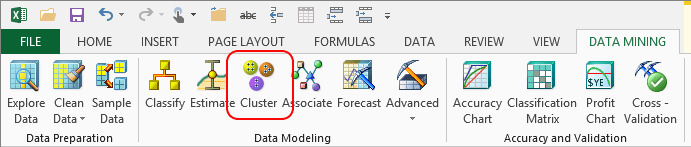

# Cluster Wizard (Data Mining Add-ins for Excel)
    
  
 The Cluster wizard helps you build a model that detects rows that share similar characteristics and groups them to maximize the distance between groups. This wizard is useful for finding patterns in all kinds of data.  
  
 The Cluster wizard uses the Microsoft Clustering algorithm and can be extensively customized. It works on existing data from an Excel table, an Excel range, or an [!INCLUDE[ssASnoversion](../includes/ssasnoversion-md.md)] query. Similar functionality is provided by the [Detect Categories](detect-categories-table-analysis-tools-for-excel.md) tool, provided in the Table Analysis Tools for Excel. However, the Detect Categories tool cannot be customized and must use data in Excel tables.  
  
## Using the Cluster Wizard  
  
1.  In the Data Mining ribbon, click **Cluster**, and then click **Next**.  
  
2.  In the **Select Source Data** page, select an Excel table or range. Or specify and external data source.  
  
     If you use an external data source, you can create custom views or paste in custom query text, and save the data set as an [!INCLUDE[ssASnoversion](../includes/ssasnoversion-md.md)] data source.  
  
3.  On the **Clustering** page, you can customize the way the model is built.  
  
    -   For **Number of segments**, you can tell the wizard to create a fixed number of categories, or let it automatically detect the optimum number of groupings.  
  
    -   Review the list of columns in the **Input columns** list, and deselect any columns that are not useful in creating patterns. Columns you should exclude include ID numbers, customer names, and so on.  
  
4.  Optionally, click **Parameters** to change the algorithm parameters and customize the behavior of the clustering model.  
  
5.  In the **Split data into training and testing sets** page, specify how much data to hold out for testing. The remainder is always used for training the model.  
  
     The default setting is 30% testing data and 70% training data.  
  
6.  On the **Finish** page, provide a descriptive name for your data set and model, and set the following options that control how you work with the finished model:  
  
    -   **Browse model**. When this option is selected, as soon as the wizard finishes processing the model, it opens a **Browse** window to help you explore the results. The contents of the viewer depend on the type of model you built. For more information, see [Browsing a Clustering Model](browsing-a-clustering-model.md).  
  
    -   **Enable drillthrough**. Select this option to view the underlying data from the finished model. This option is only available if you build a Decision Tree model.  
  
    -   **Use temporary model**. If you select this option, the model will not be saved to the server. Temporary models are deleted when you close Excel.  
  
## More about Clustering Models  
 You can change the clustering algorithm used by this wizard by clicking **Advanced** and using the **Algorithm Parameters** dialog box.  
  
 The Microsoft Clustering algorithm provides these clustering methods:  
  
-   K-means -  scalable or non-scaling.  
  
-   Expectation Maximization (EM) - scalable or non-scaling.  
  
 You can also use the CLUSTER_SEED parameter to control the starting value and ensure that repeated models using the same data set have the same results.  
  
### Requirements  
 To use the Cluster wizard, you must be connected to a [!INCLUDE[ssASnoversion](../includes/ssasnoversion-md.md)] database. For more information, see [Connect to Source Data &#40;Data Mining Client for Excel&#41;](connect-to-source-data-data-mining-client-for-excel.md).  
  
## See Also  
 [Creating a Data Mining Model](creating-a-data-mining-model.md)   
 [Detect Categories &#40;Table Analysis Tools for Excel&#41;](detect-categories-table-analysis-tools-for-excel.md)  
  
  
