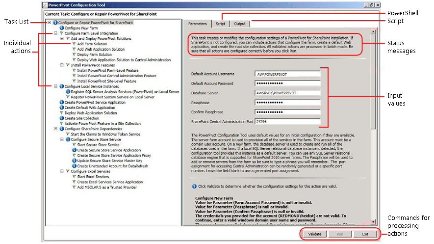

# Configure or Repair PowerPivot for SharePoint 2010 (PowerPivot Configuration Tool)
  To configure or repair an installation of [!INCLUDE[ssCurrent](../includes/sscurrent-md.md)] PowerPivot for SharePoint 2010, use the PowerPivot Configuration tool. The configuration tool starts by scanning the system and returns a list of actions needed to complete or repair an installation. The [!INCLUDE[ssCurrent](../includes/sscurrent-md.md)] setup wizard installs the PowerPivot Configuration Tool for SharePoint 2010 as well as a PowerPivot Configuration Tool for SharePoint 2013. This topic describes the PowerPivot Configuration Tool for SharePoint 2010. For more information on SharePoint 2010, see [Configure or Repair PowerPivot for SharePoint 2013 &#40;PowerPivot Configuration Tool&#41;](power-pivot-sharepoint/configure-or-repair-power-pivot-for-sharepoint-2013.md).  
  
 **[!INCLUDE[applies](../includes/applies-md.md)]**  SharePoint 2010  
  
 
  
##   Before you start  
 The PowerPivot for SharePoint 2010 Configuration Tool scans for program files, registry settings, and available ports. To get the most use out of the tools, review the following.  
  
-   General requirements to run the configuration tool, [PowerPivot Configuration Tools](power-pivot-sharepoint/power-pivot-configuration-tools.md).  
  
-   PowerPivot for SharePoint 2010 requires web applications configured for classic mode authentication. If the PowerPivot for SharePoint 2010 Configuration Tool creates the application for you, the application is configured for classic mode.  
  
-   Port 80 must be available one of the selected tasks requires the Configuration tool to create and configure a web application.  
  
##   Using the PowerPivot Configuration Tool  
 The first page of the tool provides a summary of the input values used to configure the SharePoint farm. In addition to the input values that you provide, default values are used to configure the system. Default names are used for service applications, service application databases, and service application properties.  
  
> [!TIP]  
>  If the PowerPivot Configuration tool scans the computer and returns a blank task list in the left pane, then no features or settings need configuration. To modify the SharePoint or PowerPivot configuration, use Windows PowerShell or the management pages in SharePoint Central Administration. For more information, see [PowerPivot Server Administration and Configuration in Central Administration](power-pivot-sharepoint/power-pivot-server-administration-and-configuration-in-central-administration.md).  
  
 Values for service accounts are used for multiple services. For example, the PowerPivot Configuration tool uses the default account on the first page to set all application pool identities. You can change these accounts later by modifying the service application properties in Central Administration.  
  
-   The exception to this rule in the PowerPivot for SharePoint 2010 Configuration tool is the Analysis Services service account. This account is specified during Setup, and you type a password for this account in the **Register SQL Server Analysis Services (PowerPivot on Local Server)** action. The summary page does not include a field for this password, so be sure to enter it on the page for that action.  
  
 The tool provides a tabbed interface that includes parameter inputs, Windows PowerShell script, and status messages.  
  
 The PowerPivot Configuration tool uses Windows PowerShell to configure the server. You can click the **Script** tab to review the Windows PowerShell script the.  
  
   
  
##   Configuration steps  
 The link to the configuration tool is only visible when PowerPivot for SharePoint 2010 is installed on the local server.  
  
1.  On the **Start** menu, point to **All Programs**, click [!INCLUDE[ssCurrentUI](../includes/sscurrentui-md.md)], click **Configuration Tools**, and then click **PowerPivot Configuration Tool**.  
  
2.  Click **Configure or Repair PowerPivot for SharePoint**.  
  
3.  Expand the window to full size. You should see a button bar at the bottom of the window that includes **Validate**, **Run**, and **Exit** commands.  
  
4.  **Default Account:** On the Parameters tab, type a domain user account for the **Default Account Username**. This account is used to provision essential services, including the PowerPivot service application pool. Do not specify a built-in account such as Network Service or Local System. The tool blocks configurations that specify built-in accounts.  
  
     **Passphrase:** type a passphrase. For a new SharePoint farm, the passphrase is used whenever a new server or application is added to the SharePoint farm. If it is an existing farm, enter the passphrase that allows you to add a server application to the farm.  
  
5.  **Port:** Optionally, type a port number to connect to the Central Administration web application or use the provided randomly generated number. The configuration tool checks that the number is available before offering it as an option.  
  
6.  Click **Register SQL Server Analysis Services (PowerPivot) on Local Server**.  
  
     Enter the password of the Analysis Services service account.  
  
7.  Optionally, review the remaining input values used to complete each action. For more information about each one, see [Input values used to configure the server](#bkmk_input) in this topic.  
  
8.  Optionally, remove any actions that you do not want to process. For example, if you want to configure Secure Store Service later, click **Configure Secure Store Service**, and then clear the checkbox **Include this action in the task list**.  
  
9. Click **Validate** to check whether the tool has sufficient information to process the actions in the list.  
  
    > [!NOTE]  
    >  If you get a farm configuration error, it might be because SharePoint 2010 Server SP1 is not installed.  
  
10. Click **Run** to process all of the actions in the task list. The **Run** button is enabled after you validate the actions. If **Run** is not enabled, click **Validate** first.  
  
11. [Verify a PowerPivot for SharePoint Installation](instances/install-windows/verify-a-power-pivot-for-sharepoint-installation.md).  
  
##   Input values used to configure the server  
 The PowerPivot Configuration Tool uses a combination of input values that you type in and default values that it detects or uses automatically.  
  
 The list of actions listed in the configuration tool depends on the SharePoint farms current configuration. For example, if the SharePoint farm is already configured, no actions will be listed in the tool. You can run the tool at any time to configure, repair, or detect configuration errors. If required services such as Excel Services or Secure Store Service are not running in the farm, the tool will detect the missing services and provide options to enable them. If no actions are required, the task list will be empty.  
  
 The following table describes the values that are used to configure the server.  
  
|Page|Input Value|Source|Description|  
|----------|-----------------|------------|-----------------|  
|**Configure or Repair PowerPivot for SharePoint**|Default Account|Current user|The default account is a domain Windows user account that is used to provision shared services in the farm. It is used to provision the PowerPivot service application, Secure Store Service, Excel Services, the web application pool identity, the site collection administrator, and the PowerPivot unattended data refresh account.   By default, the tool enters the domain account of the current user. Unless you are configuring a server for evaluation purposes, you should replace this with a different domain user account.   You can also change service identities later, using Central Administration.   Optionally, in the PowerPivot Configuration tool, you can specify dedicated accounts for the following:   Web application, using the **Create Default Web Application** page (assuming that the tool is creating a web application for the farm).   PowerPivot unattended data refresh account, using the **Create Unattended Account for Data Refresh** page in this tool.|  
||Database Server|Local PowerPivot named instance, if available|If a database engine instance is installed as a PowerPivot named instance, the tool will populate the database server field with this instance. If you did not install the database engine, this field is empty. You must provide an instance. It can be any version or edition of SQL Server that is supported for SharePoint farms.|  
||Passphrase|User input|If you are creating a new farm, the passphrase you enter will be the passphrase for the farm. If you are adding PowerPivot for SharePoint to an existing farm, you must provide the passphrase that was defined for the farm when it was created.|  
||SharePoint Central Administration port|Default, if needed|If the farm is not configured, the tool will provide options to create the farm, including an HTTP endpoint to Central Administration. It defaults to a randomly generated port number that is not in use.|  
|**Configure New Farm**|Database Server   Farm Account   PassPhrase   SharePoint Central Administration port|Default, if needed|The settings default to what you entered on the main page.|  
|**Configure Local Service Instance**|Analysis Services service account password|User input|You must type the password of the Analysis Services service account in the **Register SQL Server Analysis Services (PowerPivot) on Local Server** page.   The service account was specified during setup. You must now type the password as an input for registering the local service instance with SharePoint.|  
|**Create PowerPivot Service Application**|PowerPivot Service Application Name|Default|The default name is Default PowerPivot Service Application. You can substitute a different value in the tool.|  
||PowerPivot Service Application Database Server|Default|The database server to host the PowerPivot service application database. The default server name is the same database server used for the farm. You can substitute a different value in the tool.|  
||PowerPivot Service Application Database Name|Default|The default database name is based on the service application name, followed by a GUID to ensure a unique name. You can substitute a different value in the tool.|  
||Upgrade workbooks to enable data refresh|User input|Data refresh fails and is not supported for SQL Server 2008 R2 PowerPivot workbooks. The option **Upgrade workbooks to enable data refresh** upgrades the workbooks to SQL Server 2012 PowerPivot version.|  
|**Create Default Web Application**|Web Application Name|Default, if needed|If no web applications exist, the tool will create one. The web application will be configured for classic mode authentication and to listen on **port 80**. The maximum file upload size is set to 2047 MB, the maximum allowed by SharePoint. The larger file upload size is to accommodate large PowerPivot files.|  
||URL|Default, if needed|The tool creates a URL based on the server name, using the same file naming conventions as SharePoint.|  
||Web Application Pool|Default, if needed|The tool creates a default application pool in IIS.|  
||Web Application Pool Account and Password|Default, if needed|The application pool account is based on the default account, but you can override it in the tool.|  
||Web Application Database Server|Default, if needed|The default database instance is pre-selected to store the application database, but you can specify a different SQL Server instance in the tool.|  
||Web Application Database Name|Default, if needed|The database name is based on the file naming conventions of SharePoint, but you can choose a different name.|  
|**Deploy Web Application Solution**|URL|Default, if needed|The Default URL is from the default web application.|  
||Maximum File Size (in MB)|Default, if needed|Default setting is 2047. SharePoint document libraries also have a maximum size and the PowerPivot setting should not exceed the document library setting. For more information, see [Configure Maximum File Upload Size &#40;PowerPivot for SharePoint&#41;](power-pivot-sharepoint/configure-maximum-file-upload-size-power-pivot-for-sharepoint.md).|  
|**Create Site Collection**|Site Administrator|Default, if needed|The tool uses the default account. You can override it in the **Create Site Collection** page.|  
||Contact E-mail|Default, if needed|If Microsoft Outlook is configured on the server, the tool will use the email address of the current user. Otherwise, a placeholder value is used.|  
||Site URL|Default, if needed|The tool creates the site URL, using the same URL naming conventions as SharePoint.|  
||Site Title|Default, if needed|The tool adds **PowerPivot Site** as the default title.|  
|**Activate PowerPivot Feature in a Site Collection**|Site URL||URL of the site collection for which you are activating PowerPivot features.|  
||Enable premium feature for this site||Enable the SharePoint site feature "PremiumSite".|  
|**Create Secure Store Service Application**|Service Application Name||Type the name for the Secure Store service application.|  
||Database Server||Type the name of the database server to use for the Secure Store service application.|  
|**Create Secure Store Service Application Proxy**|Service Application Name||Type the name for the Secure Store service application.|  
||Service Application Proxy||Type the name for the Secure Store service application proxy.  The name will appear in the default connection group that associates applications with SharePoint content web applications.|  
|**Update Secure Store Service Master Key**|Service Application Proxy||Type the name for the Secure Store service application proxy|  
||Passphrase||The master key is used for data encryption. By default, the passphrase used to generate the key is the same passphrase that is used to provision new servers in the farm. You can replace the default passphrase with a unique passphrase.|  
|**Create Unattended Account for Datarefresh**|Target Application ID||The application ID can be descriptive text..|  
||Friendly Name for Target Application|||  
||Unattended Account User Name and Password||Type the credentials of a Windows user account that is used by the target application and used to run unattended data refresh.|  
||Site URL||Type the site URL of the site collection associated wit the target application. To associate with additional site collections, use SharePoint Central administration.|  
|**Create Excel Services Service Application**|Service Application Name||Type a service application name. A service application database with the same name will be created on the SharePoint farm's database server.|  
|**Add MSOLAP.5 as a Trusted Provider**|Service Application Name||Excel Services in SharePoint 2010 uses the [!INCLUDE[ssASnoversion](../includes/ssasnoversion-md.md)] OLE DB provider to connect to [!INCLUDE[ssASnoversion](../includes/ssasnoversion-md.md)] data. This step will add the version of the OLE DB provider installed with PowerPivot for SharePoint, as a trusted provider to Excel Services.|  
||PowerPivot Server Name|||  
|||||  
  
 If the PowerPivot Configuration Tool creates the farm, it creates the required databases on the database server, using the same file naming conventions as SharePoint. You cannot change the farm database name.  
  
 If the tool creates a site collection, it creates a content database on the database server, using the same file naming conventions as SharePoint. You cannot change the content database name.  
  
##   Next steps  
 After you complete a server installation, there are several post-installation tasks you should perform:  
  
-   Grant SharePoint permissions to individuals and groups. This task is necessary to enable access to sites and content.  
  
-   Change the service application pool identities to run under a different account. Specifying different identities for services and applications is a SharePoint best practice recommendation for secure deployment.  
  
-   Create additional trusted sites in Excel Services so that you can vary permissions and configuration settings that work best for PowerPivot data access.  
  
-   Install ADO.NET Data Services 3.5 SP1 to enable data feed export from SharePoint lists.  
  
-   Install commonly used data providers to enable server-side data refresh.  
  
-   Download the PowerPivot authoring tool to your workstation computer to create a PowerPivot workbook and then publish it to SharePoint. Installing the tool and publishing a PowerPivot workbook completes the installation cycle by verifying the interoperability of the server components you just installed.  
  
### Grant SharePoint Permissions to Workbook Users  
 Users will need SharePoint permissions before they can publish or view workbooks. Be sure to grant **View** permissions to users who need to view published workbooks and **Contribute** permissions to users who publish or manage workbooks. You must be a site collection administrator to grant permissions.  
  
1.  In the site, click **Site Actions**.  
  
2.  Click **Site Permissions**.  
  
3.  Create groups as needed if you want a set of users with **Contribute** permissions and another group for a set of users with only **View** permissions.  
  
4.  Enter the Windows domain user or group accounts who should have membership in the groups. As before, do not use e-mail addresses or distribution group if the application is configured for classic authentication.  
  
### Install ADO.NET Data Services 3.5 SP1  
 ADO.NET Data Services is required for a data feed export of SharePoint lists. SharePoint 2010 does not include this component in the PrerequisiteInstaller program, so you must install it manually.  
  
1.  Go to the hardware and software requirements documentation for SharePoint 2010, [Determine Hardware and Software Requirements (SharePoint 2010)](https://go.microsoft.com/fwlink/?LinkId=169734)  
  
2.  In Installing software prerequisites, find the link for ADO.NET Data Services 3.5 that corresponds to the operating system you are using.  
  
3.  Click the link and run the setup program that installs the service.  
  
### Install Data Providers Used in Data Refresh and Check User Permissions  
 Server-side data refresh allows users to re-import updated data to their workbooks in unattended mode. In order for data refresh to succeed, the server must have the same data provider that was used to originally import the data. In addition, the user account under which data refresh runs often requires read permissions on the external data sources. Be sure to check the requirements for enabling and configuring data refresh to ensure a successful outcome. For more information, see [PowerPivot Data Refresh with SharePoint 2010](powerpivot-data-refresh-with-sharepoint-2010.md).  
  
### Change Application Pool and Service Identities in SharePoint  
 The PowerPivot Configuration tool provisions farm features, applications, and services to run under a single account. This simplifies installation, but it does not result in a deployment that meets the security requirements of a SharePoint farm. To create a more robust deployment, change the application pools and service identities to run under different accounts after setup is complete. For more information, see [Configure PowerPivot Service Accounts](power-pivot-sharepoint/configure-power-pivot-service-accounts.md).  
  
### Create Additional Trusted Sites in Excel Services  
 You can add trusted sites in Excel Services to vary permissions and configuration settings on sites that provide Excel workbooks and PowerPivot data. For more information, see [Create a trusted location for PowerPivot sites in Central Administration](power-pivot-sharepoint/create-a-trusted-location-for-power-pivot-sites-in-central-administration.md).  
  
### Add Servers or Applications  
 Over time, if you determine that additional data storage and processing capability is needed, you can add a second PowerPivot for SharePoint server instance to the farm. For instructions, see [Deployment Checklist: Scale-out by adding PowerPivot Servers to a SharePoint 2010 farm](../../2014/sql-server/install/deployment-checklist-scale-out-adding-powerpivot-servers-sharepoint-2010-farm.md).  
  
## Additional Resources  
  [Submit feedback and contact information through Microsoft SQL Server Connect](https://connect.microsoft.com/SQLServer/Feedback) (https://connect.microsoft.com/SQLServer/Feedback).  
  
## See Also  
 [PowerPivot Configuration Tools](power-pivot-sharepoint/power-pivot-configuration-tools.md)   
 [PowerPivot Server Administration and Configuration in Central Administration](power-pivot-sharepoint/power-pivot-server-administration-and-configuration-in-central-administration.md)  
  
  
