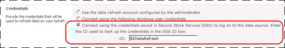

# Configure Stored Credentials for PowerPivot Data Refresh (PowerPivot for SharePoint)
  PowerPivot data refresh jobs can run under any Windows user account as long as you create a target application in Secure Store Service to store the credentials you want to use. Similarly, if you want to provide a database login that varies from the one used to originally import the data in PowerPivot for Excel, you can map those credentials to a Secure Store Service target application, and then specify that target application in a data refresh schedule.  
  
 **[!INCLUDE[applies](../includes/applies-md.md)]**  SharePoint 2010  
  
 After you follow the instructions in this topic, you will be able to use the following credentials option in the PowerPivot data refresh schedule page:  
  
   
  
 This topic explains how to set up the user names and passwords that are used for PowerPivot data refresh in a SharePoint 2010 farm. Before you can use these steps, you must have enabled Secure Store Service and generated a master key. For more information, see [PowerPivot Data Refresh with SharePoint 2010](powerpivot-data-refresh-with-sharepoint-2010.md)  
  
 This topic contains the following sections:  
  
 [Configure any Windows account for data refresh](#configAny)  
  
 [Configure a predefined account for accessing external or third-party data sources](#config3rd)  
  
 If you have problems configuring or using data refresh, refer to the [Troubleshooting PowerPivot Data Refresh](https://go.microsoft.com/fwlink/?LinkID=223279) page on the TechNet wiki for possible solutions.  
  
##   Configure any Windows account for data refresh  
 When a SharePoint user defines a data refresh schedule, he or she must specify the user identity under which data refresh is performed. Options include selecting the PowerPivot unattended data refresh account, entering his or her Windows domain user account, or entering some other Windows user account that is valid for data refresh purposes. The steps in this section are for the last option: specifying some other Windows account.  
  
 You might choose this approach if you want an alternative to using the PowerPivot unattended data refresh account (available to all PowerPivot users on SharePoint) or the credentials of the workbook owner. For example, you might want to make a series of data refresh accounts available to different workgroups to help you track and manage data refresh activity at the organizational level.  
  
> [!IMPORTANT]  
>  People and applications that use this target application (and the credentials that it stores) must be listed as members of the application. You must add the identity of each PowerPivot service application that will use the target application, your Windows account, and the group or user accounts of people who will be specifying this target application in their data refresh schedules. You can specify all of these accounts when you create the target application. If you do not know all of the user and group accounts that will require access to this application, you can add them later after the target application is created.  
  
 There are 4 parts to configuring stored credentials for data refresh:  
  
-   Create the target application that stores the credentials.  
  
-   Grant Contribute permissions to the account.  
  
-   Grant the account read permissions to access external data sources during data refresh.  
  
-   Verify that data refresh works when you specify this target application in a data refresh schedule.  
  
### Step 1: Create a target application  
  
1.  In Central Administration, in Application Management, click **Manage service applications**.  
  
2.  Click **Secure Store Service**.  
  
3.  In Manage Target Applications, click **New**.  
  
4.  In Target application ID, type a text string. The string must be unique, but it should also be easy to remember. Users will type this string in data refresh schedule pages whenever they want to use the credentials that are stored in this application.  
  
5.  In Display Name, enter a descriptive name. This name is used for display purposes only. It is not used to specify the target application in a data refresh schedule.  
  
6.  In Contact Email, type your e-mail address.  
  
7.  In Target Application Type, select **Group**.  
  
    > [!IMPORTANT]  
    >  Choosing a Group account type is necessary because it allows you to specify all of the user and service accounts requesting access to the credentials. For each request, PowerPivot System Service verifies whether the requestor is a member of the target application.  
  
8.  Skip Target Application Page URL. PowerPivot data refresh does not use it.  
  
9. Click **Next**.  
  
10. In the **Specify the credentials fields for your Secure Store Target application** page, accept the default values. Field names and types should be Windows User Name and Windows Password.  
  
11. Click Next.  
  
12. In Target Application Administrators, specify the Windows domain user accounts of SharePoint users who should have administrative access to target application settings (for example, the ability to add or remove accounts from the Members list).  
  
13. In Members, add the following user and group accounts:  
  
    1.  As the person creating the application, add your Windows user account to the Members list.  
  
    2.  Add the application pool identity of the PowerPivot service application so that it can retrieve the credentials when data refresh is scheduled to run. To view the application pool identity, go to **Manage service applications**, select the PowerPivot service application by clicking the empty space next to the name (this selects the row), and then click **Properties**. The security account that appears on this page is the account to add as a member of the target application.  
  
    3.  Add Windows user and group accounts that will be entering this target application in data refresh schedules.  
  
14. Click **OK**.  
  
15. Select the target application you just created, click the down arrow and select **Set Credentials.**  
  
16. In Credential Owner, notice that the list of credential owners is read-only. The accounts who have ownership over the credentials are the members of the target application. To add or remove a credential owner, you must add or remove accounts from the target application members list.  
  
     In Windows User Name and Windows Password, type credentials of Windows user account that will be used to run data refresh.  
  
17. Click **OK**.  
  
###   Step 2: Grant Contribute permissions to the account  
 Before you can use the stored credentials, the account must be assigned Contribute permissions on any PowerPivot workbook for which it is used. This permission level is necessary to open the workbook from a library and then save it back to the library after the data is refreshed.  
  
 Assigning permissions is a step that is performed by the site collection administrator. SharePoint permissions can be assigned at the root site collection or at any level below that, including on individual documents and items. How you set permissions will vary depending on how granular you need them to be. The following steps show you one approach for granting permissions.  
  
1.  On a SharePoint site, in Site Actions, click **Site Permissions**.  
  
2.  Click **Grant Permissions**.  
  
3.  In Select users, type the name of the Windows domain user account that you specified in the target application.  
  
4.  In Grant Permissions, select **Grant users permission directly**.  
  
5.  Select **Contribute**, and then click **OK**.  
  
###   Step 3: Grant read permissions to access external data sources used in data refresh  
 When importing data into a PowerPivot workbook, connections to external data are often based on trusted connections or impersonated connections that use the identity of the current user to connect to the data source. These types of connections work only when the current user has permission to read the data that he or she is importing.  
  
 In a data refresh scenario, the same connection string that was used to import data is now reused to refresh the data. If the connection string assumes the current user (for example, a string that includes Integrated_Security=SSPI), then the PowerPivot System Service will pass the user identity specified in the target application as the current user. This connection will only succeed if the account has read permissions on the external data source.  
  
 For this reason, you must grant the account read-only permissions on all of the external data sources that are used during data refresh.  
  
 If you are an administrator of the data sources used in your organization, you can create a login and assign the necessary permissions. Otherwise, you must contact the data owners and provide the account information. Be sure to specify the Windows domain user account that maps to the target application. This is the account you specified in "Step 1: Create a target application" in this topic.  
  
###   Step 4: Verify account availability in data refresh configuration pages  
  
1.  Open a data refresh configuration page for a published workbook that contains PowerPivot data. For instructions on how to open the page, see [Schedule a Data Refresh &#40;PowerPivot for SharePoint&#41;](schedule-a-data-refresh-powerpivot-for-sharepoint.md).  
  
2.  Verify that the **Connect using the credentials saved in Secure Store Service (SSS) to log on to the data source** option is enabled in the data refresh configuration page, and then enter the name of the target application.  
  
3.  Select the **Also refresh as soon as possible** checkbox, and then click **OK**.  
  
4.  In the library that contains the workbook, select the workbook, click the down arrow that appears to right, and then select **Manage PowerPivot Data Refresh**. You might need to wait several minutes if the data refresh job is returning a large amount of data.  
  
 If an error occurs, you can click **Configure schedule** in the data refresh history page to try different credentials. You might also need to inspect the data source connection information in the original workbook to view the connection string that is used during data refresh. The connection string will provide information about the server location and database that you can use to troubleshoot the problem.  
  
 For more information about troubleshooting, see [Troubleshooting PowerPivot Data Refresh](https://go.microsoft.com/fwlink/p/?LinkID=223279) on the TechNet Wiki.  
  
##   Configure a predefined account for accessing external or third-party data sources  
 Database servers often come with their own authentication methods. If you have a PowerPivot workbook that requires database credentials to access an external data source during data refresh, you can create a target application ID for the credentials, and then specify the target application in the Data Sources section of the schedule data refresh page.  
  
 This step is only necessary if you want to provide users with an option of overriding the database credentials that are already embedded in the PowerPivot workbook.  
  
 This step only works if the connection string already includes a user name and password. Note that having credentials in the connection string is relatively uncommon, so your ability to make use of this option is somewhat limited. In most cases, you will only have a user ID and password in the connection string if you are using database authentication to connect to the data source. For more information about how to check the connection string to see if it includes a User ID and password, see the "Grant permissions to create schedules and access external data" section in [PowerPivot Data Refresh with SharePoint 2010](powerpivot-data-refresh-with-sharepoint-2010.md).  
  
1.  In Central Administration, in Application Management, click **Manage service applications**.  
  
2.  Click **Secure Store Service**.  
  
3.  In Manage Target Applications, click **New**.  
  
4.  In Target application ID, type a text string. The string must be unique, but it should also be easy to remember. Users will type this string in data refresh schedule pages whenever they want to use the credentials that are stored in this application.  
  
5.  In Display Name, enter a descriptive name. This name is used for display purposes only. It is not used to specify the target application in a data refresh schedule.  
  
6.  In Contact Email, type your e-mail address.  
  
7.  In Target Application Type, select **Group**.  
  
8.  Skip Target Application Page URL. PowerPivot data refresh does not use it.  
  
9. Click **Next**.  
  
10. In the **Specify the credentials fields for your Secure Store Target application** page, accept the default values only if the data source uses Windows authentication. Otherwise, choose the field types that are valid for your data source, and then edit the field names to match the type.  
  
     For example, you might specify SQL Server User Name and SQL Server User Password for field names, and then choose User Name and Password for field types.  
  
11. Click Next.  
  
12. In Target Application Administrators, specify the Windows domain user accounts of SharePoint users who should have administrative access to the application settings.  
  
13. In Members, add the following user and group accounts:  
  
    1.  As the person creating the application, add your Windows user account to the Members list.  
  
    2.  Add the application pool identity of each PowerPivot service application that will be using the target application to access its stored credentials. To view the identity, go to **Manage service applications**, select the PowerPivot service application by clicking the empty space next to the name (this selects the row), and then click **Properties**. The security account that appears on this page is the account that you want to add as a member of the target application.  
  
    3.  Add Windows user and group accounts that will be entering this target application in the data sources section of a data refresh schedule page.  
  
14. Click **OK**.  
  
15. Select the target application you just created, click the down arrow and select **Set Credentials.**  
  
16. Enter the credentials that will be used to connect to the data source (for example, the user name and password of a SQL Server login).  
  
17. Click **OK**.  
  
## See Also  
 [Schedule a Data Refresh &#40;PowerPivot for SharePoint&#41;](schedule-a-data-refresh-powerpivot-for-sharepoint.md)   
 [PowerPivot Data Refresh with SharePoint 2010](powerpivot-data-refresh-with-sharepoint-2010.md)  
  
  
