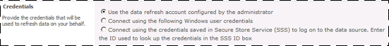

# Configure the PowerPivot Unattended Data Refresh Account (PowerPivot for SharePoint)
  The PowerPivot unattended data refresh account is a designated account for running PowerPivot data refresh jobs in a SharePoint farm. By configuring it, you enable the **Use the data refresh account configured by the administrator** option in a data refresh schedule page (see below). Workbook authors who schedule data refresh can choose this option if they want to use the PowerPivot unattended data refresh account to run a data refresh job. For more information about how to view the Credentials options in a data refresh schedule, see [Schedule a Data Refresh &#40;PowerPivot for SharePoint&#41;](schedule-a-data-refresh-powerpivot-for-sharepoint.md).  
  
   
  
 **[!INCLUDE[applies](../includes/applies-md.md)]**  SharePoint 2010  
  
 Depending on which options you selected when configuring the server, the unattended data refresh account might already be created. In a default configuration, the identity of the unattended data refresh account is initially set to the farm account. You can improve the security of your deployment by changing the account to run as a different user. Follow these instructions to change the account: [Update the credentials used by an existing PowerPivot unattended data refresh account](#bkmk_editUA).  
  
 For all other installation scenarios, you must configure this account manually using the instructions below.  
  
 This topic contains the following sections:  
  
 [Prerequisites](#bkmk_prereq)  
  
 [Step 1: Create a target application and set the credentials](#bkmk_create)  
  
 [Step 2: Specify the unattended account in PowerPivot server configuration pages](#bkmk_specifyUA)  
  
 [Step 3: Grant contribute permissions to the account](#bkmk_grant)  
  
 [Step 4: Grant read permissions to access external data sources used in data refresh](#bkmk_dbread)  
  
 [Step 5: Verify account availability in data refresh configuration pages](#bkmk_verify)  
  
 [Using the PowerPivot Unattended Data Refresh Account](#bkmk_use)  
  
 [Update the credentials used by an existing PowerPivot unattended data refresh account](#bkmk_editUA)  
  
##   Prerequisites  
 Secure Store Service must be enabled and configured, and a master key must be generated. For instructions on how to do this, see [PowerPivot Data Refresh with SharePoint 2010](powerpivot-data-refresh-with-sharepoint-2010.md)  
  
 You must decide in advance which Windows domain user account to use as the PowerPivot unattended data refresh account. This should be an account that is created specifically for this purpose so that you can monitor how it is used.  
  
 You must know the application identity of the PowerPivot System Service. You will give this service account **Full Control** permissions over the unattended data refresh account when you create the target application for it in step 1. These permissions allow the PowerPivot System Service to retrieve the credentials of the unattended data refresh account during data refresh. To get the required service account information, open the **Configure service accounts** page in Central Administration and select the service application pool used by the PowerPivot service application. By default, this is the **Service Application Pool - SharePoint Web Services System**.  
  
## Configure the unattended PowerPivot data refresh account  
 You can configure only one PowerPivot unattended data refresh account for each PowerPivot service application. Account information is stored in Secure Store Service in a target application that is set to a predefined Windows domain user account. Once the target application is created, you can specify it as the PowerPivot data refresh account in the configuration pages of a PowerPivot service application.  
  
> [!NOTE]  
>  When data refresh is performed under the unattended data refresh account, usage reporting and data refresh history is recorded against the Windows user account used for unattended data refresh. If you require a more accurate record of the individuals who are requesting data refresh or who own schedules, consider one of the other options for running data refresh. Namely, having users specify their own credentials (this is the default), or creating additional target applications for storing any Windows credentials that you want to use for data refresh purposes. For more information, see [Configure Stored Credentials for PowerPivot Data Refresh &#40;PowerPivot for SharePoint&#41;](configure-stored-credentials-data-refresh-powerpivot-sharepoint.md).  
  
 There are five parts to creating the unattended data refresh account.  
  
-   Create a target application in Secure Store Service for the account and specify the credentials.  
  
-   Specify the target application ID for the unattended data refresh account in the PowerPivot server configuration page.  
  
-   Grant Contribute permissions to the account.  
  
-   Grant the account read permissions to access external data sources during data refresh.  
  
-   Verify the account is available in the Manage Data Refresh schedule page for a published PowerPivot workbook.  
  
###   Step 1: Create a target application and set the credentials  
  
1.  In Central Administration, in Application Management, click **Manage service applications**.  
  
2.  Click **Secure Store Service**.  
  
3.  In Manage Target Applications, click **New**.  
  
4.  In Target application ID, type **PowerPivotDataRefresh**.  
  
5.  In Display Name, type **PowerPivot Data Refresh**.  
  
6.  In Contact Email, type your e-mail address.  
  
7.  In Target Application Type, select **Individual**.  
  
    > [!NOTE]  
    >  Specifying an Individual account type is correct for this scenario because only the PowerPivot service application will request the credentials of the PowerPivot unattended data refresh account. In practice, the service application is the sole user of the unattended data refresh account, making the Individual account type the best choice for this target application.  
  
8.  Skip Target Application Page URL. PowerPivot data refresh does not use it.  
  
9. Click **Next**.  
  
10. In the **Specify the credentials fields for your Secure Store Target application** page, accept the default values. Field names and types should be Windows User Name and Windows Password  
  
11. Click **Next**.  
  
12. In Target Application Administrators, specify the application pool identity of the PowerPivot service application. The service requires **Full Control** permissions so that it can retrieve unattended data refresh account information at run time. In addition, specify the Windows domain user accounts of any other SharePoint user who should have administrative access to the application settings.  
  
13. Click **OK**.  
  
14. Select the target application you just created, click the down arrow and select **Set Credentials.**  
  
15. In **Credential Owners**, type a Windows domain user account that you want to have permissions to update the credentials. The credentials are used for data fresh actions and the **Credential Owners** have permissions to modify the credentials.  
  
16. Click **OK**.  
  
###   Step 2: Specify the unattended account in PowerPivot server configuration pages  
  
1.  In Central Administration, in Application Management, click **Manage service applications**.  
  
2.  Find the PowerPivot Service application. You can identify a service application by its type. A PowerPivot service application type is **PowerPivot Service Application**.  
  
3.  Click the PowerPivot service application name. Wait for the PowerPivot Management Dashboard to appear.  
  
4.  In Actions, in the top right corner, click **Configure service application settings**.  
  
5.  In Data Refresh, in PowerPivot Unattended Data Refresh Account, type the target application ID you created in a previous step: **PowerPivotDataRefresh**.  
  
6.  Click **OK**.  
  
###   Step 3: Grant contribute permissions to the account  
 Before you can use the PowerPivot unattended data refresh account, it must be assigned Contribute permissions on any PowerPivot workbook for which it is used. This permission level is necessary to open the workbook from a library and then save it back to the library after the data is refreshed.  
  
 Assigning permissions is a step that is performed by the site collection administrator. SharePoint permissions can be assigned at the root site collection or at any level below that, including on individual documents and items. How you set permissions will vary depending on how granular you need them to be. The following steps show you one approach for granting permissions.  
  
1.  On a SharePoint site, in Site Actions, click **Site Permissions**.  
  
2.  Click **Grant Permissions**.  
  
3.  In Select users, type the name of the Windows domain user account that you designated as the PowerPivot unattended account. This is the name of the Windows domain user account that you specified in target application in Secure Store Service.  
  
4.  In Grant Permissions, select **Grant users permission directly**.  
  
5.  Select **Contribute**, and then click **OK**.  
  
###   Step 4: Grant read permissions to access external data sources used in data refresh  
 When importing data into a PowerPivot workbook, connections to external data are often based on trusted connections or impersonated connections that use the identity of the current user to connect to the data source. These types of connections work only when the current user has permission to read the data that he or she is importing.  
  
 In a data refresh scenario, the same connection string that was used to import data is now reused to refresh the data. If the connection string assumes the current user (for example, a string that includes Integrated_Security=SSPI), then the PowerPivot System Service will pass the user identity of the PowerPivot unattended data refresh account as the current user. This connection will only succeed if the PowerPivot unattended data refresh account has read permissions on the external data source.  
  
 For this reason, you must grant the PowerPivot unattended data refresh account read-only permissions on all of the external data sources that are used in any data refresh operation that runs under the unattended account.  
  
 If you are an administrator of the data sources used in your organization, you can create a login and assign the necessary permissions. Otherwise, you must contact the data owners and provide the account information. Be sure to specify the Windows domain user account that maps to the PowerPivot unattended data refresh account. This is the account you specified in "(Step 1): Create a target application and set the credentials" in this topic.  
  
###   Step 5: Verify account availability in data refresh configuration pages  
  
1.  Open a data refresh configuration page for a published workbook that contains PowerPivot data. For instructions on how to open the page, see [Schedule a Data Refresh &#40;PowerPivot for SharePoint&#41;](schedule-a-data-refresh-powerpivot-for-sharepoint.md).  
  
2.  Verify that the **Use the data refresh account configured by the administrator** option is enabled in the data refresh configuration page.  
  
3.  Select the **Also refresh as soon as possible** checkbox, and then click **OK**.  
  
4.  In the library that contains the workbook, select the workbook, click the down arrow that appears to right, and then select **Manage PowerPivot Data Refresh**. You might need to wait several minutes if the data refresh job is returning a large amount of data.  
  
 If an error occurs, you can click **Configure schedule** in the data refresh history page to try different credentials. You might also need to inspect the data source connection information in the original workbook to view the connection string that is used during data refresh. The connection string will provide information about the server location and database that you can use to troubleshoot the problem.  
  
 For more information about troubleshooting, see [Troubleshooting PowerPivot Data Refresh](https://go.microsoft.com/fwlink/p/?LinkID=223279) on the TechNet Wiki.  
  
##   Using the PowerPivot Unattended Data Refresh Account  
 Of the three credential options in PowerPivot data refresh scheduling page, only the first one corresponds to the unattended data refresh account. Be sure to select this option when setting up the data refresh schedule.  
  
   
  
 Do not use the third credential option (the one that requires you to enter the target application ID) to access the PowerPivot unattended data refresh account. There is an additional impersonation check that is performed with that option that will result in a validation error if you try to use it with the PowerPivot unattended data refresh account (or any target application that is based on the Individual account type). For more information about how to use the third option, see [Configure Stored Credentials for PowerPivot Data Refresh &#40;PowerPivot for SharePoint&#41;](configure-stored-credentials-data-refresh-powerpivot-sharepoint.md).  
  
##   Update the credentials used by an existing PowerPivot unattended data refresh account  
 If the unattended data refresh account is already configured through setup or by an administrator, you can update the user name or password by editing the target application that stores the credentials. Note that the original Windows identity that was previously associated with PowerPivot unattended data refresh account will not be visible when you edit the credentials in Secure Store Service. Whether you are updating an expired password or specifying different account, you must always re-type both the user name and password for that target application in Secure Store Service.  
  
1.  In Central Administration, in Application Management, click **Manage service applications**.  
  
2.  Click **Secure Store Service**.  
  
3.  Select the checkbox next to **PowerPivotDataRefresh**.  
  
4.  In Credentials, click **Set**.  
  
5.  In **Credential Owners**, type a Windows domain user account that you want to have permissions to update the credentials. The credentials are used for data fresh actions and the **Credential Owners** have permissions to modify the credentials.  
  
6.  In User Name, type the Windows domain user account that will be part of the unattended data refresh credentials.  
  
7.  In Password, type the password for the account, and then re-type it to confirm the password.  
  
8.  Click **OK**.  
  
 If you are changing not just the password, but the account user name as well, you will most likely need to perform additional configuration steps, such as granting read permissions to external data sources and SharePoint permissions to update the PowerPivot workbook. For instructions, go to this step in PowerPivot unattended data refresh account configuration: [Step 3: Grant contribute permissions to the account](#bkmk_grant), and then continue with all remaining steps, concluding with verification that the account is configured correctly.  
  
## See Also  
 [PowerPivot Data Refresh with SharePoint 2010](powerpivot-data-refresh-with-sharepoint-2010.md)   
 [Schedule a Data Refresh &#40;PowerPivot for SharePoint&#41;](schedule-a-data-refresh-powerpivot-for-sharepoint.md)   
 [PowerPivot Data Refresh](power-pivot-sharepoint/power-pivot-data-refresh.md)  
  
  
