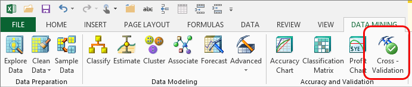

# Cross-Validation (SQL Server Data Mining Add-ins)
    
  
 Cross-validation is a standard tool in analytics and is an important feature for helping you develop and fine-tune data mining models. You use cross-validation after you have created a mining model to ascertain the validity of the model and to compare its results with other, related mining models.  
  
 Cross-validation consists of two phases: training and report generation. You will complete the following steps:  
  
-   Select a target mining structure or mining model.  
  
-   Specify the target value if applicable.  
  
-   Specify the number of cross-sections, or *folds*, into which to partition the structure data.  
  
 The **Cross-Validation** wizard then creates a new model on each of the folds, tests the model on the other folds, and then reports the accuracy of the model. Upon completion, the **Cross-Validation** wizard creates a report that shows you the metrics for each fold, and provides a summary of the model in aggregate. This information can be used to determine how good the underlying data is for a model, or to compare different models that are built on the same data.  
  
## Using the Cross-Validation Wizard  
 You can use cross-validation against both temporary models and models that are stored on an instance of [!INCLUDE[ssASnoversion](../includes/ssasnoversion-md.md)].  
  
#### To create a cross-validation report  
  
1.  In the **Accuracy and Validation** group of the **Data Mining** ribbon, click **Cross Validation**.  
  
2.  In the **Select Structure or Model** dialog box, select an existing mining structure or mining model. If you select a structure, the wizard will use cross-validation against all models that are based on that structure that have the same predictable attribute. If you select a model, the wizard will use cross-validation against only that model.  
  
3.  In the **Specify Cross-Validation Parameters** dialog box, in the **Fold Count** box, choose the number of folds among which to divide the data set. A fold is a randomly selected cross-section of the data.  
  
4.  Optionally, set the maximum number of rows to use in cross-validation by typing a number in the **Maximum Rows** text box.  
  
    > [!NOTE]  
    >  The more rows that you use, the more accurate the results will be. However, processing time might also increase significantly. The number you choose depends on your data, but in general, you should choose the highest number you can without sacrificing performance. To improve performance, you can also specify fewer folds.  
  
5.  Select a column from the **Target Attribute** dropdown list. The list displays only those columns that were configured as predictable attributes when you originally created the model. The model may contain multiple predictable attributes, but you can choose only one.  
  
6.  Select a value from the **Target State** dropdown list.  
  
     If the predictable column contains continuous numeric data, this option is not available.  
  
7.  Optionally, specify a value to use as the **Target Threshold** in counting predictions as accurate. This value is expressed as a probability, which is a number between 0 and 1, where 1 means that the prediction is guaranteed to be accurate, 0 means there is no chance that the prediction is correct, and .5 is the same as a random guess.  
  
     If the predictable column contains continuous numeric data, this option is not available.  
  
8.  Click **Finish**. A new worksheet is created, named **Cross-Validation**.  
  
    > [!NOTE]  
    >  Microsoft Excel may temporarily become unresponsive while the model is being partitioned into folds and each fold is tested.  
  
### Requirements  
 To create a cross-validation report, you must have already created a data mining structure and related models. The wizard provides a dialog box to help you choose from existing structure and models.  
  
 If you choose a mining structure that supports multiple mining models, and the models use different predictable attributes, the Cross-Validation wizard will test only those models that share the same predictable attribute.  
  
 If you choose a structure that supports both clustering models and other kinds of models, the clustering models will not be tested.  
  
## Understanding Cross-Validation Results  
 The results of cross-validation are displayed in a new worksheet, titled **Cross-Validation Report for \<attribute name>**. The new worksheet contains several sections: the first section is a summary that provides important metadata about the model that was tested, so that you can know which model or structure the results are for.  
  
 The second section in the report provides a statistical summary that indicates how good the original model is. In this summary, the differences between the models created for each fold are analyzed for three key measures: *root mean square error*, *mean absolute error*, and *log score*. These are standard statistical measures used not only in data mining but also in most kinds of statistical analysis.  
  
 For each of these measures, the Cross-Validation wizard calculates the mean and standard deviation across the model as a whole. This tells you how consistent the model is when prediction on different subsets of the data. For example, if the standard deviation is very large, it indicates that the models created for each fold have very different results, and therefore the model may have trained too closely on a particular group of data and not be applicable to other data sets.  
  
 The following section explains the measures that are used to assess the models.  
  
### Tests and Measures  
 In addition to some basic information about the number of folds in the data, and the amount of data in each fold, the worksheet displays a set of metrics about each model, categorized by test type. For example, the accuracy of a clustering model is assessed by different tests than you would use for a forecasting model.  
  
 The following table lists the tests and metrics, with an explanation of what the metric means.  
  
#### Aggregates and General Statistical Measures  
 The aggregate measures provided in the report indicate how the folds that you created in the data differ from each other.  
  
-   Average and standard deviation.  
  
-   Average of the deviation from the mean for a specific measure, across all the partitions in a model.  
  
#### Classification: Pass/Fail  
 This measure is used in classification models when you do not specify a target value for the predictable attribute. For example, if you create a model that predicts multiple possibilities, this measure tells you how well the model did at predicting all possible values.  
  
 Pass/fail is calculated by counting of cases that meet the following conditions: **pass** if the predicted state with the highest probability is the same as the input state and probability is greater than the value that you specified for **State Threshold**; otherwise, **fail**.  
  
#### Classification: True or False Positives and Negatives  
 This test is used for all classification models that have a specified target. The measure indicates how each case is classified in response to these questions: what did the model predict, and what was the actual result.  
  
|Measure|Description|  
|-------------|-----------------|  
|True positive|Count of cases that meet these conditions:   Case contains the target value.   Model predicted that case contains the target value.|  
|False positive|Count of cases that meet these conditions:   Actual value is equal to target value.   Model predicted that case contains the target value.|  
|True negative|Count of cases that meet these conditions:   Case does not contain the target value.   Model predicted that case does not contain the target value.|  
|False negative|Count of cases that meet these conditions:   Actual value not equal to target value.   Model predicted that case does not contain the target value.|  
  
#### Lift  
 *Lift* is a measure that is associated with likelihood. If an outcome is more likely when you use the model than when you make a random guess, the model is said to provide *positive lift*. However, if the model makes predictions that are less likely than random chance, the lift score is *negative*. Therefore, this metric indicates the amount of improvement that can be achieved by using the model, where a higher score is better.  
  
 Lift is calculated as the ratio of the actual prediction probability to the marginal probability in the test cases.  
  
#### Log Score  
 The *log score*, also called the *log likelihood score* for the prediction, represents the ratio between two probabilities, converted to a logarithmic scale. Because probabilities are represented as a decimal fraction, the log score is always a negative number. A score that is closer to 0 is a better score.  
  
 Whereas raw scores can have very irregular or skewed distributions, a log score is similar to a percentage.  
  
#### Root Mean Square Error  
 *Root mean square error* (RMSE) is a standard method in statistics for looking at how different data sets compare, and smoothing out the differences that can be introduced by the scale of the inputs.  
  
 RMSE represents the average error of the predicted value when compared to the actual value. It is calculated as the square root of the mean error for all partition cases, divided by the number of cases in the partition, excluding rows that have missing values for the target attributes.  
  
#### Mean Absolute Error  
 The *mean absolute error* is the average error of the predicted value to the actual value. It is calculated by obtaining the absolute sum of errors, and finding the mean of those errors.  
  
 This value helps you understand how far scores vary from the mean.  
  
#### Case Likelihood  
 This measure is used only for clustering models, and indicates how probable it is that a new case belongs to a particular cluster.  
  
 In clustering models, there are two kinds of cluster membership, depending on the method you used to create the model. In some models, based on the K-means algorithm, a new case is expected to belong to only one cluster. However, by default the Microsoft Clustering algorithm uses the Expectation Maximization method, which assumes that a new case potentially can belong to any cluster. Therefore, in these models a case can have multiple `CaseLikelihood` values, but the one reported by default is the likelihood of the case belonging to the cluster that is the best match for the new case.  
  
## See Also  
 [Validating Models and Using Models for Prediction &#40;Data Mining Add-ins for Excel&#41;](validating-models-and-using-models-for-prediction-data-mining-add-ins-for-excel.md)  
  
  
