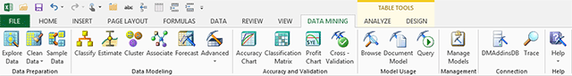

# Data Mining Client for Excel (SQL Server Data Mining Add-ins)
  The Data Mining Client for Excel is a set of tools that let you perform common data mining tasks, from data cleansing to model building and prediction queries. You can use data in Excel tables or ranges, or access external data sources.  
  
   
  
-   [Work With Data](#bkmk_Data)  
  
     Load your data into Excel, cleanse the data, check for outliers, and create statistical summaries. You can also perform different kinds of sampling, profile the data, and test models using external data. The Data Mining Client is the easiest way to prepare data for analysis without complex scripts or ETL processes.  
  
-   [Build Models and Analyze](#bkmk_Model)  
  
     These tools provide wizard interfaces to well-known, empirically tested data mining algorithms, including clustering (K-means and EM), association analysis, time series analysis, and decision trees. Advanced modeling options for each wizard let you choose different algorithms, such as the Naïve Bayes or neural networks, and customize behavior such as the cluster seed or initial sampling size.  
  
     All data mining algorithms are hosted in an instance of [!INCLUDE[ssASnoversion](../includes/ssasnoversion-md.md)], giving you more power to build complex models.  
  
-   [Test, Query, and Validate Models](#bkmk_Validate)  
  
     The Data Mining Client provides industry-standard tools for testing models, including lift charts and cross-validation. The wizards provided make it easy to test the validity of the data set and its accuracy. The query wizard builds queries to use the models for prediction and scoring.  
  
-   [View Models](#bkmk_ViewModels)  
  
     Charts generated by most tools can be saved directly to Excel. Use the [Browsing Models in Excel &#40;SQL Server Data Mining Add-ins&#41;](browsing-models-in-excel-sql-server-data-mining-add-ins.md) tool to explore the models.  
  
-   [Manage, Document, and Deploy](#bkmk_UsageMgmt)  
  
     The Data Mining Client for Excel maintains an active connection to the server, so you can save your data mining model to the server, to use in further testing, or to deploy to a production server for greater scalability.  
  
##   Work With Data  
 The **Data Preparation** group contains the following wizards that help you review and clean data in preparation for data mining tasks. Most wizards also let you separate data into training and testing sets.  
  
 [Explore Data &#40;SQL Server Data Mining Add-ins&#41;](explore-data-sql-server-data-mining-add-ins.md)  
 For building and storing models, the add-ins support these data connections:  
  
-   Connection to an [!INCLUDE[ssASnoversion](../includes/ssasnoversion-md.md)] server, for storing and processing the models.  
  
-   Optional connections to external data sources. You can build your model using any type of data that can be defined as an [!INCLUDE[ssASnoversion](../includes/ssasnoversion-md.md)] data source, or just use the data already in Excel.  
  
 [Explore Data &#40;SQL Server Data Mining Add-ins&#41;](explore-data-sql-server-data-mining-add-ins.md)  
 The **Explore Data** wizard helps you understand the type and amount of data in your data table by graphing the distribution and values for the selected columns, one at a time.  
  
 [Sample Data &#40;SQL Server Data Mining Add-ins&#41;](sample-data-sql-server-data-mining-add-ins.md)  
 Creating the right kind of data for training and testing your models is an important part of data mining, but one that can be tedious without the right tools. The **Sample Data** wizard makes it easy to divide the data used for a model into two groups, one for building the model and one for testing it. You can use random sampling or oversampling.  
  
 [Prediction Calculator &#40;Table Analysis Tools for Excel&#41;](prediction-calculator-table-analysis-tools-for-excel.md)  
 The **Remove Outliers** wizard gives you several tools to identify and appropriately handle outliers. It shows you the distribution of values and the relationship of the outliers to other data, and lets you decided whether to remove or change outliers.  
  
 [Prediction Calculator &#40;Table Analysis Tools for Excel&#41;](prediction-calculator-table-analysis-tools-for-excel.md)  
 The **Relabel** wizard helps you create new labels for data to make it easier to understand the results of analysis. For example, you can rename a range of data with a more descriptive name, or you can choose a representative value from the list.  
  
##   Build Models and Analyze  
 The options on the **Data Modeling** section of the toolbar let you derive patterns from data; group rows of data based on attributes, or explore associations. The wizards in this tool ribbon are based on the powerful data mining algorithms available in [!INCLUDE[ssASnoversion](../includes/ssasnoversion-md.md)]. Unlike the similar tools in the Table Analysis Tools for Excel, these wizards let you customize the behavior of the algorithm and use a variety of data sources.  
  
 [Classify Wizard &#40;Data Mining Add-ins for Excel&#41;](classify-wizard-data-mining-add-ins-for-excel.md)  
 The **Classify** wizard helps you build a classification model based on existing data in an Excel table, an Excel range, or an external data source. A classification model extracts patterns in your data that indicate similarities and helps you make predictions based on groupings of values. For example, a classification model might be used to predict risk based on income or spending patterns.  
  
 The **Classify**  wizard supports use of these Microsoft data mining algorithms: Decision Trees algorithm, Logistic Regression, Naïve Bayes, neural Networks.  
  
 [Estimate Wizard &#40;Data Mining Add-ins for Excel&#41;](estimate-wizard-data-mining-add-ins-for-excel.md)  
 The **Estimate** wizard helps you create an estimation model. An estimation model extracts patterns from data and uses the patterns to predict a numeric outcome, such as a currency, sales amount, date, or time.  
  
 The **Estimate** wizard uses these Microsoft data mining algorithms: Decision Trees, Linear Regression, Logistic Regression, and Neural Networks.  
  
 [Analyze Key Influencers &#40;Table Analysis Tools for Excel&#41;](analyze-key-influencers-table-analysis-tools-for-excel.md)  
 The Cluster wizard helps you build a clustering model. A clustering model detects groups of rows that share similar characteristics. This wizard is useful for exploring patterns in all kinds of data.  
  
 The **Cluster** wizard uses the Microsoft Clustering algorithm, which includes both K-means and EM.  
  
 [Associate Wizard &#40;Data Mining Client for Excel&#41;](associate-wizard-data-mining-client-for-excel.md)  
 The **Associate** wizard helps you create a data mining model using the Microsoft Association Rules algorithm, which detects frequently co-occurring items or events. Such association models are particularly useful for making recommendations.  
  
 The **Associate** wizard uses the Microsoft Association Rules algorithm.  
  
 [Forecast Wizard &#40;Data Mining Add-ins for Excel&#41;](forecast-wizard-data-mining-add-ins-for-excel.md)  
 The **Forecast** wizard helps you predict values in a time series. Typically data that you use in a forecasting contains some kind of time series, either a date stamp or some sequence ID, and you use it to derive patterns for use in predicting future values.  
  
 The **Forecast** wizard uses the Microsoft Time Series algorithm.  
  
 [Advanced Modeling &#40;Data Mining Add-ins for Excel&#41;](advanced-modeling-data-mining-add-ins-for-excel.md)  
 Already familiar with data mining? You can use the **Advanced** data modeling options to create custom data structures and build models using customizations not included in the other tools and wizards.  
  
##   Test, Query, and Validate Models  
 Use the wizards on the **Accuracy and Validation** toolbar to use industry-standard tests for validating the accuracy of your models, and for assessing the viability of the data set for creating models.  
  
 [Analyze Key Influencers &#40;Table Analysis Tools for Excel&#41;](analyze-key-influencers-table-analysis-tools-for-excel.md)  
 Evaluates the performance of a data mining model by generating a lift chart or scatter plot chart.  
  
 [Classification Matrix &#40;SQL Server Data Mining Add-ins&#41;](classification-matrix-sql-server-data-mining-add-ins.md)  
 Helps you assess the performance of a classification model by creating a chart that summarizes accurate and inaccurate predictions made by the model.  
  
 [Profit Chart &#40;SQL Server Data Mining Add-ins&#41;](profit-chart-sql-server-data-mining-add-ins.md)  
 Helps you understand the impact of a data mining model by charting the accuracy of predictions together with the costs and benefits of taking action based on the prediction.  
  
 [Cross-Validation &#40;SQL Server Data Mining Add-ins&#41;](cross-validation-sql-server-data-mining-add-ins.md)  
 Creates a report that summarizes the accuracy of the model across many subsets of the data set, so that you can determine how stable the model is.  
  
 You can also use data in an Excel table as input to a prediction query against a mining model stored on the server.  
  
 [Query &#40;SQL Server Data Mining Add-ins&#41;](query-sql-server-data-mining-add-ins.md)  
 The **Query** wizard helps you create predictions against an existing data mining model.  
  
 [Advanced Data Mining Query Editor](advanced-data-mining-query-editor.md)  
 For advanced users, this tool provides a drag-and-drop interface to DMX. You can easily create prediction queries or new models without worrying about syntax.  
  
##   View Models  
 Models you create are automatically opened for browsing. However, you can also browse models on the server and generate new visualizations. Use the [Visio shapes](viewing-data-mining-models-in-visio-data-mining-add-ins.md) to export model diagrams to a customizable canvas.  
  
 [Browsing Models in Excel &#40;SQL Server Data Mining Add-ins&#41;](browsing-models-in-excel-sql-server-data-mining-add-ins.md)  
 View the models you have created, using interactive graphs customized to each type of model.  
  
 [Documenting Mining Models &#40;Data Mining Add-ins for Excel&#41;](documenting-mining-models-data-mining-add-ins-for-excel.md)  
 This wizard creates reports that provide a statistical summary of the data set and metadata about the model, to aid in investigation and interpretation.  
  
##   Manage, Document, and Deploy  
 These tools help you get connected to a data mining server, as well as manage and export models, and monitor data mining activity.  
  
 [Manage Models &#40;SQL Server Data Mining Add-ins&#41;](manage-models-sql-server-data-mining-add-ins.md)  
 If you have the necessary permissions, you can delete modify, rename, or process existing mining models and structures without leaving Excel.  
  
 [Trace &#40;Data Mining Client for Excel&#41;](trace-data-mining-client-for-excel.md)  
 Click **Trace** to view an ongoing capture of the interaction between the Excel client and the [!INCLUDE[ssNoVersion](../includes/ssnoversion-md.md)] server. All activity is stored as DMX or XMLA statements, so that you can troubleshoot your data mining session or save the information for later use.  
  
 [Connect to a Data Mining Server](connect-to-a-data-mining-server.md)  
 To use Excel as a client for data mining, you must establish a connection to an instance of [!INCLUDE[ssASnoversion](../includes/ssasnoversion-md.md)]. The connection provides you with access to the [!INCLUDE[ssASnoversion](../includes/ssasnoversion-md.md)] engine. If you have permissions, the connection also lets you store any patterns you have discovered, and modify existing data mining objects.  
  
 The **Connections** toolbar provides wizards for managing connections to an instance of [!INCLUDE[ssASnoversion](../includes/ssasnoversion-md.md)]. You must define a connection to an instance of [!INCLUDE[ssASnoversion](../includes/ssasnoversion-md.md)] to use the data mining tools and algorithms. You can create the connection when you install the add-in, or you can add a connection later.  
  
 **Getting Started**  
 Click the **Getting Started** button to start a configuration wizard that walks you through the process of creating a connection to an instance of [!INCLUDE[ssASnoversion](../includes/ssasnoversion-md.md)], and obtaining the permissions needed to do data mining.  
  
 **Help**  
 The **Help** dropdown menu provides links to online help, Web sites, and a configuration wizard to help you complete setup and start data mining.  
  
 The Help page also links to resources on line, including the Help for the add-in, and additional videos, demos, and samples.  
  
## See Also  
 [Table Analysis Tools for Excel](table-analysis-tools-for-excel.md)   
 [Troubleshooting Visio Data Mining Diagrams &#40;SQL Server Data Mining Add-ins&#41;](troubleshooting-visio-data-mining-diagrams-sql-server-data-mining-add-ins.md)  
  
  
