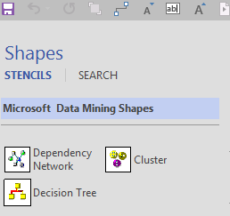

# Data Mining Shapes for Visio

The Data Mining Shapes for Visio provide templates customized for displaying data mining models. By using these templates, you can connect to a model that you have created, and create interactive presentations to illustrate the results of data mining.

The templates offer many advantages over static graphs and screen captures - they interact with the underlying data mining models, which are stored on an instance of Analysis Services, and let you customize the way that the patterns in the mining model are displayed. You can collapse and expand a tree model, filter on data nodes or by attributes, and display model statistics such as probabilities and coefficients.

The Visio templates include these wizards:

- **Dependency Network diagram:** Use this wizard to create graphs for decision trees and neural networks.

- **Decision Tree diagram:** Use this wizard to create diagrams that show the decision points and formulas associated with decision tree models. This diagram can also be used with regression models.

- **Cluster diagram:** Use this wizard to create colorful graphs for your segmentation models. You can toggle between views such as attribute discrimination, cluster profiles, and dependencies, and customize the appearance of clusters.

## Installation

When you install the Data Mining Templates for Visio, by default the following files are installed to \<drive>\Program Files\Microsoft SQL Server 2012 DM Add-Ins (or \<drive>\ or Program Files (x86)\Microsoft SQL Server 2012 DM Add-Ins):

- **Microsoft Data Mining.vst** This template contains pre-designed formatting, layout, and wizards to help you work with the data mining shapes.

- **Microsoft Data Mining Shape Studio.vss** This stencil file contains shapes associated with the template.

## How to Use the Templates

To open the templates, you can double-click the shape file, or you can open Visio and then open the shape template.

1. Drop one of the Visio data mining shapes from the stencil onto a new page.

2. When the wizard starts, connect to the server that has the data mining model that you want to display.

3. Select the data mining model, matching the type of model to the type of visualization.

4. Set options for how the data should be displayed and formatted.

5. After you have completed the **Data Mining Shape Wizard**, you have a diagram that you can modify and enhance using the features of Visio.

For more information about how to work with and enhance Visio model diagrams, see [Viewing Data Mining Models in Visio &#40;Data Mining Add-ins&#41;](viewing-data-mining-models-in-visio-data-mining-add-ins.md)

## Requirements

- To use the templates, you must first create a connection to an instance of [!INCLUDE[ssASnoversion](../includes/ssasnoversion-md.md)].

    The wizard will prompt you to select an [!INCLUDE[ssASnoversion](../includes/ssasnoversion-md.md)] server and specify the database that contains the mining model.

    For information about how to create a connection, see [Connect to Source Data &#40;Data Mining Client for Excel&#41;](connect-to-source-data-data-mining-client-for-excel.md).

- If you are using the Table Analysis Tools, make sure that you save your models to the [!INCLUDE[ssASnoversion](../includes/ssasnoversion-md.md)] server, and do not use temporary models.

- The model must have been created using one of the supported algorithms: clustering, decision trees, neural networks, Naïve Bayes, or logistic regression.
