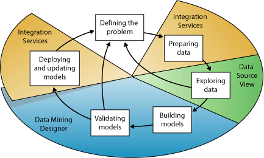
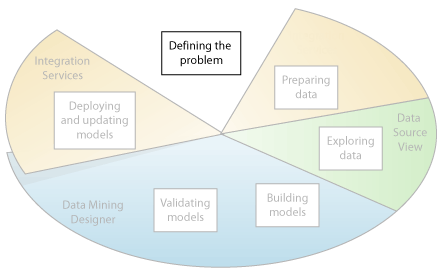
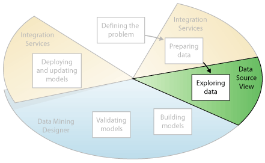
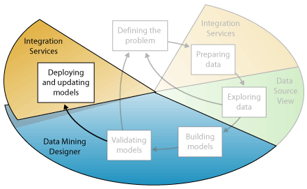

# Data Mining Concepts
  Data mining is the process of discovering actionable information from large sets of data. Data mining uses mathematical analysis to derive patterns and trends that exist in data. Typically, these patterns cannot be discovered by traditional data exploration because the relationships are too complex or because there is too much data.  
  
 These patterns and trends can be collected and defined as a *data mining model*. Mining models can be applied to specific scenarios, such as:  
  
-   **Forecasting**: Estimating sales, predicting server loads or server downtime  
  
-   **Risk and probability**: Choosing the best customers for targeted mailings, determining the probable break-even point for risk scenarios, assigning probabilities to diagnoses or other outcomes  
  
-   **Recommendations**: Determining which products are likely to be sold together, generating recommendations  
  
-   **Finding sequences**: Analyzing customer selections in a shopping cart, predicting next likely events  
  
-   **Grouping**: Separating customers or events into cluster of related items, analyzing and predicting affinities  
  
 Building a mining model is part of a larger process that includes everything from asking questions about the data and creating a model to answer those questions, to deploying the model into a working environment. This process can be defined by using the following six basic steps:  
  
1.  [Defining the Problem](#DefiningTheProblem)  
  
2.  [Preparing Data](#PreparingData)  
  
3.  [Exploring Data](#ExploringData)  
  
4.  [Building Models](#BuildingModels)  
  
5.  [Exploring and Validating Models](#ValidatingModels)  
  
6.  [Deploying and Updating Models](#DeployingandUpdatingModels)  
  
 The following diagram describes the relationships between each step in the process, and the technologies in [!INCLUDE[msCoName](../../includes/msconame-md.md)] [!INCLUDE[ssNoVersion](../../includes/ssnoversion-md.md)] that you can use to complete each step.  
  
   
  
 The process illustrated in the diagram is cyclical, meaning that creating a data mining model is a dynamic and iterative process. After you explore the data, you may find that the data is insufficient to create the appropriate mining models, and that you therefore have to look for more data. Alternatively, you may build several models and then realize that the models do not adequately answer the problem you defined, and that you therefore must redefine the problem. You may have to update the models after they have been deployed because more data has become available. Each step in the process might need to be repeated many times in order to create a good model.  
  
 Microsoft SQL Server Data Mining provides an integrated environment for creating and working with data mining models. This environment includes SQL Server Development Studio, which contains data mining algorithms and query tools that make it easy to build a comprehensive solution for a variety of projects, and [!INCLUDE[ssManStudioFull](../../includes/ssmanstudiofull-md.md)], which contains tools for browsing models and managing data mining objects. For more information, see [Creating Multidimensional Models Using SQL Server Data Tools &#40;SSDT&#41;](../multidimensional-models/creating-multidimensional-models-using-sql-server-data-tools-ssdt.md).  
  
 For an example of how the [!INCLUDE[ssNoVersion](../../includes/ssnoversion-md.md)] tools can be applied to a business scenario, see the [Basic Data Mining Tutorial](../../tutorials/basic-data-mining-tutorial.md).  
  
##   Defining the Problem  
 The first step in the data mining process, as highlighted in the following diagram, is to clearly define the problem, and consider ways that data can be utilized to provide an answer to the problem.  
  
   
  
 This step includes analyzing business requirements, defining the scope of the problem, defining the metrics by which the model will be evaluated, and defining specific objectives for the data mining project. These tasks translate into questions such as the following:  
  
-   What are you looking for? What types of relationships are you trying to find?  
  
-   Does the problem you are trying to solve reflect the policies or processes of the business?  
  
-   Do you want to make predictions from the data mining model, or just look for interesting patterns and associations?  
  
-   Which outcome or attribute do you want to try to predict?  
  
-   What kind of data do you have and what kind of information is in each column? If there are multiple tables, how are the tables related? Do you need to perform any cleansing, aggregation, or processing to make the data usable?  
  
-   How is the data distributed? Is the data seasonal? Does the data accurately represent the processes of the business?  
  
 To answer these questions, you might have to conduct a data availability study, to investigate the needs of the business users with regard to the available data. If the data does not support the needs of the users, you might have to redefine the project.  
  
 You also need to consider the ways in which the results of the model can be incorporated in key performance indicators (KPI) that are used to measure business progress.  
  
##   Preparing Data  
 The second step in the data mining process, as highlighted in the following diagram, is to consolidate and clean the data that was identified in the [Defining the Problem](#DefiningTheProblem) step.  
  
   
  
 Data can be scattered across a company and stored in different formats, or may contain inconsistencies such as incorrect or missing entries. For example, the data might show that a customer bought a product before the product was offered on the market, or that the customer shops regularly at a store located 2,000 miles from her home.  
  
 Data cleaning is not just about removing bad data or interpolating missing values, but about finding hidden correlations in the data, identifying sources of data that are the most accurate, and determining which columns are the most appropriate for use in analysis. For example, should you use the shipping date or the order date? Is the best sales influencer the quantity, total price, or a discounted price? Incomplete data, wrong data, and inputs that appear separate but in fact are strongly correlated all can influence the results of the model in ways you do not expect.  
  
 Therefore, before you start to build mining models, you should identify these problems and determine how you will fix them. For data mining typically you are working with a very large dataset and cannot examine every transaction for data quality; therefore, you might need to use some form of data profiling and automated data cleansing and filtering tools, such as those supplied in [!INCLUDE[ssISnoversion](../../includes/ssisnoversion-md.md)], [!INCLUDE[ssMDSlong](../../includes/ssmdslong-md.md)], or [!INCLUDE[ssDQSnoversionLong](../../includes/ssdqsnoversionlong-md.md)] to explore the data and find the inconsistencies. For more information, see these resources:  
  
-   [Master Data Services Overview](../../master-data-services/master-data-services-overview-mds.md)  
  
-   [Data Quality Services](../../data-quality-services/data-quality-services.md)  
  
 It is important to note that the data you use for data mining does not need to be stored in an Online Analytical Processing (OLAP) cube, or even in a relational database, although you can use both of these as data sources. You can conduct data mining using any source of data that has been defined as an [!INCLUDE[ssASnoversion](../../includes/ssasnoversion-md.md)] data source. These can include text files, Excel workbooks, or data from other external providers. For more information, see [Data Sources Supported &#40;SSAS Multidimensional&#41;](../multidimensional-models/supported-data-sources-ssas-multidimensional.md).  
  
##   Exploring Data  
 The third step in the data mining process, as highlighted in the following diagram, is to explore the prepared data.  
  
   
  
 You must understand the data in order to make appropriate decisions when you create the mining models. Exploration techniques include calculating the minimum and maximum values, calculating mean and standard deviations, and looking at the distribution of the data. For example, you might determine by reviewing the maximum, minimum, and mean values that the data is not representative of your customers or business processes, and that you therefore must obtain more balanced data or review the assumptions that are the basis for your expectations. Standard deviations and other distribution values can provide useful information about the stability and accuracy of the results. A large standard deviation can indicate that adding more data might help you improve the model. Data that strongly deviates from a standard distribution might be skewed, or might represent an accurate picture of a real-life problem, but make it difficult to fit a model to the data.  
  
 By exploring the data in light of your own understanding of the business problem, you can decide if the dataset contains flawed data, and then you can devise a strategy for fixing the problems or gain a deeper understanding of the behaviors that are typical of your business.  
  
 You can use tools such as [!INCLUDE[ssMDSshort](../../includes/ssmdsshort-md.md)] to canvass available sources of data and determine their availability for data mining. You can use tools such as [!INCLUDE[ssDQSnoversionLong](../../includes/ssdqsnoversionlong-md.md)], or the Data Profiler in Integration Services, to analyze the distribution of your data and repair issues such as wrong or missing data.  
  
 After you have defined your sources, you combine them in a Data Source view by using the Data Source View Designer in [!INCLUDE[ssBIDevStudio](../../includes/ssbidevstudio-md.md)]. For more information, see [Data Source Views in Multidimensional Models](../multidimensional-models/data-source-views-in-multidimensional-models.md). This designer also contains some several tools that you can use to explore the data and verify that it will work for creating a model. For more information, see [Explore Data in a Data Source View &#40;Analysis Services&#41;](../multidimensional-models/explore-data-in-a-data-source-view-analysis-services.md).  
  
 Note that when you create a model, [!INCLUDE[ssASnoversion](../../includes/ssasnoversion-md.md)] automatically creates statistical summaries of the data contained in the model, which you can query to use in reports or further analysis. For more information, see [Data Mining Queries](data-mining-queries.md).  
  
##   Building Models  
 The fourth step in the data mining process, as highlighted in the following diagram, is to build the mining model or models. You will use the knowledge that you gained in the [Exploring Data](#ExploringData) step to help define and create the models.  
  
   
  
 You define the columns of data that you want to use by creating a mining structure. The mining structure is linked to the source of data, but does not actually contain any data until you process it. When you process the mining structure, [!INCLUDE[ssASnoversion](../../includes/ssasnoversion-md.md)] generates aggregates and other statistical information that can be used for analysis. This information can be used by any mining model that is based on the structure. For more information about how mining structures are related to mining models, see [Logical Architecture &#40;Analysis Services - Data Mining&#41;](logical-architecture-analysis-services-data-mining.md).  
  
 Before the structure and model is processed, a data mining model too is just a container that specifies the columns used for input, the attribute that you are predicting, and parameters that tell the algorithm how to process the data. Processing a model is often called *training*. Training refers to the process of applying a specific mathematical algorithm to the data in the structure in order to extract patterns. The patterns that you find in the training process depend on the selection of training data, the algorithm you chose, and how you have configured the algorithm. [!INCLUDE[ssCurrent](../../includes/sscurrent-md.md)] contains many different algorithms, each suited to a different type of task, and each creating a different type of model. For a list of the algorithms provided in [!INCLUDE[ssCurrent](../../includes/sscurrent-md.md)], see [Data Mining Algorithms &#40;Analysis Services - Data Mining&#41;](data-mining-algorithms-analysis-services-data-mining.md).  
  
 You can also use parameters to adjust each algorithm, and you can apply filters to the training data to use just a subset of the data, creating different results. After you pass data through the model, the mining model object contains summaries and patterns that can be queried or used for prediction.  
  
 You can define a new model by using the Data Mining Wizard in [!INCLUDE[ssBIDevStudio](../../includes/ssbidevstudio-md.md)], or by using the Data Mining Extensions (DMX) language. For more information about how to use the Data Mining Wizard, see [Data Mining Wizard &#40;Analysis Services - Data Mining&#41;](data-mining-wizard-analysis-services-data-mining.md). For more information about how to use DMX, see [Data Mining Extensions &#40;DMX&#41; Reference](/sql/dmx/data-mining-extensions-dmx-reference).  
  
 It is important to remember that whenever the data changes, you must update both the mining structure and the mining model. When you update a mining structure by reprocessing it, [!INCLUDE[ssASnoversion](../../includes/ssasnoversion-md.md)] retrieves data from the source, including any new data if the source is dynamically updated, and repopulates the mining structure. If you have models that are based on the structure, you can choose to update the models that are based on the structure, which means they are retrained on the new data, or you can leave the models as is. For more information, see [Processing Requirements and Considerations &#40;Data Mining&#41;](processing-requirements-and-considerations-data-mining.md).  
  
##   Exploring and Validating Models  
 The fifth step in the data mining process, as highlighted in the following diagram, is to explore the mining models that you have built and test their effectiveness.  
  
   
  
 Before you deploy a model into a production environment, you will want to test how well the model performs. Also, when you build a model, you typically create multiple models with different configurations and test all models to see which yields the best results for your problem and your data.  
  
 [!INCLUDE[ssASnoversion](../../includes/ssasnoversion-md.md)] provides tools that help you separate your data into training and testing datasets so that you can accurately assess the performance of all models on the same data. You use the training dataset to build the model, and the testing dataset to test the accuracy of the model by creating prediction queries. In [!INCLUDE[ssASCurrent](../../includes/ssascurrent-md.md)], this partitioning can be done automatically while building the mining model. For more information, see [Testing and Validation &#40;Data Mining&#41;](testing-and-validation-data-mining.md).  
  
 You can explore the trends and patterns that the algorithms discover by using the viewers in Data Mining Designer in [!INCLUDE[ssBIDevStudio](../../includes/ssbidevstudio-md.md)]. For more information, see [Data Mining Model Viewers](data-mining-model-viewers.md). You can also test how well the models create predictions by using tools in the designer such as the lift chart and classification matrix. To verify whether the model is specific to your data, or may be used to make inferences on the general population, you can use the statistical technique called *cross-validation* to automatically create subsets of the data and test the model against each subset. For more information, see [Testing and Validation &#40;Data Mining&#41;](testing-and-validation-data-mining.md).  
  
 If none of the models that you created in the [Building Models](#BuildingModels) step perform well, you might have to return to a previous step in the process and redefine the problem or reinvestigate the data in the original dataset.  
  
##   Deploying and Updating Models  
 The last step in the data mining process, as highlighted in the following diagram, is to deploy the models that performed the best to a production environment.  
  
   
  
 After the mining models exist in a production environment, you can perform many tasks, depending on your needs. The following are some of the tasks you can perform:  
  
-   Use the models to create predictions, which you can then use to make business decisions. [!INCLUDE[ssNoVersion](../../includes/ssnoversion-md.md)] provides the DMX language that you can use to create prediction queries, and Prediction Query Builder to help you build the queries. For more information, see [Data Mining Extensions &#40;DMX&#41; Reference](/sql/dmx/data-mining-extensions-dmx-reference).  
  
-   Create content queries to retrieve statistics, rules, or formulas from the model. For more information, see [Data Mining Queries](data-mining-queries.md).  
  
-   Embed data mining functionality directly into an application. You can include Analysis Management Objects (AMO), which contains a set of objects that your application can use to create, alter, process, and delete mining structures and mining models. Alternatively, you can send XML for Analysis (XMLA) messages directly to an instance of [!INCLUDE[ssASnoversion](../../includes/ssasnoversion-md.md)].  
  
-   Use [!INCLUDE[ssISnoversion](../../includes/ssisnoversion-md.md)] to create a package in which a mining model is used to intelligently separate incoming data into multiple tables. For example, if a database is continually updated with potential customers, you could use a mining model together with [!INCLUDE[ssISnoversion](../../includes/ssisnoversion-md.md)] to split the incoming data into customers who are likely to purchase a product and customers who are likely to not purchase a product.  
  
-   Create a report that lets users directly query against an existing mining model. For more information, see [Reporting Services in SQL Server Data Tools &#40;SSDT&#41;](../../reporting-services/tools/reporting-services-in-sql-server-data-tools-ssdt.md).  
  
-   Update the models after review and analysis. Any update requires that you reprocess the models. For more information, see [Processing Data Mining Objects](processing-data-mining-objects.md).  
  
-   Update the models dynamically, as more data comes into the organization, and making constant changes to improve the effectiveness of the solution should be part of the deployment strategy. For more information, see [Management of Data Mining Solutions and Objects](management-of-data-mining-solutions-and-objects.md)  
  
## See Also  
 [Data Mining Solutions](data-mining-solutions.md)   
 [Data Mining Tools](data-mining-tools.md)  
  
  
