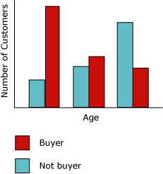
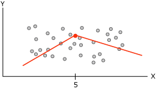
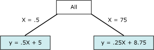

# Microsoft Decision Trees Algorithm
  The [!INCLUDE[msCoName](../../includes/msconame-md.md)] Decision Trees algorithm is a classification and regression algorithm provided by [!INCLUDE[msCoName](../../includes/msconame-md.md)] [!INCLUDE[ssNoVersion](../../includes/ssnoversion-md.md)] [!INCLUDE[ssASnoversion](../../includes/ssasnoversion-md.md)] for use in predictive modeling of both discrete and continuous attributes.  
  
 For discrete attributes, the algorithm makes predictions based on the relationships between input columns in a dataset. It uses the values, known as states, of those columns to predict the states of a column that you designate as predictable. Specifically, the algorithm identifies the input columns that are correlated with the predictable column. For example, in a scenario to predict which customers are likely to purchase a bicycle, if nine out of ten younger customers buy a bicycle, but only two out of ten older customers do so, the algorithm infers that age is a good predictor of bicycle purchase. The decision tree makes predictions based on this tendency toward a particular outcome.  
  
 For continuous attributes, the algorithm uses linear regression to determine where a decision tree splits.  
  
 If more than one column is set to predictable, or if the input data contains a nested table that is set to predictable, the algorithm builds a separate decision tree for each predictable column  
  
## Example  
 The marketing department of the [!INCLUDE[ssSampleDBCoFull](../../includes/sssampledbcofull-md.md)] company wants to identify the characteristics of previous customers that might indicate whether those customers are likely to buy a product in the future. The [!INCLUDE[ssSampleDBnormal](../../includes/sssampledbnormal-md.md)] database stores demographic information that describes previous customers. By using the [!INCLUDE[msCoName](../../includes/msconame-md.md)] Decision Trees algorithm to analyze this information, the marketing department can build a model that predicts whether a particular customer will purchase products, based on the states of known columns about that customer, such as demographics or past buying patterns.  
  
## How the Algorithm Works  
 The [!INCLUDE[msCoName](../../includes/msconame-md.md)] Decision Trees algorithm builds a data mining model by creating a series of splits in the tree. These splits are represented as *nodes*. The algorithm adds a node to the model every time that an input column is found to be significantly correlated with the predictable column. The way that the algorithm determines a split is different depending on whether it is predicting a continuous column or a discrete column.  
  
 The [!INCLUDE[msCoName](../../includes/msconame-md.md)] Decision Trees algorithm uses *feature selection* to guide the selection of the most useful attributes. Feature selection is used by all [!INCLUDE[ssASnoversion](../../includes/ssasnoversion-md.md)] data mining algorithms to improve performance and the quality of analysis. Feature selection is important to prevent unimportant attributes from using processor time. If you use too many input or predictable attributes when you design a data mining model, the model can take a very long time to process, or even run out of memory. Methods used to determine whether to split the tree include industry-standard metrics for *entropy* and Bayesian networks*.* For more information about the methods used to select meaningful attributes and then score and rank the attributes, see [Feature Selection &#40;Data Mining&#41;](feature-selection-data-mining.md).  
  
 A common problem in data mining models is that the model becomes too sensitive to small differences in the training data, in which case it said to be *over-fitted* or *over-trained*. An overfitted model cannot be generalized to other data sets. To avoid overfitting on any particular set of data, the [!INCLUDE[msCoName](../../includes/msconame-md.md)] Decision Trees algorithm uses techniques for controlling the growth of the tree. For a more in-depth explanation of how the [!INCLUDE[msCoName](../../includes/msconame-md.md)] Decision Trees algorithm works, see [Microsoft Decision Trees Algorithm Technical Reference](microsoft-decision-trees-algorithm-technical-reference.md).  
  
### Predicting Discrete Columns  
 The way that the [!INCLUDE[msCoName](../../includes/msconame-md.md)] Decision Trees algorithm builds a tree for a discrete predictable column can be demonstrated by using a histogram. The following diagram shows a histogram that plots a predictable column, Bike Buyers, against an input column, Age. The histogram shows that the age of a person helps distinguish whether that person will purchase a bicycle.  
  
   
  
 The correlation that is shown in the diagram would cause the [!INCLUDE[msCoName](../../includes/msconame-md.md)] Decision Trees algorithm to create a new node in the model.  
  
   
  
 As the algorithm adds new nodes to a model, a tree structure is formed. The top node of the tree describes the breakdown of the predictable column for the overall population of customers. As the model continues to grow, the algorithm considers all columns.  
  
### Predicting Continuous Columns  
 When the [!INCLUDE[msCoName](../../includes/msconame-md.md)] Decision Trees algorithm builds a tree based on a continuous predictable column, each node contains a regression formula. A split occurs at a point of non-linearity in the regression formula. For example, consider the following diagram.  
  
   
  
 The diagram contains data that can be modeled either by using a single line or by using two connected lines. However, a single line would do a poor job of representing the data. Instead, if you use two lines, the model will do a much better job of approximating the data. The point where the two lines come together is the point of non-linearity, and is the point where a node in a decision tree model would split. For example, the node that corresponds to the point of non-linearity in the previous graph could be represented by the following diagram. The two equations represent the regression equations for the two lines.  
  
   
  
## Data Required for Decision Tree Models  
 When you prepare data for use in a decision trees model, you should understand the requirements for the particular algorithm, including how much data is needed, and how the data is used.  
  
 The requirements for a decision trees model are as follows:  
  
-   **A single key column** Each model must contain one numeric or text column that uniquely identifies each record. Compound keys are not permitted.  
  
-   **A predictable column** Requires at least one predictable column. You can include multiple predictable attributes in a model, and the predictable attributes can be of different types, either numeric or discrete. However, increasing the number of predictable attributes can increase processing time.  
  
-   **Input columns** Requires input columns, which can be discrete or continuous. Increasing the number of input attributes affects processing time.  
  
 For more detailed information about the content types and data types supported for decision tree models, see the Requirements section of [Microsoft Decision Trees Algorithm Technical Reference](microsoft-decision-trees-algorithm-technical-reference.md).  
  
## Viewing a Decision Trees Model  
 To explore the model, you can use the **Microsoft Tree Viewer**. If your model generates multiple trees, you can select a tree and the viewer shows you a breakdown of how the cases are categorized for each predictable attribute. You can also view the interaction of the trees by using the dependency network viewer. For more information, see [Browse a Model Using the Microsoft Tree Viewer](browse-a-model-using-the-microsoft-tree-viewer.md).  
  
 If you want to know more detail about any branch or node in the tree, you can also browse the model by using the [Microsoft Generic Content Tree Viewer](browse-a-model-using-the-microsoft-generic-content-tree-viewer.md). The content stored for the model includes the distribution for all values in each node, probabilities at each level of the tree, and regression formulas for continuous attributes. For more information, see [Mining Model Content for Decision Tree Models &#40;Analysis Services - Data Mining&#41;](mining-model-content-for-decision-tree-models-analysis-services-data-mining.md).  
  
## Creating Predictions  
 After the model has been processed, the results are stored as a set of patterns and statistics, which you can use to explore relationships or make predictions.  
  
 For examples of queries to use with a decision trees model, see [Decision Trees Model Query Examples](decision-trees-model-query-examples.md).  
  
 For general information about how to create queries against mining models, see [Data Mining Queries](data-mining-queries.md).  
  
## Remarks  
  
-   Supports the use of Predictive Model Markup Language (PMML) to create mining models.  
  
-   Supports drillthrough.  
  
-   Supports the use of OLAP mining models and the creation of data mining dimensions.  
  
## See Also  
 [Data Mining Algorithms &#40;Analysis Services - Data Mining&#41;](data-mining-algorithms-analysis-services-data-mining.md)   
 [Microsoft Decision Trees Algorithm Technical Reference](microsoft-decision-trees-algorithm-technical-reference.md)   
 [Decision Trees Model Query Examples](decision-trees-model-query-examples.md)   
 [Mining Model Content for Decision Tree Models &#40;Analysis Services - Data Mining&#41;](mining-model-content-for-decision-tree-models-analysis-services-data-mining.md)  
  
  
